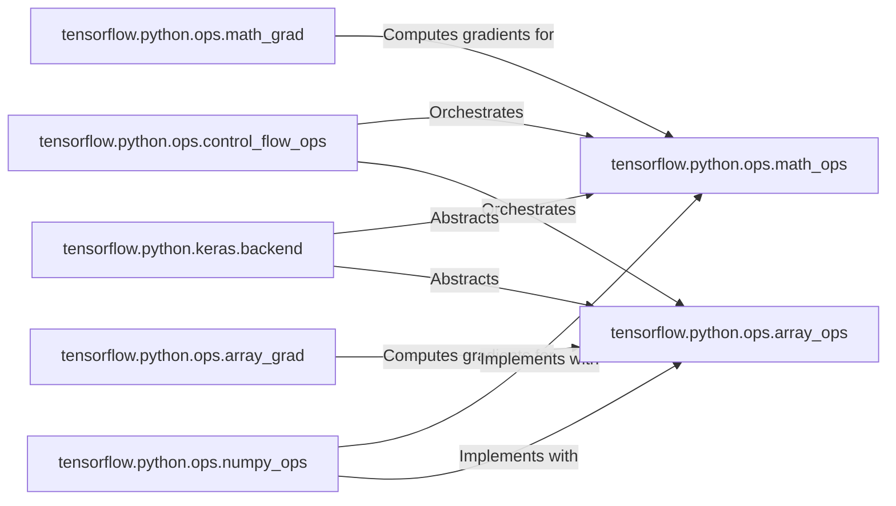

## Details

The `tensorflow.python.ops` subsystem forms the core computational engine of TensorFlow, providing fundamental operations for numerical computation (`math_ops`), tensor manipulation (`array_ops`), and dynamic graph execution (`control_flow_ops`). The `math_grad` and `array_grad` components are crucial for enabling automatic differentiation by defining the backward passes for these core operations. Higher-level APIs like `keras.backend` and `numpy_ops` build upon these foundational `ops` modules, abstracting their complexities and providing more user-friendly interfaces for model building and numerical programming, respectively. This layered architecture ensures both low-level control and high-level usability.

Critical Interaction Pathways:
*   **Core Computation Flow:** `control_flow_ops` orchestrates the execution of `math_ops` and `array_ops` to perform complex computations.
*   **Automatic Differentiation:** `math_grad` and `array_grad` compute gradients by interacting with `math_ops` and `array_ops` during the backward pass.
*   **High-Level API Abstraction:** `keras.backend` and `numpy_ops` abstract and implement their functionalities using the foundational `math_ops` and `array_ops`.

Architecture Overview:
The `tensorflow.python.ops` subsystem is the foundational layer for numerical computation within TensorFlow. It is primarily composed of modules responsible for core mathematical operations (`math_ops`), tensor manipulation (`array_ops`), and control flow mechanisms (`control_flow_ops`). To support machine learning tasks, dedicated gradient modules (`math_grad`, `array_grad`) are tightly coupled, providing the necessary backward pass computations for automatic differentiation. Building upon this core, higher-level components such as `tensorflow.python.keras.backend` provide an abstraction layer for Keras, enabling backend-agnostic model development, while `tensorflow.python.ops.numpy_ops` offers a NumPy-compatible interface, both leveraging the underlying `math_ops` and `array_ops` for their implementations. This structure highlights a clear separation of concerns, from low-level tensor operations to higher-level API abstractions, facilitating both performance and ease of use.

### tensorflow.python.ops.math_ops
Provides the fundamental arithmetic, linear algebra, and reduction operations (e.g., `add`, `multiply`, `matmul`, `reduce_sum`). These are the numerical backbone for constructing computational graphs.

**Related Classes/Methods**:

- <a href="https://github.com/tensorflow/tensorflow/blob/master/tensorflow/python/ops/math_ops.py" target="_blank" rel="noopener noreferrer">`tensorflow.python.ops.math_ops`</a>

### tensorflow.python.ops.array_ops
Enables flexible creation, reshaping, slicing, concatenation, and other structural manipulations of tensors (e.g., `reshape`, `concat`, `slice`). Crucial for data preparation and structuring model inputs/outputs.

**Related Classes/Methods**:

- <a href="https://github.com/tensorflow/tensorflow/blob/master/tensorflow/python/ops/array_ops.py" target="_blank" rel="noopener noreferrer">`tensorflow.python.ops.array_ops`</a>

### tensorflow.python.ops.control_flow_ops
Orchestrates the execution of operations based on conditional logic (`tf.cond`) and loops (`tf.while_loop`), enabling dynamic graph execution and more complex computational patterns.

**Related Classes/Methods**:

- <a href="https://github.com/tensorflow/tensorflow/blob/master/tensorflow/python/ops/control_flow_ops.py" target="_blank" rel="noopener noreferrer">`tensorflow.python.ops.control_flow_ops`</a>

### tensorflow.python.ops.math_grad
Defines the backward pass (gradient computation) for operations provided by `math_ops`, enabling automatic differentiation, which is fundamental for training neural networks.

**Related Classes/Methods**:

- <a href="https://github.com/tensorflow/tensorflow/blob/master/tensorflow/python/ops/math_grad.py" target="_blank" rel="noopener noreferrer">`tensorflow.python.ops.math_grad`</a>

### tensorflow.python.ops.array_grad
Defines the backward pass for tensor manipulation operations from `array_ops`, crucial for propagating gradients through data transformations during backpropagation.

**Related Classes/Methods**:

- <a href="https://github.com/tensorflow/tensorflow/blob/master/tensorflow/python/ops/array_grad.py" target="_blank" rel="noopener noreferrer">`tensorflow.python.ops.array_grad`</a>

### tensorflow.python.keras.backend
Provides a backend-agnostic set of functions for common Keras operations, abstracting away the underlying TensorFlow implementation details. It acts as an interface between Keras and TensorFlow's core operations.

**Related Classes/Methods**:

- <a href="https://github.com/tensorflow/tensorflow/blob/master/tensorflow/python/keras/backend.py" target="_blank" rel="noopener noreferrer">`tensorflow.python.keras.backend`</a>

### tensorflow.python.ops.numpy_ops
Offers a NumPy-compatible API built on top of TensorFlow operations, allowing users to write NumPy-style code that leverages TensorFlow's capabilities like automatic differentiation and GPU acceleration.

**Related Classes/Methods**:

- <a href="https://github.com/tensorflow/tensorflow/blob/master/tensorflow/python/ops/numpy_ops" target="_blank" rel="noopener noreferrer">`tensorflow.python.ops.numpy_ops`</a>

### [FAQ](https://github.com/CodeBoarding/GeneratedOnBoardings/tree/main?tab=readme-ov-file#faq)