```mermaid
graph LR
    tensorflow_python_saved_model_save_save["tensorflow.python.saved_model.save.save"]
    tensorflow_python_saved_model_load_load["tensorflow.python.saved_model.load.load"]
    tensorflow_lite_python_lite_convert["tensorflow.lite.python.lite.convert"]
    tensorflow_compiler_xla_python_xla_compile["tensorflow.compiler.xla.python.xla.compile"]
    tensorflow_compiler_mlir_quantization_tensorflow_python_quantize_model_quantize["tensorflow.compiler.mlir.quantization.tensorflow.python.quantize_model.quantize"]
    tensorflow_python_compiler_tensorrt_trt_convert_convert["tensorflow.python.compiler.tensorrt.trt_convert.convert"]
    tensorflow_python_tools_optimize_for_inference_optimize_for_inference["tensorflow.python.tools.optimize_for_inference.optimize_for_inference"]
    tensorflow_python_framework_convert_to_constants_convert_variables_to_constants_v2["tensorflow.python.framework.convert_to_constants.convert_variables_to_constants_v2"]
    tensorflow_python_saved_model_save_save -- "generates SavedModel consumed by" --> tensorflow_python_saved_model_load_load
    tensorflow_python_saved_model_save_save -- "generates SavedModel as input for" --> tensorflow_lite_python_lite_convert
    tensorflow_python_saved_model_load_load -- "deserializes models created by" --> tensorflow_python_saved_model_save_save
    tensorflow_python_saved_model_load_load -- "output can be passed to" --> tensorflow_lite_python_lite_convert
    tensorflow_lite_python_lite_convert -- "takes as input output from" --> tensorflow_python_saved_model_load_load
    tensorflow_lite_python_lite_convert -- "orchestrates the use of" --> tensorflow_compiler_mlir_quantization_tensorflow_python_quantize_model_quantize
    tensorflow_compiler_mlir_quantization_tensorflow_python_quantize_model_quantize -- "is utilized by" --> tensorflow_lite_python_lite_convert
    tensorflow_python_tools_optimize_for_inference_optimize_for_inference -- "output can be processed by" --> tensorflow_python_framework_convert_to_constants_convert_variables_to_constants_v2
    tensorflow_python_framework_convert_to_constants_convert_variables_to_constants_v2 -- "is often used after" --> tensorflow_python_tools_optimize_for_inference_optimize_for_inference
```

## Details

The TensorFlow model optimization and deployment subsystem focuses on transforming trained models into efficient, deployable formats. The core flow begins with `tensorflow.python.saved_model.save.save`, which serializes models into the SavedModel format. These SavedModels can then be loaded by `tensorflow.python.saved_model.load.load` for further processing or directly converted for specific deployment targets. For mobile and edge devices, `tensorflow.lite.python.lite.convert` transforms SavedModels into TensorFlow Lite format, optionally incorporating quantization via `tensorflow.compiler.mlir.quantization.tensorflow.python.quantize_model.quantize` for reduced size and faster inference. For high-performance inference on NVIDIA GPUs, `tensorflow.python.compiler.tensorrt.trt_convert.convert` optimizes graphs into TensorRT engines. Additionally, general graph optimizations are provided by `tensorflow.python.tools.optimize_for_inference.optimize_for_inference`, often followed by `tensorflow.python.framework.convert_to_constants.convert_variables_to_constants_v2` to create static, deployable models. This subsystem provides distinct pathways for optimizing and deploying TensorFlow models across diverse hardware environments.

### tensorflow.python.saved_model.save.save
Exports a TensorFlow model (including its graph, variables, and assets) into the SavedModel format, a language-neutral and hermetic serialization format crucial for deployment. This component represents the primary mechanism for persisting a complete TensorFlow model.

**Related Classes/Methods**:

- <a href="https://github.com/tensorflow/tensorflow/blob/master/tensorflow/python/saved_model/save.py#L1241-L1434" target="_blank" rel="noopener noreferrer">`tensorflow.python.saved_model.save.save`:1241-1434</a>

### tensorflow.python.saved_model.load.load
Imports a SavedModel, reconstructing the TensorFlow program, its variables, and functions, enabling model reuse and further processing. This is the counterpart to save, allowing models to re-enter the lifecycle for further optimization or direct inference.

**Related Classes/Methods**:

- <a href="https://github.com/tensorflow/tensorflow/blob/master/tensorflow/python/saved_model/load.py#L820-L913" target="_blank" rel="noopener noreferrer">`tensorflow.python.saved_model.load.load`:820-913</a>

### tensorflow.lite.python.lite.convert
Converts TensorFlow models (typically from SavedModel format) into the TensorFlow Lite format, optimizing them for deployment on mobile, embedded, and edge devices. This is a key "Deployment Runtime" component.

**Related Classes/Methods**:

- <a href="https://github.com/tensorflow/tensorflow/blob/master/tensorflow/lite/python/lite.py#L3377-L3389" target="_blank" rel="noopener noreferrer">`tensorflow.lite.python.lite.convert`:3377-3389</a>

### tensorflow.compiler.xla.python.xla.compile
Compiles TensorFlow operations into highly optimized XLA (Accelerated Linear Algebra) computations for specific hardware accelerators, embodying the "Optimizers & Compilers" pattern. This component focuses on high-performance execution through specialized compilation.

**Related Classes/Methods**: _None_

### tensorflow.compiler.mlir.quantization.tensorflow.python.quantize_model.quantize
Applies MLIR-based model quantization, reducing numerical precision (e.g., to INT8) for efficiency, smaller model size, and faster inference, particularly for deployment. This is a crucial optimization step for resource-constrained environments.

**Related Classes/Methods**:

- <a href="https://github.com/tensorflow/tensorflow/blob/master/tensorflow/compiler/mlir/quantization/tensorflow/python/quantize_model.py#L798-L926" target="_blank" rel="noopener noreferrer">`tensorflow.compiler.mlir.quantization.tensorflow.python.quantize_model.quantize`:798-926</a>

### tensorflow.python.compiler.tensorrt.trt_convert.convert
Converts TensorFlow graphs into TensorRT engines for high-performance inference on NVIDIA GPUs, serving as a specialized "Optimizer" and "Hardware Backend" component. This component targets specific high-performance hardware.

**Related Classes/Methods**: _None_

### tensorflow.python.tools.optimize_for_inference.optimize_for_inference
Provides general graph transformations to optimize a `GraphDef` for inference, such as folding constants, removing unused nodes, and fusing operations, acting as a "Tooling & Utility" for performance enhancement. This component offers generic graph-level optimizations.

**Related Classes/Methods**: _None_

### tensorflow.python.framework.convert_to_constants.convert_variables_to_constants_v2
Transforms mutable variables within a TensorFlow graph into immutable constants, a crucial step for creating static, deployable models and enabling further graph optimizations. This component is vital for preparing models for static deployment.

**Related Classes/Methods**:

- <a href="https://github.com/tensorflow/tensorflow/blob/master/tensorflow/python/framework/convert_to_constants.py#L1138-L1173" target="_blank" rel="noopener noreferrer">`tensorflow.python.framework.convert_to_constants.convert_variables_to_constants_v2`:1138-1173</a>

### [FAQ](https://github.com/CodeBoarding/GeneratedOnBoardings/tree/main?tab=readme-ov-file#faq)