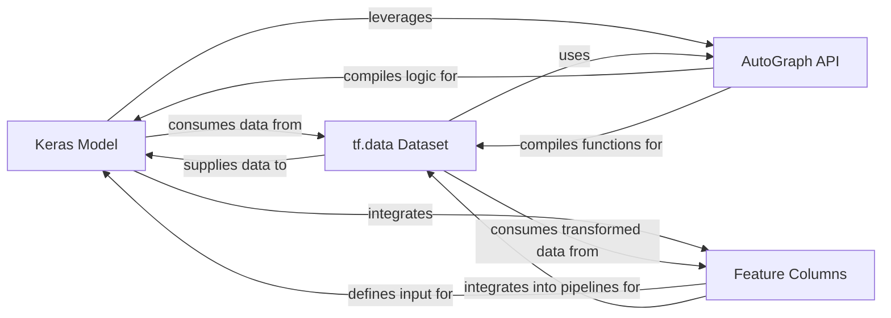

## Details

The `User API Layer` serves as the primary interface for users to interact with TensorFlow, enabling them to define, train, and evaluate machine learning models, and manage data input pipelines. It provides high-level abstractions that simplify complex ML tasks.

### Keras Model
The core abstraction for defining, compiling, training, evaluating, and predicting with machine learning models. It encapsulates the model's architecture, optimization process, loss computation, and performance tracking, providing a high-level, user-friendly interface for model development.

**Related Classes/Methods**:

- <a href="https://github.com/tensorflow/tensorflow/blob/master/tensorflow/python/keras/engine/training.py" target="_blank" rel="noopener noreferrer">`tensorflow.python.keras.engine.training.Model.fit`</a>

### tf.data Dataset
Provides a robust API for constructing flexible and high-performance data input pipelines. It abstracts the complexities of data loading, preprocessing, and batching, enabling efficient data consumption by models and supporting various data sources and transformations.

**Related Classes/Methods**:

- <a href="https://github.com/tensorflow/tensorflow/blob/master/tensorflow/python/data/ops/dataset_ops.py" target="_blank" rel="noopener noreferrer">`tensorflow.python.data.ops.dataset_ops.Dataset.from_tensor_slices`</a>

### AutoGraph API
A utility that transforms standard imperative Python code into equivalent TensorFlow graph operations. This conversion enables significant performance benefits through graph-based optimizations, static analysis, and deployment to various TensorFlow runtimes, bridging the gap between Python's flexibility and TensorFlow's graph execution efficiency.

**Related Classes/Methods**:

- <a href="https://github.com/tensorflow/tensorflow/blob/master/tensorflow/python/autograph/impl/api.py#L493-L588" target="_blank" rel="noopener noreferrer">`tensorflow.python.autograph.impl.api.tf_convert`:493-588</a>

### Feature Columns
Offers a high-level abstraction to describe and transform input features, bridging the gap between raw data and the format expected by machine learning models. They are crucial for handling various data types (e.g., categorical, numerical, text) and applying transformations like embedding or one-hot encoding, simplifying data preparation for models.

**Related Classes/Methods**:

- <a href="https://github.com/tensorflow/tensorflow/blob/master/tensorflow/python/feature_column/feature_column_v2.py#L435-L515" target="_blank" rel="noopener noreferrer">`tensorflow.python.feature_column.feature_column_v2.embedding_column`:435-515</a>

### [FAQ](https://github.com/CodeBoarding/GeneratedOnBoardings/tree/main?tab=readme-ov-file#faq)