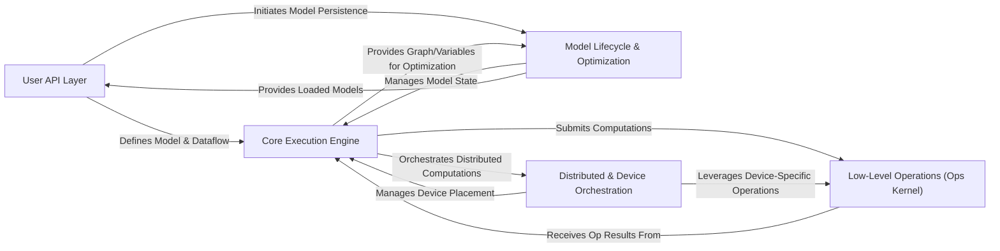

## Details

The TensorFlow architecture is a modular system designed for flexible and scalable machine learning. It is structured around a `User API Layer` for high-level model definition, a `Core Execution Engine` for graph computation and orchestration, and a `Low-Level Operations (Ops Kernel)` for fundamental hardware-accelerated operations. The `Model Lifecycle & Optimization` component handles model persistence and performance enhancements, including hardware-specific compilation like XLA. Finally, the `Distributed & Device Orchestration` component enables efficient scaling across various devices and distributed environments. Data flows from user-defined models through the core engine to low-level operations, with optimization and distributed execution capabilities integrated throughout the lifecycle.

### User API Layer [[Expand]](./User_API_Layer.md)
The primary interface for users to define, train, and evaluate machine learning models, and manage data input pipelines. It integrates high-level abstractions like Keras for model building and tf.data for efficient data loading and preprocessing. This layer also incorporates AutoGraph for converting imperative Python code into graph-compatible operations and Feature Columns for input data transformation.

**Related Classes/Methods**:

- <a href="https://github.com/tensorflow/tensorflow/blob/master/tensorflow/python/keras/engine/training.py" target="_blank" rel="noopener noreferrer">`tensorflow.python.keras.engine.training.Model.fit`</a>
- <a href="https://github.com/tensorflow/tensorflow/blob/master/tensorflow/python/data/ops/dataset_ops.py" target="_blank" rel="noopener noreferrer">`tensorflow.python.data.ops.dataset_ops.Dataset.from_tensor_slices`</a>
- <a href="https://github.com/tensorflow/tensorflow/blob/master/tensorflow/python/autograph/impl/api.py#L493-L588" target="_blank" rel="noopener noreferrer">`tensorflow.python.autograph.impl.api.tf_convert`:493-588</a>
- <a href="https://github.com/tensorflow/tensorflow/blob/master/tensorflow/python/feature_column/feature_column_v2.py#L435-L515" target="_blank" rel="noopener noreferrer">`tensorflow.python.feature_column.feature_column_v2.embedding_column`:435-515</a>

### Core Execution Engine [[Expand]](./Core_Execution_Engine.md)
The central component responsible for transforming user-defined computations into efficient, executable TensorFlow graphs. It manages eager execution, handles automatic differentiation, and dispatches operations to the underlying hardware. This component is the heart of the dataflow programming model, orchestrating the entire computation.

**Related Classes/Methods**:

- <a href="https://github.com/tensorflow/tensorflow/blob/master/tensorflow/python/eager/polymorphic_function/polymorphic_function.py#L805-L850" target="_blank" rel="noopener noreferrer">`tensorflow.python.eager.polymorphic_function.polymorphic_function.__call__`:805-850</a>
- <a href="https://github.com/tensorflow/tensorflow/blob/master/tensorflow/python/framework/func_graph.py#L921-L1114" target="_blank" rel="noopener noreferrer">`tensorflow.python.framework.func_graph.func_graph_from_py_func`:921-1114</a>

### Low-Level Operations (Ops Kernel) [[Expand]](./Low_Level_Operations_Ops_Kernel_.md)
The bedrock of TensorFlow, providing a comprehensive set of fundamental mathematical, array manipulation, and control flow operations. These are the actual implementations of primitive operations, executed by the Core Execution Engine on various devices (CPU, GPU, TPU).

**Related Classes/Methods**:

- <a href="https://github.com/tensorflow/tensorflow/blob/master/tensorflow/python/ops/math_ops.py#L3894-L3972" target="_blank" rel="noopener noreferrer">`tensorflow.python.ops.math_ops.add`:3894-3972</a>
- <a href="https://github.com/tensorflow/tensorflow/blob/master/tensorflow/python/ops/array_ops.py#L63-L201" target="_blank" rel="noopener noreferrer">`tensorflow.python.ops.array_ops.reshape`:63-201</a>

### Model Lifecycle & Optimization [[Expand]](./Model_Lifecycle_Optimization.md)
Manages the persistence, optimization, and deployment of TensorFlow models. This includes saving and restoring model parameters (variables), applying graph transformations, quantization, and hardware-specific compilation (e.g., XLA, MLIR, TensorRT), and converting models for deployment across various platforms (e.g., SavedModel, TensorFlow Lite).

**Related Classes/Methods**:

- <a href="https://github.com/tensorflow/tensorflow/blob/master/tensorflow/python/checkpoint/checkpoint.py" target="_blank" rel="noopener noreferrer">`tensorflow.python.checkpoint.checkpoint.Checkpoint.save`</a>
- <a href="https://github.com/tensorflow/tensorflow/blob/master/tensorflow/compiler/tf2xla/python/xla.py" target="_blank" rel="noopener noreferrer">`tensorflow.compiler.xla.python.xla.compile`</a>
- <a href="https://github.com/tensorflow/tensorflow/blob/master/tensorflow/python/saved_model/save.py#L1241-L1434" target="_blank" rel="noopener noreferrer">`tensorflow.python.saved_model.save.save`:1241-1434</a>
- <a href="https://github.com/tensorflow/tensorflow/blob/master/tensorflow/lite/python/lite.py#L3377-L3389" target="_blank" rel="noopener noreferrer">`tensorflow.lite.python.lite.convert`:3377-3389</a>

### Distributed & Device Orchestration [[Expand]](./Distributed_Device_Orchestration.md)
Provides strategies for scaling model training across multiple devices (CPUs, GPUs, TPUs) and machines. It handles data distribution, gradient aggregation, and explicit device placement (e.g., DTensor), enabling efficient parallel and distributed computations.

**Related Classes/Methods**:

- <a href="https://github.com/tensorflow/tensorflow/blob/master/tensorflow/python/distribute/mirrored_strategy.py" target="_blank" rel="noopener noreferrer">`tensorflow.python.distribute.mirrored_strategy.MirroredStrategy.__init__`</a>
- <a href="https://github.com/tensorflow/tensorflow/blob/master/tensorflow/dtensor/python/api.py#L37-L64" target="_blank" rel="noopener noreferrer">`tensorflow.dtensor.python.api.call_with_layout`:37-64</a>
- <a href="https://github.com/tensorflow/tensorflow/blob/master/tensorflow/python/tpu/tpu_embedding_v2.py" target="_blank" rel="noopener noreferrer">`tensorflow.python.tpu.tpu_embedding_v2.TPUEmbeddingV2.enqueue`</a>

### [FAQ](https://github.com/CodeBoarding/GeneratedOnBoardings/tree/main?tab=readme-ov-file#faq)