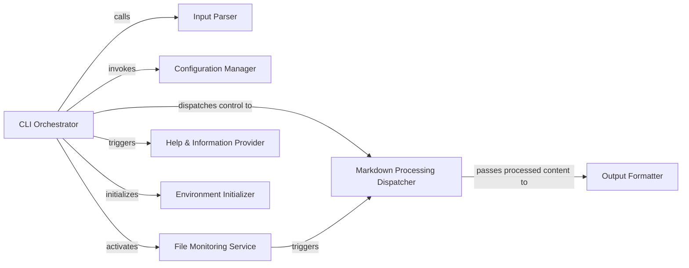

## Details

The `mdv` (terminal markdown viewer) project is structured around a clear separation of concerns, with a central `CLI Orchestrator` managing the application's lifecycle and delegating specific tasks to specialized components. The core functionality revolves around processing markdown content for terminal display, supported by input parsing, configuration management, and optional file monitoring.

### CLI Orchestrator
The primary entry point and central coordinator for the command-line application. It manages the overall application flow, orchestrates argument parsing, loads configurations, and dispatches control to core functionalities (e.g., markdown processing, file monitoring) based on user input.

**Related Classes/Methods**:

- <a href="https://github.com/axiros/terminal_markdown_viewer/blob/master/mdv/markdownviewer.py" target="_blank" rel="noopener noreferrer">`mdv.markdownviewer:run`</a>
- <a href="https://github.com/axiros/terminal_markdown_viewer/blob/master/mdv/markdownviewer.py" target="_blank" rel="noopener noreferrer">`mdv.markdownviewer:main`</a>

### Input Parser
Dedicated to extracting and interpreting command-line arguments and environment variables. It processes raw input into a structured format, providing a clear and consistent configuration object to the CLI Orchestrator for subsequent decision-making and application flow control.

**Related Classes/Methods**:

- <a href="https://github.com/axiros/terminal_markdown_viewer/blob/master/mdv/markdownviewer.py" target="_blank" rel="noopener noreferrer">`mdv.markdownviewer:parse_env_and_cli`</a>

### Configuration Manager
Handles loading, parsing, and managing application configurations from various sources (e.g., default settings, user-defined files, environment variables). It provides a unified configuration object to other components.

**Related Classes/Methods**:

- <a href="https://github.com/axiros/terminal_markdown_viewer/blob/master/mdv/markdownviewer.py" target="_blank" rel="noopener noreferrer">`mdv.markdownviewer:load_config`</a>

### Markdown Processing Dispatcher
Acts as a high-level dispatcher for the core markdown rendering pipeline. It receives parsed input and configuration from the CLI Orchestrator and initiates the sequence of markdown parsing, syntax highlighting, and theming, ultimately utilizing the Output Formatter.

**Related Classes/Methods**: _None_

### File Monitoring Service
Provides functionality to monitor specified files or directories for changes, triggering the markdown processing pipeline upon detection. This component enables the "live preview" feature.

**Related Classes/Methods**:

- <a href="https://github.com/axiros/terminal_markdown_viewer/blob/master/mdv/markdownviewer.py" target="_blank" rel="noopener noreferrer">`mdv.markdownviewer:monitor`</a>
- <a href="https://github.com/axiros/terminal_markdown_viewer/blob/master/mdv/markdownviewer.py" target="_blank" rel="noopener noreferrer">`mdv.markdownviewer:monitor_dir`</a>

### Output Formatter
Responsible for taking the processed markdown content (highlighted and themed) and formatting it for display in the terminal. It handles the final presentation layer.

**Related Classes/Methods**:

- <a href="https://github.com/axiros/terminal_markdown_viewer/blob/master/mdv/markdownviewer.py" target="_blank" rel="noopener noreferrer">`mdv.markdownviewer:formatter`</a>

### Help & Information Provider
Manages and displays help messages, version information, and lists available themes to the user via the command line.

**Related Classes/Methods**:

- <a href="https://github.com/axiros/terminal_markdown_viewer/blob/master/mdv/markdownviewer.py" target="_blank" rel="noopener noreferrer">`mdv.markdownviewer:exit_help`</a>
- <a href="https://github.com/axiros/terminal_markdown_viewer/blob/master/mdv/markdownviewer.py" target="_blank" rel="noopener noreferrer">`mdv.markdownviewer:list_themes`</a>

### Environment Initializer
Performs initial setup tasks related to the application's environment, such as fixing default encoding for Python 2 compatibility.

**Related Classes/Methods**:

- <a href="https://github.com/axiros/terminal_markdown_viewer/blob/master/mdv/markdownviewer.py" target="_blank" rel="noopener noreferrer">`mdv.markdownviewer:fix_py2_default_encoding`</a>

### [FAQ](https://github.com/CodeBoarding/GeneratedOnBoardings/tree/main?tab=readme-ov-file#faq)