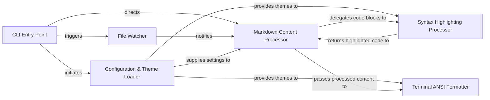

## Details

The `terminal_markdown_viewer` project is structured as a pipeline-driven CLI tool for rendering markdown. Its architecture emphasizes a clear flow from user input to terminal output. The `CLI Entry Point` serves as the initial orchestrator, handling arguments and deciding whether to perform a single render or activate the `File Watcher` for continuous updates. Markdown content is then ingested by the `Markdown Content Processor`, which acts as the central rendering engine. This engine integrates with the `Configuration & Theme Loader` for styling, and offloads syntax highlighting to the `Syntax Highlighting Processor`. The final, formatted output is then handled by the `Terminal ANSI Formatter`, which prepares the content for display in the terminal, ensuring a visually rich and responsive user experience. This modular design allows for clear separation of concerns, making the project maintainable and extensible.

### CLI Entry Point [[Expand]](./CLI_Entry_Point.md)
Handles command-line arguments, initiates rendering or monitoring, and manages overall application flow.

**Related Classes/Methods**:

- <a href="https://github.com/axiros/terminal_markdown_viewer/blob/master/mdv/markdownviewer.py" target="_blank" rel="noopener noreferrer">`mdv/markdownviewer.py:run`</a>
- <a href="https://github.com/axiros/terminal_markdown_viewer/blob/master/mdv/markdownviewer.py" target="_blank" rel="noopener noreferrer">`mdv/markdownviewer.py:parse_env_and_cli`</a>

### Configuration & Theme Loader
Manages application settings and loads visual themes, influencing how markdown is rendered and displayed.

**Related Classes/Methods**:

- <a href="https://github.com/axiros/terminal_markdown_viewer/blob/master/mdv/markdownviewer.py" target="_blank" rel="noopener noreferrer">`mdv/markdownviewer.py:load_config`</a>
- <a href="https://github.com/axiros/terminal_markdown_viewer/blob/master/mdv/markdownviewer.py" target="_blank" rel="noopener noreferrer">`mdv/markdownviewer.py:load_theme`</a>
- <a href="https://github.com/axiros/terminal_markdown_viewer/blob/master/mdv/markdownviewer.py" target="_blank" rel="noopener noreferrer">`mdv/markdownviewer.py:set_background`</a>

### File Watcher
Monitors specified files or directories for changes, triggering re-rendering of markdown content for live updates.

**Related Classes/Methods**:

- <a href="https://github.com/axiros/terminal_markdown_viewer/blob/master/mdv/markdownviewer.py" target="_blank" rel="noopener noreferrer">`mdv/markdownviewer.py:monitor`</a>
- <a href="https://github.com/axiros/terminal_markdown_viewer/blob/master/mdv/markdownviewer.py" target="_blank" rel="noopener noreferrer">`mdv/markdownviewer.py:monitor_dir`</a>

### Markdown Content Processor
Reads markdown content from various sources, parses it, and orchestrates the rendering pipeline, including handling extensions and preparing content for terminal display.

**Related Classes/Methods**:

- <a href="https://github.com/axiros/terminal_markdown_viewer/blob/master/mdv/markdownviewer.py" target="_blank" rel="noopener noreferrer">`mdv/markdownviewer.py:read_md`</a>
- <a href="https://github.com/axiros/terminal_markdown_viewer/blob/master/mdv/markdownviewer.py" target="_blank" rel="noopener noreferrer">`mdv/markdownviewer.py:main`</a>
- <a href="https://github.com/axiros/terminal_markdown_viewer/blob/master/mdv/markdownviewer.py" target="_blank" rel="noopener noreferrer">`mdv/markdownviewer.py:extendMarkdown`</a>
- <a href="https://github.com/axiros/terminal_markdown_viewer/blob/master/mdv/markdownviewer.py" target="_blank" rel="noopener noreferrer">`mdv/markdownviewer.py:AnsiPrintExtension`</a>

### Syntax Highlighting Processor
Applies syntax highlighting to code blocks within the markdown content using external libraries like Pygments.

**Related Classes/Methods**:

- <a href="https://github.com/axiros/terminal_markdown_viewer/blob/master/mdv/markdownviewer.py" target="_blank" rel="noopener noreferrer">`mdv/markdownviewer.py:code`</a>
- <a href="https://github.com/axiros/terminal_markdown_viewer/blob/master/mdv/markdownviewer.py" target="_blank" rel="noopener noreferrer">`mdv/markdownviewer.py:do_code_hilite`</a>
- <a href="https://github.com/axiros/terminal_markdown_viewer/blob/master/mdv/markdownviewer.py" target="_blank" rel="noopener noreferrer">`mdv/markdownviewer.py:style_ansi`</a>

### Terminal ANSI Formatter
Responsible for applying final ANSI escape codes and formatting for display in the terminal, including colors, borders, and text presentation.

**Related Classes/Methods**:

- <a href="https://github.com/axiros/terminal_markdown_viewer/blob/master/mdv/markdownviewer.py" target="_blank" rel="noopener noreferrer">`mdv/markdownviewer.py:col`</a>
- <a href="https://github.com/axiros/terminal_markdown_viewer/blob/master/mdv/markdownviewer.py" target="_blank" rel="noopener noreferrer">`mdv/markdownviewer.py:to_col`</a>
- <a href="https://github.com/axiros/terminal_markdown_viewer/blob/master/mdv/markdownviewer.py" target="_blank" rel="noopener noreferrer">`mdv/markdownviewer.py:p`</a>
- <a href="https://github.com/axiros/terminal_markdown_viewer/blob/master/mdv/markdownviewer.py" target="_blank" rel="noopener noreferrer">`mdv/markdownviewer.py:h`</a>
- <a href="https://github.com/axiros/terminal_markdown_viewer/blob/master/mdv/markdownviewer.py" target="_blank" rel="noopener noreferrer">`mdv/markdownviewer.py:hr`</a>
- <a href="https://github.com/axiros/terminal_markdown_viewer/blob/master/mdv/markdownviewer.py" target="_blank" rel="noopener noreferrer">`mdv/markdownviewer.py:borders`</a>
- <a href="https://github.com/axiros/terminal_markdown_viewer/blob/master/mdv/markdownviewer.py" target="_blank" rel="noopener noreferrer">`mdv/markdownviewer.py:rewrap`</a>

### [FAQ](https://github.com/CodeBoarding/GeneratedOnBoardings/tree/main?tab=readme-ov-file#faq)