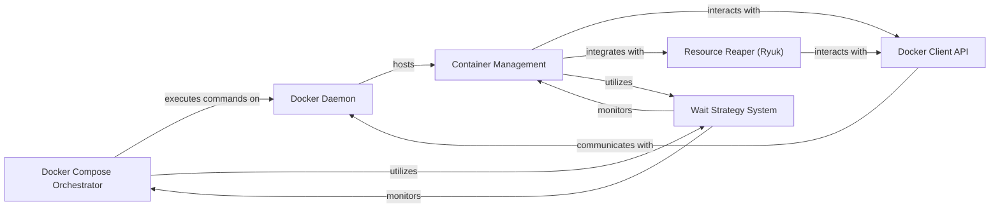

## Details

The `testcontainers-python` project's core subsystem for container orchestration is built around the Docker Compose Orchestrator, which manages multi-container environments defined by Docker Compose files. This orchestrator leverages the Docker Client API to interact with the external Docker Daemon, executing commands to bring up and tear down service stacks. Individual services within these stacks, or standalone containers, are managed by the Container Management component, which provides fundamental container lifecycle operations. For ensuring container readiness, both the Orchestrator and Container Management rely on the extensible Wait Strategy System, which implements various checks like log message monitoring or HTTP health checks. Finally, the Resource Reaper (Ryuk) component ensures a clean testing environment by automatically terminating all created Docker resources, interacting with the Docker Daemon via the Docker Client API. This architecture provides a robust and flexible framework for programmatic container-based testing.

### Docker Compose Orchestrator [[Expand]](./Docker_Compose_Orchestrator.md)
The primary component for managing and orchestrating multi-container environments defined by Docker Compose files. It handles the complete lifecycle of a group of services, from startup (pulling images, building, bringing up services) to shutdown, and integrates with readiness checks.

**Related Classes/Methods**:

- <a href="https://github.com/testcontainers/testcontainers-python/blob/main/core/testcontainers/compose/compose.py" target="_blank" rel="noopener noreferrer">`testcontainers.compose.compose.DockerCompose`</a>

### Container Management
Provides the foundational capabilities for managing individual Docker containers. This includes starting, stopping, configuring ports, volumes, and environment variables. It serves as the base for all specific container types.

**Related Classes/Methods**:

- <a href="https://github.com/testcontainers/testcontainers-python/blob/main/core/testcontainers/core/container.py" target="_blank" rel="noopener noreferrer">`testcontainers.core.container.DockerContainer`</a>
- <a href="https://github.com/testcontainers/testcontainers-python/blob/main/core/testcontainers/core/generic.py" target="_blank" rel="noopener noreferrer">`testcontainers.core.generic.DbContainer`</a>

### Wait Strategy System
A flexible framework for defining and applying various strategies to determine when a container or service is ready for use. This ensures reliable test execution by waiting for specific conditions (e.g., log messages, HTTP responses, or port availability).

**Related Classes/Methods**:

- <a href="https://github.com/testcontainers/testcontainers-python/blob/main/core/testcontainers/core/waiting_utils.py" target="_blank" rel="noopener noreferrer">`testcontainers.core.waiting_utils.WaitStrategy`</a>
- <a href="https://github.com/testcontainers/testcontainers-python/blob/main/core/testcontainers/core/wait_strategies.py" target="_blank" rel="noopener noreferrer">`testcontainers.core.wait_strategies.LogMessageWaitStrategy`</a>

### Resource Reaper (Ryuk)
A dedicated component responsible for the robust cleanup and termination of containers and associated resources after tests complete. It prevents resource leaks by running a separate "Ryuk" container that monitors and cleans up test-created Docker resources.

**Related Classes/Methods**:

- <a href="https://github.com/testcontainers/testcontainers-python/blob/main/core/testcontainers/core/container.py" target="_blank" rel="noopener noreferrer">`testcontainers.core.container.Reaper`</a>

### Docker Client API
A thin wrapper around the `docker-py` library, providing the direct programmatic interface for `testcontainers-python` to interact with the underlying `Docker Daemon`. It abstracts low-level Docker API calls.

**Related Classes/Methods**:

- <a href="https://github.com/testcontainers/testcontainers-python/blob/main/core/testcontainers/core/docker_client.py" target="_blank" rel="noopener noreferrer">`testcontainers.core.docker_client.DockerClient`</a>

### Docker Daemon
The core Docker engine that runs on the host system. It is responsible for building, running, and managing Docker containers, images, networks, and volumes. All container operations ultimately execute here.

**Related Classes/Methods**: _None_

### [FAQ](https://github.com/CodeBoarding/GeneratedOnBoardings/tree/main?tab=readme-ov-file#faq)