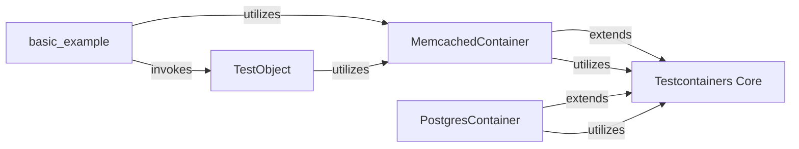

## Details

The `testcontainers-python` project provides a robust framework for managing Docker containers within integration tests. At its core, the `Testcontainers Core` component offers generic container lifecycle management. Specialized container modules, such as `MemcachedContainer` and `PostgresContainer`, extend this core functionality to provide tailored interactions for specific services. The `basic_example` component demonstrates the practical application of these container modules, showcasing how to set up, interact with, and tear down service-specific containers for testing purposes. This modular design allows for easy extension to support various containerized services while maintaining a consistent interface for users.

### Testcontainers Core [[Expand]](./Testcontainers_Core.md)
This is the foundational component providing generic Docker container management capabilities, including starting, stopping, network configuration, and resource cleanup. It serves as the base for all service-specific container modules.

**Related Classes/Methods**:

- <a href="https://github.com/testcontainers/testcontainers-python/blob/main/core/testcontainers/core/generic.py" target="_blank" rel="noopener noreferrer">`testcontainers.core.generic.GenericContainer`</a>

### MemcachedContainer
Manages the lifecycle and interactions with a Memcached Docker container. It encapsulates Memcached-specific logic, such as image selection, port mapping, and wait strategies to ensure service readiness. It also provides convenient methods for client applications to connect to the running Memcached instance.

**Related Classes/Methods**:

- <a href="https://github.com/testcontainers/testcontainers-python/blob/main/modules/memcached/testcontainers/memcached/__init__.py" target="_blank" rel="noopener noreferrer">`testcontainers.memcached.MemcachedContainer`</a>

### PostgresContainer
Manages the lifecycle and interactions with a PostgreSQL Docker container. It encapsulates PostgreSQL-specific logic, including image selection, database initialization, and wait strategies for database readiness. It provides methods for client applications to establish connections to the PostgreSQL instance.

**Related Classes/Methods**:

- <a href="https://github.com/testcontainers/testcontainers-python/blob/main/modules/postgres/testcontainers/postgres/__init__.py" target="_blank" rel="noopener noreferrer">`testcontainers.postgresql.PostgresContainer`</a>

### TestObject
A component (specifically, a class defined within an example) that demonstrates or performs integration tests against a running Memcached instance by storing and retrieving pickled objects.

**Related Classes/Methods**:

- <a href="https://github.com/testcontainers/testcontainers-python/blob/main/modules/memcached/example_basic.py#L35-L38" target="_blank" rel="noopener noreferrer">`TestObject`:35-38</a>

### basic_example
An example script that orchestrates the use of `MemcachedContainer` and demonstrates basic Memcached container functionality and interaction, including storing, retrieving, and managing data.

**Related Classes/Methods**:

- <a href="https://github.com/testcontainers/testcontainers-python/blob/main/modules/arangodb/example_basic.py#L8-L87" target="_blank" rel="noopener noreferrer">`basic_example`:8-87</a>

### [FAQ](https://github.com/CodeBoarding/GeneratedOnBoardings/tree/main?tab=readme-ov-file#faq)