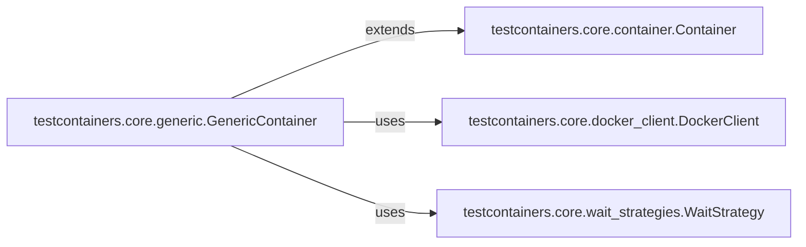

## Details

The `Testcontainers Core` subsystem is the foundational layer of the `testcontainers-python` project, responsible for the generic management and lifecycle of Docker containers. It embodies the core logic for starting, stopping, connecting to, and applying readiness checks on containers, as well as ensuring proper resource cleanup.

### testcontainers.core.container.Container
This abstract base class establishes the fundamental contract and common interface for all container types. It defines core lifecycle operations such as `start`, `stop`, and `get_container_host_ip`, ensuring a consistent API for managing containers across the `testcontainers-python` ecosystem.

**Related Classes/Methods**:

- <a href="https://github.com/testcontainers/testcontainers-python/blob/main/core/testcontainers/core/container.py" target="_blank" rel="noopener noreferrer">`testcontainers.core.container.Container`</a>

### testcontainers.core.generic.GenericContainer
A concrete implementation of `Container`, this component provides comprehensive capabilities for managing any Docker image. It orchestrates the full container lifecycle, including starting, stopping, connecting, applying wait strategies, and ensuring proper resource cleanup (e.g., via Ryuk integration). It serves as the primary user-facing component for generic container interactions.

**Related Classes/Methods**:

- <a href="https://github.com/testcontainers/testcontainers-python/blob/main/core/testcontainers/core/generic.py" target="_blank" rel="noopener noreferrer">`testcontainers.core.generic.GenericContainer`</a>
- <a href="https://github.com/testcontainers/testcontainers-python/blob/main/core/testcontainers/core/container.py" target="_blank" rel="noopener noreferrer">`testcontainers.core.container.Container`</a>
- <a href="https://github.com/testcontainers/testcontainers-python/blob/main/core/testcontainers/core/docker_client.py" target="_blank" rel="noopener noreferrer">`testcontainers.core.docker_client.DockerClient`</a>
- <a href="https://github.com/testcontainers/testcontainers-python/blob/main/core/testcontainers/core/wait_strategies.py" target="_blank" rel="noopener noreferrer">`testcontainers.core.wait_strategies.WaitStrategy`</a>

### testcontainers.core.docker_client.DockerClient
This component serves as the direct, low-level interface for communication with the Docker daemon. It abstracts the underlying Docker API calls, providing higher-level methods for running, stopping, inspecting, and managing containers and images. It acts as an adapter between the application and the Docker engine.

**Related Classes/Methods**:

- <a href="https://github.com/testcontainers/testcontainers-python/blob/main/core/testcontainers/core/docker_client.py" target="_blank" rel="noopener noreferrer">`testcontainers.core.docker_client.DockerClient`</a>

### testcontainers.core.wait_strategies.WaitStrategy
This component defines the abstract contract for various strategies used to determine when a container is fully ready and operational. It allows for flexible and extensible readiness checks based on conditions like port availability, log output, or HTTP responses, crucial for reliable test execution.

**Related Classes/Methods**:

- <a href="https://github.com/testcontainers/testcontainers-python/blob/main/core/testcontainers/core/wait_strategies.py" target="_blank" rel="noopener noreferrer">`testcontainers.core.wait_strategies.WaitStrategy`</a>

### [FAQ](https://github.com/CodeBoarding/GeneratedOnBoardings/tree/main?tab=readme-ov-file#faq)