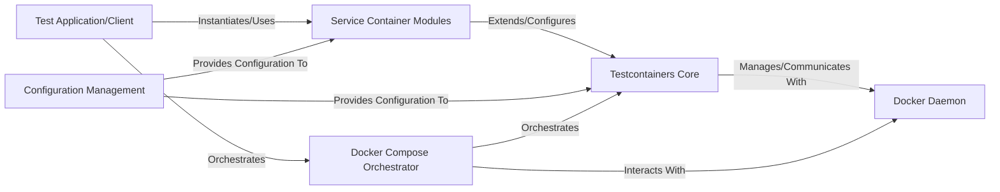

## Details

The `testcontainers-python` architecture centers around a `Testcontainers Core` that provides generic Docker container lifecycle management, interacting directly with the `Docker Daemon`. This core functionality is extended by `Service Container Modules`, which offer pre-configured, service-specific container setups for common databases and tools. The `Test Application/Client` leverages these modules or the core directly to provision test environments. `Configuration Management` provides essential settings across the system, while the `Docker Compose Orchestrator` facilitates the management of multi-container environments. This modular design allows for flexible and efficient integration of containerized services into testing workflows.

### Test Application/Client
The user's test code or application that utilizes the `testcontainers-python` library.

**Related Classes/Methods**:

- <a href="https://github.com/testcontainers/testcontainers-python/blob/main/modules/memcached/example_basic.py#L9-L131" target="_blank" rel="noopener noreferrer">`modules.memcached.example_basic.basic_example`:9-131</a>

### Testcontainers Core [[Expand]](./Testcontainers_Core.md)
The central component responsible for generic Docker container lifecycle management, including starting, stopping, connecting, and applying wait strategies. It also handles resource cleanup.

**Related Classes/Methods**:

- <a href="https://github.com/testcontainers/testcontainers-python/blob/main/core/testcontainers/core/generic.py" target="_blank" rel="noopener noreferrer">`testcontainers.core.generic.GenericContainer`</a>
- <a href="https://github.com/testcontainers/testcontainers-python/blob/main/core/testcontainers/core/container.py" target="_blank" rel="noopener noreferrer">`testcontainers.core.container.Container`</a>
- <a href="https://github.com/testcontainers/testcontainers-python/blob/main/core/testcontainers/core/docker_client.py" target="_blank" rel="noopener noreferrer">`testcontainers.core.docker_client.DockerClient`</a>
- <a href="https://github.com/testcontainers/testcontainers-python/blob/main/core/testcontainers/core/wait_strategies.py" target="_blank" rel="noopener noreferrer">`testcontainers.core.wait_strategies.WaitStrategy`</a>

### Service Container Modules [[Expand]](./Service_Container_Modules.md)
Specialized modules that extend the `Testcontainers Core` to provide pre-configured images, service-specific wait strategies, and convenient client access methods for particular containerized services (e.g., Memcached, Postgres).

**Related Classes/Methods**:

- <a href="https://github.com/testcontainers/testcontainers-python/blob/main/testcontainers/modules/memcached/__init__.py" target="_blank" rel="noopener noreferrer">`testcontainers.modules.memcached.MemcachedContainer`</a>
- <a href="https://github.com/testcontainers/testcontainers-python/blob/main/testcontainers/modules/postgres/__init__.py" target="_blank" rel="noopener noreferrer">`testcontainers.modules.postgres.PostgresContainer`</a>

### Docker Daemon
The external Docker engine responsible for running and managing containers. `Testcontainers Core` communicates with this daemon. (Note: This is an external component and does not have source code within the `testcontainers-python` project.)

**Related Classes/Methods**: _None_

### Configuration Management
Manages global and container-specific configuration settings for `Testcontainers`, such as Docker host, TLS verification, and environment variables.

**Related Classes/Methods**:

- <a href="https://github.com/testcontainers/testcontainers-python/blob/main/core/testcontainers/core/config.py" target="_blank" rel="noopener noreferrer">`testcontainers.core.config.Config`</a>

### Docker Compose Orchestrator [[Expand]](./Docker_Compose_Orchestrator.md)
A component that enables the orchestration of multi-container environments using Docker Compose files, abstracting complex setups.

**Related Classes/Methods**:

- <a href="https://github.com/testcontainers/testcontainers-python/blob/main/core/testcontainers/compose/compose.py" target="_blank" rel="noopener noreferrer">`testcontainers.compose.compose.Compose`</a>

### [FAQ](https://github.com/CodeBoarding/GeneratedOnBoardings/tree/main?tab=readme-ov-file#faq)