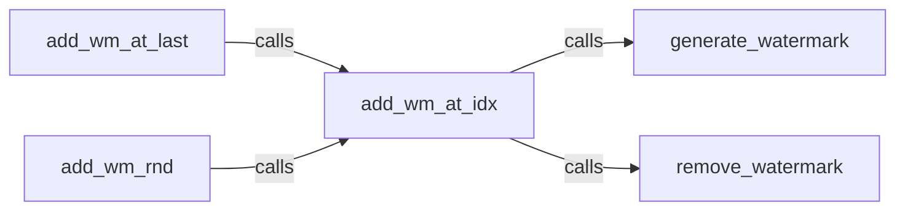

## Details

The `Core Embedding Logic` subsystem is central to the project's functionality, focusing on the insertion of watermarks into text. It adheres to the `Library/Toolkit` architectural pattern by providing a set of cohesive functions for embedding, watermark generation, and text preparation.

### add_wm_at_idx
Encapsulates the central algorithm for embedding the watermark into text at a specified index. It orchestrates the core embedding process by integrating watermark generation and ensuring proper placement. This is the primary entry point for precise watermark insertion.

**Related Classes/Methods**:

- <a href="https://github.com/guofei9987/text_blind_watermark/blob/main/text_blind_watermark/text_blind_watermark2.py#L21-L27" target="_blank" rel="noopener noreferrer">`add_wm_at_idx`:21-27</a>

### generate_watermark
Responsible for creating or retrieving the watermark string/data that will be embedded. It ensures the watermark is in the correct format for embedding.

**Related Classes/Methods**:

- <a href="https://github.com/guofei9987/text_blind_watermark/blob/main/text_blind_watermark/text_blind_watermark2.py#L17-L19" target="_blank" rel="noopener noreferrer">`generate_watermark`:17-19</a>

### remove_watermark
Cleans text by removing any existing watermarks. Its interaction with `add_wm_at_idx` suggests it might be used for pre-processing the text before embedding, ensuring a clean slate for the new watermark.

**Related Classes/Methods**:

- <a href="https://github.com/guofei9987/text_blind_watermark/blob/main/text_blind_watermark/text_blind_watermark2.py#L36-L37" target="_blank" rel="noopener noreferrer">`remove_watermark`:36-37</a>

### add_wm_at_last
Provides a specific use-case for watermark embedding: at the end of the text. It acts as a wrapper or convenience function for `add_wm_at_idx`, simplifying common embedding scenarios.

**Related Classes/Methods**:

- <a href="https://github.com/guofei9987/text_blind_watermark/blob/main/text_blind_watermark/text_blind_watermark2.py#L29-L30" target="_blank" rel="noopener noreferrer">`add_wm_at_last`:29-30</a>

### add_wm_rnd
Provides a specific use-case for watermark embedding: at a random position within the text. Similar to `add_wm_at_last`, it acts as a wrapper for `add_wm_at_idx`.

**Related Classes/Methods**:

- <a href="https://github.com/guofei9987/text_blind_watermark/blob/main/text_blind_watermark/text_blind_watermark2.py#L32-L34" target="_blank" rel="noopener noreferrer">`add_wm_rnd`:32-34</a>

### [FAQ](https://github.com/CodeBoarding/GeneratedOnBoardings/tree/main?tab=readme-ov-file#faq)