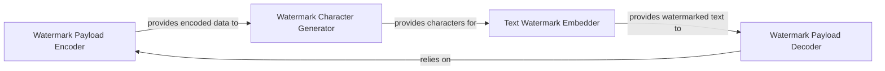

## Details

The `text_blind_watermark` subsystem is designed to embed and extract invisible watermarks within text. It operates through a sequence of specialized components: the `Watermark Payload Encoder` first transforms the raw watermark into a secure, encoded format. This encoded data is then processed by the `Watermark Character Generator` to produce a sequence of imperceptible Unicode characters. The `Text Watermark Embedder` is responsible for integrating these characters into the host text. Finally, the `Watermark Payload Decoder` performs the inverse operation, extracting and decoding the hidden characters to retrieve the original watermark. This modular design ensures clear separation of concerns, from cryptographic transformation to text manipulation.

### Watermark Payload Encoder
This component is responsible for securely transforming the raw watermark data into a binary-encoded format. It utilizes cryptographic conversion to ensure the "blind" nature of the watermark, making it robust against simple detection.

**Related Classes/Methods**:

- <a href="https://github.com/guofei9987/text_blind_watermark/blob/main/text_blind_watermark/text_blind_watermark2.py" target="_blank" rel="noopener noreferrer">`text_blind_watermark.text_blind_watermark2.TextBlindWatermark.crypt_converter.encode`</a>

### Watermark Character Generator
This component takes the binary-encoded watermark from the `Watermark Payload Encoder` and converts it into a sequence of special, invisible Unicode characters (`chr0`, `chr1`). These characters are the actual payload that will be embedded into the host text.

**Related Classes/Methods**:

- <a href="https://github.com/guofei9987/text_blind_watermark/blob/main/text_blind_watermark/text_blind_watermark2.py" target="_blank" rel="noopener noreferrer">`text_blind_watermark.text_blind_watermark2.TextBlindWatermark.generate_watermark`</a>

### Text Watermark Embedder
This component manages the core functionality of inserting the generated watermark characters into the host text. It supports embedding at specific indices, at the end of the text, or at random positions. It also provides functionality to remove existing watermarks from a given text.

**Related Classes/Methods**:

- <a href="https://github.com/guofei9987/text_blind_watermark/blob/main/text_blind_watermark/text_blind_watermark2.py#L21-L27" target="_blank" rel="noopener noreferrer">`text_blind_watermark.text_blind_watermark2.TextBlindWatermark.add_wm_at_idx`:21-27</a>
- <a href="https://github.com/guofei9987/text_blind_watermark/blob/main/text_blind_watermark/text_blind_watermark2.py#L29-L30" target="_blank" rel="noopener noreferrer">`text_blind_watermark.text_blind_watermark2.TextBlindWatermark.add_wm_at_last`:29-30</a>
- <a href="https://github.com/guofei9987/text_blind_watermark/blob/main/text_blind_watermark/text_blind_watermark2.py#L32-L34" target="_blank" rel="noopener noreferrer">`text_blind_watermark.text_blind_watermark2.TextBlindWatermark.add_wm_rnd`:32-34</a>
- <a href="https://github.com/guofei9987/text_blind_watermark/blob/main/text_blind_watermark/text_blind_watermark2.py#L36-L37" target="_blank" rel="noopener noreferrer">`text_blind_watermark.text_blind_watermark2.TextBlindWatermark.remove_watermark`:36-37</a>

### Watermark Payload Decoder
This component is responsible for the extraction and decoding process. It identifies and extracts the hidden watermark characters from a watermarked text and then uses the inverse cryptographic process to decode them back into the original, readable watermark payload.

**Related Classes/Methods**:

- <a href="https://github.com/guofei9987/text_blind_watermark/blob/main/text_blind_watermark/text_blind_watermark2.py#L39-L51" target="_blank" rel="noopener noreferrer">`text_blind_watermark.text_blind_watermark2.TextBlindWatermark.extract`:39-51</a>
- <a href="https://github.com/guofei9987/text_blind_watermark/blob/main/text_blind_watermark/text_blind_watermark2.py" target="_blank" rel="noopener noreferrer">`text_blind_watermark.text_blind_watermark2.TextBlindWatermark.crypt_converter.decode`</a>

### [FAQ](https://github.com/CodeBoarding/GeneratedOnBoardings/tree/main?tab=readme-ov-file#faq)