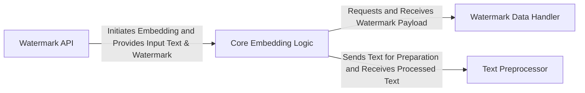

## Details

The `text_blind_watermark` library presents a well-defined, component-based architecture for text steganography. At its highest level, the `Watermark API` serves as the primary entry point, abstracting the complexities of watermark embedding. This API orchestrates calls to the `Core Embedding Logic`, which is the central component responsible for the actual insertion of the watermark. The `Core Embedding Logic` relies on two key supporting components: the `Watermark Data Handler` for generating and securing the watermark payload, and the `Text Preprocessor` for all text-related manipulations, including preparing text for embedding and facilitating watermark removal. This clear separation of concerns into distinct modules—API, core algorithm, data handling, and text utilities—enables a robust and maintainable system, making its functional flow easily understandable and visually representable in a data flow diagram.

### Watermark API
The public interface for users to interact with the watermarking capabilities, offering high-level functions for initiating embedding processes.

**Related Classes/Methods**:

- <a href="https://github.com/guofei9987/text_blind_watermark/blob/main/text_blind_watermark/text_blind_watermark2.py#L29-L30" target="_blank" rel="noopener noreferrer">`add_wm_at_last`:29-30</a>
- <a href="https://github.com/guofei9987/text_blind_watermark/blob/main/text_blind_watermark/text_blind_watermark2.py#L32-L34" target="_blank" rel="noopener noreferrer">`add_wm_rnd`:32-34</a>

### Core Embedding Logic [[Expand]](./Core_Embedding_Logic.md)
Encapsulates the central algorithm for embedding the watermark into text at a specified index, orchestrating the entire embedding process.

**Related Classes/Methods**:

- <a href="https://github.com/guofei9987/text_blind_watermark/blob/main/text_blind_watermark/text_blind_watermark2.py#L21-L27" target="_blank" rel="noopener noreferrer">`add_wm_at_idx`:21-27</a>

### Watermark Data Handler [[Expand]](./Watermark_Data_Handler.md)
Responsible for generating the raw watermark payload and handling its secure encoding and decoding, ensuring the "blind" aspect of the watermark.

**Related Classes/Methods**:

- <a href="https://github.com/guofei9987/text_blind_watermark/blob/main/text_blind_watermark/text_blind_watermark2.py#L17-L19" target="_blank" rel="noopener noreferrer">`generate_watermark`:17-19</a>

### Text Preprocessor
Provides essential utilities for manipulating and preparing text, including cleaning, normalization, and the removal of existing watermarks.

**Related Classes/Methods**:

- <a href="https://github.com/guofei9987/text_blind_watermark/blob/main/text_blind_watermark/text_blind_watermark2.py#L36-L37" target="_blank" rel="noopener noreferrer">`remove_watermark`:36-37</a>

### [FAQ](https://github.com/CodeBoarding/GeneratedOnBoardings/tree/main?tab=readme-ov-file#faq)