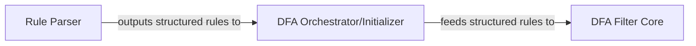

## Details

The `Filter Rule Manager` subsystem is responsible for the entire lifecycle of filtering rules, from parsing raw input to compiling them into an efficient Deterministic Finite Automaton (DFA) for the core filtering engine.

### Rule Parser
This component acts as the initial input handler for filter rules. It is responsible for interpreting raw input (e.g., keywords or patterns) and transforming them into a structured, machine-readable format suitable for the DFA construction process.

**Related Classes/Methods**:

- <a href="https://github.com/observerss/textfilter/blob/master/filter.py#L129-L132" target="_blank" rel="noopener noreferrer">`filter.parse`:129-132</a>

### DFA Orchestrator/Initializer
This component orchestrates the setup, configuration, and initial verification of the `DFAFilter`. It acts as an intermediary, utilizing the `Rule Parser` to obtain structured rules and then submitting these rules to the `DFA Filter Core` for compilation. It ensures the DFA is correctly initialized and prepared before active filtering begins.

**Related Classes/Methods**:

- <a href="https://github.com/observerss/textfilter/blob/master/filter.py#L162-L165" target="_blank" rel="noopener noreferrer">`filter.test_first_character`:162-165</a>

### DFA Filter Core
This is the central data structure and logic component for the Deterministic Finite Automaton. It manages the state transitions, stores the compiled filtering rules, and provides the core methods for adding and compiling new rules into the DFA state machine. It is the heart of the filtering logic within this subsystem.

**Related Classes/Methods**:

- <a href="https://github.com/observerss/textfilter/blob/master/filter.py#L90-L159" target="_blank" rel="noopener noreferrer">`filter.DFAFilter`:90-159</a>
- <a href="https://github.com/observerss/textfilter/blob/master/filter.py" target="_blank" rel="noopener noreferrer">`filter.DFAFilter.add`</a>

### [FAQ](https://github.com/CodeBoarding/GeneratedOnBoardings/tree/main?tab=readme-ov-file#faq)