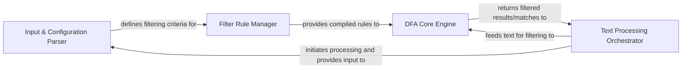

## Details

The textfilter project is structured around a pipeline-like architecture, with a clear separation of concerns. The Text Processing Orchestrator serves as the central control point, initiating the process by leveraging the Input & Configuration Parser to ingest filtering keywords. These keywords are then handed off to the Filter Rule Manager, which constructs the efficient DFA-based rules. The core of the system, the DFA Core Engine, applies these rules to incoming text streams. Finally, the Text Processing Orchestrator receives and manages the output from the DFA Core Engine, completing the filtering cycle. This design promotes modularity, allowing for independent development and potential replacement of filtering algorithms or input methods.

### Input & Configuration Parser
Responsible for reading and interpreting external keyword lists, converting them into a format suitable for internal processing. This component defines the initial filtering criteria based on user-provided configurations or files.

**Related Classes/Methods**:

- <a href="https://github.com/observerss/textfilter/blob/master/filter.py" target="_blank" rel="noopener noreferrer">`filter.DFAFilter.parse`</a>
- <a href="https://github.com/observerss/textfilter/blob/master/filter.py" target="_blank" rel="noopener noreferrer">`filter.DFAFilter.add`</a>

### Filter Rule Manager [[Expand]](./Filter_Rule_Manager.md)
Manages the compilation and organization of filtering rules. It takes the parsed keywords and constructs the internal data structures (e.g., the DFA state machine) that the core engine will use for efficient pattern matching.

**Related Classes/Methods**:

- <a href="https://github.com/observerss/textfilter/blob/master/filter.py" target="_blank" rel="noopener noreferrer">`filter.DFAFilter.add`</a>

### DFA Core Engine
Encapsulates the primary text filtering logic, specifically implementing the Deterministic Finite Automaton (DFA) algorithm. This engine efficiently identifies and processes occurrences of defined keywords within input text streams.

**Related Classes/Methods**:

- <a href="https://github.com/observerss/textfilter/blob/master/filter.py#L90-L159" target="_blank" rel="noopener noreferrer">`filter.DFAFilter`:90-159</a>
- <a href="https://github.com/observerss/textfilter/blob/master/filter.py" target="_blank" rel="noopener noreferrer">`filter.DFAFilter.filter`</a>

### Text Processing Orchestrator
Oversees the entire text processing workflow. It initiates the loading of filtering rules, feeds text data to the DFA Core Engine, and handles the output of filtered results. This component acts as the main control flow for the application.

**Related Classes/Methods**:

- <a href="https://github.com/observerss/textfilter/blob/master/filter.py" target="_blank" rel="noopener noreferrer">`filter.__main__`</a>
- <a href="https://github.com/observerss/textfilter/blob/master/filter.py" target="_blank" rel="noopener noreferrer">`filter.DFAFilter.filter`</a>

### [FAQ](https://github.com/CodeBoarding/GeneratedOnBoardings/tree/main?tab=readme-ov-file#faq)