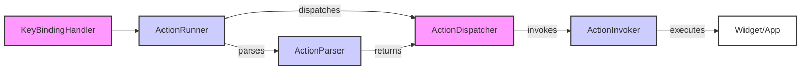

## Action Dispatcher Overview

The Action Dispatcher is a crucial component in Textual applications, responsible for taking a parsed action and executing the corresponding method on the appropriate target (widget, screen, or app). It acts as a bridge between user input and application logic, ensuring that actions are correctly routed and invoked.

### Component Descriptions

*   **Key Binding Handler**: Listens for key presses and triggers actions based on defined key bindings. It uses `_check_bindings` and `_on_key` methods in `textual.app.App`.
    *Relevant source files*: `textual.app.App`
*   **Action Runner**: Initiates the action execution process by parsing the action string and dispatching it. It uses `run_action` method in `textual.app.App`.
    *Relevant source files*: `textual.app.App`
*   **Action Parser**: Parses the action string to identify the target, method, and parameters. It uses `_parse_action` method in `textual.app.App` and `parse` method in `textual.actions`.
    *Relevant source files*: `textual.app.App`, `textual.actions`
*   **Action Dispatcher**: Locates the appropriate method within the target namespace and prepares it for invocation. It uses `_dispatch_action` method in `textual.app.App`.
    *Relevant source files*: `textual.app.App`
*   **Action Invoker**: Executes the action method with the provided parameters, handling both synchronous and asynchronous calls. It uses `invoke` method in `textual._callback`.
    *Relevant source files*: `textual._callback`
*   **Widget/App**: The target object (either a widget or the application itself) on which the action method is executed. The action dispatcher calls the method on this object.
    *Relevant source files*: `textual.widget`, `textual.app.App`
