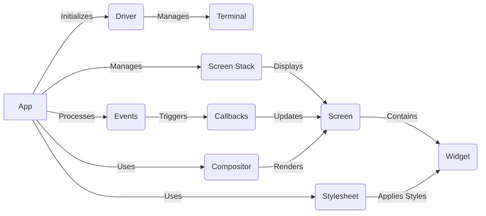

### Component Descriptions:

**App:**
The central application class that manages the application lifecycle, terminal interaction, and event processing. It initializes the driver, manages the screen stack, processes events, and applies styles.
*Relevant source files*: `textual.app.App`, `repos.textual.src.textual.app.App`

**Driver:**
The driver interface responsible for interacting with the terminal and handling input/output. It provides methods for writing to the terminal, processing messages, and managing application mode.
*Relevant source files*: `textual.driver.Driver`, `repos.textual.src.textual.driver.Driver`

**Terminal:**
Represents the terminal interface. The Driver manages the interaction with the terminal.
*Relevant source files*:  (Indirectly through `textual.driver.Driver`)

**Screen Stack:**
Manages the stack of screens within the application. The App pushes, pops, and switches screens on the stack.
*Relevant source files*: `textual.screen.Screen`, `repos.textual.src.textual.screen.Screen`

**Screen:**
Represents a screen within the application, managing widgets and layout. It handles actions like dismissing the screen.
*Relevant source files*: `textual.screen.Screen`, `repos.textual.src.textual.screen.Screen`

**Widget:**
Base class for all UI elements. It manages the layout, styling, and event handling for individual components displayed on the screen. The Stylesheet applies styles to the widgets.
*Relevant source files*: `textual.widget.Widget`

**Events:**
Represents the events that occur within the application, such as user input or timer events. The App processes these events, which can trigger callbacks.
*Relevant source files*: (Indirectly through `textual.app.App` and `textual.message_pump.MessagePump`)

**Callbacks:**
Functions that are called in response to events. Callbacks update the screen.
*Relevant source files*: (Indirectly through `textual.message_pump.MessagePump`)

**Stylesheet:**
The stylesheet manages the styling rules for the application. It parses CSS and applies styles to widgets.
*Relevant source files*: `textual.css.stylesheet.Stylesheet`

**Compositor:**
The compositor is responsible for arranging and rendering the widgets on the screen. It calculates the layout and renders the visual representation of the application.
*Relevant source files*: `textual._compositor.Compositor`
