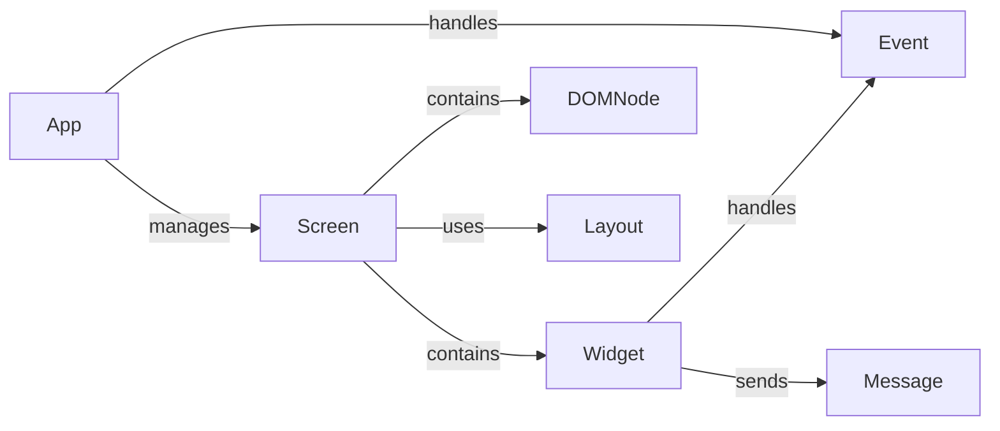

## Component Details

The Application Core manages the lifecycle of a Textual application, orchestrating the interaction between different components to create a rich terminal user interface. It handles initialization, screen management, event handling, and rendering, providing the foundation for building interactive and visually appealing applications. The core components work together to manage the application's state, respond to user input, and update the display.

### App
The central class that manages the application lifecycle, including initialization, screen management, input handling, and rendering. It acts as the main entry point and orchestrates the interaction between different parts of the application. The App class is responsible for setting up the application environment, managing screens, and handling global events.
- **Related Classes/Methods**: `textual.src.textual.app.App`

### Screen
Represents a single view or interface within the application. It manages the layout of widgets, handles user input events, and renders the content to the terminal. Screens can be pushed onto a stack, popped off, or switched to directly. The Screen class provides a container for widgets and manages their lifecycle.
- **Related Classes/Methods**: `textual.src.textual.screen.Screen`

### Widget
A visual component that can be added to a Screen. Widgets handle user input and render themselves to the terminal. They are the building blocks of the user interface. Widgets can be interactive, such as buttons and text fields, or purely for display, such as labels and images.
- **Related Classes/Methods**: `textual.src.textual.widget.Widget`

### Event
Represents an event that occurs within the application, such as a key press or a mouse click. Events are handled by widgets and the application to trigger actions. Events are the primary mechanism for user interaction and application logic.
- **Related Classes/Methods**: `textual.src.textual.events.Event`

### DOMNode
Base class for all objects that can be added to the DOM tree. It provides basic functionalities for composing the UI, handling styles, and querying for child nodes. DOMNode establishes the structure of the UI.
- **Related Classes/Methods**: `textual.src.textual.dom.DOMNode`

### Layout
Manages the arrangement and sizing of widgets within a screen. It determines how widgets are positioned and how they respond to changes in the terminal size. Layouts ensure that the UI remains usable and visually appealing across different terminal sizes.
- **Related Classes/Methods**: `textual.src.textual.layout.Layout`

### Message
Base class for all messages that are sent between widgets and the application. Messages are used to communicate events and data changes. Messages enable communication and coordination between different parts of the application.
- **Related Classes/Methods**: `textual.src.textual.message.Message`
