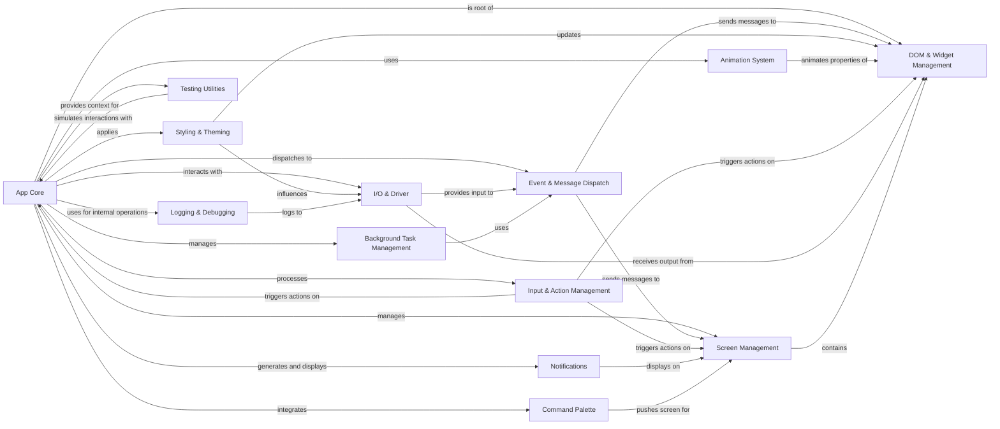

## Component Details

This graph illustrates the architecture of the Textual application lifecycle, centered around the `App Core` component. It details how the core application manages various subsystems including screen navigation, event handling, styling, animations, user input, I/O operations, background tasks, notifications, command execution, and the hierarchical structure of UI elements. The relationships highlight the flow of control and data between these interconnected components, demonstrating how they collectively contribute to the application's functionality and responsiveness.

### App Core
The central application class (`textual.src.textual.app.App`) responsible for orchestrating the entire Textual application lifecycle. It manages initialization, shutdown, global state, and acts as the primary message pump and DOM root. It integrates various subsystems like screen management, event handling, styling, and I/O.

**Related Classes/Methods**:

- <a href="https://github.com/Textualize/textual/blob/master/src/textual/app.py#L294-L4739" target="_blank" rel="noopener noreferrer">`textual.app.App` (294:4739)</a>
- <a href="https://github.com/Textualize/textual/blob/master/src/textual/app.py#L545-L843" target="_blank" rel="noopener noreferrer">`textual.app.App:__init__` (545:843)</a>
- <a href="https://github.com/Textualize/textual/blob/master/src/textual/app.py#L1116-L1134" target="_blank" rel="noopener noreferrer">`textual.app.App:exit` (1116:1134)</a>
- <a href="https://github.com/Textualize/textual/blob/master/src/textual/app.py#L2123-L2177" target="_blank" rel="noopener noreferrer">`textual.app.App:run` (2123:2177)</a>
- <a href="https://github.com/Textualize/textual/blob/master/src/textual/app.py#L2038-L2121" target="_blank" rel="noopener noreferrer">`textual.app.App:run_async` (2038:2121)</a>
- <a href="https://github.com/Textualize/textual/blob/master/src/textual/app.py#L1952-L2036" target="_blank" rel="noopener noreferrer">`textual.app.App:run_test` (1952:2036)</a>
- <a href="https://github.com/Textualize/textual/blob/master/src/textual/app.py#L3113-L3264" target="_blank" rel="noopener noreferrer">`textual.app.App:_process_messages` (3113:3264)</a>
- <a href="https://github.com/Textualize/textual/blob/master/src/textual/app.py#L3486-L3513" target="_blank" rel="noopener noreferrer">`textual.app.App:_shutdown` (3486:3513)</a>
- <a href="https://github.com/Textualize/textual/blob/master/src/textual/app.py#L989-L997" target="_blank" rel="noopener noreferrer">`textual.app.App:_context` (989:997)</a>
- <a href="https://github.com/Textualize/textual/blob/master/src/textual/app.py#L3270-L3290" target="_blank" rel="noopener noreferrer">`textual.app.App:_ready` (3270:3290)</a>
- <a href="https://github.com/Textualize/textual/blob/master/src/textual/app.py#L3012-L3032" target="_blank" rel="noopener noreferrer">`textual.app.App:_handle_exception` (3012:3032)</a>
- <a href="https://github.com/Textualize/textual/blob/master/src/textual/app.py#L3034-L3045" target="_blank" rel="noopener noreferrer">`textual.app.App:_fatal_error` (3034:3045)</a>
- <a href="https://github.com/Textualize/textual/blob/master/src/textual/app.py#L3655-L3662" target="_blank" rel="noopener noreferrer">`textual.app.App.bell` (3655:3662)</a>
- <a href="https://github.com/Textualize/textual/blob/master/src/textual/app.py#L1589-L1605" target="_blank" rel="noopener noreferrer">`textual.app.App.copy_to_clipboard` (1589:1605)</a>
- <a href="https://github.com/Textualize/textual/blob/master/src/textual/app.py#L1607-L1657" target="_blank" rel="noopener noreferrer">`textual.app.App.call_from_thread` (1607:1657)</a>
- <a href="https://github.com/Textualize/textual/blob/master/src/textual/app.py#L3640-L3641" target="_blank" rel="noopener noreferrer">`textual.app.App.post_display_hook` (3640:3641)</a>
- <a href="https://github.com/Textualize/textual/blob/master/src/textual/app.py#L4326-L4331" target="_blank" rel="noopener noreferrer">`textual.app.App.clear_selection` (4326:4331)</a>
- <a href="https://github.com/Textualize/textual/blob/master/src/textual/app.py#L4430-L4478" target="_blank" rel="noopener noreferrer">`textual.app.App.suspend` (4430:4478)</a>
- <a href="https://github.com/Textualize/textual/blob/master/src/textual/app.py#L4500-L4508" target="_blank" rel="noopener noreferrer">`textual.app.App.open_url` (4500:4508)</a>
- <a href="https://github.com/Textualize/textual/blob/master/src/textual/app.py#L245-L255" target="_blank" rel="noopener noreferrer">`textual.app._NullFile` (245:255)</a>
- <a href="https://github.com/Textualize/textual/blob/master/src/textual/app.py#L258-L290" target="_blank" rel="noopener noreferrer">`textual.app._PrintCapture` (258:290)</a>
- <a href="https://github.com/Textualize/textual/blob/master/src/textual/app.py#L197-L198" target="_blank" rel="noopener noreferrer">`textual.app.AppError` (197:198)</a>
- <a href="https://github.com/Textualize/textual/blob/master/src/textual/app.py#L229-L234" target="_blank" rel="noopener noreferrer">`textual.app.SuspendNotSupported` (229:234)</a>

### Screen Management
Manages the application's visual hierarchy and navigation. It handles the stacking and switching of different 'screens' (full-screen views), including default screens, modes, and the lifecycle events associated with screen transitions (suspend, resume).

**Related Classes/Methods**:

- <a href="https://github.com/Textualize/textual/blob/master/src/textual/screen.py#L127-L1838" target="_blank" rel="noopener noreferrer">`textual.screen.Screen` (127:1838)</a>
- <a href="https://github.com/Textualize/textual/blob/master/src/textual/app.py#L1227-L1238" target="_blank" rel="noopener noreferrer">`textual.app.App:get_default_screen` (1227:1238)</a>
- <a href="https://github.com/Textualize/textual/blob/master/src/textual/app.py#L1458-L1472" target="_blank" rel="noopener noreferrer">`textual.app.App:screen` (1458:1472)</a>
- <a href="https://github.com/Textualize/textual/blob/master/src/textual/app.py#L1091-L1097" target="_blank" rel="noopener noreferrer">`textual.app.App:screen_stack` (1091:1097)</a>
- <a href="https://github.com/Textualize/textual/blob/master/src/textual/app.py#L1112-L1114" target="_blank" rel="noopener noreferrer">`textual.app.App:current_mode` (1112:1114)</a>
- <a href="https://github.com/Textualize/textual/blob/master/src/textual/app.py#L2389-L2433" target="_blank" rel="noopener noreferrer">`textual.app.App:_init_mode` (2389:2433)</a>
- <a href="https://github.com/Textualize/textual/blob/master/src/textual/app.py#L2435-L2473" target="_blank" rel="noopener noreferrer">`textual.app.App:switch_mode` (2435:2473)</a>
- <a href="https://github.com/Textualize/textual/blob/master/src/textual/app.py#L2475-L2495" target="_blank" rel="noopener noreferrer">`textual.app.App:add_mode` (2475:2495)</a>
- <a href="https://github.com/Textualize/textual/blob/master/src/textual/app.py#L2497-L2527" target="_blank" rel="noopener noreferrer">`textual.app.App:remove_mode` (2497:2527)</a>
- <a href="https://github.com/Textualize/textual/blob/master/src/textual/app.py#L2529-L2541" target="_blank" rel="noopener noreferrer">`textual.app.App:is_screen_installed` (2529:2541)</a>
- <a href="https://github.com/Textualize/textual/blob/master/src/textual/app.py#L2544-L2544" target="_blank" rel="noopener noreferrer">`textual.app.App:get_screen` (2544:2544)</a>
- <a href="https://github.com/Textualize/textual/blob/master/src/textual/app.py#L2595-L2618" target="_blank" rel="noopener noreferrer">`textual.app.App:_get_screen` (2595:2618)</a>
- <a href="https://github.com/Textualize/textual/blob/master/src/textual/app.py#L2650-L2668" target="_blank" rel="noopener noreferrer">`textual.app.App:_replace_screen` (2650:2668)</a>
- <a href="https://github.com/Textualize/textual/blob/master/src/textual/app.py#L2688-L2745" target="_blank" rel="noopener noreferrer">`textual.app.App:push_screen` (2688:2745)</a>
- <a href="https://github.com/Textualize/textual/blob/master/src/textual/app.py#L2757-L2772" target="_blank" rel="noopener noreferrer">`textual.app.App:push_screen_wait` (2757:2772)</a>
- <a href="https://github.com/Textualize/textual/blob/master/src/textual/app.py#L2774-L2805" target="_blank" rel="noopener noreferrer">`textual.app.App:switch_screen` (2774:2805)</a>
- <a href="https://github.com/Textualize/textual/blob/master/src/textual/app.py#L2807-L2831" target="_blank" rel="noopener noreferrer">`textual.app.App:install_screen` (2807:2831)</a>
- <a href="https://github.com/Textualize/textual/blob/master/src/textual/app.py#L2833-L2865" target="_blank" rel="noopener noreferrer">`textual.app.App:uninstall_screen` (2833:2865)</a>
- <a href="https://github.com/Textualize/textual/blob/master/src/textual/app.py#L2867-L2889" target="_blank" rel="noopener noreferrer">`textual.app.App:pop_screen` (2867:2889)</a>
- <a href="https://github.com/Textualize/textual/blob/master/src/textual/app.py#L2891-L2916" target="_blank" rel="noopener noreferrer">`textual.app.App:_pop_to_screen` (2891:2916)</a>
- <a href="https://github.com/Textualize/textual/blob/master/src/textual/app.py#L209-L210" target="_blank" rel="noopener noreferrer">`textual.app.ScreenStackError` (209:210)</a>
- <a href="https://github.com/Textualize/textual/blob/master/src/textual/app.py#L205-L206" target="_blank" rel="noopener noreferrer">`textual.app.ScreenError` (205:206)</a>
- <a href="https://github.com/Textualize/textual/blob/master/src/textual/app.py#L221-L222" target="_blank" rel="noopener noreferrer">`textual.app.UnknownModeError` (221:222)</a>
- <a href="https://github.com/Textualize/textual/blob/master/src/textual/app.py#L217-L218" target="_blank" rel="noopener noreferrer">`textual.app.InvalidModeError` (217:218)</a>
- <a href="https://github.com/Textualize/textual/blob/master/src/textual/app.py#L225-L226" target="_blank" rel="noopener noreferrer">`textual.app.ActiveModeError` (225:226)</a>

### Event & Message Dispatch
Handles the routing and processing of various events and messages within the application. This includes input events (key, mouse), lifecycle events (compose, mount, resize), and custom messages, ensuring they are delivered to the correct widgets and handlers.

**Related Classes/Methods**:

- <a href="https://github.com/Textualize/textual/blob/master/src/textual/message_pump.py#L117-L876" target="_blank" rel="noopener noreferrer">`textual.message_pump.MessagePump` (117:876)</a>
- <a href="https://github.com/Textualize/textual/blob/master/src/textual/message_pump.py#L797-L800" target="_blank" rel="noopener noreferrer">`textual.message_pump.MessagePump.check_idle` (797:800)</a>
- <a href="https://github.com/Textualize/textual/blob/master/src/textual/message_pump.py#L816-L844" target="_blank" rel="noopener noreferrer">`textual.message_pump.MessagePump.post_message` (816:844)</a>
- <a href="https://github.com/Textualize/textual/blob/master/src/textual/message_pump.py#L356-L394" target="_blank" rel="noopener noreferrer">`textual.message_pump.MessagePump.set_timer` (356:394)</a>
- <a href="https://github.com/Textualize/textual/blob/master/src/textual/message_pump.py#L464-L476" target="_blank" rel="noopener noreferrer">`textual.message_pump.MessagePump.call_next` (464:476)</a>
- <a href="https://github.com/Textualize/textual/blob/master/src/textual/message_pump.py#L447-L462" target="_blank" rel="noopener noreferrer">`textual.message_pump.MessagePump.call_later` (447:462)</a>
- <a href="https://github.com/Textualize/textual/blob/master/src/textual/message_pump.py#L429-L445" target="_blank" rel="noopener noreferrer">`textual.message_pump.MessagePump.call_after_refresh` (429:445)</a>
- <a href="https://github.com/Textualize/textual/blob/master/src/textual/message_pump.py#L651-L661" target="_blank" rel="noopener noreferrer">`textual.message_pump.MessagePump._flush_next_callbacks` (651:661)</a>
- <a href="https://github.com/Textualize/textual/blob/master/src/textual/message_pump.py#L574-L576" target="_blank" rel="noopener noreferrer">`textual.message_pump.MessagePump._close_messages_no_wait` (574:576)</a>
- <a href="https://github.com/Textualize/textual/blob/master/src/textual/message_pump.py#L485-L505" target="_blank" rel="noopener noreferrer">`textual.message_pump.MessagePump._close_messages` (485:505)</a>
- <a href="https://github.com/Textualize/textual/blob/master/src/textual/message_pump.py#L663-L697" target="_blank" rel="noopener noreferrer">`textual.message_pump.MessagePump._dispatch_message` (663:697)</a>
- <a href="https://github.com/Textualize/textual/blob/master/src/textual/message_pump.py#L590-L649" target="_blank" rel="noopener noreferrer">`textual.message_pump.MessagePump._process_messages_loop` (590:649)</a>
- <a href="https://github.com/Textualize/textual/blob/master/src/textual/message_pump.py#L758-L764" target="_blank" rel="noopener noreferrer">`textual.message_pump.MessagePump.on_event` (758:764)</a>
- <a href="https://github.com/Textualize/textual/blob/master/src/textual/events.py#L261-L309" target="_blank" rel="noopener noreferrer">`textual.events.Key` (261:309)</a>
- <a href="https://github.com/Textualize/textual/blob/master/src/textual/events.py#L903-L927" target="_blank" rel="noopener noreferrer">`textual.events.Print` (903:927)</a>
- `textual.events.ExitApp` (full file reference)
- <a href="https://github.com/Textualize/textual/blob/master/src/textual/events.py#L886-L891" target="_blank" rel="noopener noreferrer">`textual.events.ScreenResume` (886:891)</a>
- <a href="https://github.com/Textualize/textual/blob/master/src/textual/events.py#L894-L899" target="_blank" rel="noopener noreferrer">`textual.events.ScreenSuspend` (894:899)</a>
- <a href="https://github.com/Textualize/textual/blob/master/src/textual/events.py#L749-L771" target="_blank" rel="noopener noreferrer">`textual.events.Leave` (749:771)</a>
- <a href="https://github.com/Textualize/textual/blob/master/src/textual/events.py#L725-L746" target="_blank" rel="noopener noreferrer">`textual.events.Enter` (725:746)</a>
- <a href="https://github.com/Textualize/textual/blob/master/src/textual/events.py#L237-L253" target="_blank" rel="noopener noreferrer">`textual.events.MouseRelease` (237:253)</a>
- <a href="https://github.com/Textualize/textual/blob/master/src/textual/events.py#L215-L233" target="_blank" rel="noopener noreferrer">`textual.events.MouseCapture` (215:233)</a>
- <a href="https://github.com/Textualize/textual/blob/master/src/textual/events.py#L156-L164" target="_blank" rel="noopener noreferrer">`textual.events.Compose` (156:164)</a>
- <a href="https://github.com/Textualize/textual/blob/master/src/textual/events.py#L100-L153" target="_blank" rel="noopener noreferrer">`textual.events.Resize` (100:153)</a>
- <a href="https://github.com/Textualize/textual/blob/master/src/textual/events.py#L167-L172" target="_blank" rel="noopener noreferrer">`textual.events.Mount` (167:172)</a>
- <a href="https://github.com/Textualize/textual/blob/master/src/textual/events.py#L175-L180" target="_blank" rel="noopener noreferrer">`textual.events.Unmount` (175:180)</a>
- <a href="https://github.com/Textualize/textual/blob/master/src/textual/events.py#L804-L813" target="_blank" rel="noopener noreferrer">`textual.events.AppFocus` (804:813)</a>
- <a href="https://github.com/Textualize/textual/blob/master/src/textual/events.py#L816-L825" target="_blank" rel="noopener noreferrer">`textual.events.AppBlur` (816:825)</a>
- <a href="https://github.com/Textualize/textual/blob/master/src/textual/events.py#L609-L694" target="_blank" rel="noopener noreferrer">`textual.events.Click` (609:694)</a>
- <a href="https://github.com/Textualize/textual/blob/master/src/textual/events.py#L863-L883" target="_blank" rel="noopener noreferrer">`textual.events.Paste` (863:883)</a>
- <a href="https://github.com/Textualize/textual/blob/master/src/textual/events.py#L931-L946" target="_blank" rel="noopener noreferrer">`textual.events.DeliveryComplete` (931:946)</a>
- <a href="https://github.com/Textualize/textual/blob/master/src/textual/events.py#L950-L960" target="_blank" rel="noopener noreferrer">`textual.events.DeliveryFailed` (950:960)</a>
- <a href="https://github.com/Textualize/textual/blob/master/src/textual/messages.py#L26-L27" target="_blank" rel="noopener noreferrer">`textual.messages.ExitApp` (26:27)</a>
- <a href="https://github.com/Textualize/textual/blob/master/src/textual/messages.py#L21-L22" target="_blank" rel="noopener noreferrer">`textual.messages.Prune` (21:22)</a>
- `textual.messages.Notify` (full file reference)
- <a href="https://github.com/Textualize/textual/blob/master/src/textual/messages.py#L103-L136" target="_blank" rel="noopener noreferrer">`textual.messages.InBandWindowResize` (103:136)</a>
- <a href="https://github.com/Textualize/textual/blob/master/src/textual/messages.py#L31-L48" target="_blank" rel="noopener noreferrer">`textual.messages.Update` (31:48)</a>
- <a href="https://github.com/Textualize/textual/blob/master/src/textual/messages.py#L52-L56" target="_blank" rel="noopener noreferrer">`textual.messages.Layout` (52:56)</a>
- <a href="https://github.com/Textualize/textual/blob/master/src/textual/_callback.py#L59-L93" target="_blank" rel="noopener noreferrer">`textual._callback.invoke` (59:93)</a>
- <a href="https://github.com/Textualize/textual/blob/master/src/textual/_event_broker.py#L17-L37" target="_blank" rel="noopener noreferrer">`textual._event_broker.extract_handler_actions` (17:37)</a>
- <a href="https://github.com/Textualize/textual/blob/master/src/textual/_dispatch_key.py#L12-L68" target="_blank" rel="noopener noreferrer">`textual._dispatch_key.dispatch_key` (12:68)</a>
- <a href="https://github.com/Textualize/textual/blob/master/src/textual/app.py#L3790-L3877" target="_blank" rel="noopener noreferrer">`textual.app.App:on_event` (3790:3877)</a>
- <a href="https://github.com/Textualize/textual/blob/master/src/textual/app.py#L2179-L2223" target="_blank" rel="noopener noreferrer">`textual.app.App:_on_css_change` (2179:2223)</a>
- <a href="https://github.com/Textualize/textual/blob/master/src/textual/app.py#L3515-L3517" target="_blank" rel="noopener noreferrer">`textual.app.App:_on_exit_app` (3515:3517)</a>
- <a href="https://github.com/Textualize/textual/blob/master/src/textual/app.py#L3292-L3302" target="_blank" rel="noopener noreferrer">`textual.app.App:_on_compose` (3292:3302)</a>
- <a href="https://github.com/Textualize/textual/blob/master/src/textual/app.py#L4293-L4298" target="_blank" rel="noopener noreferrer">`textual.app.App:_on_terminal_supports_synchronized_output` (4293:4298)</a>
- <a href="https://github.com/Textualize/textual/blob/master/src/textual/app.py#L4394-L4397" target="_blank" rel="noopener noreferrer">`textual.app.App:_on_notify` (4394:4397)</a>
- <a href="https://github.com/Textualize/textual/blob/master/src/textual/app.py#L4707-L4716" target="_blank" rel="noopener noreferrer">`textual.app.App:_on_delivery_complete` (4707:4716)</a>
- <a href="https://github.com/Textualize/textual/blob/master/src/textual/app.py#L4719-L4724" target="_blank" rel="noopener noreferrer">`textual.app.App:_on_delivery_failed` (4719:4724)</a>
- <a href="https://github.com/Textualize/textual/blob/master/src/textual/app.py#L4727-L4730" target="_blank" rel="noopener noreferrer">`textual.app.App:_on_in_band_window_resize` (4727:4730)</a>
- <a href="https://github.com/Textualize/textual/blob/master/src/textual/app.py#L4056-L4057" target="_blank" rel="noopener noreferrer">`textual.app.App:_on_update` (4056:4057)</a>
- <a href="https://github.com/Textualize/textual/blob/master/src/textual/app.py#L4059-L4060" target="_blank" rel="noopener noreferrer">`textual.app.App:_on_layout` (4059:4060)</a>
- <a href="https://github.com/Textualize/textual/blob/master/src/textual/app.py#L4062-L4064" target="_blank" rel="noopener noreferrer">`textual.app.App:_on_key` (4062:4064)</a>
- <a href="https://github.com/Textualize/textual/blob/master/src/textual/app.py#L4066-L4068" target="_blank" rel="noopener noreferrer">`textual.app.App:_on_resize` (4066:4068)</a>
- <a href="https://github.com/Textualize/textual/blob/master/src/textual/app.py#L4070-L4074" target="_blank" rel="noopener noreferrer">`textual.app.App:_on_app_focus` (4070:4074)</a>
- <a href="https://github.com/Textualize/textual/blob/master/src/textual/app.py#L4076-L4080" target="_blank" rel="noopener noreferrer">`textual.app.App:_on_app_blur` (4076:4080)</a>

### Styling & Theming
Manages the visual appearance of the application. This includes loading and applying CSS stylesheets, handling theme changes (dark/light mode, ANSI colors), and applying various display filters to renderables.

**Related Classes/Methods**:

- <a href="https://github.com/Textualize/textual/blob/master/src/textual/css/stylesheet.py#L142-L731" target="_blank" rel="noopener noreferrer">`textual.css.stylesheet.Stylesheet` (142:731)</a>
- <a href="https://github.com/Textualize/textual/blob/master/src/textual/css/stylesheet.py#L201-L209" target="_blank" rel="noopener noreferrer">`textual.css.stylesheet.Stylesheet.copy` (201:209)</a>
- <a href="https://github.com/Textualize/textual/blob/master/src/textual/css/stylesheet.py#L703-L711" target="_blank" rel="noopener noreferrer">`textual.css.stylesheet.Stylesheet.update` (703:711)</a>
- <a href="https://github.com/Textualize/textual/blob/master/src/textual/css/stylesheet.py#L713-L731" target="_blank" rel="noopener noreferrer">`textual.css.stylesheet.Stylesheet.update_nodes` (713:731)</a>
- <a href="https://github.com/Textualize/textual/blob/master/src/textual/css/stylesheet.py#L321-L331" target="_blank" rel="noopener noreferrer">`textual.css.stylesheet.Stylesheet.has_source` (321:331)</a>
- <a href="https://github.com/Textualize/textual/blob/master/src/textual/css/stylesheet.py#L288-L306" target="_blank" rel="noopener noreferrer">`textual.css.stylesheet.Stylesheet.read` (288:306)</a>
- <a href="https://github.com/Textualize/textual/blob/master/src/textual/css/stylesheet.py#L333-L370" target="_blank" rel="noopener noreferrer">`textual.css.stylesheet.Stylesheet.add_source` (333:370)</a>
- <a href="https://github.com/Textualize/textual/blob/master/src/textual/css/stylesheet.py#L409-L438" target="_blank" rel="noopener noreferrer">`textual.css.stylesheet.Stylesheet.reparse` (409:438)</a>
- <a href="https://github.com/Textualize/textual/blob/master/src/textual/css/stylesheet.py#L469-L606" target="_blank" rel="noopener noreferrer">`textual.css.stylesheet.Stylesheet.apply` (469:606)</a>
- <a href="https://github.com/Textualize/textual/blob/master/src/textual/css/query.py#L59-L508" target="_blank" rel="noopener noreferrer">`textual.css.query.DOMQuery` (59:508)</a>
- <a href="https://github.com/Textualize/textual/blob/master/src/textual/css/query.py#L223-L249" target="_blank" rel="noopener noreferrer">`textual.css.query.DOMQuery.first` (223:249)</a>
- <a href="https://github.com/Textualize/textual/blob/master/src/textual/css/query.py#L40-L41" target="_blank" rel="noopener noreferrer">`textual.css.query.NoMatches` (40:41)</a>
- <a href="https://github.com/Textualize/textual/blob/master/src/textual/css/errors.py#L49-L50" target="_blank" rel="noopener noreferrer">`textual.css.errors.StylesheetError` (49:50)</a>
- <a href="https://github.com/Textualize/textual/blob/master/src/textual/theme.py#L12-L62" target="_blank" rel="noopener noreferrer">`textual.theme.Theme` (12:62)</a>
- `textual.theme.BUILTIN_THEMES` (full file reference)
- <a href="https://github.com/Textualize/textual/blob/master/src/textual/theme.py#L289-L318" target="_blank" rel="noopener noreferrer">`textual.theme.ThemeProvider` (289:318)</a>
- `textual._ansi_theme.ALABASTER` (full file reference)
- `textual._ansi_theme.MONOKAI` (full file reference)
- <a href="https://github.com/Textualize/textual/blob/master/src/textual/_path.py#L21-L44" target="_blank" rel="noopener noreferrer">`textual._path._css_path_type_as_list` (21:44)</a>
- <a href="https://github.com/Textualize/textual/blob/master/src/textual/_path.py#L47-L72" target="_blank" rel="noopener noreferrer">`textual._path._make_path_object_relative` (47:72)</a>
- <a href="https://github.com/Textualize/textual/blob/master/src/textual/filter.py#L220-L286" target="_blank" rel="noopener noreferrer">`textual.filter.ANSIToTruecolor` (220:286)</a>
- <a href="https://github.com/Textualize/textual/blob/master/src/textual/filter.py#L98-L121" target="_blank" rel="noopener noreferrer">`textual.filter.NoColor` (98:121)</a>
- <a href="https://github.com/Textualize/textual/blob/master/src/textual/filter.py#L77-L95" target="_blank" rel="noopener noreferrer">`textual.filter.Monochrome` (77:95)</a>
- <a href="https://github.com/Textualize/textual/blob/master/src/textual/filter.py#L180-L217" target="_blank" rel="noopener noreferrer">`textual.filter.DimFilter` (180:217)</a>
- <a href="https://github.com/Textualize/textual/blob/master/src/textual/app.py#L1302-L1314" target="_blank" rel="noopener noreferrer">`textual.app.App.register_theme` (1302:1314)</a>
- <a href="https://github.com/Textualize/textual/blob/master/src/textual/app.py#L1316-L1323" target="_blank" rel="noopener noreferrer">`textual.app.App.unregister_theme` (1316:1323)</a>
- <a href="https://github.com/Textualize/textual/blob/master/src/textual/app.py#L1326-L1331" target="_blank" rel="noopener noreferrer">`textual.app.App.available_themes` (1326:1331)</a>
- <a href="https://github.com/Textualize/textual/blob/master/src/textual/app.py#L1334-L1339" target="_blank" rel="noopener noreferrer">`textual.app.App.current_theme` (1334:1339)</a>
- <a href="https://github.com/Textualize/textual/blob/master/src/textual/app.py#L1341-L1348" target="_blank" rel="noopener noreferrer">`textual.app.App:_validate_theme` (1341:1348)</a>
- <a href="https://github.com/Textualize/textual/blob/master/src/textual/app.py#L1350-L1363" target="_blank" rel="noopener noreferrer">`textual.app.App:_watch_theme` (1350:1363)</a>
- <a href="https://github.com/Textualize/textual/blob/master/src/textual/app.py#L1369-L1373" target="_blank" rel="noopener noreferrer">`textual.app.App.watch_ansi_theme_dark` (1369:1373)</a>
- <a href="https://github.com/Textualize/textual/blob/master/src/textual/app.py#L1375-L1379" target="_blank" rel="noopener noreferrer">`textual.app.App.watch_ansi_theme_light` (1375:1379)</a>
- <a href="https://github.com/Textualize/textual/blob/master/src/textual/app.py#L1382-L1390" target="_blank" rel="noopener noreferrer">`textual.app.App.ansi_theme` (1382:1390)</a>
- <a href="https://github.com/Textualize/textual/blob/master/src/textual/app.py#L1392-L1402" target="_blank" rel="noopener noreferrer">`textual.app.App:_refresh_truecolor_filter` (1392:1402)</a>
- <a href="https://github.com/Textualize/textual/blob/master/src/textual/app.py#L1365-L1367" target="_blank" rel="noopener noreferrer">`textual.app.App:_invalidate_css` (1365:1367)</a>
- <a href="https://github.com/Textualize/textual/blob/master/src/textual/app.py#L1266-L1284" target="_blank" rel="noopener noreferrer">`textual.app.App.get_css_variables` (1266:1284)</a>
- <a href="https://github.com/Textualize/textual/blob/master/src/textual/app.py#L1247-L1264" target="_blank" rel="noopener noreferrer">`textual.app.App.get_theme_variable_defaults` (1247:1264)</a>
- <a href="https://github.com/Textualize/textual/blob/master/src/textual/app.py#L1286-L1300" target="_blank" rel="noopener noreferrer">`textual.app.App.get_theme` (1286:1300)</a>
- <a href="https://github.com/Textualize/textual/blob/master/src/textual/app.py#L3546-L3567" target="_blank" rel="noopener noreferrer">`textual.app.App.refresh_css` (3546:3567)</a>
- <a href="https://github.com/Textualize/textual/blob/master/src/textual/app.py#L237-L238" target="_blank" rel="noopener noreferrer">`textual.app.InvalidThemeError` (237:238)</a>

### Animation System
Provides capabilities for animating various properties of UI elements over time, with support for different easing functions and animation levels.

**Related Classes/Methods**:

- <a href="https://github.com/Textualize/textual/blob/master/src/textual/_animator.py#L223-L589" target="_blank" rel="noopener noreferrer">`textual._animator.Animator` (223:589)</a>
- <a href="https://github.com/Textualize/textual/blob/master/src/textual/_animator.py#L273-L282" target="_blank" rel="noopener noreferrer">`textual._animator.Animator.bind` (273:282)</a>
- <a href="https://github.com/Textualize/textual/blob/master/src/textual/_animator.py#L509-L526" target="_blank" rel="noopener noreferrer">`textual._animator.Animator.stop_animation` (509:526)</a>
- <a href="https://github.com/Textualize/textual/blob/master/src/textual/_animator.py#L257-L261" target="_blank" rel="noopener noreferrer">`textual._animator.Animator.start` (257:261)</a>
- <a href="https://github.com/Textualize/textual/blob/master/src/textual/_animator.py#L263-L271" target="_blank" rel="noopener noreferrer">`textual._animator.Animator.stop` (263:271)</a>
- <a href="https://github.com/Textualize/textual/blob/master/src/textual/_animator.py#L171-L220" target="_blank" rel="noopener noreferrer">`textual._animator.BoundAnimator` (171:220)</a>
- `textual._animator.DEFAULT_EASING` (full file reference)
- <a href="https://github.com/Textualize/textual/blob/master/src/textual/app.py#L1005-L1043" target="_blank" rel="noopener noreferrer">`textual.app.App.animate` (1005:1043)</a>
- <a href="https://github.com/Textualize/textual/blob/master/src/textual/app.py#L1045-L1055" target="_blank" rel="noopener noreferrer">`textual.app.App.stop_animation` (1045:1055)</a>

### Input & Action Management
Manages user input, specifically key presses, by mapping them to predefined actions. It handles key binding definitions, parsing action strings, and dispatching actions to the appropriate target (App, Screen, or focused widget).

**Related Classes/Methods**:

- <a href="https://github.com/Textualize/textual/blob/master/src/textual/binding.py#L55-L154" target="_blank" rel="noopener noreferrer">`textual.binding.Binding` (55:154)</a>
- <a href="https://github.com/Textualize/textual/blob/master/src/textual/binding.py#L171-L379" target="_blank" rel="noopener noreferrer">`textual.binding.BindingsMap` (171:379)</a>
- <a href="https://github.com/Textualize/textual/blob/master/src/textual/binding.py#L195-L201" target="_blank" rel="noopener noreferrer">`textual.binding.BindingsMap._add_binding` (195:201)</a>
- <a href="https://github.com/Textualize/textual/blob/master/src/textual/binding.py#L332-L362" target="_blank" rel="noopener noreferrer">`textual.binding.BindingsMap.bind` (332:362)</a>
- `textual.binding.Keymap` (full file reference)
- <a href="https://github.com/Textualize/textual/blob/master/src/textual/keys.py#L290-L308" target="_blank" rel="noopener noreferrer">`textual.keys.format_key` (290:308)</a>
- <a href="https://github.com/Textualize/textual/blob/master/src/textual/keys.py#L341-L356" target="_blank" rel="noopener noreferrer">`textual.keys._character_to_key` (341:356)</a>
- <a href="https://github.com/Textualize/textual/blob/master/src/textual/keys.py#L276-L281" target="_blank" rel="noopener noreferrer">`textual.keys._get_unicode_name_from_key` (276:281)</a>
- <a href="https://github.com/Textualize/textual/blob/master/src/textual/keys.py#L359-L368" target="_blank" rel="noopener noreferrer">`textual.keys._normalize_key_list` (359:368)</a>
- <a href="https://github.com/Textualize/textual/blob/master/src/textual/actions.py#L26-L59" target="_blank" rel="noopener noreferrer">`textual.actions.parse` (26:59)</a>
- `textual.actions.ActionParseResult` (full file reference)
- <a href="https://github.com/Textualize/textual/blob/master/src/textual/actions.py#L14-L15" target="_blank" rel="noopener noreferrer">`textual.actions.SkipAction` (14:15)</a>
- <a href="https://github.com/Textualize/textual/blob/master/src/textual/app.py#L1806-L1830" target="_blank" rel="noopener noreferrer">`textual.app.App.bind` (1806:1830)</a>
- <a href="https://github.com/Textualize/textual/blob/master/src/textual/app.py#L1832-L1860" target="_blank" rel="noopener noreferrer">`textual.app.App.get_key_display` (1832:1860)</a>
- <a href="https://github.com/Textualize/textual/blob/master/src/textual/app.py#L1862-L1888" target="_blank" rel="noopener noreferrer">`textual.app.App:_press_keys` (1862:1888)</a>
- <a href="https://github.com/Textualize/textual/blob/master/src/textual/app.py#L3696-L3718" target="_blank" rel="noopener noreferrer">`textual.app.App:_check_bindings` (3696:3718)</a>
- <a href="https://github.com/Textualize/textual/blob/master/src/textual/app.py#L1659-L1661" target="_blank" rel="noopener noreferrer">`textual.app.App.action_change_theme` (1659:1661)</a>
- <a href="https://github.com/Textualize/textual/blob/master/src/textual/app.py#L1663-L1672" target="_blank" rel="noopener noreferrer">`textual.app.App.action_screenshot` (1663:1672)</a>
- <a href="https://github.com/Textualize/textual/blob/master/src/textual/app.py#L3720-L3732" target="_blank" rel="noopener noreferrer">`textual.app.App.action_help_quit` (3720:3732)</a>
- <a href="https://github.com/Textualize/textual/blob/master/src/textual/app.py#L3735-L3739" target="_blank" rel="noopener noreferrer">`textual.app.App:_normalize_keymap` (3735:3739)</a>
- <a href="https://github.com/Textualize/textual/blob/master/src/textual/app.py#L3741-L3755" target="_blank" rel="noopener noreferrer">`textual.app.App.set_keymap` (3741:3755)</a>
- <a href="https://github.com/Textualize/textual/blob/master/src/textual/app.py#L3757-L3768" target="_blank" rel="noopener noreferrer">`textual.app.App.update_keymap` (3757:3768)</a>
- <a href="https://github.com/Textualize/textual/blob/master/src/textual/app.py#L3770-L3788" target="_blank" rel="noopener noreferrer">`textual.app.App.handle_bindings_clash` (3770:3788)</a>
- <a href="https://github.com/Textualize/textual/blob/master/src/textual/app.py#L3896-L3926" target="_blank" rel="noopener noreferrer">`textual.app.App:_parse_action` (3896:3926)</a>
- <a href="https://github.com/Textualize/textual/blob/master/src/textual/app.py#L3928-L3943" target="_blank" rel="noopener noreferrer">`textual.app.App:_check_action_state` (3928:3943)</a>
- <a href="https://github.com/Textualize/textual/blob/master/src/textual/app.py#L3945-L3969" target="_blank" rel="noopener noreferrer">`textual.app.App.run_action` (3945:3969)</a>
- <a href="https://github.com/Textualize/textual/blob/master/src/textual/app.py#L3971-L4010" target="_blank" rel="noopener noreferrer">`textual.app.App:_dispatch_action` (3971:4010)</a>
- <a href="https://github.com/Textualize/textual/blob/master/src/textual/app.py#L4012-L4054" target="_blank" rel="noopener noreferrer">`textual.app.App:_broker_event` (4012:4054)</a>
- <a href="https://github.com/Textualize/textual/blob/master/src/textual/app.py#L4162-L4170" target="_blank" rel="noopener noreferrer">`textual.app.App.action_simulate_key` (4162:4170)</a>
- <a href="https://github.com/Textualize/textual/blob/master/src/textual/app.py#L4172-L4174" target="_blank" rel="noopener noreferrer">`textual.app.App.action_quit` (4172:4174)</a>
- <a href="https://github.com/Textualize/textual/blob/master/src/textual/app.py#L4176-L4178" target="_blank" rel="noopener noreferrer">`textual.app.App.action_bell` (4176:4178)</a>
- <a href="https://github.com/Textualize/textual/blob/master/src/textual/app.py#L4180-L4192" target="_blank" rel="noopener noreferrer">`textual.app.App.action_focus` (4180:4192)</a>
- <a href="https://github.com/Textualize/textual/blob/master/src/textual/app.py#L4194-L4200" target="_blank" rel="noopener noreferrer">`textual.app.App.action_switch_screen` (4194:4200)</a>
- <a href="https://github.com/Textualize/textual/blob/master/src/textual/app.py#L4202-L4208" target="_blank" rel="noopener noreferrer">`textual.app.App.action_push_screen` (4202:4208)</a>
- <a href="https://github.com/Textualize/textual/blob/master/src/textual/app.py#L4210-L4212" target="_blank" rel="noopener noreferrer">`textual.app.App.action_pop_screen` (4210:4212)</a>
- <a href="https://github.com/Textualize/textual/blob/master/src/textual/app.py#L4214-L4216" target="_blank" rel="noopener noreferrer">`textual.app.App.action_switch_mode` (4214:4216)</a>
- <a href="https://github.com/Textualize/textual/blob/master/src/textual/app.py#L4218-L4229" target="_blank" rel="noopener noreferrer">`textual.app.App.action_back` (4218:4229)</a>
- <a href="https://github.com/Textualize/textual/blob/master/src/textual/app.py#L4231-L4238" target="_blank" rel="noopener noreferrer">`textual.app.App.action_add_class` (4231:4238)</a>
- <a href="https://github.com/Textualize/textual/blob/master/src/textual/app.py#L4240-L4246" target="_blank" rel="noopener noreferrer">`textual.app.App.action_remove_class` (4240:4246)</a>
- <a href="https://github.com/Textualize/textual/blob/master/src/textual/app.py#L4248-L4255" target="_blank" rel="noopener noreferrer">`textual.app.App.action_toggle_class` (4248:4255)</a>
- <a href="https://github.com/Textualize/textual/blob/master/src/textual/app.py#L4257-L4264" target="_blank" rel="noopener noreferrer">`textual.app.App.action_toggle_dark` (4257:4264)</a>
- <a href="https://github.com/Textualize/textual/blob/master/src/textual/app.py#L4266-L4268" target="_blank" rel="noopener noreferrer">`textual.app.App.action_focus_next` (4266:4268)</a>
- <a href="https://github.com/Textualize/textual/blob/master/src/textual/app.py#L4270-L4272" target="_blank" rel="noopener noreferrer">`textual.app.App.action_focus_previous` (4270:4272)</a>
- <a href="https://github.com/Textualize/textual/blob/master/src/textual/app.py#L4274-L4276" target="_blank" rel="noopener noreferrer">`textual.app.App.action_hide_help_panel` (4274:4276)</a>
- <a href="https://github.com/Textualize/textual/blob/master/src/textual/app.py#L4278-L4285" target="_blank" rel="noopener noreferrer">`textual.app.App.action_show_help_panel` (4278:4285)</a>
- <a href="https://github.com/Textualize/textual/blob/master/src/textual/app.py#L201-L202" target="_blank" rel="noopener noreferrer">`textual.app.ActionError` (201:202)</a>

### I/O & Driver
Manages the interaction with the underlying terminal or web environment. It handles rendering output, processing raw input, and providing platform-specific functionalities like file delivery and URL opening.

**Related Classes/Methods**:

- <a href="https://github.com/Textualize/textual/blob/master/src/textual/driver.py#L17-L301" target="_blank" rel="noopener noreferrer">`textual.driver.Driver` (17:301)</a>
- <a href="https://github.com/Textualize/textual/blob/master/src/textual/drivers/windows_driver.py#L16-L137" target="_blank" rel="noopener noreferrer">`textual.drivers.windows_driver.WindowsDriver` (16:137)</a>
- <a href="https://github.com/Textualize/textual/blob/master/src/textual/drivers/linux_driver.py#L31-L469" target="_blank" rel="noopener noreferrer">`textual.drivers.linux_driver.LinuxDriver` (31:469)</a>
- <a href="https://github.com/Textualize/textual/blob/master/src/textual/drivers/headless_driver.py#L10-L65" target="_blank" rel="noopener noreferrer">`textual.drivers.headless_driver.HeadlessDriver` (10:65)</a>
- <a href="https://github.com/Textualize/textual/blob/master/src/textual/drivers/linux_inline_driver.py#L28-L325" target="_blank" rel="noopener noreferrer">`textual.drivers.linux_inline_driver.LinuxInlineDriver` (28:325)</a>
- <a href="https://github.com/Textualize/textual/blob/master/src/textual/app.py#L1404-L1439" target="_blank" rel="noopener noreferrer">`textual.app.App.get_driver_class` (1404:1439)</a>
- <a href="https://github.com/Textualize/textual/blob/master/src/textual/app.py#L3067-L3100" target="_blank" rel="noopener noreferrer">`textual.app.App:_build_driver` (3067:3100)</a>
- <a href="https://github.com/Textualize/textual/blob/master/src/textual/app.py#L3569-L3638" target="_blank" rel="noopener noreferrer">`textual.app.App:_display` (3569:3638)</a>
- <a href="https://github.com/Textualize/textual/blob/master/src/textual/app.py#L4300-L4302" target="_blank" rel="noopener noreferrer">`textual.app.App:_begin_update` (4300:4302)</a>
- <a href="https://github.com/Textualize/textual/blob/master/src/textual/app.py#L4304-L4306" target="_blank" rel="noopener noreferrer">`textual.app.App:_end_update` (4304:4306)</a>
- <a href="https://github.com/Textualize/textual/blob/master/src/textual/app.py#L1737-L1771" target="_blank" rel="noopener noreferrer">`textual.app.App.deliver_screenshot` (1737:1771)</a>
- <a href="https://github.com/Textualize/textual/blob/master/src/textual/app.py#L1708-L1735" target="_blank" rel="noopener noreferrer">`textual.app.App.save_screenshot` (1708:1735)</a>
- <a href="https://github.com/Textualize/textual/blob/master/src/textual/app.py#L1674-L1706" target="_blank" rel="noopener noreferrer">`textual.app.App.export_screenshot` (1674:1706)</a>
- <a href="https://github.com/Textualize/textual/blob/master/src/textual/app.py#L4510-L4582" target="_blank" rel="noopener noreferrer">`textual.app.App.deliver_text` (4510:4582)</a>
- <a href="https://github.com/Textualize/textual/blob/master/src/textual/app.py#L4584-L4662" target="_blank" rel="noopener noreferrer">`textual.app.App.deliver_binary` (4584:4662)</a>
- <a href="https://github.com/Textualize/textual/blob/master/src/textual/app.py#L4664-L4704" target="_blank" rel="noopener noreferrer">`textual.app.App:_deliver_binary` (4664:4704)</a>
- <a href="https://github.com/Textualize/textual/blob/master/src/textual/_files.py#L6-L28" target="_blank" rel="noopener noreferrer">`textual._files.generate_datetime_filename` (6:28)</a>
- `textual._ansi_sequences.SYNC_END` (full file reference)
- `textual._ansi_sequences.SYNC_START` (full file reference)

### Logging & Debugging
Provides internal logging mechanisms for the application and integrates with external developer tools for enhanced debugging and introspection.

**Related Classes/Methods**:

- `textual.Logger` (full file reference)
- `textual.LogGroup` (full file reference)
- `textual.LogVerbosity` (full file reference)
- `textual.log` (full file reference)
- `textual_dev.client.DevtoolsClient` (full file reference)
- `textual_dev.client.DevtoolsConnectionError` (full file reference)
- `textual_dev.client.DevtoolsLog` (full file reference)
- `textual_dev.redirect_output.StdoutRedirector` (full file reference)
- <a href="https://github.com/Textualize/textual/blob/master/src/textual/app.py#L1508-L1520" target="_blank" rel="noopener noreferrer">`textual.app.App.log` (1508:1520)</a>
- <a href="https://github.com/Textualize/textual/blob/master/src/textual/app.py#L1522-L1575" target="_blank" rel="noopener noreferrer">`textual.app.App:_log` (1522:1575)</a>
- <a href="https://github.com/Textualize/textual/blob/master/src/textual/app.py#L3102-L3111" target="_blank" rel="noopener noreferrer">`textual.app.App:_init_devtools` (3102:3111)</a>
- <a href="https://github.com/Textualize/textual/blob/master/src/textual/app.py#L3441-L3443" target="_blank" rel="noopener noreferrer">`textual.app.App:_disconnect_devtools` (3441:3443)</a>
- <a href="https://github.com/Textualize/textual/blob/master/src/textual/app.py#L3047-L3065" target="_blank" rel="noopener noreferrer">`textual.app.App:_print_error_renderables` (3047:3065)</a>

### Background Task Management
Manages asynchronous operations and background workers to prevent blocking the main application thread, ensuring a responsive user interface.

**Related Classes/Methods**:

- <a href="https://github.com/Textualize/textual/blob/master/src/textual/worker_manager.py#L24-L181" target="_blank" rel="noopener noreferrer">`textual.worker_manager.WorkerManager` (24:181)</a>
- <a href="https://github.com/Textualize/textual/blob/master/src/textual/worker.py#L65-L79" target="_blank" rel="noopener noreferrer">`textual.worker.get_current_worker` (65:79)</a>
- <a href="https://github.com/Textualize/textual/blob/master/src/textual/worker.py#L41-L42" target="_blank" rel="noopener noreferrer">`textual.worker.NoActiveWorker` (41:42)</a>
- <a href="https://github.com/Textualize/textual/blob/master/src/textual/timer.py#L32-L202" target="_blank" rel="noopener noreferrer">`textual.timer.Timer` (32:202)</a>
- <a href="https://github.com/Textualize/textual/blob/master/src/textual/timer.py#L103-L125" target="_blank" rel="noopener noreferrer">`textual.timer.Timer._stop_all` (103:125)</a>
- <a href="https://github.com/Textualize/textual/blob/master/src/textual/app.py#L886-L892" target="_blank" rel="noopener noreferrer">`textual.app.App.workers` (886:892)</a>

### Notifications
Handles the creation, display, and management of application-wide notifications, often appearing as temporary 'toasts' on the screen.

**Related Classes/Methods**:

- <a href="https://github.com/Textualize/textual/blob/master/src/textual/notifications.py#L27-L68" target="_blank" rel="noopener noreferrer">`textual.notifications.Notification` (27:68)</a>
- <a href="https://github.com/Textualize/textual/blob/master/src/textual/notifications.py#L71-L120" target="_blank" rel="noopener noreferrer">`textual.notifications.Notifications` (71:120)</a>
- <a href="https://github.com/Textualize/textual/blob/master/src/textual/notifications.py#L20-L23" target="_blank" rel="noopener noreferrer">`textual.notifications.Notify` (20:23)</a>
- `textual.notifications.SeverityLevel` (full file reference)
- <a href="https://github.com/Textualize/textual/blob/master/src/textual/widgets/_toast.py#L142-L200" target="_blank" rel="noopener noreferrer">`textual.widgets._toast.ToastRack` (142:200)</a>
- <a href="https://github.com/Textualize/textual/blob/master/src/textual/app.py#L4333-L4392" target="_blank" rel="noopener noreferrer">`textual.app.App.notify` (4333:4392)</a>
- <a href="https://github.com/Textualize/textual/blob/master/src/textual/app.py#L4394-L4397" target="_blank" rel="noopener noreferrer">`textual.app.App:_on_notify` (4394:4397)</a>
- <a href="https://github.com/Textualize/textual/blob/master/src/textual/app.py#L4399-L4408" target="_blank" rel="noopener noreferrer">`textual.app.App:_unnotify` (4399:4408)</a>
- <a href="https://github.com/Textualize/textual/blob/master/src/textual/app.py#L4410-L4413" target="_blank" rel="noopener noreferrer">`textual.app.App.clear_notifications` (4410:4413)</a>
- <a href="https://github.com/Textualize/textual/blob/master/src/textual/app.py#L4308-L4324" target="_blank" rel="noopener noreferrer">`textual.app.App:_refresh_notifications` (4308:4324)</a>
- <a href="https://github.com/Textualize/textual/blob/master/src/textual/app.py#L4287-L4291" target="_blank" rel="noopener noreferrer">`textual.app.App.action_notify` (4287:4291)</a>

### Command Palette
Provides a searchable interface for users to discover and execute various application commands, enhancing accessibility and power-user features.

**Related Classes/Methods**:

- <a href="https://github.com/Textualize/textual/blob/master/src/textual/command.py#L522-L1276" target="_blank" rel="noopener noreferrer">`textual.command.CommandPalette` (522:1276)</a>
- `textual.command.CommandListItem` (full file reference)
- <a href="https://github.com/Textualize/textual/blob/master/src/textual/command.py#L179-L325" target="_blank" rel="noopener noreferrer">`textual.command.Provider` (179:325)</a>
- <a href="https://github.com/Textualize/textual/blob/master/src/textual/command.py#L344-L397" target="_blank" rel="noopener noreferrer">`textual.command.SimpleProvider` (344:397)</a>
- <a href="https://github.com/Textualize/textual/blob/master/src/textual/system_commands.py#L19-L64" target="_blank" rel="noopener noreferrer">`textual.system_commands.SystemCommandsProvider` (19:64)</a>
- <a href="https://github.com/Textualize/textual/blob/master/src/textual/app.py#L1773-L1792" target="_blank" rel="noopener noreferrer">`textual.app.App.search_commands` (1773:1792)</a>
- <a href="https://github.com/Textualize/textual/blob/master/src/textual/app.py#L1794-L1804" target="_blank" rel="noopener noreferrer">`textual.app.App.search_themes` (1794:1804)</a>
- <a href="https://github.com/Textualize/textual/blob/master/src/textual/app.py#L1164-L1225" target="_blank" rel="noopener noreferrer">`textual.app.App.get_system_commands` (1164:1225)</a>
- <a href="https://github.com/Textualize/textual/blob/master/src/textual/app.py#L4415-L4418" target="_blank" rel="noopener noreferrer">`textual.app.App.action_command_palette` (4415:4418)</a>

### DOM & Widget Management
Manages the hierarchical structure of UI elements (widgets) within the application. It handles the creation, attachment, detachment, and removal of widgets, and provides mechanisms for querying and updating the DOM.

**Related Classes/Methods**:

- <a href="https://github.com/Textualize/textual/blob/master/src/textual/dom.py#L136-L1844" target="_blank" rel="noopener noreferrer">`textual.dom.DOMNode` (136:1844)</a>
- <a href="https://github.com/Textualize/textual/blob/master/src/textual/dom.py#L249-L273" target="_blank" rel="noopener noreferrer">`textual.dom.DOMNode.set_reactive` (249:273)</a>
- <a href="https://github.com/Textualize/textual/blob/master/src/textual/dom.py#L1665-L1690" target="_blank" rel="noopener noreferrer">`textual.dom.DOMNode.set_class` (1665:1690)</a>
- <a href="https://github.com/Textualize/textual/blob/master/src/textual/dom.py#L675-L715" target="_blank" rel="noopener noreferrer">`textual.dom.DOMNode._get_default_css` (675:715)</a>
- <a href="https://github.com/Textualize/textual/blob/master/src/textual/dom.py#L1825-L1833" target="_blank" rel="noopener noreferrer">`textual.dom.DOMNode.refresh_bindings` (1825:1833)</a>
- <a href="https://github.com/Textualize/textual/blob/master/src/textual/dom.py#L1380-L1398" target="_blank" rel="noopener noreferrer">`textual.dom.DOMNode.query` (1380:1398)</a>
- <a href="https://github.com/Textualize/textual/blob/master/src/textual/dom.py#L1445-L1496" target="_blank" rel="noopener noreferrer">`textual.dom.DOMNode.query_one` (1445:1496)</a>
- <a href="https://github.com/Textualize/textual/blob/master/src/textual/dom.py#L111-L112" target="_blank" rel="noopener noreferrer">`textual.dom.NoScreen` (111:112)</a>
- <a href="https://github.com/Textualize/textual/blob/master/src/textual/_node_list.py#L176-L182" target="_blank" rel="noopener noreferrer">`textual._node_list.NodeList._clear` (176:182)</a>
- <a href="https://github.com/Textualize/textual/blob/master/src/textual/_compose.py#L10-L78" target="_blank" rel="noopener noreferrer">`textual._compose.compose` (10:78)</a>
- <a href="https://github.com/Textualize/textual/blob/master/src/textual/widget.py#L275-L4687" target="_blank" rel="noopener noreferrer">`textual.widget.Widget` (275:4687)</a>
- <a href="https://github.com/Textualize/textual/blob/master/src/textual/widget.py#L120-L158" target="_blank" rel="noopener noreferrer">`textual.widget.AwaitMount` (120:158)</a>
- <a href="https://github.com/Textualize/textual/blob/master/src/textual/widget.py#L4218-L4240" target="_blank" rel="noopener noreferrer">`textual.widget.Widget.post_message` (4218:4240)</a>
- <a href="https://github.com/Textualize/textual/blob/master/src/textual/await_complete.py#L17-L85" target="_blank" rel="noopener noreferrer">`textual.await_complete.AwaitComplete` (17:85)</a>
- <a href="https://github.com/Textualize/textual/blob/master/src/textual/await_complete.py#L80-L85" target="_blank" rel="noopener noreferrer">`textual.await_complete.AwaitComplete.nothing` (80:85)</a>
- <a href="https://github.com/Textualize/textual/blob/master/src/textual/await_complete.py#L49-L56" target="_blank" rel="noopener noreferrer">`textual.await_complete.AwaitComplete.call_next` (49:56)</a>
- <a href="https://github.com/Textualize/textual/blob/master/src/textual/await_remove.py#L19-L47" target="_blank" rel="noopener noreferrer">`textual.await_remove.AwaitRemove` (19:47)</a>
- <a href="https://github.com/Textualize/textual/blob/master/src/textual/app.py#L1137-L1148" target="_blank" rel="noopener noreferrer">`textual.app.App.focused` (1137:1148)</a>
- <a href="https://github.com/Textualize/textual/blob/master/src/textual/app.py#L920-L939" target="_blank" rel="noopener noreferrer">`textual.app.App.children` (920:939)</a>
- <a href="https://github.com/Textualize/textual/blob/master/src/textual/app.py#L1058-L1060" target="_blank" rel="noopener noreferrer">`textual.app.App.is_dom_root` (1058:1060)</a>
- <a href="https://github.com/Textualize/textual/blob/master/src/textual/app.py#L1063-L1065" target="_blank" rel="noopener noreferrer">`textual.app.App.is_attached` (1063:1065)</a>
- <a href="https://github.com/Textualize/textual/blob/master/src/textual/app.py#L1240-L1245" target="_blank" rel="noopener noreferrer">`textual.app.App.compose` (1240:1245)</a>
- <a href="https://github.com/Textualize/textual/blob/master/src/textual/app.py#L2225-L2231" target="_blank" rel="noopener noreferrer">`textual.app.App.render` (2225:2231)</a>
- <a href="https://github.com/Textualize/textual/blob/master/src/textual/app.py#L2245-L2266" target="_blank" rel="noopener noreferrer">`textual.app.App.get_child_by_id` (2245:2266)</a>
- <a href="https://github.com/Textualize/textual/blob/master/src/textual/app.py#L2278-L2303" target="_blank" rel="noopener noreferrer">`textual.app.App.get_widget_by_id` (2278:2303)</a>
- <a href="https://github.com/Textualize/textual/blob/master/src/textual/app.py#L2305-L2317" target="_blank" rel="noopener noreferrer">`textual.app.App.get_child_by_type` (2305:2317)</a>
- <a href="https://github.com/Textualize/textual/blob/master/src/textual/app.py#L2319-L2328" target="_blank" rel="noopener noreferrer">`textual.app.App.update_styles` (2319:2328)</a>
- <a href="https://github.com/Textualize/textual/blob/master/src/textual/app.py#L2330-L2357" target="_blank" rel="noopener noreferrer">`textual.app.App.mount` (2330:2357)</a>
- <a href="https://github.com/Textualize/textual/blob/master/src/textual/app.py#L2359-L2387" target="_blank" rel="noopener noreferrer">`textual.app.App.mount_all` (2359:2387)</a>
- <a href="https://github.com/Textualize/textual/blob/master/src/textual/app.py#L3324-L3369" target="_blank" rel="noopener noreferrer">`textual.app.App:_register_child` (3324:3369)</a>
- <a href="https://github.com/Textualize/textual/blob/master/src/textual/app.py#L3371-L3427" target="_blank" rel="noopener noreferrer">`textual.app.App:_register` (3371:3427)</a>
- <a href="https://github.com/Textualize/textual/blob/master/src/textual/app.py#L3429-L3439" target="_blank" rel="noopener noreferrer">`textual.app.App:_unregister` (3429:3439)</a>
- <a href="https://github.com/Textualize/textual/blob/master/src/textual/app.py#L3445-L3455" target="_blank" rel="noopener noreferrer">`textual.app.App:_start_widget` (3445:3455)</a>
- <a href="https://github.com/Textualize/textual/blob/master/src/textual/app.py#L3457-L3466" target="_blank" rel="noopener noreferrer">`textual.app.App.is_mounted` (3457:3466)</a>
- <a href="https://github.com/Textualize/textual/blob/master/src/textual/app.py#L4082-L4128" target="_blank" rel="noopener noreferrer">`textual.app.App:_prune` (4082:4128)</a>
- <a href="https://github.com/Textualize/textual/blob/master/src/textual/app.py#L3310-L3322" target="_blank" rel="noopener noreferrer">`textual.app.App.recompose` (3310:3322)</a>
- <a href="https://github.com/Textualize/textual/blob/master/src/textual/app.py#L3304-L3308" target="_blank" rel="noopener noreferrer">`textual.app.App:_check_recompose` (3304:3308)</a>
- <a href="https://github.com/Textualize/textual/blob/master/src/textual/app.py#L2918-L2925" target="_blank" rel="noopener noreferrer">`textual.app.App.set_focus` (2918:2925)</a>
- <a href="https://github.com/Textualize/textual/blob/master/src/textual/app.py#L2927-L2947" target="_blank" rel="noopener noreferrer">`textual.app.App:_set_mouse_over` (2927:2947)</a>
- <a href="https://github.com/Textualize/textual/blob/master/src/textual/app.py#L2949-L2970" target="_blank" rel="noopener noreferrer">`textual.app.App:_update_mouse_over` (2949:2970)</a>
- <a href="https://github.com/Textualize/textual/blob/master/src/textual/app.py#L2972-L2987" target="_blank" rel="noopener noreferrer">`textual.app.App.capture_mouse` (2972:2987)</a>
- <a href="https://github.com/Textualize/textual/blob/master/src/textual/app.py#L3643-L3653" target="_blank" rel="noopener noreferrer">`textual.app.App.get_widget_at` (3643:3653)</a>
- <a href="https://github.com/Textualize/textual/blob/master/src/textual/app.py#L3665-L3684" target="_blank" rel="noopener noreferrer">`textual.app.App:_binding_chain` (3665:3684)</a>
- <a href="https://github.com/Textualize/textual/blob/master/src/textual/app.py#L4130-L4160" target="_blank" rel="noopener noreferrer">`textual.app.App:_watch_app_focus` (4130:4160)</a>
- <a href="https://github.com/Textualize/textual/blob/master/src/textual/app.py#L3880-L3894" target="_blank" rel="noopener noreferrer">`textual.app.App.escape_to_minimize` (3880:3894)</a>
- <a href="https://github.com/Textualize/textual/blob/master/src/textual/app.py#L4278-L4285" target="_blank" rel="noopener noreferrer">`textual.app.App.action_show_help_panel` (4278:4285)</a>
- <a href="https://github.com/Textualize/textual/blob/master/src/textual/widgets/_loading_indicator.py#L18-L93" target="_blank" rel="noopener noreferrer">`textual.widgets._loading_indicator.LoadingIndicator` (18:93)</a>
- <a href="https://github.com/Textualize/textual/blob/master/src/textual/widgets/_help_panel.py#L11-L106" target="_blank" rel="noopener noreferrer">`textual.widgets._help_panel.HelpPanel` (11:106)</a>
- <a href="https://github.com/Textualize/textual/blob/master/src/textual/renderables/blank.py#L10-L27" target="_blank" rel="noopener noreferrer">`textual.renderables.blank.Blank` (10:27)</a>
- <a href="https://github.com/Textualize/textual/blob/master/src/textual/errors.py#L13-L14" target="_blank" rel="noopener noreferrer">`textual.errors.NoWidget` (13:14)</a>

### Testing Utilities
Provides a dedicated environment and tools for programmatically testing Textual applications, allowing for headless execution and simulated user interactions.

**Related Classes/Methods**:

- <a href="https://github.com/Textualize/textual/blob/master/src/textual/pilot.py#L62-L556" target="_blank" rel="noopener noreferrer">`textual.pilot.Pilot` (62:556)</a>
- <a href="https://github.com/Textualize/textual/blob/master/src/textual/pilot.py#L459-L519" target="_blank" rel="noopener noreferrer">`textual.pilot.Pilot._wait_for_screen` (459:519)</a>
- <a href="https://github.com/Textualize/textual/blob/master/src/textual/_wait.py#L8-L41" target="_blank" rel="noopener noreferrer">`textual._wait.wait_for_idle` (8:41)</a>

### [FAQ](https://github.com/CodeBoarding/GeneratedOnBoardings/tree/main?tab=readme-ov-file#faq)