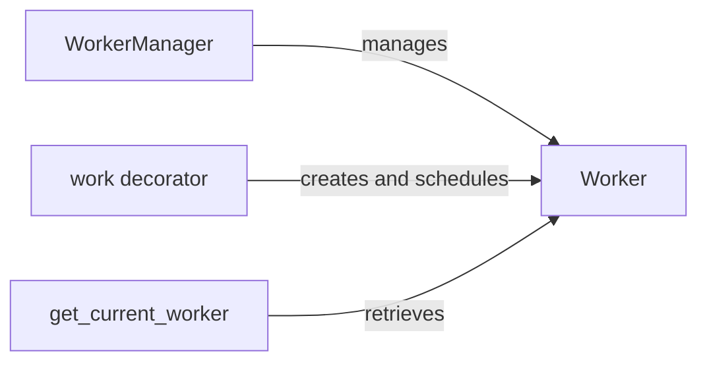

## Component Details

The Asynchronous Operations subsystem in Textual handles background tasks, allowing the application to remain responsive while performing long-running operations. It revolves around the `WorkerManager`, which manages the lifecycle of `Worker` instances. The `@work` decorator simplifies the process of offloading tasks to workers, and `get_current_worker` provides a way to access the current worker instance within a task. This system enables efficient execution of tasks in separate threads, improving the overall performance and responsiveness of Textual applications.

### Worker
The `Worker` class represents an individual task that can be executed in a background thread. It encapsulates the task's state (running, completed, failed) and provides methods to start, run, and wait for the task to complete. It is the fundamental unit of asynchronous execution.
- **Related Classes/Methods**: `textual.src.textual.worker.Worker`

### WorkerManager
The `WorkerManager` class is responsible for managing the lifecycle of `Worker` instances. It provides methods to create new workers, track their status, and manage their execution. It acts as a central point for managing background tasks within the application.
- **Related Classes/Methods**: `textual.src.textual.worker_manager.WorkerManager`

### work decorator
The `work` decorator is used to mark methods as suitable for running in a background worker. When a method is decorated with `@work`, it automatically creates a `Worker` instance and schedules the decorated method to be executed in a separate thread or asynchronously. This simplifies the process of offloading tasks to background workers.
- **Related Classes/Methods**: `textual.src.textual._work_decorator.work`

### get_current_worker
The `get_current_worker` function retrieves the current worker instance, if any, associated with the current thread or task. This allows code running within a worker to access the worker's state and other information, enabling communication and coordination between the main thread and background tasks.
- **Related Classes/Methods**: `textual.src.textual.worker.get_current_worker`
