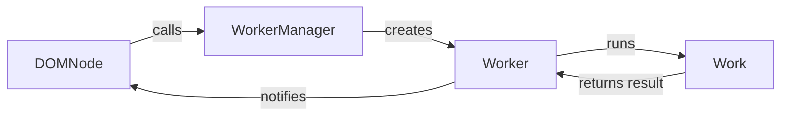

## Asynchronous Task Management Overview

This component provides tools for running tasks in the background and managing asynchronous operations within the Textual framework. It leverages the `Worker`, `WorkerManager`, and the `work` decorator to simplify the process of offloading work to separate threads or async tasks.

### Data Flow Diagram

### Component Descriptions

- **DOMNode**: Represents a node in the Textual DOM (Document Object Model), such as an App, Screen, or Widget. It provides the `run_worker` method to create and manage workers. It uses the `WorkerManager` to add new workers.
  - **Purpose**: Provides the context for running workers and receives notifications about their completion or errors.
  - **Interactions**: Calls `WorkerManager` to create and manage workers. Receives notifications from `Worker` upon completion or error.
  - **Relevant source files**: `textual.dom.DOMNode`

- **WorkerManager**: Manages the lifecycle of `Worker` instances. It provides methods to add, start, cancel, and track workers. It is accessed via `App.workers` or `Widget.workers`.
  - **Purpose**: Centralized management of background tasks, ensuring proper resource utilization and task coordination.
  - **Interactions**: Creates `Worker` instances. Is called by `DOMNode` to create workers.
  - **Relevant source files**: `textual.worker_manager.WorkerManager`

- **Worker**: Represents an individual asynchronous task. It encapsulates the task's state, handles errors, and provides mechanisms for cancellation and waiting for completion. It runs the `Work` in a separate thread or as an async task.
  - **Purpose**: Executes a given task in the background, managing its state and handling potential errors.
  - **Interactions**: Receives work from `WorkerManager`. Notifies `DOMNode` about completion or errors.
  - **Relevant source files**: `textual.worker.Worker`

- **Work**: Represents the actual function or coroutine that needs to be executed in the background. It is decorated with `@work`.
  - **Purpose**: Defines the task to be executed asynchronously.
  - **Interactions**: Runs inside the `Worker`. Returns a result to the `Worker`.
  - **Relevant source files**: `textual._work_decorator.work`
