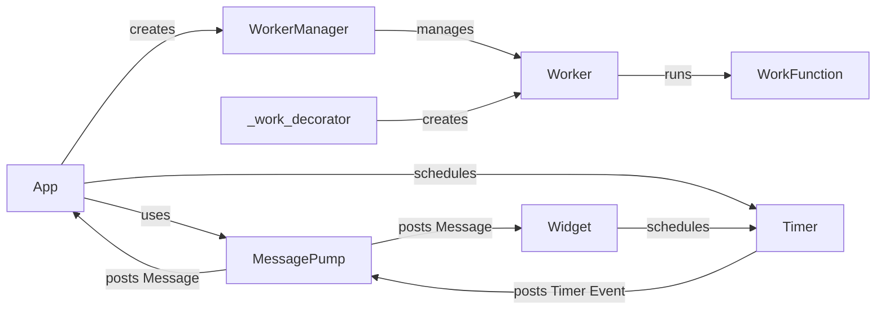

## Asynchronous Task Management Overview

This component provides the foundation for managing background tasks, timers, and asynchronous operations within the Textual application. It leverages the `MessagePump` to handle messages and events, the `Timer` class for scheduling callbacks, and the `Worker` and `WorkerManager` classes for managing background tasks in separate threads.

### Data Flow Diagram

### Component Descriptions

- **App**: The core application class that inherits from `MessagePump` and manages the event loop, widgets, and terminal interaction. It creates and manages the `WorkerManager` and schedules timers using the `Timer` class. It also processes messages posted to it by the `MessagePump` and other components.
  - *Relevant source files*: `textual.app.App`

- **MessagePump**: Base class for managing messages, timers, and callbacks. It provides the foundation for asynchronous operations in Textual. It schedules timers and posts messages to the `App` and `Widget` instances.
  - *Relevant source files*: `textual.message_pump.MessagePump`

- **Timer**: Encapsulates timer functionality, allowing callbacks to be executed after a specified delay or at regular intervals. It interacts with the `MessagePump` to schedule and manage timer events. It posts `Timer` events to the `MessagePump`.
  - *Relevant source files*: `textual.timer.Timer`

- **Widget**: Base class for UI elements, providing rendering, event handling, and state management. Widgets can schedule auto-refreshing, which uses the timer mechanism. It schedules timers using the `Timer` class and posts messages to the `MessagePump`.
  - *Relevant source files*: `textual.widget.Widget`

- **WorkerManager**: Manages a collection of `Worker` instances, providing methods for adding, starting, canceling, and monitoring workers. It is responsible for coordinating background tasks within the application. It creates and manages `Worker` instances.
  - *Relevant source files*: `textual.worker_manager.WorkerManager`

- **Worker**: Represents a background task that can be run in a separate thread. It provides a mechanism for executing functions asynchronously without blocking the main thread. It runs the `WorkFunction` in a separate thread.
  - *Relevant source files*: `textual.worker.Worker`

- **WorkFunction**: Represents the actual function or coroutine that will be executed by the `Worker`. The `_work_decorator` creates a `Worker` instance that encapsulates this function.
  - *Relevant source files*: `textual._work_decorator.work`

- **_work_decorator**: A decorator that simplifies the creation and management of `Worker` instances. It allows functions to be easily executed in a background thread by annotating them with the `@work` decorator. It creates `Worker` instances.
  - *Relevant source files*: `textual._work_decorator.work`