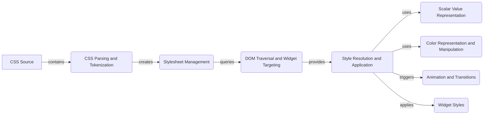

## CSS Styling Engine Overview

This document provides a high-level overview of the CSS Styling Engine in Textual. The engine is responsible for parsing CSS stylesheets, resolving styles based on selectors and applying the resolved styles to the widgets in the application.

### Data Flow Diagram

### Component Descriptions

*   **CSS Source**: Represents the source of the CSS, which can be a file, a string, or default styles defined in a widget. It contains the raw CSS content and metadata about the source.
    *   **Functionality**: Provides the CSS content to the parsing and tokenization component.
    *   **Interaction**: The starting point of the styling process, providing the raw CSS.
    *   **Relevant source files**: `textual.css.stylesheet.Stylesheet`
*   **CSS Parsing and Tokenization**: Handles the parsing and tokenization of CSS stylesheets. It transforms CSS text into a structured representation that can be further processed.
    *   **Functionality**: Transforms CSS text into tokens and then into a structured format (RuleSets).
    *   **Interaction**: Receives CSS source, sends RuleSets to Stylesheet Management.
    *   **Relevant source files**: `textual.css.parse`, `textual.css.tokenize`, `textual.css.tokenizer.Tokenizer`
*   **Stylesheet Management**: Represents a CSS stylesheet and manages its lifecycle. It loads, parses, and stores CSS rules, and provides mechanisms for applying these rules to the application's widgets.
    *   **Functionality**: Stores and manages CSS rules, provides an API to add/remove CSS sources, and triggers parsing.
    *   **Interaction**: Receives RuleSets from Parsing, queries DOM for widget targeting.
    *   **Relevant source files**: `textual.css.stylesheet.Stylesheet`, `textual.css.stylesheet.Watcher`
*   **DOM Traversal and Widget Targeting**: Provides functionalities to query and manipulate widgets within the Textual application's Document Object Model (DOM). It enables the CSS engine to target specific widgets for styling and apply styles based on their position and attributes within the DOM.
    *   **Functionality**: Allows the CSS engine to select specific widgets based on CSS selectors.
    *   **Interaction**: Stylesheet Management queries the DOM to find matching widgets.
    *   **Relevant source files**: `textual.dom.DOMNode.query_one`, `textual.dom.DOMNode.query`
*   **Style Resolution and Application**: Resolves and applies computed styles to widgets. It determines the final style values based on CSS rules, cascading, and specificity, and then applies these styles to the corresponding widgets.
    *   **Functionality**: Resolves the final style values for a widget based on CSS rules and applies them.
    *   **Interaction**: Receives targeted widgets from DOM Traversal, uses Scalar and Color representations, triggers Animations, and applies styles to widgets.
    *   **Relevant source files**: `textual.css.styles.Styles`, `textual.css.styles.ComputeResult`, `textual.css.query.DOMQuery`
*   **Scalar Value Representation**: Represents a numeric value with a unit, such as pixels or percentages. It's used for CSS properties like width, height, and margin, providing a way to express sizes and distances in a flexible and unit-aware manner.
    *   **Functionality**: Represents and resolves scalar values with units.
    *   **Interaction**: Used by Style Resolution to handle dimension and size related CSS properties.
    *   **Relevant source files**: `textual.css.scalar.Scalar`, `textual.css.scalar.Unit`
*   **Color Representation and Manipulation**: Represents a color value and provides functionalities for parsing, manipulating, and converting colors between different formats. It's a fundamental building block for styling the visual appearance of widgets.
    *   **Functionality**: Represents and manipulates color values.
    *   **Interaction**: Used by Style Resolution to handle color related CSS properties.
    *   **Relevant source files**: `textual.color.Color`, `textual.color.Color.parse`, `textual.color.Color.from_rich_color`
*   **Animation and Transitions**: Handles CSS animations and transitions, allowing for dynamic and smooth changes in widget styles over time. It manages the animation lifecycle and applies style updates to create visual effects.
    *   **Functionality**: Manages animations and transitions of style properties.
    *   **Interaction**: Triggered by Style Resolution when style changes require animation.
    *   **Relevant source files**: `textual.css.transition.Transition`, `textual.css.scalar_animation.ScalarAnimation`
*   **Widget Styles**: Represents the final styles applied to a widget.
    *   **Functionality**: Stores the resolved styles for a widget.
    *   **Interaction**: Receives the final styles from Style Resolution.
    *   **Relevant source files**: `textual.widget.Widget`
