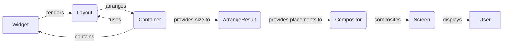

## Component Composition & Layout Overview

This component is responsible for managing the layout and composition of UI elements (Widgets) within the Textual framework. It handles the arrangement of widgets on the screen, calculates their positions and sizes, and uses a compositor to render the final output.

**Diagram: Data Flow Diagram**

**Component Descriptions:**

*   **Widget**: Base class for all UI elements. It defines the basic rendering and layout behavior. It renders its content and provides it to the Layout for arrangement.
    *   Relevant source files: `textual.widget.Widget`
*   **Layout**: Abstract base class for layout algorithms. It takes widgets and a container size as input and calculates the positions and sizes of the widgets. It provides the arrangement information to the Container.
    *   Relevant source files: `textual.layout.Layout`
*   **Container**: A widget that can contain other widgets. It uses a Layout to arrange its children within its bounds. It provides the size of the container to the ArrangeResult.
    *   Relevant source files: `textual.containers.Container`
*   **ArrangeResult**: Represents the result of a layout arrangement, containing the placements of widgets and scrollbar information. It provides the placements to the Compositor.
    *   Relevant source files: `textual.layout.ArrangeResult`, `textual.layout.DockArrangeResult`
*   **Compositor**: Responsible for drawing the UI by compositing the rendered output of widgets. It maintains a spatial map of widgets and their geometries. It composites the widgets onto the Screen.
    *   Relevant source files: `textual._compositor.Compositor`
*   **Screen**: Represents the entire screen and manages the rendering process. It displays the final output to the User.
    *   Relevant source files: `textual.screen.Screen`
