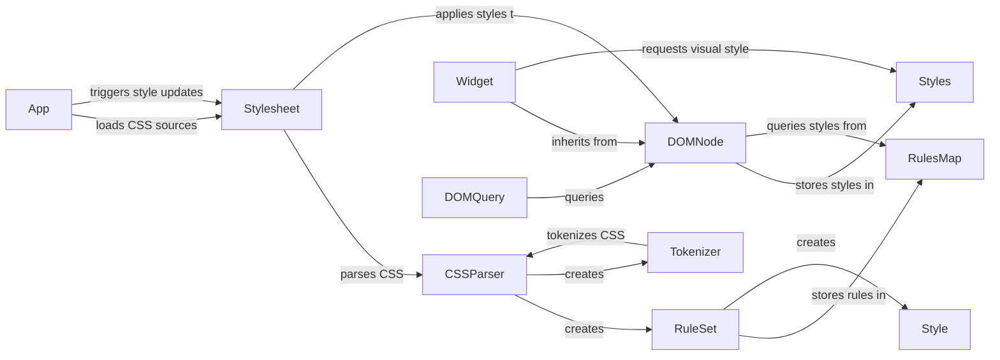

## Component Styling (CSS) Overview

This document provides a high-level overview of the CSS styling engine within the Textual framework. The engine is responsible for parsing CSS-like syntax, applying styles to UI components (Widgets), and managing style updates efficiently.

### Data Flow Diagram

### Component Descriptions

*   **App**: The main application class that initiates CSS loading and style updates. It loads CSS sources, parses them using the `Stylesheet` and applies the resulting styles to the DOM.
    *   **Functionality**: Manages the application lifecycle, including CSS loading and refreshing.
    *   **Interaction**: Loads CSS into `Stylesheet` and triggers `Stylesheet` updates.
    *   **Source Files**: `textual.app.App`

*   **Stylesheet**: Manages CSS rules and applies them to the DOM. It parses CSS sources, resolves variables, and applies styles to DOM nodes.
    *   **Functionality**: Parses CSS, stores rules, and applies them to DOM nodes.
    *   **Interaction**: Receives CSS from `App`, uses `CSSParser` to parse it, and applies styles to `DOMNode`.
    *   **Source Files**: `textual.css.stylesheet.Stylesheet`

*   **CSSParser**: Parses CSS source code into a structured representation (RuleSets, Declarations, Selectors).
    *   **Functionality**: Transforms CSS text into a structured format that the `Stylesheet` can use.
    *   **Interaction**: Receives CSS text from `Stylesheet` and outputs `RuleSet` objects.
    *   **Source Files**: `textual.css.parse`

*   **RuleSet**: Represents a set of CSS rules for a specific selector.
    *   **Description**: Stores CSS rules and their associated selectors.
    *   **Interaction**: Created by `CSSParser` and stored in `RulesMap`.
    *   **Source Files**: `textual.css.model`

*   **RulesMap**: A data structure that stores the CSS rules applicable to a DOM node, organized by style property. It allows efficient access to the resolved style values.
    *   **Functionality**: Provides a way to quickly look up the applicable styles for a given DOM node.
    *   **Interaction**: Stores `RuleSet` objects and is queried by `DOMNode` to apply styles.
    *   **Source Files**: `textual.css.styles.RulesMap`

*   **DOMNode**: Base class for elements in the DOM, responsible for managing styles, classes, and style updates. It provides methods to add, remove, and toggle classes, as well as to set and update styles.
    *   **Functionality**: Represents an element in the DOM and manages its styles.
    *   **Interaction**: Receives style updates from `Stylesheet` and stores them in `Styles`.
    *   **Source Files**: `textual.dom.DOMNode`

*   **Styles**: Represents the computed styles for a DOM node. It stores the resolved style rules and provides methods to access and manipulate them.
    *   **Functionality**: Stores the resolved styles for a DOM node.
    *   **Interaction**: Stored in `DOMNode` and provides access to style properties.
    *   **Source Files**: `textual.css.styles.Styles`

*   **Widget**: Base class for UI elements, provides a method to get visual styles. It inherits from DOMNode and adds UI-specific functionality.
    *   **Functionality**: Represents a UI element with styling capabilities.
    *   **Interaction**: Inherits styling from `DOMNode` and provides a way to access visual styles.
    *   **Source Files**: `textual.widget.Widget`

*   **DOMQuery**: Provides a way to query the DOM tree and select nodes based on CSS selectors.
    *   **Functionality**: Allows searching the DOM for specific nodes based on CSS selectors.
    *   **Interaction**: Used to select specific `DOMNode` elements.
    *   **Source Files**: `textual.css.query.DOMQuery`

*   **Tokenizer**: Tokenizes CSS source code, breaking it down into individual tokens for parsing.
    *   **Functionality**: Breaks down CSS source into tokens.
    *   **Interaction**: Used by `CSSParser` to process CSS source.
    *   **Source Files**: `textual.css.tokenizer.Tokenizer`

*   **Style**: Represents a single, resolved CSS style, containing properties like color, background, etc.
    *   **Functionality**: Represents a single CSS style property and its value.
    *   **Interaction**: Created by `CSSParser` and stored in `RuleSet`.
    *   **Source Files**: `textual.style.Style`