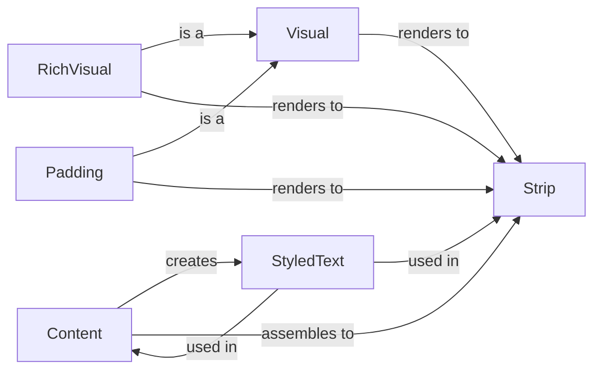

## Component Details

The Content Rendering subsystem in Textual is responsible for converting application data into a visual representation on the terminal. It manages the styling, formatting, and layout of text and other visual elements. The core components work together to create renderable segments that are then displayed on the screen. The process involves creating content from various sources, applying styles, assembling content into strips, and rendering these strips with consideration for padding and other visual attributes.

### Content
The Content class represents styled text content. It handles operations such as creating content from text, markup, or rich text, applying styles, assembling the content into renderable segments, and providing methods for manipulating the content (e.g., truncation, padding, alignment). It uses StyledText to manage the styling of individual text segments and assembles these into Strips for rendering.
- **Related Classes/Methods**: `textual.src.textual.content.Content`

### Strip
The Strip class represents a single line of styled text. It provides methods for manipulating and styling the text within the strip, such as alignment, cropping, padding, and applying styles or metadata. Strips are the fundamental units for rendering text in Textual. It uses StyledText to manage the styling of individual text segments.
- **Related Classes/Methods**: `textual.src.textual.strip.Strip`

### Visual
The Visual class serves as an abstract base class for visual elements. It defines the interface for converting visual elements into renderable strips. Concrete subclasses, such as RichVisual and Padding, implement the to_strips method to provide specific rendering logic.
- **Related Classes/Methods**: `textual.src.textual.visual.Visual`, `textual.src.textual.visual`

### RichVisual
The RichVisual class is a concrete implementation of Visual that renders rich text content. It calculates the optimal width for rendering and converts the rich text into strips.
- **Related Classes/Methods**: `textual.src.textual.visual.RichVisual`

### Padding
The Padding class is a concrete implementation of Visual that adds padding around other visual elements. It renders strips with the specified padding.
- **Related Classes/Methods**: `textual.src.textual.visual.Padding`

### StyledText
StyledText represents a string with associated style information. It's used within Content and Strip to manage the styling of individual text segments.
- **Related Classes/Methods**: `textual.src.textual.styled_text.StyledText`
