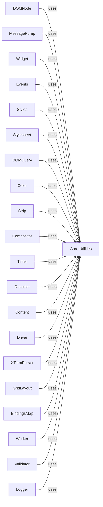

## Component Details

The Core Utilities component in Textual provides a fundamental set of helper classes and functions that underpin various aspects of the framework. This includes essential functionalities like geometric calculations for UI element positioning and sizing, efficient data caching mechanisms, precise timing and scheduling for animations and events, and re-entrant locking for managing concurrent operations. These utilities are widely used across other Textual components to ensure consistent behavior, performance, and resource management.

### Core Utilities
Provides foundational helper classes and functions for common tasks such as geometric calculations, caching, timing, animation, and various internal mechanisms that support the entire framework.

**Related Classes/Methods**:

- <a href="https://github.com/Textualize/textual/blob/master/src/textual/geometry.py#L317-L1116" target="_blank" rel="noopener noreferrer">`textual.geometry.Region` (317:1116)</a>
- <a href="https://github.com/Textualize/textual/blob/master/src/textual/cache.py#L20-L207" target="_blank" rel="noopener noreferrer">`textual.cache.LRUCache` (20:207)</a>
- <a href="https://github.com/Textualize/textual/blob/master/src/textual/timer.py#L32-L202" target="_blank" rel="noopener noreferrer">`textual.timer.Timer` (32:202)</a>
- <a href="https://github.com/Textualize/textual/blob/master/src/textual/rlock.py#L6-L47" target="_blank" rel="noopener noreferrer">`textual.rlock.RLock` (6:47)</a>
- <a href="https://github.com/Textualize/textual/blob/master/src/textual/geometry.py#L69-L186" target="_blank" rel="noopener noreferrer">`textual.geometry.Offset` (69:186)</a>
- <a href="https://github.com/Textualize/textual/blob/master/src/textual/geometry.py#L189-L314" target="_blank" rel="noopener noreferrer">`textual.geometry.Size` (189:314)</a>
- <a href="https://github.com/Textualize/textual/blob/master/src/textual/geometry.py#L1119-L1315" target="_blank" rel="noopener noreferrer">`textual.geometry.Spacing` (1119:1315)</a>

### [FAQ](https://github.com/CodeBoarding/GeneratedOnBoardings/tree/main?tab=readme-ov-file#faq)