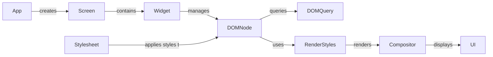

## DOM Component Overview

The DOM (Document Object Model) is a crucial component in Textual, representing the UI as a tree of nodes. It enables the manipulation and querying of widgets and their properties, managing the hierarchy of widgets and their relationships. The DOM facilitates dynamic updates and interactions within the application's user interface.

### Component Descriptions:

- **App**: The root of the application, responsible for managing screens, global styles, and application-level events. It creates and manages `Screen` instances.
  *Source Files*: `textual.app.App`

- **Screen**: Represents a screen or view within the application. It inherits from DOMNode and provides methods for managing the layout and content of the screen. It acts as a container for widgets and manages their arrangement on the screen.
  *Source Files*: `textual.screen.Screen`

- **Widget**: A base class for UI elements. It inherits from DOMNode and provides additional functionality for handling user input, managing styles, and interacting with the application. It's the fundamental building block for creating interactive UI components.
  *Source Files*: `textual.widget.Widget`

- **DOMNode**: Represents a node in the Document Object Model (DOM) tree. It provides methods for querying, manipulating, and styling elements within the application's user interface. It maintains the hierarchical structure of the UI and provides methods to traverse and manipulate it.
  *Source Files*: `textual.dom.DOMNode`

- **DOMQuery**: Provides functionality to query the DOM tree for specific nodes based on CSS selectors. It enables efficient searching and filtering of UI elements based on their properties and relationships.
  *Source Files*: `textual.css.query.DOMQuery`

- **Stylesheet**: Manages the application's CSS stylesheets. It parses CSS code, applies styles to DOM nodes, and handles dynamic style updates.
  *Source Files*: `textual.css.stylesheet.Stylesheet`

- **RenderStyles**: Responsible for rendering the styles of a DOM node. It takes the computed styles and applies them to the node, determining its appearance on the screen.
  *Source Files*: `textual.css.styles.RenderStyles`

- **Compositor**: Responsible for composing the visual output of the application. It takes the layout information and renders the UI elements on the screen.
  *Source Files*: `textual._compositor.Compositor`

- **UI**: Represents the final rendered user interface displayed to the user. It's the culmination of the DOM, styles, and layout, providing an interactive experience.
