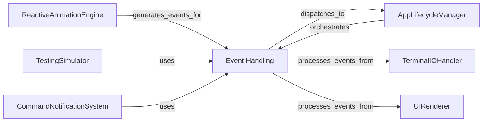

## Component Details

The Event Handling subsystem is the central message bus for the Textual application, responsible for defining, managing, and dispatching various user and system events (e.g., keyboard presses, mouse clicks, window resizing) and general messages. It handles message posting, queuing, and dispatching to relevant handlers throughout the application, enabling decoupled communication between components.

### Event Handling
The central message bus for the Textual application, responsible for defining, managing, and dispatching various user and system events (e.g., keyboard presses, mouse clicks, window resizing) and general messages. It handles message posting, queuing, and dispatching to relevant handlers throughout the application, enabling decoupled communication between components.

**Related Classes/Methods**:

- <a href="https://github.com/Textualize/textual/blob/master/src/textual/message_pump.py#L117-L876" target="_blank" rel="noopener noreferrer">`textual.message_pump.MessagePump` (117:876)</a>
- <a href="https://github.com/Textualize/textual/blob/master/src/textual/message.py#L23-L158" target="_blank" rel="noopener noreferrer">`textual.message.Message` (23:158)</a>
- <a href="https://github.com/Textualize/textual/blob/master/src/textual/events.py#L39-L40" target="_blank" rel="noopener noreferrer">`textual.events.Event` (39:40)</a>
- <a href="https://github.com/Textualize/textual/blob/master/src/textual/events.py#L261-L309" target="_blank" rel="noopener noreferrer">`textual.events.Key` (261:309)</a>
- <a href="https://github.com/Textualize/textual/blob/master/src/textual/events.py#L324-L561" target="_blank" rel="noopener noreferrer">`textual.events.MouseEvent` (324:561)</a>
- `textual.events` (full file reference)
- `textual.messages` (full file reference)

### AppLifecycleManager
The core of the Textual application, responsible for managing the application's lifecycle, including startup, shutdown, screen management (pushing, popping, switching), mode handling, and global event processing. It orchestrates interactions between various subsystems.

**Related Classes/Methods**:

- <a href="https://github.com/Textualize/textual/blob/master/src/textual/app.py#L294-L4739" target="_blank" rel="noopener noreferrer">`textual.app.App` (294:4739)</a>

### TerminalIOHandler
Manages the low-level communication with the terminal, including capturing user input (keyboard, mouse) and rendering application output. It provides platform-specific implementations to ensure compatibility across different operating systems and environments.

**Related Classes/Methods**:

- <a href="https://github.com/Textualize/textual/blob/master/src/textual/driver.py#L17-L301" target="_blank" rel="noopener noreferrer">`textual.driver.Driver` (17:301)</a>
- <a href="https://github.com/Textualize/textual/blob/master/src/textual/drivers/win32.py#L212-L304" target="_blank" rel="noopener noreferrer">`textual.drivers.win32.EventMonitor` (212:304)</a>
- <a href="https://github.com/Textualize/textual/blob/master/src/textual/drivers/windows_driver.py#L16-L137" target="_blank" rel="noopener noreferrer">`textual.drivers.windows_driver.WindowsDriver` (16:137)</a>
- <a href="https://github.com/Textualize/textual/blob/master/src/textual/drivers/linux_inline_driver.py#L28-L325" target="_blank" rel="noopener noreferrer">`textual.drivers.linux_inline_driver.LinuxInlineDriver` (28:325)</a>
- <a href="https://github.com/Textualize/textual/blob/master/src/textual/drivers/web_driver.py#L41-L354" target="_blank" rel="noopener noreferrer">`textual.drivers.web_driver.WebDriver` (41:354)</a>
- <a href="https://github.com/Textualize/textual/blob/master/src/textual/drivers/headless_driver.py#L10-L65" target="_blank" rel="noopener noreferrer">`textual.drivers.headless_driver.HeadlessDriver` (10:65)</a>
- <a href="https://github.com/Textualize/textual/blob/master/src/textual/drivers/linux_driver.py#L31-L469" target="_blank" rel="noopener noreferrer">`textual.drivers.linux_driver.LinuxDriver` (31:469)</a>
- <a href="https://github.com/Textualize/textual/blob/master/src/textual/_xterm_parser.py#L52-L376" target="_blank" rel="noopener noreferrer">`textual._xterm_parser.XTermParser` (52:376)</a>

### UIRenderer
Manages the visual representation and interaction of the application's user interface. This includes the hierarchical structure of widgets (DOM), rendering content to the terminal, handling user input at the widget level, and managing focus within the UI.

**Related Classes/Methods**:

- <a href="https://github.com/Textualize/textual/blob/master/src/textual/widget.py#L275-L4687" target="_blank" rel="noopener noreferrer">`textual.widget.Widget` (275:4687)</a>
- <a href="https://github.com/Textualize/textual/blob/master/src/textual/dom.py#L136-L1844" target="_blank" rel="noopener noreferrer">`textual.dom.DOMNode` (136:1844)</a>
- <a href="https://github.com/Textualize/textual/blob/master/src/textual/screen.py#L127-L1838" target="_blank" rel="noopener noreferrer">`textual.screen.Screen` (127:1838)</a>
- <a href="https://github.com/Textualize/textual/blob/master/src/textual/scroll_view.py#L15-L185" target="_blank" rel="noopener noreferrer">`textual.scroll_view.ScrollView` (15:185)</a>
- <a href="https://github.com/Textualize/textual/blob/master/src/textual/widgets/_rich_log.py#L47-L321" target="_blank" rel="noopener noreferrer">`textual.widgets._rich_log.RichLog` (47:321)</a>
- <a href="https://github.com/Textualize/textual/blob/master/src/textual/widgets/_toggle_button.py#L25-L261" target="_blank" rel="noopener noreferrer">`textual.widgets._toggle_button.ToggleButton` (25:261)</a>
- <a href="https://github.com/Textualize/textual/blob/master/src/textual/widgets/_option_list.py#L108-L999" target="_blank" rel="noopener noreferrer">`textual.widgets._option_list.OptionList` (108:999)</a>
- <a href="https://github.com/Textualize/textual/blob/master/src/textual/widgets/_select.py#L44-L173" target="_blank" rel="noopener noreferrer">`textual.widgets._select.SelectOverlay` (44:173)</a>
- <a href="https://github.com/Textualize/textual/blob/master/src/textual/widgets/_select.py#L176-L261" target="_blank" rel="noopener noreferrer">`textual.widgets._select.SelectCurrent` (176:261)</a>
- <a href="https://github.com/Textualize/textual/blob/master/src/textual/widgets/_select.py#L270-L707" target="_blank" rel="noopener noreferrer">`textual.widgets._select.Select` (270:707)</a>
- <a href="https://github.com/Textualize/textual/blob/master/src/textual/widgets/_progress_bar.py#L191-L376" target="_blank" rel="noopener noreferrer">`textual.widgets._progress_bar.ProgressBar` (191:376)</a>
- <a href="https://github.com/Textualize/textual/blob/master/src/textual/widgets/_footer.py#L124-L277" target="_blank" rel="noopener noreferrer">`textual.widgets._footer.Footer` (124:277)</a>
- <a href="https://github.com/Textualize/textual/blob/master/src/textual/widgets/_masked_input.py#L443-L704" target="_blank" rel="noopener noreferrer">`textual.widgets._masked_input.MaskedInput` (443:704)</a>
- <a href="https://github.com/Textualize/textual/blob/master/src/textual/widgets/_input.py#L70-L1092" target="_blank" rel="noopener noreferrer">`textual.widgets._input.Input` (70:1092)</a>
- <a href="https://github.com/Textualize/textual/blob/master/src/textual/widgets/_header.py#L16-L52" target="_blank" rel="noopener noreferrer">`textual.widgets._header.HeaderIcon` (16:52)</a>
- <a href="https://github.com/Textualize/textual/blob/master/src/textual/widgets/_header.py#L75-L98" target="_blank" rel="noopener noreferrer">`textual.widgets._header.HeaderClock` (75:98)</a>
- <a href="https://github.com/Textualize/textual/blob/master/src/textual/widgets/_header.py#L130-L237" target="_blank" rel="noopener noreferrer">`textual.widgets._header.Header` (130:237)</a>
- <a href="https://github.com/Textualize/textual/blob/master/src/textual/widgets/_content_switcher.py#L15-L132" target="_blank" rel="noopener noreferrer">`textual.widgets._content_switcher.ContentSwitcher` (15:132)</a>
- <a href="https://github.com/Textualize/textual/blob/master/src/textual/widgets/_list_view.py#L19-L394" target="_blank" rel="noopener noreferrer">`textual.widgets._list_view.ListView` (19:394)</a>
- <a href="https://github.com/Textualize/textual/blob/master/src/textual/widgets/_selection_list.py#L76-L715" target="_blank" rel="noopener noreferrer">`textual.widgets._selection_list.SelectionList` (76:715)</a>
- <a href="https://github.com/Textualize/textual/blob/master/src/textual/widgets/_directory_tree.py#L32-L580" target="_blank" rel="noopener noreferrer">`textual.widgets._directory_tree.DirectoryTree` (32:580)</a>
- <a href="https://github.com/Textualize/textual/blob/master/src/textual/widgets/_data_table.py#L259-L2785" target="_blank" rel="noopener noreferrer">`textual.widgets._data_table.DataTable` (259:2785)</a>
- <a href="https://github.com/Textualize/textual/blob/master/src/textual/widgets/_tabbed_content.py#L165-L235" target="_blank" rel="noopener noreferrer">`textual.widgets._tabbed_content.TabPane` (165:235)</a>
- <a href="https://github.com/Textualize/textual/blob/master/src/textual/widgets/_tabbed_content.py#L238-L716" target="_blank" rel="noopener noreferrer">`textual.widgets._tabbed_content.TabbedContent` (238:716)</a>
- <a href="https://github.com/Textualize/textual/blob/master/src/textual/widgets/_markdown.py#L107-L232" target="_blank" rel="noopener noreferrer">`textual.widgets._markdown.MarkdownBlock` (107:232)</a>
- <a href="https://github.com/Textualize/textual/blob/master/src/textual/widgets/_markdown.py#L1138-L1261" target="_blank" rel="noopener noreferrer">`textual.widgets._markdown.MarkdownViewer` (1138:1261)</a>
- <a href="https://github.com/Textualize/textual/blob/master/src/textual/widgets/_collapsible.py#L17-L93" target="_blank" rel="noopener noreferrer">`textual.widgets._collapsible.CollapsibleTitle` (17:93)</a>
- <a href="https://github.com/Textualize/textual/blob/master/src/textual/widgets/_collapsible.py#L96-L242" target="_blank" rel="noopener noreferrer">`textual.widgets._collapsible.Collapsible` (96:242)</a>
- <a href="https://github.com/Textualize/textual/blob/master/src/textual/widgets/_switch.py#L20-L204" target="_blank" rel="noopener noreferrer">`textual.widgets._switch.Switch` (20:204)</a>
- <a href="https://github.com/Textualize/textual/blob/master/src/textual/widgets/_list_item.py#L11-L39" target="_blank" rel="noopener noreferrer">`textual.widgets._list_item.ListItem` (11:39)</a>
- <a href="https://github.com/Textualize/textual/blob/master/src/textual/widgets/_button.py#L39-L405" target="_blank" rel="noopener noreferrer">`textual.widgets._button.Button` (39:405)</a>
- <a href="https://github.com/Textualize/textual/blob/master/src/textual/widgets/_loading_indicator.py#L18-L93" target="_blank" rel="noopener noreferrer">`textual.widgets._loading_indicator.LoadingIndicator` (18:93)</a>
- <a href="https://github.com/Textualize/textual/blob/master/src/textual/widgets/_tree.py#L91-L513" target="_blank" rel="noopener noreferrer">`textual.widgets._tree.TreeNode` (91:513)</a>
- <a href="https://github.com/Textualize/textual/blob/master/src/textual/widgets/_tree.py#L516-L1598" target="_blank" rel="noopener noreferrer">`textual.widgets._tree.Tree` (516:1598)</a>
- <a href="https://github.com/Textualize/textual/blob/master/src/textual/widgets/_placeholder.py#L55-L180" target="_blank" rel="noopener noreferrer">`textual.widgets._placeholder.Placeholder` (55:180)</a>
- <a href="https://github.com/Textualize/textual/blob/master/src/textual/widgets/_tabs.py#L27-L89" target="_blank" rel="noopener noreferrer">`textual.widgets._tabs.Underline` (27:89)</a>
- <a href="https://github.com/Textualize/textual/blob/master/src/textual/widgets/_tabs.py#L92-L196" target="_blank" rel="noopener noreferrer">`textual.widgets._tabs.Tab` (92:196)</a>
- <a href="https://github.com/Textualize/textual/blob/master/src/textual/widgets/_tabs.py#L199-L866" target="_blank" rel="noopener noreferrer">`textual.widgets._tabs.Tabs` (199:866)</a>
- <a href="https://github.com/Textualize/textual/blob/master/src/textual/widgets/_text_area.py#L107-L2381" target="_blank" rel="noopener noreferrer">`textual.widgets._text_area.TextArea` (107:2381)</a>
- <a href="https://github.com/Textualize/textual/blob/master/src/textual/widgets/_log.py#L26-L362" target="_blank" rel="noopener noreferrer">`textual.widgets._log.Log` (26:362)</a>
- <a href="https://github.com/Textualize/textual/blob/master/src/textual/widgets/_radio_set.py#L19-L307" target="_blank" rel="noopener noreferrer">`textual.widgets._radio_set.RadioSet` (19:307)</a>

### ReactiveAnimationEngine
Provides the underlying mechanisms for reactive programming and animations within the Textual UI. It enables properties to automatically update dependent parts of the UI and facilitates smooth visual transitions through timed animations.

**Related Classes/Methods**:

- <a href="https://github.com/Textualize/textual/blob/master/src/textual/reactive.py#L408-L443" target="_blank" rel="noopener noreferrer">`textual.reactive` (408:443)</a>
- <a href="https://github.com/Textualize/textual/blob/master/src/textual/_animator.py#L52-L87" target="_blank" rel="noopener noreferrer">`textual._animator.Animation` (52:87)</a>
- <a href="https://github.com/Textualize/textual/blob/master/src/textual/_animator.py#L91-L168" target="_blank" rel="noopener noreferrer">`textual._animator.SimpleAnimation` (91:168)</a>
- <a href="https://github.com/Textualize/textual/blob/master/src/textual/_animator.py#L223-L589" target="_blank" rel="noopener noreferrer">`textual._animator.Animator` (223:589)</a>
- <a href="https://github.com/Textualize/textual/blob/master/src/textual/timer.py#L32-L202" target="_blank" rel="noopener noreferrer">`textual.timer.Timer` (32:202)</a>

### TestingSimulator
A utility component designed for automated testing of Textual applications. It allows programmatic control over the application, simulating user inputs and verifying UI behavior without a graphical interface.

**Related Classes/Methods**:

- <a href="https://github.com/Textualize/textual/blob/master/src/textual/pilot.py#L62-L556" target="_blank" rel="noopener noreferrer">`textual.pilot.Pilot` (62:556)</a>

### CommandNotificationSystem
Handles application-wide commands, such as those invoked via a command palette, and manages user notifications. It also integrates with the theming system to provide visual feedback for these features.

**Related Classes/Methods**:

- <a href="https://github.com/Textualize/textual/blob/master/src/textual/command.py#L522-L1276" target="_blank" rel="noopener noreferrer">`textual.command.CommandPalette` (522:1276)</a>
- <a href="https://github.com/Textualize/textual/blob/master/src/textual/notifications.py#L27-L68" target="_blank" rel="noopener noreferrer">`textual.notifications.Notification` (27:68)</a>
- <a href="https://github.com/Textualize/textual/blob/master/src/textual/notifications.py#L20-L23" target="_blank" rel="noopener noreferrer">`textual.notifications.Notify` (20:23)</a>
- <a href="https://github.com/Textualize/textual/blob/master/src/textual/widgets/_toast.py#L33-L139" target="_blank" rel="noopener noreferrer">`textual.widgets._toast.Toast` (33:139)</a>
- <a href="https://github.com/Textualize/textual/blob/master/src/textual/widgets/_toast.py#L142-L200" target="_blank" rel="noopener noreferrer">`textual.widgets._toast.ToastRack` (142:200)</a>
- <a href="https://github.com/Textualize/textual/blob/master/src/textual/theme.py#L12-L62" target="_blank" rel="noopener noreferrer">`textual.theme.Theme` (12:62)</a>
- <a href="https://github.com/Textualize/textual/blob/master/src/textual/theme.py#L289-L318" target="_blank" rel="noopener noreferrer">`textual.theme.ThemeProvider` (289:318)</a>

### [FAQ](https://github.com/CodeBoarding/GeneratedOnBoardings/tree/main?tab=readme-ov-file#faq)