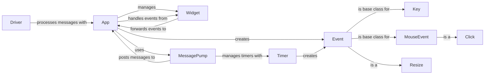

## Component Details

The Event Management subsystem in Textual is responsible for handling user interactions and internal application events. It defines the event classes, manages event propagation, and dispatches events to the appropriate handlers. The core components include the App, Widget, Event, and Driver, which work together to ensure that user input and application state changes are correctly processed and reflected in the UI. The App class is the central hub for event processing, while the Widget class handles events specific to individual UI elements. The Driver interacts with the terminal to capture user input and update the display.

### App
The central application class that manages the application lifecycle, event handling, and action dispatching. It initializes the application, processes events, checks bindings, and manages the overall application state. It receives events from the driver and dispatches them to the appropriate widgets.
- **Related Classes/Methods**: `textual.src.textual.app.App`

### Widget
The base class for all UI elements in Textual. It handles basic event processing, forwarding events to appropriate handlers, and managing the widget's state. It also provides methods for handling mouse events and key presses. Widgets receive events from the App and can generate their own events.
- **Related Classes/Methods**: `textual.src.textual.widget.Widget`

### Event
Base class for all events in Textual. Defines common attributes and methods for event handling. It serves as the foundation for specific event types like Key, MouseEvent, and Resize.
- **Related Classes/Methods**: `textual.src.textual.events.Event`

### Key
Represents a key press event. Contains information about the key that was pressed, modifiers, and other relevant details. It is a subclass of Event.
- **Related Classes/Methods**: `textual.src.textual.events.Key`

### MouseEvent
Base class for mouse events. Contains information about the mouse position and button states. It is a subclass of Event and the parent of more specific mouse event types.
- **Related Classes/Methods**: `textual.src.textual.events.MouseEvent`

### Click
Represents a mouse click event. Contains information about the mouse position and button that was clicked. It is a subclass of MouseEvent.
- **Related Classes/Methods**: `textual.src.textual.events.Click`

### Resize
Represents a resize event. Contains information about the new size of the application window. It is a subclass of Event.
- **Related Classes/Methods**: `textual.src.textual.events.Resize`

### Driver
Responsible for processing messages and interacting with the underlying terminal or UI. It receives messages from the application and updates the display accordingly. The driver captures user input and translates it into events.
- **Related Classes/Methods**: `textual.src.textual.driver.Driver`

### MessagePump
Manages and dispatches messages within the application. It handles events, posts messages, and manages timers. It dispatches messages to the appropriate handlers.
- **Related Classes/Methods**: `textual.src.textual.message_pump.MessagePump`

### Timer
Provides a mechanism for scheduling tasks to be executed at specific intervals. It allows starting, stopping, and managing timers within the application. It interacts with the message pump to schedule and execute timer events.
- **Related Classes/Methods**: `textual.src.textual.timer.Timer`
