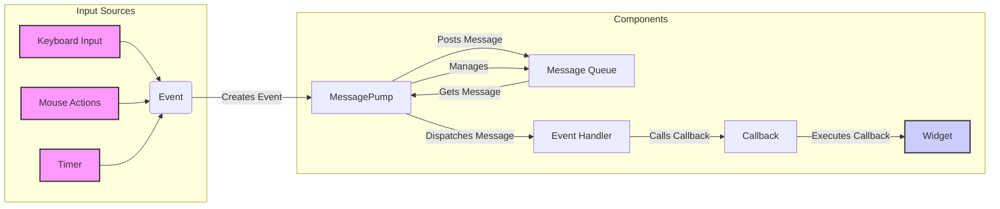

## Event System Overview

This diagram illustrates the flow of events within the Textual application's Event System. It highlights how user inputs and system events are captured, processed, and dispatched to the appropriate widgets.

## Components Description

- **Keyboard Input**: Represents user interactions via the keyboard. It creates `Event` objects that encapsulate key presses and releases.
    - *Interaction*: Sends `Event` to `MessagePump`.
    - *Relevant source files*: `textual.events.Key`

- **Mouse Actions**: Represents user interactions via the mouse. It creates `Event` objects that encapsulate mouse clicks, movements, and scrolls.
    - *Interaction*: Sends `Event` to `MessagePump`.
    - *Relevant source files*: `textual.events.MouseEvent`, `textual.events.Click`, `textual.events.MouseMove`, `textual.events.MouseUp`, `textual.events.MouseDown`, `textual.events.MouseScrollUp`, `textual.events.MouseScrollDown`

- **Timer**: Represents timed events within the application. It creates `Event` objects that trigger callbacks at specified intervals.
    - *Interaction*: Sends `Event` to `MessagePump`.
    - *Relevant source files*: `textual.timer.Timer`, `textual.events.Timer`

- **Event**: Base class for all events in Textual. Events are messages that represent user interactions, system notifications, or internal signals.
    - *Interaction*: Created by input sources and dispatched via the `MessagePump`.
    - *Relevant source files*: `textual.events.Event`

- **MessagePump**: Manages the message queue, timers, and dispatching messages to appropriate handlers.
    - *Interaction*: Receives `Event` from input sources, posts them to the `Message Queue`, and dispatches them to `Event Handler`.
    - *Relevant source files*: `textual.message_pump.MessagePump`

- **Message Queue**: A queue that holds messages (including events) to be processed by the `MessagePump`.
    - *Interaction*: Managed by `MessagePump`.
    - *Relevant source files*: `textual.message_pump.MessagePump`

- **Event Handler**: Processes events and triggers the appropriate callbacks.
    - *Interaction*: Receives `Event` from `MessagePump` and calls `Callback`.
    - *Relevant source files*: `textual.message_pump.MessagePump`

- **Callback**: An event used to invoke a callback function.
    - *Interaction*: Called by `Event Handler` and executes on `Widget`.
    - *Relevant source files*: `textual.events.Callback`

- **Widget**: A visual component in the user interface that responds to events.
    - *Interaction*: Receives callbacks and updates its state accordingly.
    - *Relevant source files*: `textual.widget.Widget`
