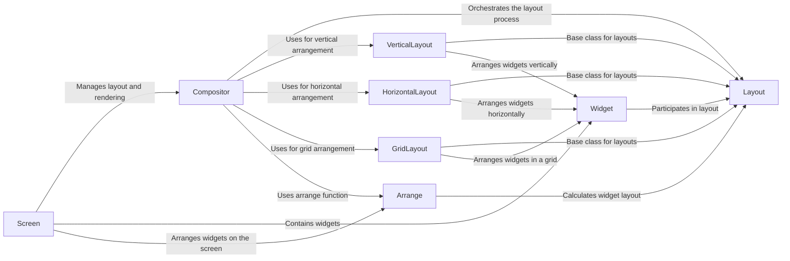

## Component Details

The layout and composition subsystem in Textual is responsible for managing the arrangement and sizing of widgets within the application's user interface. It provides a flexible and extensible system for positioning widgets using various layout strategies. The core components work together to determine the optimal placement of widgets, adapting to different screen sizes and content requirements. The Compositor orchestrates the layout process, utilizing Layout instances (VerticalLayout, HorizontalLayout, GridLayout) to arrange widgets within the Screen. Widgets interact with the layout system to negotiate their size and position, while the Arrange function performs the actual calculations to determine the final layout.

### Compositor
The Compositor is responsible for managing the overall layout and rendering of the UI. It triggers layout reflows when the screen size changes or widgets are added/removed. It uses Layout instances to perform the actual layout calculations and the arrange function to determine the final positions of widgets.
- **Related Classes/Methods**: `textual.src.textual._compositor.Compositor`

### Layout
The Layout class serves as the base class for all layout strategies. It defines the common interface for arranging widgets within a container. Subclasses implement specific layout algorithms.
- **Related Classes/Methods**: `textual.src.textual.layout.Layout`

### VerticalLayout
VerticalLayout arranges widgets in a vertical stack, one above the other. It inherits from the Layout class and implements the arrange method to position widgets vertically.
- **Related Classes/Methods**: `textual.src.textual.layouts.vertical.VerticalLayout`

### HorizontalLayout
HorizontalLayout arranges widgets horizontally, side by side. It inherits from the Layout class and implements the arrange method to position widgets horizontally.
- **Related Classes/Methods**: `textual.src.textual.layouts.horizontal.HorizontalLayout`

### GridLayout
GridLayout arranges widgets in a grid structure. It inherits from the Layout class and provides methods for specifying row and column spans for widgets.
- **Related Classes/Methods**: `textual.src.textual.layouts.grid.GridLayout`

### Widget
Widget is the base class for all UI elements in Textual. Widgets participate in the layout process by providing size hints and constraints. They interact with the layout system to determine their final size and position.
- **Related Classes/Methods**: `textual.src.textual.widget.Widget`

### Screen
Screen represents the top-level container for the UI. It manages the layout and rendering of widgets on the screen. The Compositor is associated with the Screen.
- **Related Classes/Methods**: `textual.src.textual.screen.Screen`

### Arrange
The arrange function is responsible for calculating the layout of widgets within a container, taking into account size constraints and layout strategies. It's a core part of the layout process.
- **Related Classes/Methods**: `textual.src.textual._arrange`
