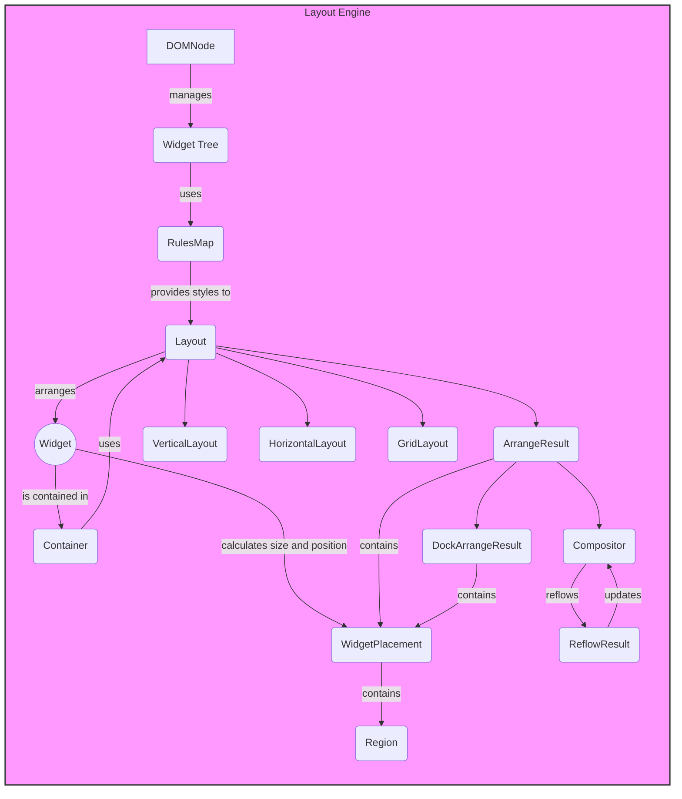

## Layout Engine Overview

The Layout Engine is responsible for arranging widgets on the screen, determining their size and position based on layout algorithms and constraints. It handles different layout strategies such as vertical, horizontal, and grid layouts.

### Component Descriptions

*   **DOMNode**
    *Description*: Represents a node in the Document Object Model (DOM). It manages the widget tree and provides methods for traversing and manipulating the tree.
    *Interaction*: Manages the Widget Tree, which is used by the Layout Engine to determine the layout of widgets.
    *Relevant Files*: `textual.dom.DOMNode`

*   **Widget Tree**
    *Description*: A hierarchical structure of widgets, representing the UI elements to be displayed.
    *Interaction*: Provides the structure of widgets to the Layout Engine for arrangement.

*   **RulesMap**
    *Description*: Stores the computed styles for a DOM node, including layout-related properties.
    *Interaction*: Provides style information to the Layout component, influencing layout decisions.
    *Relevant Files*: `textual.css.styles.RulesMap`

*   **Layout**
    *Description*: Abstract base class for layout algorithms. It defines the interface for arranging widgets within a container.
    *Interaction*: Arranges widgets within a container based on available space and layout constraints. It uses style information from RulesMap to make layout decisions. It is used by Container.
    *Relevant Files*: `textual.layout.Layout`

*   **Widget**
    *Description*: Base class for all UI elements. It manages the widget's lifecycle, rendering, and event handling.
    *Interaction*: Represents a UI element that is arranged by the Layout component. Its size and position are determined by the layout algorithm.
    *Relevant Files*: `textual.widget.Widget`

*   **WidgetPlacement**
    *Description*: Represents the placement of a widget within a layout, including its region and z-index.
    *Interaction*: Contains the calculated size and position of a widget after layout. It is used by the Compositor to render the widgets on the screen.
    *Relevant Files*: `textual.layout.WidgetPlacement`

*   **Region**
    *Description*: Represents a rectangular area on the screen.
    *Interaction*: Defines the boundaries of a widget's placement.

*   **ArrangeResult**
    *Description*: Represents the result of a layout arrangement, containing the spatial map of widgets and the total region occupied.
    *Interaction*: Contains the WidgetPlacement and is used by the Compositor.
    *Relevant Files*: `textual.layout.ArrangeResult`

*   **Container**
    *Description*: Base class for widgets that contain other widgets. It manages the layout of its children.
    *Interaction*: Uses a Layout to arrange its children.
    *Relevant Files*: `textual.containers.Container`

*   **VerticalLayout**
    *Description*: A layout that arranges widgets vertically within their container.
    *Interaction*: A concrete implementation of the Layout abstract class.
    *Relevant Files*: `textual.layouts.vertical.VerticalLayout`

*   **HorizontalLayout**
    *Description*: A layout that arranges widgets horizontally within their container.
    *Interaction*: A concrete implementation of the Layout abstract class.
    *Relevant Files*: `textual.layouts.horizontal.HorizontalLayout`

*   **GridLayout**
    *Description*: A layout that arranges widgets in a grid within their container.
    *Interaction*: A concrete implementation of the Layout abstract class.
    *Relevant Files*: `textual.layouts.grid.GridLayout`

*   **DockArrangeResult**
    *Description*: Represents the result of a dock layout arrangement, including scroll spacing and spatial map.
    *Interaction*: Contains the WidgetPlacement and is used by the Compositor.
    *Relevant Files*: `textual.layout.DockArrangeResult`

*   **Compositor**
    *Description*: Responsible for managing the layout and rendering of widgets on the screen.
    *Interaction*: Receives the ArrangeResult and ReflowResult, and manages the rendering of widgets on the screen.
    *Relevant Files*: `textual._compositor.Compositor`

*   **ReflowResult**
    *Description*: Represents the result of reflowing the compositor, including resized and shown widgets.
    *Interaction*: Updates the Compositor.
    *Relevant Files*: `textual._compositor.ReflowResult`