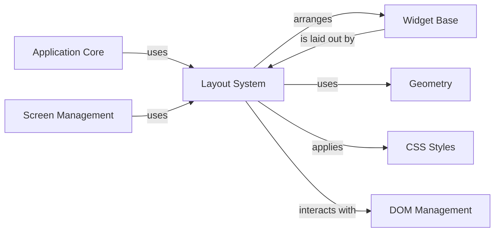

## Component Details

The Layout System is a critical subsystem responsible for dynamically arranging and sizing UI elements (widgets) on the terminal screen. It interprets various layout algorithms (like horizontal, vertical, and grid layouts) and applies CSS properties to determine the precise position and dimensions of each widget. This ensures that the user interface is rendered correctly and adaptively, regardless of screen size or content changes. It interacts closely with the Widget Base to get widget properties, Screen Management to update the display, CSS Styles to apply styling rules, Geometry for coordinate calculations, and DOM Management to traverse the widget hierarchy.

### Layout System
Determines the positioning and sizing of UI elements on the screen by implementing various layout algorithms (e.g., horizontal, vertical, grid) and applying CSS properties. It provides the core logic for arranging widgets within the application's display.

**Related Classes/Methods**:

- <a href="https://github.com/Textualize/textual/blob/master/src/textual/layout.py#L203-L309" target="_blank" rel="noopener noreferrer">`textual.layout.Layout` (203:309)</a>
- <a href="https://github.com/Textualize/textual/blob/master/src/textual/layouts/horizontal.py#L15-L120" target="_blank" rel="noopener noreferrer">`textual.layouts.horizontal.HorizontalLayout` (15:120)</a>
- <a href="https://github.com/Textualize/textual/blob/master/src/textual/layouts/vertical.py#L15-L124" target="_blank" rel="noopener noreferrer">`textual.layouts.vertical.VerticalLayout` (15:124)</a>
- <a href="https://github.com/Textualize/textual/blob/master/src/textual/layouts/grid.py#L15-L322" target="_blank" rel="noopener noreferrer">`textual.layouts.grid.GridLayout` (15:322)</a>

### Widget Base
The foundational class for all interactive and displayable elements within a Textual application. It provides core functionalities such as rendering, event handling, styling, and managing its position within the DOM tree.

**Related Classes/Methods**:

- <a href="https://github.com/Textualize/textual/blob/master/src/textual/widget.py#L275-L4687" target="_blank" rel="noopener noreferrer">`textual.widget.Widget` (275:4687)</a>

### Screen Management
Manages the display of widgets on the terminal, including rendering the widget tree, handling screen updates, and managing the screen stack for multi-screen applications. It provides the canvas on which widgets are drawn.

**Related Classes/Methods**:

- <a href="https://github.com/Textualize/textual/blob/master/src/textual/screen.py#L127-L1838" target="_blank" rel="noopener noreferrer">`textual.screen.Screen` (127:1838)</a>

### CSS Styles
Represents the computed style of a widget, including properties like color, background, border, and layout. It provides methods for applying and inheriting styles, and for converting style properties into renderable attributes.

**Related Classes/Methods**:

- <a href="https://github.com/Textualize/textual/blob/master/src/textual/css/styles.py#L858-L1298" target="_blank" rel="noopener noreferrer">`textual.css.styles.Styles` (858:1298)</a>

### Geometry
Provides fundamental data structures and utilities for handling screen coordinates, dimensions, and regions. It's crucial for layout calculations, event positioning, and rendering.

**Related Classes/Methods**:

- `textual.geometry.Point` (full file reference)
- <a href="https://github.com/Textualize/textual/blob/master/src/textual/geometry.py#L189-L314" target="_blank" rel="noopener noreferrer">`textual.geometry.Size` (189:314)</a>
- <a href="https://github.com/Textualize/textual/blob/master/src/textual/geometry.py#L317-L1116" target="_blank" rel="noopener noreferrer">`textual.geometry.Region` (317:1116)</a>

### DOM Management
Manages the hierarchical structure of widgets, allowing for efficient traversal, querying, and manipulation of the widget tree. It provides methods to add, remove, and find widgets within the application's UI.

**Related Classes/Methods**:

- <a href="https://github.com/Textualize/textual/blob/master/src/textual/dom.py#L136-L1844" target="_blank" rel="noopener noreferrer">`textual.dom.DOMNode` (136:1844)</a>

### Application Core
The central component of a Textual application, responsible for initialization, managing the main event loop, handling global events, and orchestrating the display and interaction of widgets. It acts as the entry point for the application.

**Related Classes/Methods**:

- <a href="https://github.com/Textualize/textual/blob/master/src/textual/app.py#L294-L4739" target="_blank" rel="noopener noreferrer">`textual.app.App` (294:4739)</a>

### [FAQ](https://github.com/CodeBoarding/GeneratedOnBoardings/tree/main?tab=readme-ov-file#faq)