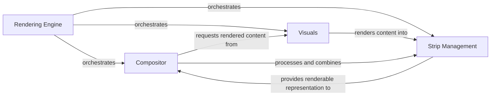

## Component Details

The Rendering Engine orchestrates the visual rendering pipeline within Textual, converting UI elements and content into displayable character strips and composing them for final output to the terminal. It integrates the functionalities of the Visuals component for content abstraction, the Compositor for layout and widget rendering, and Strip Management for handling the fundamental line-by-line text representation.

### Rendering Engine
Orchestrates the visual rendering pipeline, converting UI elements and content into displayable character strips and composing them for final output to the terminal.

**Related Classes/Methods**:

- <a href="https://github.com/Textualize/textual/blob/master/src/textual/_compositor.py#L281-L1240" target="_blank" rel="noopener noreferrer">`textual._compositor.Compositor` (281:1240)</a>
- <a href="https://github.com/Textualize/textual/blob/master/src/textual/visual.py#L106-L233" target="_blank" rel="noopener noreferrer">`textual.visual.Visual` (106:233)</a>
- <a href="https://github.com/Textualize/textual/blob/master/src/textual/strip.py#L67-L735" target="_blank" rel="noopener noreferrer">`textual.strip.Strip` (67:735)</a>

### Visuals
This component is responsible for abstracting various content types (like Rich renderables, plain text, or markup) into a unified Visual interface. It provides methods for rendering content into Strip objects, measuring optimal width, and calculating height, serving as the bridge between raw content and the display system.

**Related Classes/Methods**:

- <a href="https://github.com/Textualize/textual/blob/master/src/textual/visual.py#L58-L103" target="_blank" rel="noopener noreferrer">`textual.visual.visualize` (58:103)</a>
- <a href="https://github.com/Textualize/textual/blob/master/src/textual/visual.py#L106-L233" target="_blank" rel="noopener noreferrer">`textual.visual.Visual` (106:233)</a>
- <a href="https://github.com/Textualize/textual/blob/master/src/textual/visual.py#L237-L321" target="_blank" rel="noopener noreferrer">`textual.visual.RichVisual` (237:321)</a>
- <a href="https://github.com/Textualize/textual/blob/master/src/textual/visual.py#L325-L391" target="_blank" rel="noopener noreferrer">`textual.visual.Padding` (325:391)</a>
- <a href="https://github.com/Textualize/textual/blob/master/src/textual/content.py#L217-L246" target="_blank" rel="noopener noreferrer">`textual.content.Content.from_markup` (217:246)</a>
- <a href="https://github.com/Textualize/textual/blob/master/src/textual/content.py#L111-L1408" target="_blank" rel="noopener noreferrer">`textual.content.Content` (111:1408)</a>
- <a href="https://github.com/Textualize/textual/blob/master/src/textual/content.py#L249-L308" target="_blank" rel="noopener noreferrer">`textual.content.Content.from_rich_text` (249:308)</a>
- <a href="https://github.com/Textualize/textual/blob/master/src/textual/visual.py#L51-L52" target="_blank" rel="noopener noreferrer">`textual.visual.VisualError` (51:52)</a>
- <a href="https://github.com/Textualize/textual/blob/master/src/textual/render.py#L8-L41" target="_blank" rel="noopener noreferrer">`textual.render.measure` (8:41)</a>
- <a href="https://github.com/Textualize/textual/blob/master/src/textual/style.py#L271-L305" target="_blank" rel="noopener noreferrer">`textual.style.Style.from_rich_style` (271:305)</a>
- <a href="https://github.com/Textualize/textual/blob/master/src/textual/style.py#L46-L431" target="_blank" rel="noopener noreferrer">`textual.style.Style` (46:431)</a>

### Compositor
The Compositor component manages the overall layout and rendering of widgets on the screen. It maintains a map of widget geometries, handles reflow operations (layout recalculations), and generates updates (full or partial) to the display. It also provides methods for querying widget positions and styles at specific coordinates.

**Related Classes/Methods**:

- <a href="https://github.com/Textualize/textual/blob/master/src/textual/_compositor.py#L281-L1240" target="_blank" rel="noopener noreferrer">`textual._compositor.Compositor` (281:1240)</a>
- <a href="https://github.com/Textualize/textual/blob/master/src/textual/_compositor.py#L75-L115" target="_blank" rel="noopener noreferrer">`textual._compositor.LayoutUpdate` (75:115)</a>
- <a href="https://github.com/Textualize/textual/blob/master/src/textual/_compositor.py#L119-L160" target="_blank" rel="noopener noreferrer">`textual._compositor.InlineUpdate` (119:160)</a>
- <a href="https://github.com/Textualize/textual/blob/master/src/textual/_compositor.py#L164-L277" target="_blank" rel="noopener noreferrer">`textual._compositor.ChopsUpdate` (164:277)</a>
- <a href="https://github.com/Textualize/textual/blob/master/src/textual/_compositor.py#L524-L733" target="_blank" rel="noopener noreferrer">`textual._compositor.Compositor._arrange_root` (524:733)</a>
- <a href="https://github.com/Textualize/textual/blob/master/src/textual/_compositor.py#L323-L358" target="_blank" rel="noopener noreferrer">`textual._compositor.Compositor._regions_to_spans` (323:358)</a>
- <a href="https://github.com/Textualize/textual/blob/master/src/textual/errors.py#L13-L14" target="_blank" rel="noopener noreferrer">`textual.errors.NoWidget` (13:14)</a>
- <a href="https://github.com/Textualize/textual/blob/master/src/textual/geometry.py#L663-L677" target="_blank" rel="noopener noreferrer">`textual.geometry.Region.overlaps` (663:677)</a>
- <a href="https://github.com/Textualize/textual/blob/master/src/textual/geometry.py#L817-L839" target="_blank" rel="noopener noreferrer">`textual.geometry.Region.intersection` (817:839)</a>
- <a href="https://github.com/Textualize/textual/blob/master/src/textual/geometry.py#L679-L690" target="_blank" rel="noopener noreferrer">`textual.geometry.Region.contains` (679:690)</a>
- <a href="https://github.com/Textualize/textual/blob/master/src/textual/geometry.py#L709-L725" target="_blank" rel="noopener noreferrer">`textual.geometry.Region.contains_region` (709:725)</a>
- <a href="https://github.com/Textualize/textual/blob/master/src/textual/geometry.py#L363-L378" target="_blank" rel="noopener noreferrer">`textual.geometry.Region.from_union` (363:378)</a>
- <a href="https://github.com/Textualize/textual/blob/master/src/textual/_loop.py#L20-L30" target="_blank" rel="noopener noreferrer">`textual._loop.loop_last` (20:30)</a>
- <a href="https://github.com/Textualize/textual/blob/master/src/textual/strip.py#L41-L63" target="_blank" rel="noopener noreferrer">`textual.strip.StripRenderable` (41:63)</a>

### Strip Management
This component is responsible for the fundamental building block of Textual's rendering: the Strip. A Strip represents a single line of text with associated styles and metadata. This component provides methods for creating, manipulating (e.g., aligning, cropping, joining, simplifying), and rendering these text lines.

**Related Classes/Methods**:

- <a href="https://github.com/Textualize/textual/blob/master/src/textual/strip.py#L67-L735" target="_blank" rel="noopener noreferrer">`textual.strip.Strip` (67:735)</a>
- <a href="https://github.com/Textualize/textual/blob/master/src/textual/strip.py#L28-L38" target="_blank" rel="noopener noreferrer">`textual.strip.get_line_length` (28:38)</a>
- <a href="https://github.com/Textualize/textual/blob/master/src/textual/_segment_tools.py#L149-L179" target="_blank" rel="noopener noreferrer">`textual._segment_tools.line_pad` (149:179)</a>
- <a href="https://github.com/Textualize/textual/blob/master/src/textual/_segment_tools.py#L22-L65" target="_blank" rel="noopener noreferrer">`textual._segment_tools.index_to_cell_position` (22:65)</a>
- <a href="https://github.com/Textualize/textual/blob/master/src/textual/cache.py#L210-L314" target="_blank" rel="noopener noreferrer">`textual.cache.FIFOCache` (210:314)</a>

### [FAQ](https://github.com/CodeBoarding/GeneratedOnBoardings/tree/main?tab=readme-ov-file#faq)