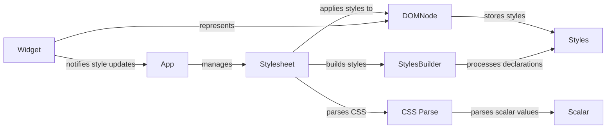

## Component Details

The Styling Engine in Textual is responsible for managing the visual appearance of the application. It involves parsing CSS stylesheets, resolving style properties, and applying these styles to the application's widgets. The engine ensures that the UI reflects the styles defined in CSS, handling updates and changes efficiently.

### App
The App class manages application-level CSS, including loading, refreshing, and applying styles. It holds the main stylesheet and triggers style updates throughout the application.
- **Related Classes/Methods**: `textual.src.textual.app.App`

### Widget
The Widget class represents a UI element and is responsible for managing its own styles. It provides methods to get component-specific styles and to notify the application when its styles need to be updated. Each widget has a reference to its DOM node, which stores the applied styles.
- **Related Classes/Methods**: `textual.src.textual.widget.Widget`

### DOMNode
The DOMNode class represents a node in the document object model and stores the styles applied to that node. It provides methods to set, reset, and retrieve styles. It serves as the central point for style information within the application's structure.
- **Related Classes/Methods**: `textual.src.textual.dom.DOMNode`

### Stylesheet
The Stylesheet class is responsible for parsing, storing, and applying CSS rules. It reads CSS from files or strings, parses it into a set of rules, and applies those rules to the DOM nodes. It manages CSS variables and updates styles efficiently.
- **Related Classes/Methods**: `textual.src.textual.css.stylesheet.Stylesheet`

### CSS Parse
The `textual.css.parse` module contains functions for parsing CSS syntax into a structured representation. It handles tokenization, rule set parsing, selector parsing, and variable substitution. It transforms raw CSS into a usable format for the Stylesheet.
- **Related Classes/Methods**: `textual.src.textual.css.parse`

### Scalar
The Scalar class represents a CSS scalar value, such as a length or a number. It provides methods for parsing and resolving scalar values. It is used to represent CSS properties that have numeric or length values.
- **Related Classes/Methods**: `textual.src.textual.css.scalar.Scalar`

### Styles
The Styles class stores the resolved style properties for a DOM node. It provides methods for copying and parsing styles. It holds the final computed styles that are applied to a DOM node.
- **Related Classes/Methods**: `textual.src.textual.css.styles.Styles`

### StylesBuilder
The StylesBuilder class is responsible for building a Styles object from a set of CSS declarations. It processes each declaration and sets the corresponding style property. It acts as an intermediary between the parsed CSS and the final Styles object.
- **Related Classes/Methods**: `textual.src.textual.css._styles_builder.StylesBuilder`
