```mermaid
graph LR
    CSS_Parsing_Tokenization["CSS Parsing & Tokenization"]
    CSS_Stylesheet_Management["CSS Stylesheet Management"]
    Style_Definition_Application["Style Definition & Application"]
    Style_Property_Handlers["Style Property Handlers"]
    Color_Design_System["Color & Design System"]
    DOM_Core["DOM Core"]
    Application_Lifecycle["Application Lifecycle"]
    Base_Widget["Base Widget"]
    Specialized_Widgets["Specialized Widgets"]
    Renderables["Renderables"]
    Markup_Processing["Markup Processing"]
    Utilities_Error_Reporting["Utilities & Error Reporting"]
    CSS_Parsing_Tokenization -- "parses CSS for" --> CSS_Stylesheet_Management
    CSS_Parsing_Tokenization -- "reports errors to" --> Utilities_Error_Reporting
    CSS_Parsing_Tokenization -- "tokenizes for" --> Markup_Processing
    CSS_Parsing_Tokenization -- "uses" --> Color_Design_System
    CSS_Stylesheet_Management -- "uses" --> CSS_Parsing_Tokenization
    CSS_Stylesheet_Management -- "applies styles to" --> DOM_Core
    CSS_Stylesheet_Management -- "uses" --> Style_Definition_Application
    CSS_Stylesheet_Management -- "queries DOM via" --> DOM_Core
    CSS_Stylesheet_Management -- "reports errors to" --> Utilities_Error_Reporting
    Style_Definition_Application -- "defines styles for" --> CSS_Stylesheet_Management
    Style_Definition_Application -- "applies styles to" --> DOM_Core
    Style_Definition_Application -- "uses" --> Style_Property_Handlers
    Style_Definition_Application -- "uses" --> Color_Design_System
    Style_Definition_Application -- "caches styles via" --> Style_Definition_Application
    Style_Definition_Application -- "processes markup via" --> Markup_Processing
    Style_Property_Handlers -- "validates values via" --> Utilities_Error_Reporting
    Style_Property_Handlers -- "uses" --> Color_Design_System
    Color_Design_System -- "uses" --> Utilities_Error_Reporting
    Color_Design_System -- "provides colors to" --> Renderables
    Color_Design_System -- "provides colors to" --> Style_Definition_Application
    Color_Design_System -- "manages themes with" --> Application_Lifecycle
    DOM_Core -- "receives styles from" --> CSS_Stylesheet_Management
    DOM_Core -- "receives styles from" --> Style_Definition_Application
    DOM_Core -- "notifies style updates to" --> Base_Widget
    DOM_Core -- "uses" --> Color_Design_System
    Application_Lifecycle -- "manages stylesheets via" --> CSS_Stylesheet_Management
    Application_Lifecycle -- "updates styles via" --> Style_Definition_Application
    Application_Lifecycle -- "manages themes with" --> Color_Design_System
    Application_Lifecycle -- "handles errors via" --> Utilities_Error_Reporting
    Base_Widget -- "gets styles from" --> DOM_Core
    Base_Widget -- "notifies style updates to" --> Specialized_Widgets
    Base_Widget -- "uses" --> Style_Definition_Application
    Specialized_Widgets -- "renders using" --> Renderables
    Specialized_Widgets -- "gets styles from" --> Base_Widget
    Specialized_Widgets -- "handles errors via" --> Utilities_Error_Reporting
    Specialized_Widgets -- "uses" --> Color_Design_System
    Renderables -- "uses" --> Color_Design_System
    Markup_Processing -- "generates styled content for" --> Style_Definition_Application
    Markup_Processing -- "uses" --> CSS_Parsing_Tokenization
    Markup_Processing -- "uses" --> Color_Design_System
    Utilities_Error_Reporting -- "provides utilities to" --> CSS_Parsing_Tokenization
    Utilities_Error_Reporting -- "provides utilities to" --> CSS_Stylesheet_Management
    Utilities_Error_Reporting -- "provides utilities to" --> Style_Property_Handlers
    Utilities_Error_Reporting -- "provides utilities to" --> Color_Design_System
    Utilities_Error_Reporting -- "provides utilities to" --> Specialized_Widgets
    Utilities_Error_Reporting -- "provides utilities to" --> Application_Lifecycle
```

## Component Details

The Styling System is responsible for parsing, applying, and managing CSS rules, computed styles, and color definitions for UI elements, ensuring consistent visual presentation. It encompasses components for CSS parsing and tokenization, stylesheet management, style definition and application, property handling, color and design system utilities, interaction with the DOM, integration with the application lifecycle, and support for various widgets and renderables, all while providing robust error reporting.

### CSS Parsing & Tokenization
This component is responsible for the lexical analysis and syntactic parsing of CSS code. It breaks down raw CSS text into meaningful tokens and then constructs structured representations like selectors and declarations, which are fundamental for applying styles.

**Related Classes/Methods**:

- <a href="https://github.com/Textualize/textual/blob/master/src/textual/css/tokenize.py#L313-L327" target="_blank" rel="noopener noreferrer">`textual.css.tokenize.tokenize_values` (313:327)</a>
- `textual.css.tokenize.Tokenizer:get_token` (full file reference)
- <a href="https://github.com/Textualize/textual/blob/master/src/textual/css/parse.py#L56-L105" target="_blank" rel="noopener noreferrer">`textual.css.parse.parse_selectors` (56:105)</a>
- <a href="https://github.com/Textualize/textual/blob/master/src/textual/css/parse.py#L108-L270" target="_blank" rel="noopener noreferrer">`textual.css.parse.parse_rule_set` (108:270)</a>
- <a href="https://github.com/Textualize/textual/blob/master/src/textual/css/parse.py#L273-L318" target="_blank" rel="noopener noreferrer">`textual.css.parse.parse_declarations` (273:318)</a>
- <a href="https://github.com/Textualize/textual/blob/master/src/textual/css/parse.py#L346-L427" target="_blank" rel="noopener noreferrer">`textual.css.parse.substitute_references` (346:427)</a>
- <a href="https://github.com/Textualize/textual/blob/master/src/textual/css/parse.py#L430-L466" target="_blank" rel="noopener noreferrer">`textual.css.parse.parse` (430:466)</a>
- <a href="https://github.com/Textualize/textual/blob/master/src/textual/css/tokenizer.py#L211-L384" target="_blank" rel="noopener noreferrer">`textual.css.tokenizer.Tokenizer` (211:384)</a>
- <a href="https://github.com/Textualize/textual/blob/master/src/textual/css/tokenizer.py#L21-L102" target="_blank" rel="noopener noreferrer">`textual.css.tokenizer.TokenError` (21:102)</a>
- <a href="https://github.com/Textualize/textual/blob/master/src/textual/css/tokenizer.py#L105-L106" target="_blank" rel="noopener noreferrer">`textual.css.tokenizer.UnexpectedEnd` (105:106)</a>
- <a href="https://github.com/Textualize/textual/blob/master/src/textual/css/model.py#L111-L167" target="_blank" rel="noopener noreferrer">`textual.css.model.Selector` (111:167)</a>
- <a href="https://github.com/Textualize/textual/blob/master/src/textual/css/model.py#L238-L306" target="_blank" rel="noopener noreferrer">`textual.css.model.RuleSet` (238:306)</a>
- <a href="https://github.com/Textualize/textual/blob/master/src/textual/css/tokenize.py#L277-L282" target="_blank" rel="noopener noreferrer">`textual.css.tokenize.DeclarationTokenizerState` (277:282)</a>
- <a href="https://github.com/Textualize/textual/blob/master/src/textual/css/tokenize.py#L289-L304" target="_blank" rel="noopener noreferrer">`textual.css.tokenize.StyleTokenizerState` (289:304)</a>
- <a href="https://github.com/Textualize/textual/blob/master/src/textual/css/tokenize.py#L285-L286" target="_blank" rel="noopener noreferrer">`textual.css.tokenize.ValueTokenizerState` (285:286)</a>
- <a href="https://github.com/Textualize/textual/blob/master/src/textual/css/tokenizer.py#L110-L148" target="_blank" rel="noopener noreferrer">`textual.css.tokenizer.Expect` (110:148)</a>

### CSS Stylesheet Management
This component manages the collection of CSS rules, applies them to the Document Object Model (DOM), and orchestrates updates to the stylesheet. It ensures that the correct styles are matched and applied to the relevant UI elements.

**Related Classes/Methods**:

- <a href="https://github.com/Textualize/textual/blob/master/src/textual/css/stylesheet.py#L142-L731" target="_blank" rel="noopener noreferrer">`textual.css.stylesheet.Stylesheet` (142:731)</a>
- <a href="https://github.com/Textualize/textual/blob/master/src/textual/css/stylesheet.py#L160-L163" target="_blank" rel="noopener noreferrer">`textual.css.stylesheet.Stylesheet:_variable_tokens` (160:163)</a>
- <a href="https://github.com/Textualize/textual/blob/master/src/textual/css/stylesheet.py#L166-L176" target="_blank" rel="noopener noreferrer">`textual.css.stylesheet.Stylesheet:rules` (166:176)</a>
- <a href="https://github.com/Textualize/textual/blob/master/src/textual/css/stylesheet.py#L223-L238" target="_blank" rel="noopener noreferrer">`textual.css.stylesheet.Stylesheet:parse_style` (223:238)</a>
- <a href="https://github.com/Textualize/textual/blob/master/src/textual/css/stylesheet.py#L240-L286" target="_blank" rel="noopener noreferrer">`textual.css.stylesheet.Stylesheet:_parse_rules` (240:286)</a>
- <a href="https://github.com/Textualize/textual/blob/master/src/textual/css/stylesheet.py#L288-L306" target="_blank" rel="noopener noreferrer">`textual.css.stylesheet.Stylesheet:read` (288:306)</a>
- <a href="https://github.com/Textualize/textual/blob/master/src/textual/css/stylesheet.py#L308-L319" target="_blank" rel="noopener noreferrer">`textual.css.stylesheet.Stylesheet:read_all` (308:319)</a>
- <a href="https://github.com/Textualize/textual/blob/master/src/textual/css/stylesheet.py#L372-L407" target="_blank" rel="noopener noreferrer">`textual.css.stylesheet.Stylesheet:parse` (372:407)</a>
- <a href="https://github.com/Textualize/textual/blob/master/src/textual/css/stylesheet.py#L409-L438" target="_blank" rel="noopener noreferrer">`textual.css.stylesheet.Stylesheet:reparse` (409:438)</a>
- <a href="https://github.com/Textualize/textual/blob/master/src/textual/css/stylesheet.py#L441-L455" target="_blank" rel="noopener noreferrer">`textual.css.stylesheet.Stylesheet:_check_rule` (441:455)</a>
- <a href="https://github.com/Textualize/textual/blob/master/src/textual/css/stylesheet.py#L469-L606" target="_blank" rel="noopener noreferrer">`textual.css.stylesheet.Stylesheet:apply` (469:606)</a>
- <a href="https://github.com/Textualize/textual/blob/master/src/textual/css/stylesheet.py#L608-L632" target="_blank" rel="noopener noreferrer">`textual.css.stylesheet.Stylesheet:_process_component_classes` (608:632)</a>
- <a href="https://github.com/Textualize/textual/blob/master/src/textual/css/stylesheet.py#L635-L701" target="_blank" rel="noopener noreferrer">`textual.css.stylesheet.Stylesheet:replace_rules` (635:701)</a>
- <a href="https://github.com/Textualize/textual/blob/master/src/textual/css/stylesheet.py#L703-L711" target="_blank" rel="noopener noreferrer">`textual.css.stylesheet.Stylesheet:update` (703:711)</a>
- <a href="https://github.com/Textualize/textual/blob/master/src/textual/css/stylesheet.py#L713-L731" target="_blank" rel="noopener noreferrer">`textual.css.stylesheet.Stylesheet:update_nodes` (713:731)</a>
- <a href="https://github.com/Textualize/textual/blob/master/src/textual/css/query.py#L62-L108" target="_blank" rel="noopener noreferrer">`textual.css.query.DOMQuery:__init__` (62:108)</a>
- <a href="https://github.com/Textualize/textual/blob/master/src/textual/css/query.py#L116-L135" target="_blank" rel="noopener noreferrer">`textual.css.query.DOMQuery:nodes` (116:135)</a>
- <a href="https://github.com/Textualize/textual/blob/master/src/textual/css/query.py#L417-L437" target="_blank" rel="noopener noreferrer">`textual.css.query.DOMQuery:set_styles` (417:437)</a>
- <a href="https://github.com/Textualize/textual/blob/master/src/textual/css/match.py#L11-L24" target="_blank" rel="noopener noreferrer">`textual.css.match.match` (11:24)</a>
- <a href="https://github.com/Textualize/textual/blob/master/src/textual/css/match.py#L27-L74" target="_blank" rel="noopener noreferrer">`textual.css.match._check_selectors` (27:74)</a>
- <a href="https://github.com/Textualize/textual/blob/master/src/textual/css/stylesheet.py#L34-L41" target="_blank" rel="noopener noreferrer">`textual.css.stylesheet.StylesheetParseError` (34:41)</a>
- <a href="https://github.com/Textualize/textual/blob/master/src/textual/css/stylesheet.py#L44-L120" target="_blank" rel="noopener noreferrer">`textual.css.stylesheet.StylesheetErrors` (44:120)</a>
- <a href="https://github.com/Textualize/textual/blob/master/src/textual/css/styles.py#L82-L207" target="_blank" rel="noopener noreferrer">`textual.css.styles.RulesMap` (82:207)</a>

### Style Definition & Application
This component defines the structure and properties of individual styles and is responsible for their application to UI elements. It includes base style definitions, renderable styles, and a cache for efficient style rendering.

**Related Classes/Methods**:

- <a href="https://github.com/Textualize/textual/blob/master/src/textual/css/styles.py#L498-L542" target="_blank" rel="noopener noreferrer">`textual.css.styles.StylesBase:__textual_animation__` (498:542)</a>
- <a href="https://github.com/Textualize/textual/blob/master/src/textual/css/styles.py#L544-L548" target="_blank" rel="noopener noreferrer">`textual.css.styles.StylesBase:__eq__` (544:548)</a>
- <a href="https://github.com/Textualize/textual/blob/master/src/textual/css/styles.py#L588-L593" target="_blank" rel="noopener noreferrer">`textual.css.styles.StylesBase:auto_dimensions` (588:593)</a>
- <a href="https://github.com/Textualize/textual/blob/master/src/textual/css/styles.py#L744-L761" target="_blank" rel="noopener noreferrer">`textual.css.styles.StylesBase:parse` (744:761)</a>
- <a href="https://github.com/Textualize/textual/blob/master/src/textual/css/styles.py#L834-L853" target="_blank" rel="noopener noreferrer">`textual.css.styles.StylesBase:partial_rich_style` (834:853)</a>
- <a href="https://github.com/Textualize/textual/blob/master/src/textual/css/styles.py#L869-L875" target="_blank" rel="noopener noreferrer">`textual.css.styles.Styles:copy` (869:875)</a>
- <a href="https://github.com/Textualize/textual/blob/master/src/textual/css/styles.py#L1050-L1294" target="_blank" rel="noopener noreferrer">`textual.css.styles.Styles:css_lines` (1050:1294)</a>
- <a href="https://github.com/Textualize/textual/blob/master/src/textual/css/styles.py#L1302-L1485" target="_blank" rel="noopener noreferrer">`textual.css.styles.RenderStyles` (1302:1485)</a>
- <a href="https://github.com/Textualize/textual/blob/master/src/textual/style.py#L194-L226" target="_blank" rel="noopener noreferrer">`textual.style.Style:__add__` (194:226)</a>
- <a href="https://github.com/Textualize/textual/blob/master/src/textual/style.py#L236-L252" target="_blank" rel="noopener noreferrer">`textual.style.Style:parse` (236:252)</a>
- <a href="https://github.com/Textualize/textual/blob/master/src/textual/style.py#L255-L268" target="_blank" rel="noopener noreferrer">`textual.style.Style:_normalize_markup_tag` (255:268)</a>
- <a href="https://github.com/Textualize/textual/blob/master/src/textual/style.py#L271-L305" target="_blank" rel="noopener noreferrer">`textual.style.Style:from_rich_style` (271:305)</a>
- <a href="https://github.com/Textualize/textual/blob/master/src/textual/style.py#L308-L331" target="_blank" rel="noopener noreferrer">`textual.style.Style:from_styles` (308:331)</a>
- <a href="https://github.com/Textualize/textual/blob/master/src/textual/style.py#L334-L343" target="_blank" rel="noopener noreferrer">`textual.style.Style:from_meta` (334:343)</a>
- <a href="https://github.com/Textualize/textual/blob/master/src/textual/style.py#L397-L410" target="_blank" rel="noopener noreferrer">`textual.style.Style:without_color` (397:410)</a>
- <a href="https://github.com/Textualize/textual/blob/master/src/textual/style.py#L413-L415" target="_blank" rel="noopener noreferrer">`textual.style.Style:background_style` (413:415)</a>
- <a href="https://github.com/Textualize/textual/blob/master/src/textual/_styles_cache.py#L266-L517" target="_blank" rel="noopener noreferrer">`textual._styles_cache.StylesCache:render_line` (266:517)</a>
- <a href="https://github.com/Textualize/textual/blob/master/src/textual/_styles_cache.py#L106-L109" target="_blank" rel="noopener noreferrer">`textual._styles_cache.StylesCache.clear` (106:109)</a>
- <a href="https://github.com/Textualize/textual/blob/master/src/textual/css/scalar_animation.py#L14-L98" target="_blank" rel="noopener noreferrer">`textual.css.scalar_animation.ScalarAnimation` (14:98)</a>
- <a href="https://github.com/Textualize/textual/blob/master/src/textual/css/_styles_builder.py#L85-L1275" target="_blank" rel="noopener noreferrer">`textual.css._styles_builder.StylesBuilder` (85:1275)</a>
- <a href="https://github.com/Textualize/textual/blob/master/src/textual/css/styles.py#L858-L1298" target="_blank" rel="noopener noreferrer">`textual.css.styles.Styles` (858:1298)</a>

### Style Property Handlers
This component defines how individual CSS properties are handled, parsed, and validated. It ensures that style values conform to expected formats and types.

**Related Classes/Methods**:

- <a href="https://github.com/Textualize/textual/blob/master/src/textual/css/_style_properties.py#L170-L227" target="_blank" rel="noopener noreferrer">`textual.css._style_properties.ScalarProperty:__set__` (170:227)</a>
- <a href="https://github.com/Textualize/textual/blob/master/src/textual/css/_style_properties.py#L250-L274" target="_blank" rel="noopener noreferrer">`textual.css._style_properties.ScalarListProperty:__set__` (250:274)</a>
- <a href="https://github.com/Textualize/textual/blob/master/src/textual/css/_style_properties.py#L306-L351" target="_blank" rel="noopener noreferrer">`textual.css._style_properties.BoxProperty:__set__` (306:351)</a>
- <a href="https://github.com/Textualize/textual/blob/master/src/textual/css/_style_properties.py#L429-L521" target="_blank" rel="noopener noreferrer">`textual.css._style_properties.BorderProperty:__set__` (429:521)</a>
- <a href="https://github.com/Textualize/textual/blob/master/src/textual/css/_style_properties.py#L561-L592" target="_blank" rel="noopener noreferrer">`textual.css._style_properties.SpacingProperty:__set__` (561:592)</a>
- <a href="https://github.com/Textualize/textual/blob/master/src/textual/css/_style_properties.py#L675-L702" target="_blank" rel="noopener noreferrer">`textual.css._style_properties.LayoutProperty:__set__` (675:702)</a>
- <a href="https://github.com/Textualize/textual/blob/master/src/textual/css/_style_properties.py#L729-L774" target="_blank" rel="noopener noreferrer">`textual.css._style_properties.OffsetProperty:__set__` (729:774)</a>
- <a href="https://github.com/Textualize/textual/blob/master/src/textual/css/_style_properties.py#L822-L857" target="_blank" rel="noopener noreferrer">`textual.css._style_properties.StringEnumProperty:__set__` (822:857)</a>
- <a href="https://github.com/Textualize/textual/blob/master/src/textual/css/_style_properties.py#L936-L937" target="_blank" rel="noopener noreferrer">`textual.css._style_properties.ColorProperty:__init__` (936:937)</a>
- <a href="https://github.com/Textualize/textual/blob/master/src/textual/css/_style_properties.py#L956-L999" target="_blank" rel="noopener noreferrer">`textual.css._style_properties.ColorProperty:__set__` (956:999)</a>
- <a href="https://github.com/Textualize/textual/blob/master/src/textual/css/_style_properties.py#L1005-L1020" target="_blank" rel="noopener noreferrer">`textual.css._style_properties.ScrollbarColorProperty:__set__` (1005:1020)</a>
- <a href="https://github.com/Textualize/textual/blob/master/src/textual/css/_style_properties.py#L1043-L1084" target="_blank" rel="noopener noreferrer">`textual.css._style_properties.StyleFlagsProperty:__set__` (1043:1084)</a>
- <a href="https://github.com/Textualize/textual/blob/master/src/textual/css/_style_properties.py#L1146-L1171" target="_blank" rel="noopener noreferrer">`textual.css._style_properties.FractionalProperty:__set__` (1146:1171)</a>
- <a href="https://github.com/Textualize/textual/blob/master/src/textual/css/_style_properties.py#L1204-L1230" target="_blank" rel="noopener noreferrer">`textual.css._style_properties.HatchProperty:__set__` (1204:1230)</a>
- <a href="https://github.com/Textualize/textual/blob/master/src/textual/css/_style_properties.py#L132-L136" target="_blank" rel="noopener noreferrer">`textual.css._style_properties.BooleanProperty` (132:136)</a>
- <a href="https://github.com/Textualize/textual/blob/master/src/textual/css/_style_properties.py#L124-L129" target="_blank" rel="noopener noreferrer">`textual.css._style_properties.IntegerProperty` (124:129)</a>
- <a href="https://github.com/Textualize/textual/blob/master/src/textual/css/_style_properties.py#L860-L867" target="_blank" rel="noopener noreferrer">`textual.css._style_properties.OverflowProperty` (860:867)</a>
- <a href="https://github.com/Textualize/textual/blob/master/src/textual/css/_style_properties.py#L1174-L1193" target="_blank" rel="noopener noreferrer">`textual.css._style_properties.AlignProperty` (1174:1193)</a>
- <a href="https://github.com/Textualize/textual/blob/master/src/textual/css/_style_properties.py#L595-L623" target="_blank" rel="noopener noreferrer">`textual.css._style_properties.DockProperty` (595:623)</a>
- <a href="https://github.com/Textualize/textual/blob/master/src/textual/css/_style_properties.py#L524-L538" target="_blank" rel="noopener noreferrer">`textual.css._style_properties.KeylineProperty` (524:538)</a>
- <a href="https://github.com/Textualize/textual/blob/master/src/textual/css/_style_properties.py#L909-L930" target="_blank" rel="noopener noreferrer">`textual.css._style_properties.NameListProperty` (909:930)</a>
- <a href="https://github.com/Textualize/textual/blob/master/src/textual/css/_style_properties.py#L870-L906" target="_blank" rel="noopener noreferrer">`textual.css._style_properties.NameProperty` (870:906)</a>
- <a href="https://github.com/Textualize/textual/blob/master/src/textual/css/_style_properties.py#L1087-L1113" target="_blank" rel="noopener noreferrer">`textual.css._style_properties.TransitionsProperty` (1087:1113)</a>
- <a href="https://github.com/Textualize/textual/blob/master/src/textual/css/scalar.py#L244-L264" target="_blank" rel="noopener noreferrer">`textual.css.scalar.Scalar.parse` (244:264)</a>
- <a href="https://github.com/Textualize/textual/blob/master/src/textual/css/scalar.py#L231-L240" target="_blank" rel="noopener noreferrer">`textual.css.scalar.Scalar.from_number` (231:240)</a>
- <a href="https://github.com/Textualize/textual/blob/master/src/textual/css/scalar.py#L168-L177" target="_blank" rel="noopener noreferrer">`textual.css.scalar.get_symbols` (168:177)</a>
- <a href="https://github.com/Textualize/textual/blob/master/src/textual/css/scalar.py#L27-L37" target="_blank" rel="noopener noreferrer">`textual.css.scalar.Unit` (27:37)</a>

### Color & Design System
This component provides comprehensive utilities for color manipulation, parsing various color formats, generating gradients, and managing the application's overall color themes and design system. It also handles opacity and visual filters.

**Related Classes/Methods**:

- <a href="https://github.com/Textualize/textual/blob/master/src/textual/color.py#L181-L198" target="_blank" rel="noopener noreferrer">`textual.color.Color.from_rich_color` (181:198)</a>
- <a href="https://github.com/Textualize/textual/blob/master/src/textual/color.py#L652-L661" target="_blank" rel="noopener noreferrer">`textual.color.Color.get_contrast_text` (652:661)</a>
- <a href="https://github.com/Textualize/textual/blob/master/src/textual/color.py#L246-L258" target="_blank" rel="noopener noreferrer">`textual.color.Color.clamped` (246:258)</a>
- <a href="https://github.com/Textualize/textual/blob/master/src/textual/color.py#L353-L368" target="_blank" rel="noopener noreferrer">`textual.color.Color.css` (353:368)</a>
- <a href="https://github.com/Textualize/textual/blob/master/src/textual/color.py#L499-L622" target="_blank" rel="noopener noreferrer">`textual.color.Color.parse` (499:622)</a>
- <a href="https://github.com/Textualize/textual/blob/master/src/textual/color.py#L625-L637" target="_blank" rel="noopener noreferrer">`textual.color.Color.darken` (625:637)</a>
- <a href="https://github.com/Textualize/textual/blob/master/src/textual/color.py#L201-L213" target="_blank" rel="noopener noreferrer">`textual.color.Color.from_hsl` (201:213)</a>
- <a href="https://github.com/Textualize/textual/blob/master/src/textual/color.py#L390-L400" target="_blank" rel="noopener noreferrer">`textual.color.Color.with_alpha` (390:400)</a>
- <a href="https://github.com/Textualize/textual/blob/master/src/textual/color.py#L790-L813" target="_blank" rel="noopener noreferrer">`textual.color.rgb_to_lab` (790:813)</a>
- <a href="https://github.com/Textualize/textual/blob/master/src/textual/color.py#L816-L841" target="_blank" rel="noopener noreferrer">`textual.color.lab_to_rgb` (816:841)</a>
- <a href="https://github.com/Textualize/textual/blob/master/src/textual/color.py#L66-L74" target="_blank" rel="noopener noreferrer">`textual.color.HSL:css` (66:74)</a>
- `textual.color.HSL.css.as_str` (full file reference)
- <a href="https://github.com/Textualize/textual/blob/master/src/textual/color.py#L667-L705" target="_blank" rel="noopener noreferrer">`textual.color.Gradient:__init__` (667:705)</a>
- <a href="https://github.com/Textualize/textual/blob/master/src/textual/color.py#L708-L721" target="_blank" rel="noopener noreferrer">`textual.color.Gradient:from_colors` (708:721)</a>
- <a href="https://github.com/Textualize/textual/blob/master/src/textual/color.py#L767-L778" target="_blank" rel="noopener noreferrer">`textual.color.Gradient:get_rich_color` (767:778)</a>
- <a href="https://github.com/Textualize/textual/blob/master/src/textual/color.py#L745-L765" target="_blank" rel="noopener noreferrer">`textual.color.Gradient.get_color` (745:765)</a>
- <a href="https://github.com/Textualize/textual/blob/master/src/textual/design.py#L47-L85" target="_blank" rel="noopener noreferrer">`textual.design.ColorSystem:__init__` (47:85)</a>
- <a href="https://github.com/Textualize/textual/blob/master/src/textual/design.py#L103-L360" target="_blank" rel="noopener noreferrer">`textual.design.ColorSystem:generate` (103:360)</a>
- `textual.design.ColorSystem.__init__.parse` (full file reference)
- <a href="https://github.com/Textualize/textual/blob/master/src/textual/design.py#L363-L389" target="_blank" rel="noopener noreferrer">`textual.design:show_design` (363:389)</a>
- <a href="https://github.com/Textualize/textual/blob/master/src/textual/theme.py#L39-L62" target="_blank" rel="noopener noreferrer">`textual.theme.Theme:to_color_system` (39:62)</a>
- <a href="https://github.com/Textualize/textual/blob/master/src/textual/_opacity.py#L9-L42" target="_blank" rel="noopener noreferrer">`textual._opacity:_apply_opacity` (9:42)</a>
- <a href="https://github.com/Textualize/textual/blob/master/src/textual/filter.py#L53-L74" target="_blank" rel="noopener noreferrer">`textual.filter:monochrome_style` (53:74)</a>
- <a href="https://github.com/Textualize/textual/blob/master/src/textual/filter.py#L156-L176" target="_blank" rel="noopener noreferrer">`textual.filter:dim_style` (156:176)</a>
- <a href="https://github.com/Textualize/textual/blob/master/src/textual/filter.py#L129-L149" target="_blank" rel="noopener noreferrer">`textual.filter.dim_color` (129:149)</a>
- <a href="https://github.com/Textualize/textual/blob/master/src/textual/filter.py#L233-L258" target="_blank" rel="noopener noreferrer">`textual.filter.ANSIToTruecolor:truecolor_style` (233:258)</a>
- <a href="https://github.com/Textualize/textual/blob/master/src/textual/filter.py#L260-L286" target="_blank" rel="noopener noreferrer">`textual.filter.ANSIToTruecolor:apply` (260:286)</a>
- <a href="https://github.com/Textualize/textual/blob/master/src/textual/color.py#L123-L133" target="_blank" rel="noopener noreferrer">`textual.color.ColorParseError` (123:133)</a>
- <a href="https://github.com/Textualize/textual/blob/master/src/textual/filter.py#L180-L217" target="_blank" rel="noopener noreferrer">`textual.filter.DimFilter` (180:217)</a>
- <a href="https://github.com/Textualize/textual/blob/master/src/textual/filter.py#L77-L95" target="_blank" rel="noopener noreferrer">`textual.filter.Monochrome` (77:95)</a>
- <a href="https://github.com/Textualize/textual/blob/master/src/textual/filter.py#L98-L121" target="_blank" rel="noopener noreferrer">`textual.filter.NoColor` (98:121)</a>
- <a href="https://github.com/Textualize/textual/blob/master/src/textual/theme.py#L289-L318" target="_blank" rel="noopener noreferrer">`textual.theme.ThemeProvider` (289:318)</a>
- <a href="https://github.com/Textualize/textual/blob/master/src/textual/color.py#L137-L661" target="_blank" rel="noopener noreferrer">`textual.color.Color` (137:661)</a>

### DOM Core
This component represents the fundamental building blocks of the Textual UI tree. Each DOMNode is a UI element that can have styles applied to it and participates in the rendering process.

**Related Classes/Methods**:

- <a href="https://github.com/Textualize/textual/blob/master/src/textual/dom.py#L189-L236" target="_blank" rel="noopener noreferrer">`textual.dom.DOMNode:__init__` (189:236)</a>
- <a href="https://github.com/Textualize/textual/blob/master/src/textual/dom.py#L564-L588" target="_blank" rel="noopener noreferrer">`textual.dom.DOMNode:get_component_styles` (564:588)</a>
- <a href="https://github.com/Textualize/textual/blob/master/src/textual/dom.py#L865-L877" target="_blank" rel="noopener noreferrer">`textual.dom.DOMNode:display` (865:877)</a>
- <a href="https://github.com/Textualize/textual/blob/master/src/textual/dom.py#L901-L916" target="_blank" rel="noopener noreferrer">`textual.dom.DOMNode:visible` (901:916)</a>
- <a href="https://github.com/Textualize/textual/blob/master/src/textual/dom.py#L1178-L1197" target="_blank" rel="noopener noreferrer">`textual.dom.DOMNode:colors` (1178:1197)</a>
- <a href="https://github.com/Textualize/textual/blob/master/src/textual/dom.py#L1630-L1652" target="_blank" rel="noopener noreferrer">`textual.dom.DOMNode:set_styles` (1630:1652)</a>
- <a href="https://github.com/Textualize/textual/blob/master/src/textual/dom.py#L1804-L1807" target="_blank" rel="noopener noreferrer">`textual.dom.DOMNode.refresh` (1804:1807)</a>
- <a href="https://github.com/Textualize/textual/blob/master/src/textual/dom.py#L111-L112" target="_blank" rel="noopener noreferrer">`textual.dom.NoScreen` (111:112)</a>
- <a href="https://github.com/Textualize/textual/blob/master/src/textual/dom.py#L115-L132" target="_blank" rel="noopener noreferrer">`textual.dom._ClassesDescriptor` (115:132)</a>
- <a href="https://github.com/Textualize/textual/blob/master/src/textual/_node_list.py#L26-L206" target="_blank" rel="noopener noreferrer">`textual._node_list.NodeList` (26:206)</a>

### Application Lifecycle
This component manages the overall lifecycle of a Textual application, including initialization, processing messages, refreshing CSS, and handling theme changes.

**Related Classes/Methods**:

- <a href="https://github.com/Textualize/textual/blob/master/src/textual/app.py#L545-L843" target="_blank" rel="noopener noreferrer">`textual.app.App:__init__` (545:843)</a>
- <a href="https://github.com/Textualize/textual/blob/master/src/textual/app.py#L1350-L1363" target="_blank" rel="noopener noreferrer">`textual.app.App._watch_theme` (1350:1363)</a>
- <a href="https://github.com/Textualize/textual/blob/master/src/textual/app.py#L1369-L1373" target="_blank" rel="noopener noreferrer">`textual.app.App:watch_ansi_theme_dark` (1369:1373)</a>
- <a href="https://github.com/Textualize/textual/blob/master/src/textual/app.py#L1375-L1379" target="_blank" rel="noopener noreferrer">`textual.app.App:watch_ansi_theme_light` (1375:1379)</a>
- <a href="https://github.com/Textualize/textual/blob/master/src/textual/app.py#L3113-L3264" target="_blank" rel="noopener noreferrer">`textual.app.App._process_messages` (3113:3264)</a>
- <a href="https://github.com/Textualize/textual/blob/master/src/textual/app.py#L3546-L3567" target="_blank" rel="noopener noreferrer">`textual.app.App:refresh_css` (3546:3567)</a>
- <a href="https://github.com/Textualize/textual/blob/master/src/textual/app.py#L2319-L2328" target="_blank" rel="noopener noreferrer">`textual.app.App:update_styles` (2319:2328)</a>
- <a href="https://github.com/Textualize/textual/blob/master/src/textual/app.py#L2620-L2648" target="_blank" rel="noopener noreferrer">`textual.app.App._load_screen_css` (2620:2648)</a>
- <a href="https://github.com/Textualize/textual/blob/master/src/textual/app.py#L2179-L2223" target="_blank" rel="noopener noreferrer">`textual.app.App._on_css_change` (2179:2223)</a>
- <a href="https://github.com/Textualize/textual/blob/master/src/textual/app.py#L3371-L3427" target="_blank" rel="noopener noreferrer">`textual.app.App._register` (3371:3427)</a>
- <a href="https://github.com/Textualize/textual/blob/master/src/textual/app.py#L1266-L1284" target="_blank" rel="noopener noreferrer">`textual.app.App.get_css_variables` (1266:1284)</a>
- <a href="https://github.com/Textualize/textual/blob/master/src/textual/app.py#L1392-L1402" target="_blank" rel="noopener noreferrer">`textual.app.App._refresh_truecolor_filter` (1392:1402)</a>
- <a href="https://github.com/Textualize/textual/blob/master/src/textual/app.py#L1365-L1367" target="_blank" rel="noopener noreferrer">`textual.app.App._invalidate_css` (1365:1367)</a>
- <a href="https://github.com/Textualize/textual/blob/master/src/textual/app.py#L225-L226" target="_blank" rel="noopener noreferrer">`textual.app.ActiveModeError` (225:226)</a>
- <a href="https://github.com/Textualize/textual/blob/master/src/textual/app.py#L217-L218" target="_blank" rel="noopener noreferrer">`textual.app.InvalidModeError` (217:218)</a>
- <a href="https://github.com/Textualize/textual/blob/master/src/textual/app.py#L209-L210" target="_blank" rel="noopener noreferrer">`textual.app.ScreenStackError` (209:210)</a>
- <a href="https://github.com/Textualize/textual/blob/master/src/textual/app.py#L221-L222" target="_blank" rel="noopener noreferrer">`textual.app.UnknownModeError` (221:222)</a>
- <a href="https://github.com/Textualize/textual/blob/master/src/textual/app.py#L205-L206" target="_blank" rel="noopener noreferrer">`textual.app.ScreenError` (205:206)</a>
- <a href="https://github.com/Textualize/textual/blob/master/src/textual/app.py#L258-L290" target="_blank" rel="noopener noreferrer">`textual.app._PrintCapture` (258:290)</a>
- <a href="https://github.com/Textualize/textual/blob/master/src/textual/notifications.py#L71-L120" target="_blank" rel="noopener noreferrer">`textual.notifications.Notifications` (71:120)</a>
- `textual.Logger` (full file reference)

### Base Widget
This component serves as the abstract base class for all interactive UI components in Textual. It provides common properties and methods for interacting with the DOM and styling system.

**Related Classes/Methods**:

- <a href="https://github.com/Textualize/textual/blob/master/src/textual/widget.py#L1074-L1101" target="_blank" rel="noopener noreferrer">`textual.widget.Widget:get_component_rich_style` (1074:1101)</a>
- <a href="https://github.com/Textualize/textual/blob/master/src/textual/widget.py#L1103-L1163" target="_blank" rel="noopener noreferrer">`textual.widget.Widget:get_visual_style` (1103:1163)</a>
- <a href="https://github.com/Textualize/textual/blob/master/src/textual/widget.py#L3920-L3955" target="_blank" rel="noopener noreferrer">`textual.widget.Widget:visual_style` (3920:3955)</a>
- `textual.widget.Widget.get_visual_style.iter_styles` (full file reference)
- <a href="https://github.com/Textualize/textual/blob/master/src/textual/widget.py#L4400-L4403" target="_blank" rel="noopener noreferrer">`textual.widget.Widget.notify_style_update` (4400:4403)</a>
- <a href="https://github.com/Textualize/textual/blob/master/src/textual/widget.py#L225-L226" target="_blank" rel="noopener noreferrer">`textual.widget.MountError` (225:226)</a>
- <a href="https://github.com/Textualize/textual/blob/master/src/textual/widget.py#L221-L222" target="_blank" rel="noopener noreferrer">`textual.widget.WidgetError` (221:222)</a>
- <a href="https://github.com/Textualize/textual/blob/master/src/textual/widget.py#L120-L158" target="_blank" rel="noopener noreferrer">`textual.widget.AwaitMount` (120:158)</a>
- <a href="https://github.com/Textualize/textual/blob/master/src/textual/rlock.py#L6-L47" target="_blank" rel="noopener noreferrer">`textual.rlock.RLock` (6:47)</a>

### Specialized Widgets
This component encompasses various concrete implementations of UI widgets, each providing specific functionality and visual representation. These widgets build upon the Base Widget and interact with the styling and rendering systems.

**Related Classes/Methods**:

- <a href="https://github.com/Textualize/textual/blob/master/src/textual/widgets/_progress_bar.py#L97-L112" target="_blank" rel="noopener noreferrer">`textual.widgets._progress_bar.Bar:render` (97:112)</a>
- <a href="https://github.com/Textualize/textual/blob/master/src/textual/widgets/_progress_bar.py#L114-L140" target="_blank" rel="noopener noreferrer">`textual.widgets._progress_bar.Bar:render_indeterminate` (114:140)</a>
- <a href="https://github.com/Textualize/textual/blob/master/src/textual/widgets/_footer.py#L89-L111" target="_blank" rel="noopener noreferrer">`textual.widgets._footer.FooterKey:render` (89:111)</a>
- <a href="https://github.com/Textualize/textual/blob/master/src/textual/widgets/_masked_input.py#L551-L586" target="_blank" rel="noopener noreferrer">`textual.widgets._masked_input.MaskedInput:render_line` (551:586)</a>
- <a href="https://github.com/Textualize/textual/blob/master/src/textual/widgets/_input.py#L599-L661" target="_blank" rel="noopener noreferrer">`textual.widgets._input.Input:render_line` (599:661)</a>
- <a href="https://github.com/Textualize/textual/blob/master/src/textual/widgets/_rule.py#L162-L178" target="_blank" rel="noopener noreferrer">`textual.widgets._rule.Rule:render` (162:178)</a>
- <a href="https://github.com/Textualize/textual/blob/master/src/textual/widgets/_rule.py#L193-L198" target="_blank" rel="noopener noreferrer">`textual.widgets._rule.Rule:validate_line_style` (193:198)</a>
- <a href="https://github.com/Textualize/textual/blob/master/src/textual/widgets/_option_list.py#L745-L774" target="_blank" rel="noopener noreferrer">`textual.widgets._option_list.OptionList:_get_option_render` (745:774)</a>
- <a href="https://github.com/Textualize/textual/blob/master/src/textual/widgets/_option_list.py#L776-L804" target="_blank" rel="noopener noreferrer">`textual.widgets._option_list.OptionList:_update_lines` (776:804)</a>
- <a href="https://github.com/Textualize/textual/blob/master/src/textual/widgets/_option_list.py#L806-L823" target="_blank" rel="noopener noreferrer">`textual.widgets._option_list.OptionList:get_content_width` (806:823)</a>
- <a href="https://github.com/Textualize/textual/blob/master/src/textual/widgets/_option_list.py#L825-L838" target="_blank" rel="noopener noreferrer">`textual.widgets._option_list.OptionList:get_content_height` (825:838)</a>
- <a href="https://github.com/Textualize/textual/blob/master/src/textual/widgets/_option_list.py#L850-L877" target="_blank" rel="noopener noreferrer">`textual.widgets._option_list.OptionList:render_line` (850:877)</a>
- <a href="https://github.com/Textualize/textual/blob/master/src/textual/widgets/_selection_list.py#L506-L567" target="_blank" rel="noopener noreferrer">`textual.widgets._selection_list.SelectionList:render_line` (506:567)</a>
- <a href="https://github.com/Textualize/textual/blob/master/src/textual/widgets/_directory_tree.py#L388-L438" target="_blank" rel="noopener noreferrer">`textual.widgets._directory_tree.DirectoryTree:render_label` (388:438)</a>
- <a href="https://github.com/Textualize/textual/blob/master/src/textual/widgets/_data_table.py#L1108-L1115" target="_blank" rel="noopener noreferrer">`textual.widgets._data_table.DataTable:notify_style_update` (1108:1115)</a>
- <a href="https://github.com/Textualize/textual/blob/master/src/textual/widgets/_data_table.py#L1389-L1496" target="_blank" rel="noopener noreferrer">`textual.widgets._data_table.DataTable:_update_dimensions` (1389:1496)</a>
- <a href="https://github.com/Textualize/textual/blob/master/src/textual/widgets/_data_table.py#L2139-L2195" target="_blank" rel="noopener noreferrer">`textual.widgets._data_table.DataTable:_get_styles_to_render_cell` (2139:2195)</a>
- <a href="https://github.com/Textualize/textual/blob/master/src/textual/widgets/_data_table.py#L2197-L2324" target="_blank" rel="noopener noreferrer">`textual.widgets._data_table.DataTable:_render_line_in_row` (2197:2324)</a>
- <a href="https://github.com/Textualize/textual/blob/master/src/textual/widgets/_data_table.py#L2460-L2483" target="_blank" rel="noopener noreferrer">`textual.widgets._data_table.DataTable:_get_row_style` (2460:2483)</a>
- <a href="https://github.com/Textualize/textual/blob/master/src/textual/widgets/_markdown.py#L478-L493" target="_blank" rel="noopener noreferrer">`textual.widgets._markdown.MarkdownTableContent:render` (478:493)</a>
- <a href="https://github.com/Textualize/textual/blob/master/src/textual/widgets/_markdown.py#L647-L654" target="_blank" rel="noopener noreferrer">`textual.widgets._markdown.MarkdownFence:_retheme` (647:654)</a>
- <a href="https://github.com/Textualize/textual/blob/master/src/textual/widgets/_markdown.py#L633-L641" target="_blank" rel="noopener noreferrer">`textual.widgets._markdown.MarkdownFence:_block` (633:641)</a>
- <a href="https://github.com/Textualize/textual/blob/master/src/textual/widgets/_switch.py#L169-L177" target="_blank" rel="noopener noreferrer">`textual.widgets._switch.Switch:render` (169:177)</a>
- <a href="https://github.com/Textualize/textual/blob/master/src/textual/widgets/_button.py#L245-L250" target="_blank" rel="noopener noreferrer">`textual.widgets._button.Button:validate_variant` (245:250)</a>
- <a href="https://github.com/Textualize/textual/blob/master/src/textual/widgets/_key_panel.py#L38-L111" target="_blank" rel="noopener noreferrer">`textual.widgets._key_panel.BindingsTable:render_bindings_table` (38:111)</a>
- <a href="https://github.com/Textualize/textual/blob/master/src/textual/widgets/_loading_indicator.py#L67-L93" target="_blank" rel="noopener noreferrer">`textual.widgets._loading_indicator.LoadingIndicator:render` (67:93)</a>
- <a href="https://github.com/Textualize/textual/blob/master/src/textual/widgets/_tree.py#L1300-L1309" target="_blank" rel="noopener noreferrer">`textual.widgets._tree.Tree:render_line` (1300:1309)</a>
- <a href="https://github.com/Textualize/textual/blob/master/src/textual/widgets/_tree.py#L1311-L1436" target="_blank" rel="noopener noreferrer">`textual.widgets._tree.Tree:_render_line` (1311:1436)</a>
- <a href="https://github.com/Textualize/textual/blob/master/src/textual/widgets/_placeholder.py#L163-L170" target="_blank" rel="noopener noreferrer">`textual.widgets._placeholder.Placeholder:validate_variant` (163:170)</a>
- <a href="https://github.com/Textualize/textual/blob/master/src/textual/widgets/_sparkline.py#L88-L108" target="_blank" rel="noopener noreferrer">`textual.widgets._sparkline.Sparkline:render` (88:108)</a>
- <a href="https://github.com/Textualize/textual/blob/master/src/textual/widgets/_toast.py#L102-L122" target="_blank" rel="noopener noreferrer">`textual.widgets._toast.Toast:render` (102:122)</a>
- <a href="https://github.com/Textualize/textual/blob/master/src/textual/widgets/_log.py#L95-L98" target="_blank" rel="noopener noreferrer">`textual.widgets._log.Log:notify_style_update` (95:98)</a>
- <a href="https://github.com/Textualize/textual/blob/master/src/textual/widgets/_log.py#L315-L351" target="_blank" rel="noopener noreferrer">`textual.widgets._log.Log:_render_line_strip` (315:351)</a>
- <a href="https://github.com/Textualize/textual/blob/master/src/textual/widgets/_button.py#L39-L405" target="_blank" rel="noopener noreferrer">`textual.widgets._button.Button` (39:405)</a>
- <a href="https://github.com/Textualize/textual/blob/master/src/textual/widgets/_checkbox.py#L8-L26" target="_blank" rel="noopener noreferrer">`textual.widgets._checkbox.Checkbox` (8:26)</a>
- <a href="https://github.com/Textualize/textual/blob/master/src/textual/widgets/_collapsible.py#L96-L242" target="_blank" rel="noopener noreferrer">`textual.widgets._collapsible.Collapsible` (96:242)</a>
- <a href="https://github.com/Textualize/textual/blob/master/src/textual/widgets/_content_switcher.py#L15-L132" target="_blank" rel="noopener noreferrer">`textual.widgets._content_switcher.ContentSwitcher` (15:132)</a>
- <a href="https://github.com/Textualize/textual/blob/master/src/textual/widgets/_data_table.py#L259-L2785" target="_blank" rel="noopener noreferrer">`textual.widgets._data_table.DataTable` (259:2785)</a>
- <a href="https://github.com/Textualize/textual/blob/master/src/textual/widgets/_digits.py#L16-L110" target="_blank" rel="noopener noreferrer">`textual.widgets._digits.Digits` (16:110)</a>
- <a href="https://github.com/Textualize/textual/blob/master/src/textual/widgets/_directory_tree.py#L32-L580" target="_blank" rel="noopener noreferrer">`textual.widgets._directory_tree.DirectoryTree` (32:580)</a>
- <a href="https://github.com/Textualize/textual/blob/master/src/textual/widgets/_footer.py#L124-L277" target="_blank" rel="noopener noreferrer">`textual.widgets._footer.Footer` (124:277)</a>
- <a href="https://github.com/Textualize/textual/blob/master/src/textual/widgets/_header.py#L130-L237" target="_blank" rel="noopener noreferrer">`textual.widgets._header.Header` (130:237)</a>
- <a href="https://github.com/Textualize/textual/blob/master/src/textual/widgets/_help_panel.py#L11-L106" target="_blank" rel="noopener noreferrer">`textual.widgets._help_panel.HelpPanel` (11:106)</a>
- <a href="https://github.com/Textualize/textual/blob/master/src/textual/widgets/_input.py#L70-L1092" target="_blank" rel="noopener noreferrer">`textual.widgets._input.Input` (70:1092)</a>
- <a href="https://github.com/Textualize/textual/blob/master/src/textual/widgets/_key_panel.py#L117-L175" target="_blank" rel="noopener noreferrer">`textual.widgets._key_panel.KeyPanel` (117:175)</a>
- <a href="https://github.com/Textualize/textual/blob/master/src/textual/widgets/_label.py#L13-L74" target="_blank" rel="noopener noreferrer">`textual.widgets._label.Label` (13:74)</a>
- <a href="https://github.com/Textualize/textual/blob/master/src/textual/widgets/_link.py#L8-L70" target="_blank" rel="noopener noreferrer">`textual.widgets._link.Link` (8:70)</a>
- <a href="https://github.com/Textualize/textual/blob/master/src/textual/widgets/_list_item.py#L11-L39" target="_blank" rel="noopener noreferrer">`textual.widgets._list_item.ListItem` (11:39)</a>
- <a href="https://github.com/Textualize/textual/blob/master/src/textual/widgets/_list_view.py#L19-L394" target="_blank" rel="noopener noreferrer">`textual.widgets._list_view.ListView` (19:394)</a>
- <a href="https://github.com/Textualize/textual/blob/master/src/textual/widgets/_loading_indicator.py#L18-L93" target="_blank" rel="noopener noreferrer">`textual.widgets._loading_indicator.LoadingIndicator` (18:93)</a>
- <a href="https://github.com/Textualize/textual/blob/master/src/textual/widgets/_log.py#L26-L362" target="_blank" rel="noopener noreferrer">`textual.widgets._log.Log` (26:362)</a>
- <a href="https://github.com/Textualize/textual/blob/master/src/textual/widgets/_markdown.py#L676-L1049" target="_blank" rel="noopener noreferrer">`textual.widgets._markdown.Markdown` (676:1049)</a>
- <a href="https://github.com/Textualize/textual/blob/master/src/textual/widgets/_masked_input.py#L443-L704" target="_blank" rel="noopener noreferrer">`textual.widgets._masked_input.MaskedInput` (443:704)</a>
- <a href="https://github.com/Textualize/textual/blob/master/src/textual/widgets/_option_list.py#L108-L999" target="_blank" rel="noopener noreferrer">`textual.widgets._option_list.OptionList` (108:999)</a>
- <a href="https://github.com/Textualize/textual/blob/master/src/textual/widgets/_placeholder.py#L55-L180" target="_blank" rel="noopener noreferrer">`textual.widgets._placeholder.Placeholder` (55:180)</a>
- <a href="https://github.com/Textualize/textual/blob/master/src/textual/widgets/_pretty.py#L12-L63" target="_blank" rel="noopener noreferrer">`textual.widgets._pretty.Pretty` (12:63)</a>
- <a href="https://github.com/Textualize/textual/blob/master/src/textual/widgets/_progress_bar.py#L191-L376" target="_blank" rel="noopener noreferrer">`textual.widgets._progress_bar.ProgressBar` (191:376)</a>
- <a href="https://github.com/Textualize/textual/blob/master/src/textual/widgets/_radio_button.py#L8-L33" target="_blank" rel="noopener noreferrer">`textual.widgets._radio_button.RadioButton` (8:33)</a>
- <a href="https://github.com/Textualize/textual/blob/master/src/textual/widgets/_radio_set.py#L19-L307" target="_blank" rel="noopener noreferrer">`textual.widgets._radio_set.RadioSet` (19:307)</a>
- <a href="https://github.com/Textualize/textual/blob/master/src/textual/widgets/_rich_log.py#L47-L321" target="_blank" rel="noopener noreferrer">`textual.widgets._rich_log.RichLog` (47:321)</a>
- <a href="https://github.com/Textualize/textual/blob/master/src/textual/widgets/_rule.py#L110-L268" target="_blank" rel="noopener noreferrer">`textual.widgets._rule.Rule` (110:268)</a>
- <a href="https://github.com/Textualize/textual/blob/master/src/textual/widgets/_select.py#L270-L707" target="_blank" rel="noopener noreferrer">`textual.widgets._select.Select` (270:707)</a>
- <a href="https://github.com/Textualize/textual/blob/master/src/textual/widgets/_selection_list.py#L76-L715" target="_blank" rel="noopener noreferrer">`textual.widgets._selection_list.SelectionList` (76:715)</a>
- <a href="https://github.com/Textualize/textual/blob/master/src/textual/widgets/_sparkline.py#L17-L108" target="_blank" rel="noopener noreferrer">`textual.widgets._sparkline.Sparkline` (17:108)</a>
- <a href="https://github.com/Textualize/textual/blob/master/src/textual/widgets/_static.py#L31-L107" target="_blank" rel="noopener noreferrer">`textual.widgets._static.Static` (31:107)</a>
- <a href="https://github.com/Textualize/textual/blob/master/src/textual/widgets/_switch.py#L20-L204" target="_blank" rel="noopener noreferrer">`textual.widgets._switch.Switch` (20:204)</a>
- <a href="https://github.com/Textualize/textual/blob/master/src/textual/widgets/_tabbed_content.py#L238-L716" target="_blank" rel="noopener noreferrer">`textual.widgets._tabbed_content.TabbedContent` (238:716)</a>
- <a href="https://github.com/Textualize/textual/blob/master/src/textual/widgets/_tabs.py#L199-L866" target="_blank" rel="noopener noreferrer">`textual.widgets._tabs.Tabs` (199:866)</a>
- <a href="https://github.com/Textualize/textual/blob/master/src/textual/widgets/_text_area.py#L107-L2381" target="_blank" rel="noopener noreferrer">`textual.widgets._text_area.TextArea` (107:2381)</a>
- <a href="https://github.com/Textualize/textual/blob/master/src/textual/widgets/_toast.py#L33-L139" target="_blank" rel="noopener noreferrer">`textual.widgets._toast.Toast` (33:139)</a>
- <a href="https://github.com/Textualize/textual/blob/master/src/textual/widgets/_toggle_button.py#L25-L261" target="_blank" rel="noopener noreferrer">`textual.widgets._toggle_button.ToggleButton` (25:261)</a>
- <a href="https://github.com/Textualize/textual/blob/master/src/textual/widgets/_tooltip.py#L6-L21" target="_blank" rel="noopener noreferrer">`textual.widgets._tooltip.Tooltip` (6:21)</a>
- <a href="https://github.com/Textualize/textual/blob/master/src/textual/widgets/_tree.py#L516-L1598" target="_blank" rel="noopener noreferrer">`textual.widgets._tree.Tree` (516:1598)</a>
- <a href="https://github.com/Textualize/textual/blob/master/src/textual/widgets/_welcome.py#L27-L59" target="_blank" rel="noopener noreferrer">`textual.widgets._welcome.Welcome` (27:59)</a>
- <a href="https://github.com/Textualize/textual/blob/master/src/textual/widgets/_data_table.py#L219-L239" target="_blank" rel="noopener noreferrer">`textual.widgets._data_table.Column` (219:239)</a>
- <a href="https://github.com/Textualize/textual/blob/master/src/textual/widgets/_data_table.py#L119-L124" target="_blank" rel="noopener noreferrer">`textual.widgets._data_table.RowKey` (119:124)</a>
- <a href="https://github.com/Textualize/textual/blob/master/src/textual/widgets/_data_table.py#L127-L132" target="_blank" rel="noopener noreferrer">`textual.widgets._data_table.ColumnKey` (127:132)</a>
- <a href="https://github.com/Textualize/textual/blob/master/src/textual/widgets/_option_list.py#L43-L90" target="_blank" rel="noopener noreferrer">`textual.widgets._option_list.Option` (43:90)</a>
- <a href="https://github.com/Textualize/textual/blob/master/src/textual/widgets/_selection_list.py#L37-L73" target="_blank" rel="noopener noreferrer">`textual.widgets._selection_list.Selection` (37:73)</a>
- <a href="https://github.com/Textualize/textual/blob/master/src/textual/widgets/_tabs.py#L92-L196" target="_blank" rel="noopener noreferrer">`textual.widgets._tabs.Tab` (92:196)</a>
- <a href="https://github.com/Textualize/textual/blob/master/src/textual/widgets/_tabbed_content.py#L29-L73" target="_blank" rel="noopener noreferrer">`textual.widgets._tabbed_content.ContentTab` (29:73)</a>
- <a href="https://github.com/Textualize/textual/blob/master/src/textual/widgets/_tabbed_content.py#L165-L235" target="_blank" rel="noopener noreferrer">`textual.widgets._tabbed_content.TabPane` (165:235)</a>
- <a href="https://github.com/Textualize/textual/blob/master/src/textual/widgets/_tabs.py#L27-L89" target="_blank" rel="noopener noreferrer">`textual.widgets._tabs.Underline` (27:89)</a>
- <a href="https://github.com/Textualize/textual/blob/master/src/textual/widgets/_masked_input.py#L65-L440" target="_blank" rel="noopener noreferrer">`textual.widgets._masked_input._Template` (65:440)</a>
- <a href="https://github.com/Textualize/textual/blob/master/src/textual/widgets/_masked_input.py#L27-L43" target="_blank" rel="noopener noreferrer">`textual.widgets._masked_input._CharFlags` (27:43)</a>
- <a href="https://github.com/Textualize/textual/blob/master/src/textual/widgets/_option_list.py#L94-L105" target="_blank" rel="noopener noreferrer">`textual.widgets._option_list._LineCache` (94:105)</a>
- <a href="https://github.com/Textualize/textual/blob/master/src/textual/widgets/_select.py#L26-L30" target="_blank" rel="noopener noreferrer">`textual.widgets._select.NoSelection` (26:30)</a>
- <a href="https://github.com/Textualize/textual/blob/master/src/textual/widgets/_tree.py#L91-L513" target="_blank" rel="noopener noreferrer">`textual.widgets._tree.TreeNode` (91:513)</a>
- <a href="https://github.com/Textualize/textual/blob/master/src/textual/widgets/_tree.py#L86-L87" target="_blank" rel="noopener noreferrer">`textual.widgets._tree.TreeNodes` (86:87)</a>
- <a href="https://github.com/Textualize/textual/blob/master/src/textual/widgets/_progress_bar.py#L163-L188" target="_blank" rel="noopener noreferrer">`textual.widgets._progress_bar.ETAStatus` (163:188)</a>
- <a href="https://github.com/Textualize/textual/blob/master/src/textual/widgets/_progress_bar.py#L143-L160" target="_blank" rel="noopener noreferrer">`textual.widgets._progress_bar.PercentageStatus` (143:160)</a>
- <a href="https://github.com/Textualize/textual/blob/master/src/textual/widgets/_header.py#L75-L98" target="_blank" rel="noopener noreferrer">`textual.widgets._header.HeaderClock` (75:98)</a>
- <a href="https://github.com/Textualize/textual/blob/master/src/textual/widgets/_header.py#L55-L72" target="_blank" rel="noopener noreferrer">`textual.widgets._header.HeaderClockSpace` (55:72)</a>
- <a href="https://github.com/Textualize/textual/blob/master/src/textual/widgets/_header.py#L16-L52" target="_blank" rel="noopener noreferrer">`textual.widgets._header.HeaderIcon` (16:52)</a>
- <a href="https://github.com/Textualize/textual/blob/master/src/textual/widgets/_header.py#L101-L127" target="_blank" rel="noopener noreferrer">`textual.widgets._header.HeaderTitle` (101:127)</a>
- <a href="https://github.com/Textualize/textual/blob/master/src/textual/widgets/_list_item.py#L22-L27" target="_blank" rel="noopener noreferrer">`textual.widgets._list_item.ListItem._ChildClicked` (22:27)</a>
- <a href="https://github.com/Textualize/textual/blob/master/src/textual/widgets/_markdown.py#L107-L232" target="_blank" rel="noopener noreferrer">`textual.widgets._markdown.MarkdownBlock` (107:232)</a>
- <a href="https://github.com/Textualize/textual/blob/master/src/textual/widgets/_markdown.py#L349-L366" target="_blank" rel="noopener noreferrer">`textual.widgets._markdown.MarkdownBlockQuote` (349:366)</a>
- <a href="https://github.com/Textualize/textual/blob/master/src/textual/widgets/_markdown.py#L552-L573" target="_blank" rel="noopener noreferrer">`textual.widgets._markdown.MarkdownBullet` (552:573)</a>
- <a href="https://github.com/Textualize/textual/blob/master/src/textual/widgets/_markdown.py#L383-L409" target="_blank" rel="noopener noreferrer">`textual.widgets._markdown.MarkdownBulletList` (383:409)</a>
- <a href="https://github.com/Textualize/textual/blob/master/src/textual/widgets/_markdown.py#L247-L257" target="_blank" rel="noopener noreferrer">`textual.widgets._markdown.MarkdownH1` (247:257)</a>
- <a href="https://github.com/Textualize/textual/blob/master/src/textual/widgets/_markdown.py#L260-L269" target="_blank" rel="noopener noreferrer">`textual.widgets._markdown.MarkdownH2` (260:269)</a>
- <a href="https://github.com/Textualize/textual/blob/master/src/textual/widgets/_markdown.py#L272-L283" target="_blank" rel="noopener noreferrer">`textual.widgets._markdown.MarkdownH3` (272:283)</a>
- <a href="https://github.com/Textualize/textual/blob/master/src/textual/widgets/_markdown.py#L286-L296" target="_blank" rel="noopener noreferrer">`textual.widgets._markdown.MarkdownH4` (286:296)</a>
- <a href="https://github.com/Textualize/textual/blob/master/src/textual/widgets/_markdown.py#L299-L309" target="_blank" rel="noopener noreferrer">`textual.widgets._markdown.MarkdownH5` (299:309)</a>
- <a href="https://github.com/Textualize/textual/blob/master/src/textual/widgets/_markdown.py#L312-L322" target="_blank" rel="noopener noreferrer">`textual.widgets._markdown.MarkdownH6` (312:322)</a>
- <a href="https://github.com/Textualize/textual/blob/master/src/textual/widgets/_markdown.py#L235-L244" target="_blank" rel="noopener noreferrer">`textual.widgets._markdown.MarkdownHeader` (235:244)</a>
- <a href="https://github.com/Textualize/textual/blob/master/src/textual/widgets/_markdown.py#L325-L335" target="_blank" rel="noopener noreferrer">`textual.widgets._markdown.MarkdownHorizontalRule` (325:335)</a>
- <a href="https://github.com/Textualize/textual/blob/master/src/textual/widgets/_markdown.py#L369-L380" target="_blank" rel="noopener noreferrer">`textual.widgets._markdown.MarkdownList` (369:380)</a>
- <a href="https://github.com/Textualize/textual/blob/master/src/textual/widgets/_markdown.py#L576-L594" target="_blank" rel="noopener noreferrer">`textual.widgets._markdown.MarkdownListItem` (576:594)</a>
- <a href="https://github.com/Textualize/textual/blob/master/src/textual/widgets/_markdown.py#L412-L451" target="_blank" rel="noopener noreferrer">`textual.widgets._markdown.MarkdownOrderedList` (412:451)</a>
- <a href="https://github.com/Textualize/textual/blob/master/src/textual/widgets/_markdown.py#L597-L598" target="_blank" rel="noopener noreferrer">`textual.widgets._markdown.MarkdownOrderedListItem` (597:598)</a>
- <a href="https://github.com/Textualize/textual/blob/master/src/textual/widgets/_markdown.py#L338-L346" target="_blank" rel="noopener noreferrer">`textual.widgets._markdown.MarkdownParagraph` (338:346)</a>
- <a href="https://github.com/Textualize/textual/blob/master/src/textual/widgets/_markdown.py#L532-L533" target="_blank" rel="noopener noreferrer">`textual.widgets._markdown.MarkdownTBody` (532:533)</a>
- <a href="https://github.com/Textualize/textual/blob/master/src/textual/widgets/_markdown.py#L548-L549" target="_blank" rel="noopener noreferrer">`textual.widgets._markdown.MarkdownTD` (548:549)</a>
- <a href="https://github.com/Textualize/textual/blob/master/src/textual/widgets/_markdown.py#L544-L545" target="_blank" rel="noopener noreferrer">`textual.widgets._markdown.MarkdownTH` (544:545)</a>
- <a href="https://github.com/Textualize/textual/blob/master/src/textual/widgets/_markdown.py#L536-L537" target="_blank" rel="noopener noreferrer">`textual.widgets._markdown.MarkdownTHead` (536:537)</a>
- <a href="https://github.com/Textualize/textual/blob/master/src/textual/widgets/_markdown.py#L540-L541" target="_blank" rel="noopener noreferrer">`textual.widgets._markdown.MarkdownTR` (540:541)</a>
- <a href="https://github.com/Textualize/textual/blob/master/src/textual/widgets/_markdown.py#L501-L529" target="_blank" rel="noopener noreferrer">`textual.widgets._markdown.MarkdownTable` (501:529)</a>
- <a href="https://github.com/Textualize/textual/blob/master/src/textual/widgets/_markdown.py#L601-L602" target="_blank" rel="noopener noreferrer">`textual.widgets._markdown.MarkdownUnorderedListItem` (601:602)</a>
- `textual.widgets._markdown_viewer.MarkdownViewer` (full file reference)
- <a href="https://github.com/Textualize/textual/blob/master/src/textual/widgets/_toast.py#L16-L30" target="_blank" rel="noopener noreferrer">`textual.widgets._toast.ToastHolder` (16:30)</a>
- <a href="https://github.com/Textualize/textual/blob/master/src/textual/widgets/_toast.py#L142-L200" target="_blank" rel="noopener noreferrer">`textual.widgets._toast.ToastRack` (142:200)</a>
- <a href="https://github.com/Textualize/textual/blob/master/src/textual/widgets/_tabbed_content.py#L76-L162" target="_blank" rel="noopener noreferrer">`textual.widgets._tabbed_content.ContentTabs` (76:162)</a>
- <a href="https://github.com/Textualize/textual/blob/master/src/textual/widgets/_select.py#L176-L261" target="_blank" rel="noopener noreferrer">`textual.widgets._select.SelectCurrent` (176:261)</a>
- <a href="https://github.com/Textualize/textual/blob/master/src/textual/widgets/_select.py#L44-L173" target="_blank" rel="noopener noreferrer">`textual.widgets._select.SelectOverlay` (44:173)</a>

### Renderables
This component comprises low-level objects responsible for generating visual output. These renderable primitives often utilize color and style information to draw elements on the screen, including basic shapes, sparklines, and gradients.

**Related Classes/Methods**:

- <a href="https://github.com/Textualize/textual/blob/master/src/textual/canvas.py#L210-L282" target="_blank" rel="noopener noreferrer">`textual.canvas.Canvas:render` (210:282)</a>
- <a href="https://github.com/Textualize/textual/blob/master/src/textual/renderables/blank.py#L13-L15" target="_blank" rel="noopener noreferrer">`textual.renderables.blank.Blank:__init__` (13:15)</a>
- <a href="https://github.com/Textualize/textual/blob/master/src/textual/renderables/sparkline.py#L65-L97" target="_blank" rel="noopener noreferrer">`textual.renderables.sparkline.Sparkline:__rich_console__` (65:97)</a>
- <a href="https://github.com/Textualize/textual/blob/master/src/textual/renderables/sparkline.py#L49-L63" target="_blank" rel="noopener noreferrer">`textual.renderables.sparkline.Sparkline._buckets` (49:63)</a>
- <a href="https://github.com/Textualize/textual/blob/master/src/textual/renderables/gradient.py#L16-L18" target="_blank" rel="noopener noreferrer">`textual.renderables.gradient.VerticalGradient:__init__` (16:18)</a>
- <a href="https://github.com/Textualize/textual/blob/master/src/textual/renderables/gradient.py#L52-L60" target="_blank" rel="noopener noreferrer">`textual.renderables.gradient.LinearGradient:__init__` (52:60)</a>
- <a href="https://github.com/Textualize/textual/blob/master/src/textual/renderables/gradient.py#L62-L115" target="_blank" rel="noopener noreferrer">`textual.renderables.gradient.LinearGradient:__rich_console__` (62:115)</a>
- <a href="https://github.com/Textualize/textual/blob/master/src/textual/renderables/background_screen.py#L35-L91" target="_blank" rel="noopener noreferrer">`textual.renderables.background_screen.BackgroundScreen:process_segments` (35:91)</a>
- <a href="https://github.com/Textualize/textual/blob/master/src/textual/renderables/tint.py#L32-L86" target="_blank" rel="noopener noreferrer">`textual.renderables.tint.Tint:process_segments` (32:86)</a>
- <a href="https://github.com/Textualize/textual/blob/master/src/textual/renderables/text_opacity.py#L19-L37" target="_blank" rel="noopener noreferrer">`textual.renderables.text_opacity:_get_blended_style_cached` (19:37)</a>
- <a href="https://github.com/Textualize/textual/blob/master/src/textual/renderables/text_opacity.py#L54-L97" target="_blank" rel="noopener noreferrer">`textual.renderables.text_opacity.TextOpacity:process_segments` (54:97)</a>
- <a href="https://github.com/Textualize/textual/blob/master/src/textual/renderables/bar.py#L37-L106" target="_blank" rel="noopener noreferrer">`textual.renderables.bar.Bar:__rich_console__` (37:106)</a>
- <a href="https://github.com/Textualize/textual/blob/master/src/textual/renderables/_blend_colors.py#L6-L27" target="_blank" rel="noopener noreferrer">`textual.renderables._blend_colors.blend_colors` (6:27)</a>
- <a href="https://github.com/Textualize/textual/blob/master/src/textual/renderables/bar.py#L109-L134" target="_blank" rel="noopener noreferrer">`textual.renderables.bar._apply_gradient` (109:134)</a>
- <a href="https://github.com/Textualize/textual/blob/master/src/textual/canvas.py#L54-L87" target="_blank" rel="noopener noreferrer">`textual.canvas.HorizontalLine` (54:87)</a>
- <a href="https://github.com/Textualize/textual/blob/master/src/textual/canvas.py#L127-L145" target="_blank" rel="noopener noreferrer">`textual.canvas.Rectangle` (127:145)</a>
- <a href="https://github.com/Textualize/textual/blob/master/src/textual/canvas.py#L91-L123" target="_blank" rel="noopener noreferrer">`textual.canvas.VerticalLine` (91:123)</a>

### Markup Processing
This component is responsible for interpreting and converting markup strings into styled content. It tokenizes and parses markup tags to apply corresponding styles.

**Related Classes/Methods**:

- <a href="https://github.com/Textualize/textual/blob/master/src/textual/markup.py#L180-L289" target="_blank" rel="noopener noreferrer">`textual.markup.parse_style` (180:289)</a>
- <a href="https://github.com/Textualize/textual/blob/master/src/textual/markup.py#L118-L127" target="_blank" rel="noopener noreferrer">`textual.markup.StyleTokenizer` (118:127)</a>
- <a href="https://github.com/Textualize/textual/blob/master/src/textual/markup.py#L322-L433" target="_blank" rel="noopener noreferrer">`textual.markup._to_content` (322:433)</a>
- <a href="https://github.com/Textualize/textual/blob/master/src/textual/markup.py#L82-L101" target="_blank" rel="noopener noreferrer">`textual.markup.MarkupTokenizer` (82:101)</a>

### Utilities & Error Reporting
This component provides a collection of general utility functions, including mathematical operations like clamping values, and mechanisms for reporting CSS-related errors with helpful context and suggestions.

**Related Classes/Methods**:

- <a href="https://github.com/Textualize/textual/blob/master/src/textual/geometry.py#L36-L66" target="_blank" rel="noopener noreferrer">`textual.geometry.clamp` (36:66)</a>
- <a href="https://github.com/Textualize/textual/blob/master/src/textual/suggestions.py#L7-L21" target="_blank" rel="noopener noreferrer">`textual.suggestions.get_suggestion` (7:21)</a>
- <a href="https://github.com/Textualize/textual/blob/master/src/textual/css/errors.py#L25-L46" target="_blank" rel="noopener noreferrer">`textual.css.errors.StyleValueError` (25:46)</a>
- <a href="https://github.com/Textualize/textual/blob/master/src/textual/css/errors.py#L9-L14" target="_blank" rel="noopener noreferrer">`textual.css.errors.DeclarationError` (9:14)</a>
- <a href="https://github.com/Textualize/textual/blob/master/src/textual/css/errors.py#L49-L50" target="_blank" rel="noopener noreferrer">`textual.css.errors.StylesheetError` (49:50)</a>
- <a href="https://github.com/Textualize/textual/blob/master/src/textual/color.py#L123-L133" target="_blank" rel="noopener noreferrer">`textual.color.ColorParseError` (123:133)</a>
- <a href="https://github.com/Textualize/textual/blob/master/src/textual/widgets/_rule.py#L76-L77" target="_blank" rel="noopener noreferrer">`textual.widgets._rule.InvalidLineStyle` (76:77)</a>
- <a href="https://github.com/Textualize/textual/blob/master/src/textual/widgets/_button.py#L35-L36" target="_blank" rel="noopener noreferrer">`textual.widgets._button.InvalidButtonVariant` (35:36)</a>
- <a href="https://github.com/Textualize/textual/blob/master/src/textual/widgets/_placeholder.py#L51-L52" target="_blank" rel="noopener noreferrer">`textual.widgets._placeholder.InvalidPlaceholderVariant` (51:52)</a>
- <a href="https://github.com/Textualize/textual/blob/master/src/textual/css/query.py#L36-L37" target="_blank" rel="noopener noreferrer">`textual.css.query.InvalidQueryFormat` (36:37)</a>
- <a href="https://github.com/Textualize/textual/blob/master/src/textual/css/tokenizer.py#L105-L106" target="_blank" rel="noopener noreferrer">`textual.css.tokenizer.UnexpectedEnd` (105:106)</a>
- <a href="https://github.com/Textualize/textual/blob/master/src/textual/css/tokenizer.py#L21-L102" target="_blank" rel="noopener noreferrer">`textual.css.tokenizer.TokenError` (21:102)</a>
- <a href="https://github.com/Textualize/textual/blob/master/src/textual/css/_error_tools.py#L6-L30" target="_blank" rel="noopener noreferrer">`textual.css._error_tools.friendly_list` (6:30)</a>
- <a href="https://github.com/Textualize/textual/blob/master/src/textual/css/_help_text.py#L129-L154" target="_blank" rel="noopener noreferrer">`textual.css._help_text:property_invalid_value_help_text` (129:154)</a>
- <a href="https://github.com/Textualize/textual/blob/master/src/textual/css/_help_text.py#L157-L185" target="_blank" rel="noopener noreferrer">`textual.css._help_text:spacing_wrong_number_of_values_help_text` (157:185)</a>
- <a href="https://github.com/Textualize/textual/blob/master/src/textual/css/_help_text.py#L188-L206" target="_blank" rel="noopener noreferrer">`textual.css._help_text:spacing_invalid_value_help_text` (188:206)</a>
- <a href="https://github.com/Textualize/textual/blob/master/src/textual/css/_help_text.py#L209-L254" target="_blank" rel="noopener noreferrer">`textual.css._help_text:scalar_help_text` (209:254)</a>
- <a href="https://github.com/Textualize/textual/blob/master/src/textual/css/_help_text.py#L257-L301" target="_blank" rel="noopener noreferrer">`textual.css._help_text:string_enum_help_text` (257:301)</a>
- <a href="https://github.com/Textualize/textual/blob/master/src/textual/css/_help_text.py#L304-L367" target="_blank" rel="noopener noreferrer">`textual.css._help_text:color_property_help_text` (304:367)</a>
- <a href="https://github.com/Textualize/textual/blob/master/src/textual/css/_help_text.py#L370-L425" target="_blank" rel="noopener noreferrer">`textual.css._help_text:border_property_help_text` (370:425)</a>
- <a href="https://github.com/Textualize/textual/blob/master/src/textual/css/_help_text.py#L428-L447" target="_blank" rel="noopener noreferrer">`textual.css._help_text:layout_property_help_text` (428:447)</a>
- <a href="https://github.com/Textualize/textual/blob/master/src/textual/css/_help_text.py#L450-L482" target="_blank" rel="noopener noreferrer">`textual.css._help_text:dock_property_help_text` (450:482)</a>
- <a href="https://github.com/Textualize/textual/blob/master/src/textual/css/_help_text.py#L485-L515" target="_blank" rel="noopener noreferrer">`textual.css._help_text:split_property_help_text` (485:515)</a>
- <a href="https://github.com/Textualize/textual/blob/master/src/textual/css/_help_text.py#L518-L555" target="_blank" rel="noopener noreferrer">`textual.css._help_text:fractional_property_help_text` (518:555)</a>
- <a href="https://github.com/Textualize/textual/blob/master/src/textual/css/_help_text.py#L558-L595" target="_blank" rel="noopener noreferrer">`textual.css._help_text:offset_property_help_text` (558:595)</a>
- <a href="https://github.com/Textualize/textual/blob/master/src/textual/css/_help_text.py#L598-L632" target="_blank" rel="noopener noreferrer">`textual.css._help_text:scrollbar_size_property_help_text` (598:632)</a>
- <a href="https://github.com/Textualize/textual/blob/master/src/textual/css/_help_text.py#L635-L654" target="_blank" rel="noopener noreferrer">`textual.css._help_text:scrollbar_size_single_axis_help_text` (635:654)</a>
- <a href="https://github.com/Textualize/textual/blob/master/src/textual/css/_help_text.py#L657-L676" target="_blank" rel="noopener noreferrer">`textual.css._help_text:integer_help_text` (657:676)</a>
- <a href="https://github.com/Textualize/textual/blob/master/src/textual/css/_help_text.py#L679-L707" target="_blank" rel="noopener noreferrer">`textual.css._help_text:align_help_text` (679:707)</a>
- <a href="https://github.com/Textualize/textual/blob/master/src/textual/css/_help_text.py#L710-L727" target="_blank" rel="noopener noreferrer">`textual.css._help_text:keyline_help_text` (710:727)</a>
- <a href="https://github.com/Textualize/textual/blob/master/src/textual/css/_help_text.py#L730-L747" target="_blank" rel="noopener noreferrer">`textual.css._help_text:text_align_help_text` (730:747)</a>
- <a href="https://github.com/Textualize/textual/blob/master/src/textual/css/_help_text.py#L750-L771" target="_blank" rel="noopener noreferrer">`textual.css._help_text:offset_single_axis_help_text` (750:771)</a>
- <a href="https://github.com/Textualize/textual/blob/master/src/textual/css/_help_text.py#L774-L788" target="_blank" rel="noopener noreferrer">`textual.css._help_text:position_help_text` (774:788)</a>
- <a href="https://github.com/Textualize/textual/blob/master/src/textual/css/_help_text.py#L791-L831" target="_blank" rel="noopener noreferrer">`textual.css._help_text:style_flags_property_help_text` (791:831)</a>
- <a href="https://github.com/Textualize/textual/blob/master/src/textual/css/_help_text.py#L834-L840" target="_blank" rel="noopener noreferrer">`textual.css._help_text:table_rows_or_columns_help_text` (834:840)</a>
- <a href="https://github.com/Textualize/textual/blob/master/src/textual/css/_help_renderables.py#L68-L97" target="_blank" rel="noopener noreferrer">`textual.css._help_renderables.HelpText` (68:97)</a>
- <a href="https://github.com/Textualize/textual/blob/master/src/textual/css/scalar.py#L370-L381" target="_blank" rel="noopener noreferrer">`textual.css.scalar.percentage_string_to_float` (370:381)</a>
- <a href="https://github.com/Textualize/textual/blob/master/src/textual/css/scalar.py#L180-L311" target="_blank" rel="noopener noreferrer">`textual.css.scalar.Scalar` (180:311)</a>
- <a href="https://github.com/Textualize/textual/blob/master/src/textual/css/scalar.py#L22-L23" target="_blank" rel="noopener noreferrer">`textual.css.scalar.ScalarParseError` (22:23)</a>
- <a href="https://github.com/Textualize/textual/blob/master/src/textual/css/scalar.py#L18-L19" target="_blank" rel="noopener noreferrer">`textual.css.scalar.ScalarResolveError` (18:19)</a>
- <a href="https://github.com/Textualize/textual/blob/master/src/textual/css/errors.py#L21-L22" target="_blank" rel="noopener noreferrer">`textual.css.errors.UnresolvedVariableError` (21:22)</a>
- <a href="https://github.com/Textualize/textual/blob/master/src/textual/css/query.py#L32-L33" target="_blank" rel="noopener noreferrer">`textual.css.query.QueryError` (32:33)</a>
- <a href="https://github.com/Textualize/textual/blob/master/src/textual/css/query.py#L40-L41" target="_blank" rel="noopener noreferrer">`textual.css.query.NoMatches` (40:41)</a>
- <a href="https://github.com/Textualize/textual/blob/master/src/textual/css/query.py#L44-L45" target="_blank" rel="noopener noreferrer">`textual.css.query.TooManyMatches` (44:45)</a>
- <a href="https://github.com/Textualize/textual/blob/master/src/textual/css/query.py#L48-L49" target="_blank" rel="noopener noreferrer">`textual.css.query.WrongType` (48:49)</a>
- <a href="https://github.com/Textualize/textual/blob/master/src/textual/validation.py#L443-L482" target="_blank" rel="noopener noreferrer">`textual.validation.Function` (443:482)</a>
- <a href="https://github.com/Textualize/textual/blob/master/src/textual/validation.py#L455-L456" target="_blank" rel="noopener noreferrer">`textual.validation.Function.ReturnedFalse` (455:456)</a>
- <a href="https://github.com/Textualize/textual/blob/master/src/textual/validation.py#L342-L388" target="_blank" rel="noopener noreferrer">`textual.validation.Integer` (342:388)</a>
- <a href="https://github.com/Textualize/textual/blob/master/src/textual/validation.py#L345-L346" target="_blank" rel="noopener noreferrer">`textual.validation.Integer.NotAnInteger` (345:346)</a>
- <a href="https://github.com/Textualize/textual/blob/master/src/textual/validation.py#L391-L440" target="_blank" rel="noopener noreferrer">`textual.validation.Length` (391:440)</a>
- <a href="https://github.com/Textualize/textual/blob/master/src/textual/validation.py#L406-L407" target="_blank" rel="noopener noreferrer">`textual.validation.Length.Incorrect` (406:407)</a>
- <a href="https://github.com/Textualize/textual/blob/master/src/textual/validation.py#L268-L339" target="_blank" rel="noopener noreferrer">`textual.validation.Number` (268:339)</a>
- <a href="https://github.com/Textualize/textual/blob/master/src/textual/validation.py#L283-L284" target="_blank" rel="noopener noreferrer">`textual.validation.Number.NotANumber` (283:284)</a>
- <a href="https://github.com/Textualize/textual/blob/master/src/textual/validation.py#L286-L287" target="_blank" rel="noopener noreferrer">`textual.validation.Number.NotInRange` (286:287)</a>
- <a href="https://github.com/Textualize/textual/blob/master/src/textual/validation.py#L222-L265" target="_blank" rel="noopener noreferrer">`textual.validation.Regex` (222:265)</a>
- <a href="https://github.com/Textualize/textual/blob/master/src/textual/validation.py#L237-L238" target="_blank" rel="noopener noreferrer">`textual.validation.Regex.NoResults` (237:238)</a>
- <a href="https://github.com/Textualize/textual/blob/master/src/textual/validation.py#L485-L519" target="_blank" rel="noopener noreferrer">`textual.validation.URL` (485:519)</a>
- <a href="https://github.com/Textualize/textual/blob/master/src/textual/validation.py#L488-L489" target="_blank" rel="noopener noreferrer">`textual.validation.URL.InvalidURL` (488:489)</a>
- <a href="https://github.com/Textualize/textual/blob/master/src/textual/validation.py#L112-L219" target="_blank" rel="noopener noreferrer">`textual.validation.Validator` (112:219)</a>
- <a href="https://github.com/Textualize/textual/blob/master/src/textual/validation.py#L88-L109" target="_blank" rel="noopener noreferrer">`textual.validation.Failure` (88:109)</a>

### [FAQ](https://github.com/CodeBoarding/GeneratedOnBoardings/tree/main?tab=readme-ov-file#faq)