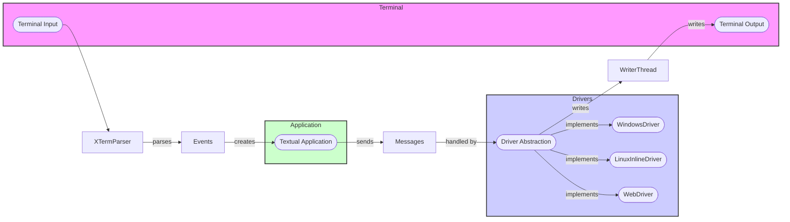

## Terminal Driver Abstraction Overview

This document provides an overview of the Terminal Driver Abstraction in Textual, which handles low-level terminal interactions and provides a consistent interface for input and output across different platforms.

### Data Flow Diagram

### Component Descriptions

*   **Terminal Input**: Represents the raw input received from the terminal (keyboard, mouse, etc.).
    *   Purpose: Captures user interactions with the terminal.
    *   Functionality: Receives raw input streams.
    *   Interaction: Sends raw input to `XTermParser`.

*   **XTermParser**: Parses terminal input, decodes XTerm escape sequences, and emits events.
    *   Purpose: Interprets terminal input and converts it into meaningful events.
    *   Functionality: Parses XTerm escape sequences, handles mouse codes, and generates key events.
    *   Interaction: Receives raw input from `Terminal Input` and sends events to `App`.
    *   Relevant source files: `textual._xterm_parser`

*   **Events**: Represents events generated by the parser (e.g., key presses, mouse clicks).
    *   Purpose: Encapsulates user actions and terminal state changes.
    *   Functionality: Carries information about user input and terminal events.
    *   Interaction: Received from `XTermParser` and sends to `App`.
    *   Relevant source files: `textual.events`

*   **Textual Application (App)**: The core application logic.
    *   Purpose: Manages the application's state, handles events, and updates the display.
    *   Functionality: Processes events, updates the UI, and sends messages to the driver.
    *   Interaction: Receives events from `Events` and sends messages to `Driver`.

*   **Messages**: Represents messages sent from the application to the terminal driver.
    *   Purpose: Encapsulates commands and data to be sent to the terminal.
    *   Functionality: Carries information about terminal operations (e.g., cursor movement, text output).
    *   Interaction: Received from `App` and sends to `Driver`.
    *   Relevant source files: `textual.messages`

*   **Driver Abstraction (Driver)**: Abstract base class for terminal drivers.
    *   Purpose: Provides a consistent interface for interacting with different terminal types.
    *   Functionality: Handles low-level terminal operations, such as writing to the terminal and managing input.
    *   Interaction: Receives messages from `App` and sends data to `WriterThread`. Implemented by `WindowsDriver`, `LinuxInlineDriver`, and `WebDriver`.
    *   Relevant source files: `textual.driver`

*   **WindowsDriver**: Driver implementation for Windows terminals.
    *   Purpose: Manages Windows-specific terminal interactions.
    *   Functionality: Handles Windows-specific terminal operations, such as enabling mouse support and bracketed paste.
    *   Interaction: Implements the `Driver` interface and interacts with the Windows console API.
    *   Relevant source files: `textual.drivers.windows_driver`

*   **LinuxInlineDriver**: Driver implementation for Linux terminals.
    *   Purpose: Manages Linux-specific terminal interactions.
    *   Functionality: Handles Linux-specific terminal operations, such as enabling mouse support and bracketed paste.
    *   Interaction: Implements the `Driver` interface and interacts with the Linux terminal.
    *   Relevant source files: `textual.drivers.linux_inline_driver`

*   **WebDriver**: Driver implementation for web terminals.
    *   Purpose: Manages communication with the web browser.
    *   Functionality: Handles web-specific terminal operations, such as sending binary-encoded data and opening URLs.
    *   Interaction: Implements the `Driver` interface and communicates with the web browser via a WebSocket connection.
    *   Relevant source files: `textual.drivers.web_driver`

*   **WriterThread**: A thread that handles writing to the terminal.
    *   Purpose: Ensures efficient and non-blocking output to the terminal.
    *   Functionality: Queues write operations and performs them in a separate thread.
    *   Interaction: Receives data from `Driver` and writes to `Terminal Output`.
    *   Relevant source files: `textual.drivers._writer_thread`

*   **Terminal Output**: Represents the output stream to the terminal.
    *   Purpose: Displays text and graphics in the terminal.
    *   Functionality: Writes data to the terminal.
    *   Interaction: Receives data from `WriterThread`.
