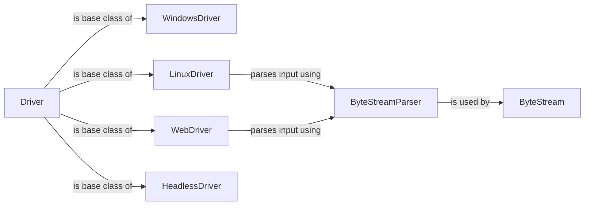

## Component Details

The Terminal Driver subsystem in Textual is responsible for managing the interaction between the application and the terminal or other output devices. It provides an abstraction layer that handles input and output, manages the terminal's state, and ensures consistent rendering across different terminal environments. The core of this subsystem is the `Driver` class, which serves as the base class for specific driver implementations tailored to different platforms (e.g., Linux, Windows, Web). These drivers handle terminal-specific functionalities such as enabling mouse support, managing bracketed paste, and processing terminal events. Input from the terminal is parsed by `ByteStreamParser` and `ByteStream`, which convert the raw byte stream into meaningful data for the application. The `HeadlessDriver` allows running Textual applications without a terminal.

### Driver
The base class for all drivers, providing a common interface for interacting with the terminal. It defines methods for processing messages, managing application modes, and handling terminal events. It acts as an intermediary between the Textual application and the specific terminal driver implementation.
- **Related Classes/Methods**: `textual.src.textual.driver.Driver`

### WindowsDriver
A driver implementation specifically for Windows terminals. It utilizes the Windows API for terminal interaction, handling tasks such as enabling/disabling mouse support and bracketed paste. It also manages the application mode within the Windows terminal environment.
- **Related Classes/Methods**: `textual.src.textual.drivers.windows_driver.WindowsDriver`

### LinuxDriver
A driver implementation for Linux terminals, interacting directly with the TTY. It manages terminal settings, input, and output, including mouse support, bracketed paste, and window resize events. It uses ByteStreamParser to parse the input.
- **Related Classes/Methods**: `textual.src.textual.drivers.linux_driver.LinuxDriver`

### WebDriver
A driver implementation for web-based terminals, using WebSockets for communication. It handles input and output, mouse support, bracketed paste, and other terminal features within a web browser environment. It uses ByteStreamParser to parse the input.
- **Related Classes/Methods**: `textual.src.textual.drivers.web_driver.WebDriver`

### ByteStreamParser
Parses byte streams received from the terminal, converting them into meaningful data for the application. It is used by the drivers to interpret the raw input from the terminal.
- **Related Classes/Methods**: `textual.src.textual.drivers._byte_stream.ByteStreamParser`

### HeadlessDriver
A driver implementation for running Textual applications in a headless environment (without a terminal). This is useful for testing or running applications in environments where a terminal is not available.
- **Related Classes/Methods**: `textual.src.textual.drivers.headless_driver.HeadlessDriver`

### ByteStream
Manages the byte stream parsing process, utilizing ByteStreamParser to convert raw byte streams into meaningful data.
- **Related Classes/Methods**: `textual.src.textual.drivers._byte_stream.ByteStream`
