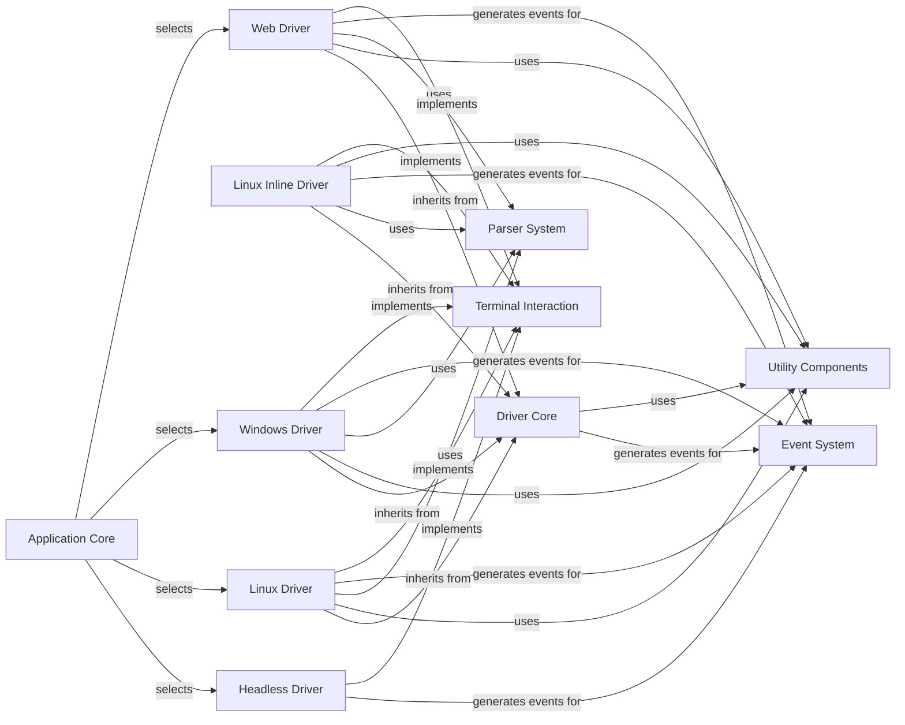

## Component Details

The Terminal Interaction subsystem in Textual is responsible for abstracting low-level terminal communication across various operating systems and web environments. It provides a unified `Driver Core` interface, which is then implemented by platform-specific drivers like `Windows Driver`, `Linux Driver`, `Linux Inline Driver`, `Web Driver`, and `Headless Driver`. These drivers manage input parsing, output rendering, and application mode control, interacting with the `Event System` to dispatch terminal events and utilizing `Parser System` and `Utility Components` for data processing and auxiliary functions. The `Application Core` selects and initializes the appropriate driver based on the runtime environment.

### Terminal Interaction
Manages low-level communication with the terminal, including parsing raw input sequences (keyboard, mouse) and sending control codes for output rendering across different operating systems and web environments.

**Related Classes/Methods**:

- <a href="https://github.com/Textualize/textual/blob/master/src/textual/driver.py#L17-L301" target="_blank" rel="noopener noreferrer">`textual.driver.Driver` (17:301)</a>
- <a href="https://github.com/Textualize/textual/blob/master/src/textual/drivers/windows_driver.py#L16-L137" target="_blank" rel="noopener noreferrer">`textual.drivers.windows_driver.WindowsDriver` (16:137)</a>
- <a href="https://github.com/Textualize/textual/blob/master/src/textual/drivers/linux_driver.py#L31-L469" target="_blank" rel="noopener noreferrer">`textual.drivers.linux_driver.LinuxDriver` (31:469)</a>
- <a href="https://github.com/Textualize/textual/blob/master/src/textual/drivers/web_driver.py#L41-L354" target="_blank" rel="noopener noreferrer">`textual.drivers.web_driver.WebDriver` (41:354)</a>

### Driver Core
The foundational driver component in Textual, responsible for managing the application's interaction with the terminal. It handles message processing, application mode suspension/resumption, and binary data delivery, providing a common interface for various terminal backends.

**Related Classes/Methods**:

- <a href="https://github.com/Textualize/textual/blob/master/src/textual/driver.py#L17-L301" target="_blank" rel="noopener noreferrer">`textual.driver.Driver` (17:301)</a>
- <a href="https://github.com/Textualize/textual/blob/master/src/textual/driver.py#L77-L132" target="_blank" rel="noopener noreferrer">`textual.driver.Driver:process_message` (77:132)</a>
- <a href="https://github.com/Textualize/textual/blob/master/src/textual/driver.py#L67-L75" target="_blank" rel="noopener noreferrer">`textual.driver.Driver.send_message` (67:75)</a>
- <a href="https://github.com/Textualize/textual/blob/master/src/textual/driver.py#L157-L164" target="_blank" rel="noopener noreferrer">`textual.driver.Driver:suspend_application_mode` (157:164)</a>
- <a href="https://github.com/Textualize/textual/blob/master/src/textual/driver.py#L154-L155" target="_blank" rel="noopener noreferrer">`textual.driver.Driver.stop_application_mode` (154:155)</a>
- <a href="https://github.com/Textualize/textual/blob/master/src/textual/driver.py#L192-L193" target="_blank" rel="noopener noreferrer">`textual.driver.Driver.close` (192:193)</a>
- <a href="https://github.com/Textualize/textual/blob/master/src/textual/driver.py#L166-L172" target="_blank" rel="noopener noreferrer">`textual.driver.Driver:resume_application_mode` (166:172)</a>
- <a href="https://github.com/Textualize/textual/blob/master/src/textual/driver.py#L146-L147" target="_blank" rel="noopener noreferrer">`textual.driver.Driver.start_application_mode` (146:147)</a>
- <a href="https://github.com/Textualize/textual/blob/master/src/textual/driver.py#L208-L277" target="_blank" rel="noopener noreferrer">`textual.driver.Driver:deliver_binary` (208:277)</a>
- <a href="https://github.com/Textualize/textual/blob/master/src/textual/driver.py#L279-L289" target="_blank" rel="noopener noreferrer">`textual.driver.Driver._delivery_complete` (279:289)</a>
- <a href="https://github.com/Textualize/textual/blob/master/src/textual/driver.py#L291-L301" target="_blank" rel="noopener noreferrer">`textual.driver.Driver._delivery_failed` (291:301)</a>
- <a href="https://github.com/Textualize/textual/blob/master/src/textual/driver.py#L20-L45" target="_blank" rel="noopener noreferrer">`textual.driver.Driver.__init__` (20:45)</a>
- <a href="https://github.com/Textualize/textual/blob/master/src/textual/driver.py#L142-L143" target="_blank" rel="noopener noreferrer">`textual.driver.Driver.flush` (142:143)</a>
- <a href="https://github.com/Textualize/textual/blob/master/src/textual/driver.py#L174-L175" target="_blank" rel="noopener noreferrer">`textual.driver.Driver.SignalResume` (174:175)</a>

### Windows Driver
This component provides the specific implementation for Textual applications running on Windows. It manages console modes, handles input events from the Windows console, and writes output to it, including mouse and bracketed paste support.

**Related Classes/Methods**:

- <a href="https://github.com/Textualize/textual/blob/master/src/textual/drivers/windows_driver.py#L16-L137" target="_blank" rel="noopener noreferrer">`textual.drivers.windows_driver.WindowsDriver` (16:137)</a>
- <a href="https://github.com/Textualize/textual/blob/master/src/textual/drivers/win32.py#L158-L180" target="_blank" rel="noopener noreferrer">`textual.drivers.win32:enable_application_mode` (158:180)</a>
- <a href="https://github.com/Textualize/textual/blob/master/src/textual/drivers/win32.py#L143-L155" target="_blank" rel="noopener noreferrer">`textual.drivers.win32.get_console_mode` (143:155)</a>
- <a href="https://github.com/Textualize/textual/blob/master/src/textual/drivers/win32.py#L128-L140" target="_blank" rel="noopener noreferrer">`textual.drivers.win32.set_console_mode` (128:140)</a>
- <a href="https://github.com/Textualize/textual/blob/master/src/textual/drivers/win32.py#L228-L298" target="_blank" rel="noopener noreferrer">`textual.drivers.win32.EventMonitor:run` (228:298)</a>
- <a href="https://github.com/Textualize/textual/blob/master/src/textual/drivers/win32.py#L183-L209" target="_blank" rel="noopener noreferrer">`textual.drivers.win32.wait_for_handles` (183:209)</a>
- <a href="https://github.com/Textualize/textual/blob/master/src/textual/drivers/win32.py#L300-L304" target="_blank" rel="noopener noreferrer">`textual.drivers.win32.EventMonitor:on_size_change` (300:304)</a>
- <a href="https://github.com/Textualize/textual/blob/master/src/textual/drivers/windows_driver.py#L19-L40" target="_blank" rel="noopener noreferrer">`textual.drivers.windows_driver.WindowsDriver:__init__` (19:40)</a>
- <a href="https://github.com/Textualize/textual/blob/master/src/textual/drivers/windows_driver.py#L47-L54" target="_blank" rel="noopener noreferrer">`textual.drivers.windows_driver.WindowsDriver:write` (47:54)</a>
- <a href="https://github.com/Textualize/textual/blob/master/src/textual/drivers/windows_driver.py#L56-L65" target="_blank" rel="noopener noreferrer">`textual.drivers.windows_driver.WindowsDriver:_enable_mouse_support` (56:65)</a>
- <a href="https://github.com/Textualize/textual/blob/master/src/textual/drivers/windows_driver.py#L67-L76" target="_blank" rel="noopener noreferrer">`textual.drivers.windows_driver.WindowsDriver:_disable_mouse_support` (67:76)</a>
- <a href="https://github.com/Textualize/textual/blob/master/src/textual/drivers/windows_driver.py#L78-L80" target="_blank" rel="noopener noreferrer">`textual.drivers.windows_driver.WindowsDriver:_enable_bracketed_paste` (78:80)</a>
- <a href="https://github.com/Textualize/textual/blob/master/src/textual/drivers/windows_driver.py#L82-L84" target="_blank" rel="noopener noreferrer">`textual.drivers.windows_driver.WindowsDriver:_disable_bracketed_paste` (82:84)</a>
- <a href="https://github.com/Textualize/textual/blob/master/src/textual/drivers/windows_driver.py#L86-L106" target="_blank" rel="noopener noreferrer">`textual.drivers.windows_driver.WindowsDriver:start_application_mode` (86:106)</a>
- <a href="https://github.com/Textualize/textual/blob/master/src/textual/drivers/windows_driver.py#L108-L120" target="_blank" rel="noopener noreferrer">`textual.drivers.windows_driver.WindowsDriver:disable_input` (108:120)</a>
- <a href="https://github.com/Textualize/textual/blob/master/src/textual/drivers/windows_driver.py#L122-L130" target="_blank" rel="noopener noreferrer">`textual.drivers.windows_driver.WindowsDriver:stop_application_mode` (122:130)</a>
- <a href="https://github.com/Textualize/textual/blob/master/src/textual/drivers/windows_driver.py#L132-L137" target="_blank" rel="noopener noreferrer">`textual.drivers.windows_driver.WindowsDriver:close` (132:137)</a>
- <a href="https://github.com/Textualize/textual/blob/master/src/textual/drivers/win32.py#L158-L180" target="_blank" rel="noopener noreferrer">`textual.drivers.win32.enable_application_mode` (158:180)</a>
- <a href="https://github.com/Textualize/textual/blob/master/src/textual/drivers/win32.py#L212-L304" target="_blank" rel="noopener noreferrer">`textual.drivers.win32.EventMonitor` (212:304)</a>

### Linux Inline Driver
This component handles terminal interactions for Textual applications on Linux, specifically for inline display scenarios. It manages input threads, terminal size, mouse support, and bracketed paste, adapting to Linux-specific terminal behaviors.

**Related Classes/Methods**:

- <a href="https://github.com/Textualize/textual/blob/master/src/textual/drivers/linux_inline_driver.py#L29-L41" target="_blank" rel="noopener noreferrer">`textual.drivers.linux_inline_driver.LinuxInlineDriver:__init__` (29:41)</a>
- <a href="https://github.com/Textualize/textual/blob/master/src/textual/drivers/linux_inline_driver.py#L50-L52" target="_blank" rel="noopener noreferrer">`textual.drivers.linux_inline_driver.LinuxInlineDriver:_enable_bracketed_paste` (50:52)</a>
- <a href="https://github.com/Textualize/textual/blob/master/src/textual/drivers/linux_inline_driver.py#L103-L104" target="_blank" rel="noopener noreferrer">`textual.drivers.linux_inline_driver.LinuxInlineDriver:write` (103:104)</a>
- <a href="https://github.com/Textualize/textual/blob/master/src/textual/drivers/linux_inline_driver.py#L54-L56" target="_blank" rel="noopener noreferrer">`textual.drivers.linux_inline_driver.LinuxInlineDriver:_disable_bracketed_paste` (54:56)</a>
- <a href="https://github.com/Textualize/textual/blob/master/src/textual/drivers/linux_inline_driver.py#L79-L90" target="_blank" rel="noopener noreferrer">`textual.drivers.linux_inline_driver.LinuxInlineDriver:_enable_mouse_support` (79:90)</a>
- <a href="https://github.com/Textualize/textual/blob/master/src/textual/drivers/linux_inline_driver.py#L305-L307" target="_blank" rel="noopener noreferrer">`textual.drivers.linux_inline_driver.LinuxInlineDriver.flush` (305:307)</a>
- <a href="https://github.com/Textualize/textual/blob/master/src/textual/drivers/linux_inline_driver.py#L92-L101" target="_blank" rel="noopener noreferrer">`textual.drivers.linux_inline_driver.LinuxInlineDriver:_disable_mouse_support` (92:101)</a>
- <a href="https://github.com/Textualize/textual/blob/master/src/textual/drivers/linux_inline_driver.py#L106-L119" target="_blank" rel="noopener noreferrer">`textual.drivers.linux_inline_driver.LinuxInlineDriver:_run_input_thread` (106:119)</a>
- <a href="https://github.com/Textualize/textual/blob/master/src/textual/drivers/linux_inline_driver.py#L121-L177" target="_blank" rel="noopener noreferrer">`textual.drivers.linux_inline_driver.LinuxInlineDriver:run_input_thread` (121:177)</a>
- `textual.drivers.linux_inline_driver.LinuxInlineDriver.run_input_thread.process_selector_events` (full file reference)
- <a href="https://github.com/Textualize/textual/blob/master/src/textual/drivers/linux_inline_driver.py#L179-L244" target="_blank" rel="noopener noreferrer">`textual.drivers.linux_inline_driver.LinuxInlineDriver:start_application_mode` (179:244)</a>
- <a href="https://github.com/Textualize/textual/blob/master/src/textual/drivers/linux_inline_driver.py#L58-L77" target="_blank" rel="noopener noreferrer">`textual.drivers.linux_inline_driver.LinuxInlineDriver._get_terminal_size` (58:77)</a>
- `textual.drivers.linux_inline_driver.LinuxInlineDriver.start_application_mode.send_size_event.update_size` (full file reference)
- `textual.drivers.linux_inline_driver.LinuxInlineDriver.start_application_mode.send_size_event` (full file reference)
- <a href="https://github.com/Textualize/textual/blob/master/src/textual/drivers/linux_inline_driver.py#L256-L269" target="_blank" rel="noopener noreferrer">`textual.drivers.linux_inline_driver.LinuxInlineDriver._patch_lflag` (256:269)</a>
- <a href="https://github.com/Textualize/textual/blob/master/src/textual/drivers/linux_inline_driver.py#L272-L284" target="_blank" rel="noopener noreferrer">`textual.drivers.linux_inline_driver.LinuxInlineDriver._patch_iflag` (272:284)</a>
- <a href="https://github.com/Textualize/textual/blob/master/src/textual/drivers/linux_inline_driver.py#L246-L253" target="_blank" rel="noopener noreferrer">`textual.drivers.linux_inline_driver.LinuxInlineDriver._request_terminal_sync_mode_support` (246:253)</a>
- <a href="https://github.com/Textualize/textual/blob/master/src/textual/drivers/linux_inline_driver.py#L286-L303" target="_blank" rel="noopener noreferrer">`textual.drivers.linux_inline_driver.LinuxInlineDriver:disable_input` (286:303)</a>
- <a href="https://github.com/Textualize/textual/blob/master/src/textual/drivers/linux_inline_driver.py#L309-L325" target="_blank" rel="noopener noreferrer">`textual.drivers.linux_inline_driver.LinuxInlineDriver:stop_application_mode` (309:325)</a>

### Web Driver
This component enables Textual applications to run in a web environment, handling communication with the browser. It manages input and output, including binary data delivery, mouse support, and bracketed paste, adapting to web-specific protocols.

**Related Classes/Methods**:

- <a href="https://github.com/Textualize/textual/blob/master/src/textual/drivers/web_driver.py#L41-L354" target="_blank" rel="noopener noreferrer">`textual.drivers.web_driver.WebDriver` (41:354)</a>
- <a href="https://github.com/Textualize/textual/blob/master/src/textual/drivers/web_driver.py#L44-L72" target="_blank" rel="noopener noreferrer">`textual.drivers.web_driver.WebDriver:__init__` (44:72)</a>
- <a href="https://github.com/Textualize/textual/blob/master/src/textual/drivers/web_driver.py#L99-L106" target="_blank" rel="noopener noreferrer">`textual.drivers.web_driver.WebDriver:write_binary_encoded` (99:106)</a>
- <a href="https://github.com/Textualize/textual/blob/master/src/textual/drivers/web_driver.py#L111-L117" target="_blank" rel="noopener noreferrer">`textual.drivers.web_driver.WebDriver:_enable_mouse_support` (111:117)</a>
- <a href="https://github.com/Textualize/textual/blob/master/src/textual/drivers/web_driver.py#L78-L87" target="_blank" rel="noopener noreferrer">`textual.drivers.web_driver.WebDriver:write` (78:87)</a>
- <a href="https://github.com/Textualize/textual/blob/master/src/textual/drivers/web_driver.py#L119-L121" target="_blank" rel="noopener noreferrer">`textual.drivers.web_driver.WebDriver:_enable_bracketed_paste` (119:121)</a>
- <a href="https://github.com/Textualize/textual/blob/master/src/textual/drivers/web_driver.py#L123-L125" target="_blank" rel="noopener noreferrer">`textual.drivers.web_driver.WebDriver:_disable_bracketed_paste` (123:125)</a>
- <a href="https://github.com/Textualize/textual/blob/master/src/textual/drivers/web_driver.py#L127-L133" target="_blank" rel="noopener noreferrer">`textual.drivers.web_driver.WebDriver:_disable_mouse_support` (127:133)</a>
- <a href="https://github.com/Textualize/textual/blob/master/src/textual/drivers/web_driver.py#L135-L137" target="_blank" rel="noopener noreferrer">`textual.drivers.web_driver.WebDriver:_request_terminal_sync_mode_support` (135:137)</a>
- <a href="https://github.com/Textualize/textual/blob/master/src/textual/drivers/web_driver.py#L139-L173" target="_blank" rel="noopener noreferrer">`textual.drivers.web_driver.WebDriver:start_application_mode` (139:173)</a>
- <a href="https://github.com/Textualize/textual/blob/master/src/textual/drivers/web_driver.py#L178-L182" target="_blank" rel="noopener noreferrer">`textual.drivers.web_driver.WebDriver:stop_application_mode` (178:182)</a>
- <a href="https://github.com/Textualize/textual/blob/master/src/textual/drivers/web_driver.py#L89-L97" target="_blank" rel="noopener noreferrer">`textual.drivers.web_driver.WebDriver.write_meta` (89:97)</a>
- <a href="https://github.com/Textualize/textual/blob/master/src/textual/drivers/web_driver.py#L184-L213" target="_blank" rel="noopener noreferrer">`textual.drivers.web_driver.WebDriver:run_input_thread` (184:213)</a>
- <a href="https://github.com/Textualize/textual/blob/master/src/textual/drivers/web_driver.py#L215-L229" target="_blank" rel="noopener noreferrer">`textual.drivers.web_driver.WebDriver._on_meta` (215:229)</a>
- <a href="https://github.com/Textualize/textual/blob/master/src/textual/drivers/web_driver.py#L231-L295" target="_blank" rel="noopener noreferrer">`textual.drivers.web_driver.WebDriver:on_meta` (231:295)</a>
- <a href="https://github.com/Textualize/textual/blob/master/src/textual/drivers/web_driver.py#L37-L38" target="_blank" rel="noopener noreferrer">`textual.drivers.web_driver._ExitInput` (37:38)</a>
- <a href="https://github.com/Textualize/textual/blob/master/src/textual/drivers/web_driver.py#L297-L304" target="_blank" rel="noopener noreferrer">`textual.drivers.web_driver.WebDriver:open_url` (297:304)</a>
- <a href="https://github.com/Textualize/textual/blob/master/src/textual/drivers/web_driver.py#L306-L325" target="_blank" rel="noopener noreferrer">`textual.drivers.web_driver.WebDriver:deliver_binary` (306:325)</a>
- <a href="https://github.com/Textualize/textual/blob/master/src/textual/drivers/web_driver.py#L327-L354" target="_blank" rel="noopener noreferrer">`textual.drivers.web_driver.WebDriver._deliver_file` (327:354)</a>

### Headless Driver
This component provides a driver for Textual applications that run without a visible terminal, primarily used for testing or background processes. It simulates terminal interactions and manages application mode in a non-graphical environment.

**Related Classes/Methods**:

- <a href="https://github.com/Textualize/textual/blob/master/src/textual/drivers/headless_driver.py#L44-L59" target="_blank" rel="noopener noreferrer">`textual.drivers.headless_driver.HeadlessDriver:start_application_mode` (44:59)</a>
- <a href="https://github.com/Textualize/textual/blob/master/src/textual/drivers/headless_driver.py#L18-L34" target="_blank" rel="noopener noreferrer">`textual.drivers.headless_driver.HeadlessDriver._get_terminal_size` (18:34)</a>
- `textual.drivers.headless_driver.HeadlessDriver.start_application_mode.send_size_event` (full file reference)
- <a href="https://github.com/Textualize/textual/blob/master/src/textual/drivers/headless_driver.py#L10-L65" target="_blank" rel="noopener noreferrer">`textual.drivers.headless_driver.HeadlessDriver` (10:65)</a>

### Linux Driver
This component is the primary driver for Textual applications on standard Linux terminals. It handles signal processing, mouse and bracketed paste support, and manages terminal line wrapping and in-band window resizing.

**Related Classes/Methods**:

- <a href="https://github.com/Textualize/textual/blob/master/src/textual/drivers/linux_driver.py#L31-L469" target="_blank" rel="noopener noreferrer">`textual.drivers.linux_driver.LinuxDriver` (31:469)</a>
- <a href="https://github.com/Textualize/textual/blob/master/src/textual/drivers/linux_driver.py#L34-L72" target="_blank" rel="noopener noreferrer">`textual.drivers.linux_driver.LinuxDriver:__init__` (34:72)</a>
- <a href="https://github.com/Textualize/textual/blob/master/src/textual/drivers/linux_driver.py#L74-L85" target="_blank" rel="noopener noreferrer">`textual.drivers.linux_driver.LinuxDriver:_sigtstp_application` (74:85)</a>
- <a href="https://github.com/Textualize/textual/blob/master/src/textual/drivers/linux_driver.py#L87-L90" target="_blank" rel="noopener noreferrer">`textual.drivers.linux_driver.LinuxDriver:_sigcont_application` (87:90)</a>
- <a href="https://github.com/Textualize/textual/blob/master/src/textual/drivers/linux_driver.py#L121-L133" target="_blank" rel="noopener noreferrer">`textual.drivers.linux_driver.LinuxDriver:_enable_mouse_support` (121:133)</a>
- <a href="https://github.com/Textualize/textual/blob/master/src/textual/drivers/linux_driver.py#L138-L143" target="_blank" rel="noopener noreferrer">`textual.drivers.linux_driver.LinuxDriver:_enable_mouse_pixels` (138:143)</a>
- <a href="https://github.com/Textualize/textual/blob/master/src/textual/drivers/linux_driver.py#L145-L147" target="_blank" rel="noopener noreferrer">`textual.drivers.linux_driver.LinuxDriver:_enable_bracketed_paste` (145:147)</a>
- <a href="https://github.com/Textualize/textual/blob/master/src/textual/drivers/linux_driver.py#L149-L150" target="_blank" rel="noopener noreferrer">`textual.drivers.linux_driver.LinuxDriver:_query_in_band_window_resize` (149:150)</a>
- <a href="https://github.com/Textualize/textual/blob/master/src/textual/drivers/linux_driver.py#L152-L153" target="_blank" rel="noopener noreferrer">`textual.drivers.linux_driver.LinuxDriver:_enable_in_band_window_resize` (152:153)</a>
- <a href="https://github.com/Textualize/textual/blob/master/src/textual/drivers/linux_driver.py#L155-L156" target="_blank" rel="noopener noreferrer">`textual.drivers.linux_driver.LinuxDriver:_enable_line_wrap` (155:156)</a>
- <a href="https://github.com/Textualize/textual/blob/master/src/textual/drivers/linux_driver.py#L158-L159" target="_blank" rel="noopener noreferrer">`textual.drivers.linux_driver.LinuxDriver:_disable_line_wrap` (158:159)</a>
- <a href="https://github.com/Textualize/textual/blob/master/src/textual/drivers/linux_driver.py#L161-L163" target="_blank" rel="noopener noreferrer">`textual.drivers.linux_driver.LinuxDriver:_disable_in_band_window_resize` (161:163)</a>
- <a href="https://github.com/Textualize/textual/blob/master/src/textual/drivers/linux_driver.py#L165-L167" target="_blank" rel="noopener noreferrer">`textual.drivers.linux_driver.LinuxDriver:_disable_bracketed_paste` (165:167)</a>
- <a href="https://github.com/Textualize/textual/blob/master/src/textual/drivers/linux_driver.py#L169-L178" target="_blank" rel="noopener noreferrer">`textual.drivers.linux_driver.LinuxDriver:_disable_mouse_support` (169:178)</a>
- <a href="https://github.com/Textualize/textual/blob/master/src/textual/drivers/linux_driver.py#L180-L187" target="_blank" rel="noopener noreferrer">`textual.drivers.linux_driver.LinuxDriver:write` (180:187)</a>
- <a href="https://github.com/Textualize/textual/blob/master/src/textual/drivers/linux_driver.py#L189-L297" target="_blank" rel="noopener noreferrer">`textual.drivers.linux_driver.LinuxDriver:start_application_mode` (189:297)</a>
- <a href="https://github.com/Textualize/textual/blob/master/src/textual/drivers/linux_driver.py#L299-L308" target="_blank" rel="noopener noreferrer">`textual.drivers.linux_driver.LinuxDriver:_request_terminal_sync_mode_support` (299:308)</a>
- <a href="https://github.com/Textualize/textual/blob/master/src/textual/drivers/linux_driver.py#L341-L357" target="_blank" rel="noopener noreferrer">`textual.drivers.linux_driver.LinuxDriver:disable_input` (341:357)</a>
- <a href="https://github.com/Textualize/textual/blob/master/src/textual/drivers/linux_driver.py#L359-L380" target="_blank" rel="noopener noreferrer">`textual.drivers.linux_driver.LinuxDriver:stop_application_mode` (359:380)</a>
- <a href="https://github.com/Textualize/textual/blob/master/src/textual/drivers/linux_driver.py#L382-L385" target="_blank" rel="noopener noreferrer">`textual.drivers.linux_driver.LinuxDriver:close` (382:385)</a>
- <a href="https://github.com/Textualize/textual/blob/master/src/textual/drivers/linux_driver.py#L387-L400" target="_blank" rel="noopener noreferrer">`textual.drivers.linux_driver.LinuxDriver:_run_input_thread` (387:400)</a>
- <a href="https://github.com/Textualize/textual/blob/master/src/textual/drivers/linux_driver.py#L402-L452" target="_blank" rel="noopener noreferrer">`textual.drivers.linux_driver.LinuxDriver:run_input_thread` (402:452)</a>
- `textual.drivers.linux_driver.LinuxDriver.run_input_thread.process_selector_events` (full file reference)
- <a href="https://github.com/Textualize/textual/blob/master/src/textual/drivers/linux_driver.py#L454-L469" target="_blank" rel="noopener noreferrer">`textual.drivers.linux_driver.LinuxDriver:process_message` (454:469)</a>
- <a href="https://github.com/Textualize/textual/blob/master/src/textual/drivers/linux_driver.py#L31-L469" target="_blank" rel="noopener noreferrer">`textual.drivers.linux_driver.LinuxDriver` (31:469)</a>

### Application Core
The central application component responsible for initializing and managing the Textual application lifecycle. It determines the appropriate driver based on the environment and orchestrates the application's startup and shutdown.

**Related Classes/Methods**:

- <a href="https://github.com/Textualize/textual/blob/master/src/textual/app.py#L1404-L1439" target="_blank" rel="noopener noreferrer">`textual.app.App:get_driver_class` (1404:1439)</a>
- <a href="https://github.com/Textualize/textual/blob/master/src/textual/app.py#L3067-L3100" target="_blank" rel="noopener noreferrer">`textual.app.App:_build_driver` (3067:3100)</a>

### Event System
This component defines and manages various events within the Textual application, such as mouse interactions, resize events, and application lifecycle events (focus, blur, exit). It provides the structure for communication between different parts of the application.

**Related Classes/Methods**:

- <a href="https://github.com/Textualize/textual/blob/master/src/textual/events.py#L583-L588" target="_blank" rel="noopener noreferrer">`textual.events.MouseUp` (583:588)</a>
- <a href="https://github.com/Textualize/textual/blob/master/src/textual/events.py#L931-L946" target="_blank" rel="noopener noreferrer">`textual.events.DeliveryComplete` (931:946)</a>
- <a href="https://github.com/Textualize/textual/blob/master/src/textual/events.py#L950-L960" target="_blank" rel="noopener noreferrer">`textual.events.DeliveryFailed` (950:960)</a>
- <a href="https://github.com/Textualize/textual/blob/master/src/textual/events.py#L100-L153" target="_blank" rel="noopener noreferrer">`textual.events.Resize` (100:153)</a>
- <a href="https://github.com/Textualize/textual/blob/master/src/textual/messages.py#L26-L27" target="_blank" rel="noopener noreferrer">`textual.messages.ExitApp` (26:27)</a>
- <a href="https://github.com/Textualize/textual/blob/master/src/textual/events.py#L816-L825" target="_blank" rel="noopener noreferrer">`textual.events.AppBlur` (816:825)</a>
- <a href="https://github.com/Textualize/textual/blob/master/src/textual/events.py#L804-L813" target="_blank" rel="noopener noreferrer">`textual.events.AppFocus` (804:813)</a>
- <a href="https://github.com/Textualize/textual/blob/master/src/textual/messages.py#L103-L136" target="_blank" rel="noopener noreferrer">`textual.messages.InBandWindowResize` (103:136)</a>

### Parser System
This component is responsible for parsing input streams, specifically XTerm escape sequences, to interpret terminal commands and user input. It feeds the parsed data to the Textual application for further processing.

**Related Classes/Methods**:

- <a href="https://github.com/Textualize/textual/blob/master/src/textual/_xterm_parser.py#L52-L376" target="_blank" rel="noopener noreferrer">`textual._xterm_parser.XTermParser` (52:376)</a>
- <a href="https://github.com/Textualize/textual/blob/master/src/textual/_parser.py#L57-L63" target="_blank" rel="noopener noreferrer">`textual._parser.Parser.tick` (57:63)</a>
- <a href="https://github.com/Textualize/textual/blob/master/src/textual/_xterm_parser.py#L70-L72" target="_blank" rel="noopener noreferrer">`textual._xterm_parser.XTermParser.feed` (70:72)</a>

### Utility Components
A collection of helper components that provide essential functionalities such as logging, looping utilities, binary encoding/decoding, and managing writer and input threads for various drivers.

**Related Classes/Methods**:

- `textual.Logger` (full file reference)
- <a href="https://github.com/Textualize/textual/blob/master/src/textual/_loop.py#L20-L30" target="_blank" rel="noopener noreferrer">`textual._loop.loop_last` (20:30)</a>
- <a href="https://github.com/Textualize/textual/blob/master/src/textual/_binary_encode.py#L28-L166" target="_blank" rel="noopener noreferrer">`textual._binary_encode.dump` (28:166)</a>
- <a href="https://github.com/Textualize/textual/blob/master/src/textual/drivers/_writer_thread.py#L20-L26" target="_blank" rel="noopener noreferrer">`textual.drivers._writer_thread.WriterThread.write` (20:26)</a>
- <a href="https://github.com/Textualize/textual/blob/master/src/textual/drivers/_writer_thread.py#L12-L68" target="_blank" rel="noopener noreferrer">`textual.drivers._writer_thread.WriterThread` (12:68)</a>
- <a href="https://github.com/Textualize/textual/blob/master/src/textual/drivers/_writer_thread.py#L65-L68" target="_blank" rel="noopener noreferrer">`textual.drivers._writer_thread.WriterThread.stop` (65:68)</a>
- <a href="https://github.com/Textualize/textual/blob/master/src/textual/drivers/_input_reader_windows.py#L7-L33" target="_blank" rel="noopener noreferrer">`textual.drivers._input_reader_windows.InputReader` (7:33)</a>
- <a href="https://github.com/Textualize/textual/blob/master/src/textual/drivers/_input_reader_windows.py#L20-L22" target="_blank" rel="noopener noreferrer">`textual.drivers._input_reader_windows.InputReader.close` (20:22)</a>
- <a href="https://github.com/Textualize/textual/blob/master/src/textual/drivers/_byte_stream.py#L138-L157" target="_blank" rel="noopener noreferrer">`textual.drivers._byte_stream.ByteStream` (138:157)</a>
- <a href="https://github.com/Textualize/textual/blob/master/src/textual/drivers/_byte_stream.py#L72-L117" target="_blank" rel="noopener noreferrer">`textual.drivers._byte_stream.ByteStreamParser.feed` (72:117)</a>

### [FAQ](https://github.com/CodeBoarding/GeneratedOnBoardings/tree/main?tab=readme-ov-file#faq)