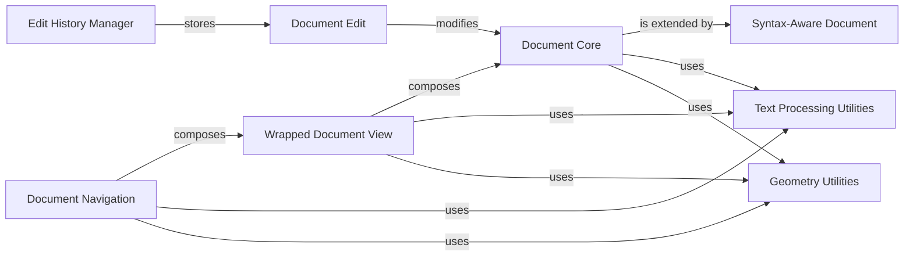

## Component Details

The Text Document Model subsystem provides the foundational data structures and logic for managing editable text content within the editor. It encompasses the core document representation, mechanisms for tracking and reverting changes through an edit history, syntax awareness for advanced text processing, and functionalities for navigating and visually wrapping the document content. This subsystem ensures the integrity and manipulability of the text data, supporting features like undo/redo, syntax highlighting, and efficient cursor movement.

### Document Core
The fundamental data structure for storing and managing the raw text content of the editor. It offers basic operations such as retrieving specific lines, extracting text ranges, and performing direct text replacements, serving as the canonical source of truth for the document's content.

**Related Classes/Methods**:

- <a href="https://github.com/Textualize/textual/blob/master/src/textual/document/_document.py#L204-L431" target="_blank" rel="noopener noreferrer">`textual.document._document.Document` (204:431)</a>
- <a href="https://github.com/Textualize/textual/blob/master/src/textual/document/_document.py#L207-L216" target="_blank" rel="noopener noreferrer">`textual.document._document.Document.__init__` (207:216)</a>
- <a href="https://github.com/Textualize/textual/blob/master/src/textual/document/_document.py#L238-L251" target="_blank" rel="noopener noreferrer">`textual.document._document.Document.get_size` (238:251)</a>
- <a href="https://github.com/Textualize/textual/blob/master/src/textual/document/_document.py#L404-L414" target="_blank" rel="noopener noreferrer">`textual.document._document.Document.get_line` (404:414)</a>
- <a href="https://github.com/Textualize/textual/blob/master/src/textual/document/_document.py#L303-L339" target="_blank" rel="noopener noreferrer">`textual.document._document.Document.get_text_range` (303:339)</a>
- <a href="https://github.com/Textualize/textual/blob/master/src/textual/document/_document.py#L253-L301" target="_blank" rel="noopener noreferrer">`textual.document._document.Document.replace_range` (253:301)</a>
- <a href="https://github.com/Textualize/textual/blob/master/src/textual/document/_document.py#L357-L370" target="_blank" rel="noopener noreferrer">`textual.document._document.Document.get_index_from_location` (357:370)</a>
- <a href="https://github.com/Textualize/textual/blob/master/src/textual/document/_document.py#L372-L402" target="_blank" rel="noopener noreferrer">`textual.document._document.Document.get_location_from_index` (372:402)</a>
- <a href="https://github.com/Textualize/textual/blob/master/src/textual/document/_document.py#L47-L63" target="_blank" rel="noopener noreferrer">`textual.document._document._detect_newline_style` (47:63)</a>
- <a href="https://github.com/Textualize/textual/blob/master/src/textual/document/_document.py#L23-L29" target="_blank" rel="noopener noreferrer">`textual.document._document.EditResult` (23:29)</a>
- `textual.document._document.Location` (full file reference)
- <a href="https://github.com/Textualize/textual/blob/master/src/textual/document/_document.py#L438-L468" target="_blank" rel="noopener noreferrer">`textual.document._document.Selection` (438:468)</a>
- <a href="https://github.com/Textualize/textual/blob/master/src/textual/document/_document.py#L456-L462" target="_blank" rel="noopener noreferrer">`textual.document._document.Selection.cursor` (456:462)</a>

### Syntax-Aware Document
Building upon the Document Core, this component integrates with a syntax parsing engine (like tree-sitter) to understand the grammatical structure of the text. It enables advanced features such as syntax highlighting by allowing queries against the parsed syntax tree, providing a richer understanding of the document's content beyond plain text.

**Related Classes/Methods**:

- <a href="https://github.com/Textualize/textual/blob/master/src/textual/document/_syntax_aware_document.py#L18-L228" target="_blank" rel="noopener noreferrer">`textual.document._syntax_aware_document.SyntaxAwareDocument` (18:228)</a>
- <a href="https://github.com/Textualize/textual/blob/master/src/textual/document/_syntax_aware_document.py#L23-L48" target="_blank" rel="noopener noreferrer">`textual.document._syntax_aware_document.SyntaxAwareDocument:__init__` (23:48)</a>
- <a href="https://github.com/Textualize/textual/blob/master/src/textual/document/_syntax_aware_document.py#L50-L63" target="_blank" rel="noopener noreferrer">`textual.document._syntax_aware_document.SyntaxAwareDocument.prepare_query` (50:63)</a>
- <a href="https://github.com/Textualize/textual/blob/master/src/textual/document/_syntax_aware_document.py#L94-L134" target="_blank" rel="noopener noreferrer">`textual.document._syntax_aware_document.SyntaxAwareDocument.replace_range` (94:134)</a>
- <a href="https://github.com/Textualize/textual/blob/master/src/textual/document/_syntax_aware_document.py#L148-L170" target="_blank" rel="noopener noreferrer">`textual.document._syntax_aware_document.SyntaxAwareDocument._location_to_byte_offset` (148:170)</a>
- <a href="https://github.com/Textualize/textual/blob/master/src/textual/document/_syntax_aware_document.py#L172-L189" target="_blank" rel="noopener noreferrer">`textual.document._syntax_aware_document.SyntaxAwareDocument._location_to_point` (172:189)</a>

### Wrapped Document View
This component is responsible for presenting a visually wrapped version of the raw document content. It takes into account the available display width and tab settings to calculate how lines should break and where characters should appear, providing the necessary mapping between logical document locations and their visual offsets on screen.

**Related Classes/Methods**:

- <a href="https://github.com/Textualize/textual/blob/master/src/textual/document/_wrapped_document.py#L18-L454" target="_blank" rel="noopener noreferrer">`textual.document._wrapped_document.WrappedDocument` (18:454)</a>
- <a href="https://github.com/Textualize/textual/blob/master/src/textual/document/_wrapped_document.py#L27-L68" target="_blank" rel="noopener noreferrer">`textual.document._wrapped_document.WrappedDocument:__init__` (27:68)</a>
- <a href="https://github.com/Textualize/textual/blob/master/src/textual/document/_wrapped_document.py#L80-L128" target="_blank" rel="noopener noreferrer">`textual.document._wrapped_document.WrappedDocument:wrap` (80:128)</a>
- <a href="https://github.com/Textualize/textual/blob/master/src/textual/document/_wrapped_document.py#L156-L275" target="_blank" rel="noopener noreferrer">`textual.document._wrapped_document.WrappedDocument:wrap_range` (156:275)</a>
- <a href="https://github.com/Textualize/textual/blob/master/src/textual/document/_wrapped_document.py#L327-L356" target="_blank" rel="noopener noreferrer">`textual.document._wrapped_document.WrappedDocument:location_to_offset` (327:356)</a>
- <a href="https://github.com/Textualize/textual/blob/master/src/textual/document/_wrapped_document.py#L277-L325" target="_blank" rel="noopener noreferrer">`textual.document._wrapped_document.WrappedDocument:offset_to_location` (277:325)</a>
- <a href="https://github.com/Textualize/textual/blob/master/src/textual/document/_wrapped_document.py#L423-L443" target="_blank" rel="noopener noreferrer">`textual.document._wrapped_document.WrappedDocument:get_offsets` (423:443)</a>
- <a href="https://github.com/Textualize/textual/blob/master/src/textual/document/_wrapped_document.py#L445-L454" target="_blank" rel="noopener noreferrer">`textual.document._wrapped_document.WrappedDocument:get_tab_widths` (445:454)</a>
- <a href="https://github.com/Textualize/textual/blob/master/src/textual/document/_wrapped_document.py#L406-L421" target="_blank" rel="noopener noreferrer">`textual.document._wrapped_document.WrappedDocument:get_sections` (406:421)</a>
- <a href="https://github.com/Textualize/textual/blob/master/src/textual/document/_wrapped_document.py#L358-L404" target="_blank" rel="noopener noreferrer">`textual.document._wrapped_document.WrappedDocument:get_target_document_column` (358:404)</a>

### Document Navigation
This component encapsulates the logic for moving the cursor within the document, intelligently navigating across lines, words, and wrapped sections. It provides methods to calculate target cursor locations based on various movement commands (e.g., left, right, up, down, home, end, word-by-word), ensuring correct cursor placement even with text wrapping.

**Related Classes/Methods**:

- <a href="https://github.com/Textualize/textual/blob/master/src/textual/document/_document_navigator.py#L11-L454" target="_blank" rel="noopener noreferrer">`textual.document._document_navigator.DocumentNavigator` (11:454)</a>
- <a href="https://github.com/Textualize/textual/blob/master/src/textual/document/_document_navigator.py#L225-L245" target="_blank" rel="noopener noreferrer">`textual.document._document_navigator.DocumentNavigator:get_location_left` (225:245)</a>
- <a href="https://github.com/Textualize/textual/blob/master/src/textual/document/_document_navigator.py#L247-L266" target="_blank" rel="noopener noreferrer">`textual.document._document_navigator.DocumentNavigator:get_location_right` (247:266)</a>
- <a href="https://github.com/Textualize/textual/blob/master/src/textual/document/_document_navigator.py#L268-L314" target="_blank" rel="noopener noreferrer">`textual.document._document_navigator.DocumentNavigator:get_location_above` (268:314)</a>
- <a href="https://github.com/Textualize/textual/blob/master/src/textual/document/_document_navigator.py#L316-L359" target="_blank" rel="noopener noreferrer">`textual.document._document_navigator.DocumentNavigator:get_location_below` (316:359)</a>
- <a href="https://github.com/Textualize/textual/blob/master/src/textual/document/_document_navigator.py#L361-L383" target="_blank" rel="noopener noreferrer">`textual.document._document_navigator.DocumentNavigator:get_location_end` (361:383)</a>
- <a href="https://github.com/Textualize/textual/blob/master/src/textual/document/_document_navigator.py#L385-L417" target="_blank" rel="noopener noreferrer">`textual.document._document_navigator.DocumentNavigator:get_location_home` (385:417)</a>
- <a href="https://github.com/Textualize/textual/blob/master/src/textual/document/_document_navigator.py#L212-L223" target="_blank" rel="noopener noreferrer">`textual.document._document_navigator.DocumentNavigator.is_end_of_document` (212:223)</a>
- <a href="https://github.com/Textualize/textual/blob/master/src/textual/document/_document_navigator.py#L101-L116" target="_blank" rel="noopener noreferrer">`textual.document._document_navigator.DocumentNavigator.is_end_of_document_line` (101:116)</a>
- <a href="https://github.com/Textualize/textual/blob/master/src/textual/document/_document_navigator.py#L145-L165" target="_blank" rel="noopener noreferrer">`textual.document._document_navigator.DocumentNavigator.is_first_wrapped_line` (145:165)</a>
- <a href="https://github.com/Textualize/textual/blob/master/src/textual/document/_document_navigator.py#L419-L436" target="_blank" rel="noopener noreferrer">`textual.document._document_navigator.DocumentNavigator.get_location_at_y_offset` (419:436)</a>

### Edit History Manager
This component maintains a chronological record of all modifications made to the document, enabling robust undo and redo functionality. It stores a sequence of Edit objects and provides mechanisms to revert or reapply batches of changes, ensuring the integrity of the document's state through editing operations.

**Related Classes/Methods**:

- <a href="https://github.com/Textualize/textual/blob/master/src/textual/document/_history.py#L18-L183" target="_blank" rel="noopener noreferrer">`textual.document._history.EditHistory` (18:183)</a>
- <a href="https://github.com/Textualize/textual/blob/master/src/textual/document/_history.py#L163-L165" target="_blank" rel="noopener noreferrer">`textual.document._history.EditHistory.checkpoint` (163:165)</a>
- <a href="https://github.com/Textualize/textual/blob/master/src/textual/document/_history.py#L155-L161" target="_blank" rel="noopener noreferrer">`textual.document._history.EditHistory.clear` (155:161)</a>
- <a href="https://github.com/Textualize/textual/blob/master/src/textual/document/_history.py#L50-L118" target="_blank" rel="noopener noreferrer">`textual.document._history.EditHistory:record` (50:118)</a>
- <a href="https://github.com/Textualize/textual/blob/master/src/textual/document/_history.py#L120-L134" target="_blank" rel="noopener noreferrer">`textual.document._history.EditHistory:_pop_undo` (120:134)</a>
- <a href="https://github.com/Textualize/textual/blob/master/src/textual/document/_history.py#L136-L153" target="_blank" rel="noopener noreferrer">`textual.document._history.EditHistory:_pop_redo` (136:153)</a>
- <a href="https://github.com/Textualize/textual/blob/master/src/textual/document/_history.py#L10-L14" target="_blank" rel="noopener noreferrer">`textual.document._history.HistoryException` (10:14)</a>
- <a href="https://github.com/Textualize/textual/blob/master/src/textual/document/_history.py#L177-L183" target="_blank" rel="noopener noreferrer">`textual.document._history.EditHistory._get_time` (177:183)</a>

### Document Edit
This component represents a single, atomic, and reversible change to the document's content, such as an insertion, deletion, or replacement of text. Each Edit object contains the necessary information to apply the change to the document and to reverse it, forming the fundamental unit of modification tracked by the Edit History Manager.

**Related Classes/Methods**:

- <a href="https://github.com/Textualize/textual/blob/master/src/textual/document/_edit.py#L13-L151" target="_blank" rel="noopener noreferrer">`textual.document._edit.Edit` (13:151)</a>
- <a href="https://github.com/Textualize/textual/blob/master/src/textual/document/_edit.py#L37-L104" target="_blank" rel="noopener noreferrer">`textual.document._edit.Edit:do` (37:104)</a>

### Text Processing Utilities
This collection of helper functions provides essential text manipulation capabilities, including the calculation of display widths for tab characters, the expansion of tabs into spaces for consistent rendering, and the determination of character cell lengths, which are crucial for accurate visual layout and cursor positioning.

**Related Classes/Methods**:

- <a href="https://github.com/Textualize/textual/blob/master/src/textual/expand_tabs.py#L11-L46" target="_blank" rel="noopener noreferrer">`textual.expand_tabs.get_tab_widths` (11:46)</a>
- <a href="https://github.com/Textualize/textual/blob/master/src/textual/expand_tabs.py#L49-L61" target="_blank" rel="noopener noreferrer">`textual.expand_tabs.expand_tabs_inline` (49:61)</a>
- <a href="https://github.com/Textualize/textual/blob/master/src/textual/expand_tabs.py#L64-L94" target="_blank" rel="noopener noreferrer">`textual.expand_tabs.expand_text_tabs_from_widths` (64:94)</a>
- `textual._cells.cell_len` (full file reference)
- <a href="https://github.com/Textualize/textual/blob/master/src/textual/_cells.py#L15-L44" target="_blank" rel="noopener noreferrer">`textual._cells.cell_width_to_column_index` (15:44)</a>
- <a href="https://github.com/Textualize/textual/blob/master/src/textual/_wrap.py#L32-L147" target="_blank" rel="noopener noreferrer">`textual._wrap.compute_wrap_offsets` (32:147)</a>
- <a href="https://github.com/Textualize/textual/blob/master/src/textual/widgets/_text_area.py#L2385-L2421" target="_blank" rel="noopener noreferrer">`textual.widgets._text_area.build_byte_to_codepoint_dict` (2385:2421)</a>

### Geometry Utilities
This component offers fundamental mathematical functions and data structures for handling spatial concepts within the UI, such as clamping coordinates to valid ranges, and representing positions, sizes, and regions, which are used for layout calculations, scrolling, and event handling.

**Related Classes/Methods**:

- <a href="https://github.com/Textualize/textual/blob/master/src/textual/geometry.py#L36-L66" target="_blank" rel="noopener noreferrer">`textual.geometry.clamp` (36:66)</a>
- <a href="https://github.com/Textualize/textual/blob/master/src/textual/geometry.py#L69-L186" target="_blank" rel="noopener noreferrer">`textual.geometry.Offset` (69:186)</a>
- <a href="https://github.com/Textualize/textual/blob/master/src/textual/geometry.py#L317-L1116" target="_blank" rel="noopener noreferrer">`textual.geometry.Region` (317:1116)</a>
- <a href="https://github.com/Textualize/textual/blob/master/src/textual/geometry.py#L189-L314" target="_blank" rel="noopener noreferrer">`textual.geometry.Size` (189:314)</a>
- <a href="https://github.com/Textualize/textual/blob/master/src/textual/geometry.py#L1119-L1315" target="_blank" rel="noopener noreferrer">`textual.geometry.Spacing` (1119:1315)</a>

### [FAQ](https://github.com/CodeBoarding/GeneratedOnBoardings/tree/main?tab=readme-ov-file#faq)