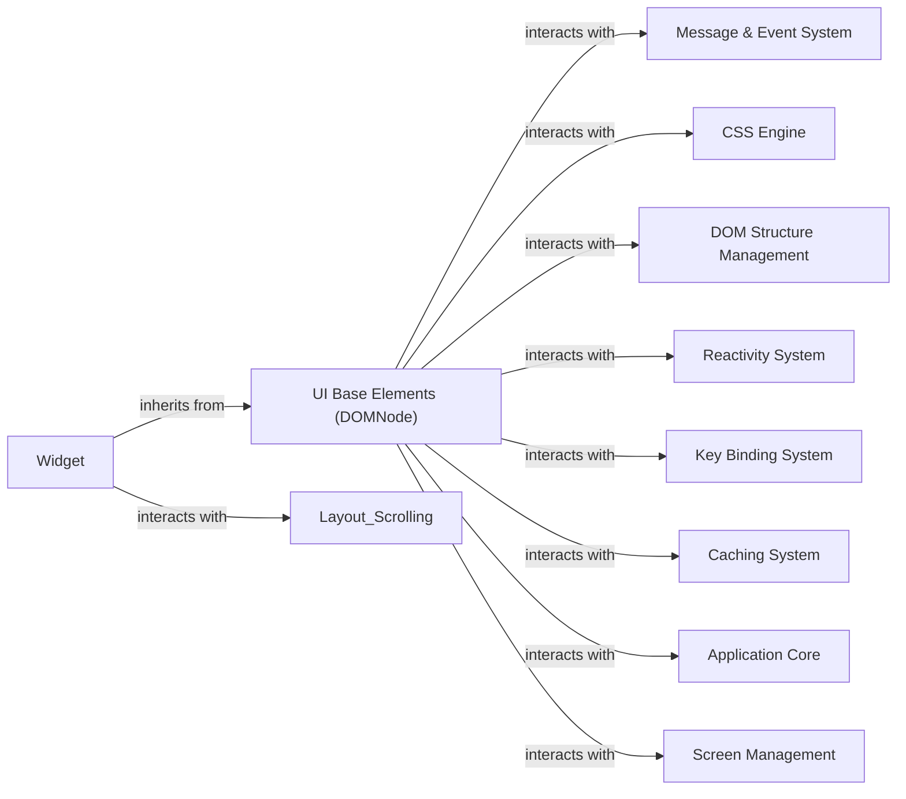

## Component Details

This component overview details the foundational structure of Textual's UI, centered around the `DOMNode` and `Widget` classes. The `DOMNode` serves as the base for all elements in the Document Object Model, managing their hierarchical position, basic properties, and interactions with core systems like styling, reactivity, and event handling. The `Widget` component extends `DOMNode` to provide interactive and visual UI elements, incorporating rendering, layout, and advanced event processing. The overall flow involves `DOMNode` and `Widget` instances being created, organized into a DOM tree, styled by the CSS Engine, updated via the Reactivity System, and responding to user input through the Message & Event System and Key Binding System. The Caching System optimizes performance, while the Application Core and Screen Management components provide the overarching application context and screen display capabilities.

### UI Base Elements (DOMNode)
The foundational class for all elements within the Textual Document Object Model. It manages basic properties like ID, name, CSS classes, and provides core functionalities for hierarchical structure (children, parent), style management, reactive data binding, and DOM querying.

**Related Classes/Methods**:

- <a href="https://github.com/Textualize/textual/blob/master/src/textual/dom.py#L136-L1844" target="_blank" rel="noopener noreferrer">`textual.dom.DOMNode` (136:1844)</a>
- <a href="https://github.com/Textualize/textual/blob/master/src/textual/dom.py#L91-L104" target="_blank" rel="noopener noreferrer">`textual.dom.check_identifiers` (91:104)</a>
- <a href="https://github.com/Textualize/textual/blob/master/src/textual/dom.py#L87-L88" target="_blank" rel="noopener noreferrer">`textual.dom.BadIdentifier` (87:88)</a>
- <a href="https://github.com/Textualize/textual/blob/master/src/textual/dom.py#L107-L108" target="_blank" rel="noopener noreferrer">`textual.dom.DOMError` (107:108)</a>
- <a href="https://github.com/Textualize/textual/blob/master/src/textual/dom.py#L111-L112" target="_blank" rel="noopener noreferrer">`textual.dom.NoScreen` (111:112)</a>
- <a href="https://github.com/Textualize/textual/blob/master/src/textual/dom.py#L115-L132" target="_blank" rel="noopener noreferrer">`textual.dom._ClassesDescriptor` (115:132)</a>

### Widget
A specialized DOMNode that represents a visible, interactive UI element in Textual. It extends DOMNode with capabilities for rendering, layout, event handling (mouse, keyboard), scrolling, and managing its own lifecycle (mount, unmount, compose, recompose). Widgets are the building blocks of Textual applications.

**Related Classes/Methods**:

- <a href="https://github.com/Textualize/textual/blob/master/src/textual/widget.py#L275-L4687" target="_blank" rel="noopener noreferrer">`textual.widget.Widget` (275:4687)</a>

### Message & Event System
Manages the message queue, dispatches events to DOMNodes/Widgets, and handles message lifecycle, including scheduling and prevention.

**Related Classes/Methods**:

- <a href="https://github.com/Textualize/textual/blob/master/src/textual/message_pump.py#L117-L876" target="_blank" rel="noopener noreferrer">`textual.message_pump.MessagePump` (117:876)</a>
- `textual.events` (full file reference)
- `textual.messages` (full file reference)

### CSS Engine
Responsible for parsing, applying, and querying CSS styles, including managing inline styles, default styles, and component-specific styles.

**Related Classes/Methods**:

- <a href="https://github.com/Textualize/textual/blob/master/src/textual/css/styles.py#L858-L1298" target="_blank" rel="noopener noreferrer">`textual.css.styles.Styles` (858:1298)</a>
- <a href="https://github.com/Textualize/textual/blob/master/src/textual/css/styles.py#L1302-L1485" target="_blank" rel="noopener noreferrer">`textual.css.styles.RenderStyles` (1302:1485)</a>
- <a href="https://github.com/Textualize/textual/blob/master/src/textual/css/query.py#L59-L508" target="_blank" rel="noopener noreferrer">`textual.css.query.DOMQuery` (59:508)</a>
- <a href="https://github.com/Textualize/textual/blob/master/src/textual/css/parse.py#L56-L105" target="_blank" rel="noopener noreferrer">`textual.css.parse.parse_selectors` (56:105)</a>
- <a href="https://github.com/Textualize/textual/blob/master/src/textual/css/match.py#L11-L24" target="_blank" rel="noopener noreferrer">`textual.css.match.match` (11:24)</a>
- <a href="https://github.com/Textualize/textual/blob/master/src/textual/css/errors.py#L9-L14" target="_blank" rel="noopener noreferrer">`textual.css.errors.DeclarationError` (9:14)</a>
- <a href="https://github.com/Textualize/textual/blob/master/src/textual/css/errors.py#L25-L46" target="_blank" rel="noopener noreferrer">`textual.css.errors.StyleValueError` (25:46)</a>

### DOM Structure Management
Handles the creation, manipulation, and traversal of the DOM tree, including managing child nodes and their order.

**Related Classes/Methods**:

- <a href="https://github.com/Textualize/textual/blob/master/src/textual/_node_list.py#L26-L206" target="_blank" rel="noopener noreferrer">`textual._node_list.NodeList` (26:206)</a>
- <a href="https://github.com/Textualize/textual/blob/master/src/textual/walk.py#L38-L83" target="_blank" rel="noopener noreferrer">`textual.walk.walk_depth_first` (38:83)</a>
- <a href="https://github.com/Textualize/textual/blob/master/src/textual/walk.py#L104-L139" target="_blank" rel="noopener noreferrer">`textual.walk.walk_breadth_first` (104:139)</a>

### Reactivity System
Provides reactive programming capabilities, allowing attributes to be observed for changes and triggering automatic updates or callbacks.

**Related Classes/Methods**:

- <a href="https://github.com/Textualize/textual/blob/master/src/textual/reactive.py#L102-L405" target="_blank" rel="noopener noreferrer">`textual.reactive.Reactive` (102:405)</a>
- <a href="https://github.com/Textualize/textual/blob/master/src/textual/reactive.py#L51-L52" target="_blank" rel="noopener noreferrer">`textual.reactive.ReactiveError` (51:52)</a>
- <a href="https://github.com/Textualize/textual/blob/master/src/textual/reactive.py#L44-L48" target="_blank" rel="noopener noreferrer">`textual.reactive._Mutated` (44:48)</a>
- <a href="https://github.com/Textualize/textual/blob/master/src/textual/reactive.py#L476-L503" target="_blank" rel="noopener noreferrer">`textual.reactive._watch` (476:503)</a>

### Key Binding System
Manages keyboard shortcuts and their associated actions, including merging bindings from different sources and dispatching key events.

**Related Classes/Methods**:

- <a href="https://github.com/Textualize/textual/blob/master/src/textual/binding.py#L171-L379" target="_blank" rel="noopener noreferrer">`textual.binding.BindingsMap` (171:379)</a>
- <a href="https://github.com/Textualize/textual/blob/master/src/textual/binding.py#L55-L154" target="_blank" rel="noopener noreferrer">`textual.binding.Binding` (55:154)</a>

### Caching System
Improves performance by storing and retrieving frequently accessed data, such as query results, layout calculations, and rendered content.

**Related Classes/Methods**:

- <a href="https://github.com/Textualize/textual/blob/master/src/textual/cache.py#L20-L207" target="_blank" rel="noopener noreferrer">`textual.cache.LRUCache` (20:207)</a>

### Application Core
Represents the central application logic, managing the overall lifecycle, global state, and interactions with the operating system.

**Related Classes/Methods**:

- <a href="https://github.com/Textualize/textual/blob/master/src/textual/app.py#L294-L4739" target="_blank" rel="noopener noreferrer">`textual.app.App` (294:4739)</a>

### Screen Management
Manages the display of different screens within the application, including focus management and widget lookup.

**Related Classes/Methods**:

- <a href="https://github.com/Textualize/textual/blob/master/src/textual/screen.py#L127-L1838" target="_blank" rel="noopener noreferrer">`textual.screen.Screen` (127:1838)</a>

### [FAQ](https://github.com/CodeBoarding/GeneratedOnBoardings/tree/main?tab=readme-ov-file#faq)