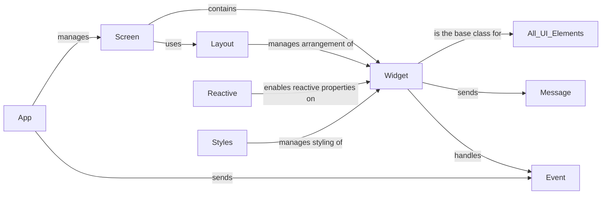

## Component Details

The Widget System in Textual provides the foundation for building interactive user interfaces. The core component is the `Widget` class, which serves as the base for all UI elements. Widgets manage their lifecycle, rendering, event handling, and layout. The `Screen` class acts as the root container for widgets, while the `App` class manages the overall application lifecycle. Widgets can be styled using the `Styles` component and react to changes using the `Reactive` component. Messages and Events are used for communication between widgets and the application. The `Layout` component is responsible for arranging widgets within a container.

### Widget
The base class for all UI elements in Textual. It manages the widget's lifecycle, rendering, event handling, and layout. It provides methods for mounting, scrolling, styling, and composing child widgets.
- **Related Classes/Methods**: `textual.src.textual.widget.Widget`

### Screen
Represents the application's screen and manages the layout and rendering of widgets. It acts as the root container for all widgets in the application.
- **Related Classes/Methods**: `textual.src.textual.app.Screen`

### App
The main application class that initializes and runs the Textual application. It manages the screen, event loop, and overall application lifecycle.
- **Related Classes/Methods**: `textual.src.textual.app.App`

### Layout
Manages the arrangement and sizing of widgets within a container. It uses a flexible layout algorithm to adapt to different screen sizes and widget requirements.
- **Related Classes/Methods**: `textual.src.textual.layout.Layout`

### Reactive
A descriptor that enables reactive properties on widgets. When a reactive property changes, it automatically triggers a re-render of the widget.
- **Related Classes/Methods**: `textual.src.textual.reactive.Reactive`

### Message
Base class for all messages that are sent between widgets and the application. Messages are used to communicate events and data changes.
- **Related Classes/Methods**: `textual.src.textual.message.Message`

### Event
Base class for all events that are triggered by user interactions or system events. Events are handled by widgets to respond to user input and other changes.
- **Related Classes/Methods**: `textual.src.textual.events.Event`

### Styles
Manages the styling of widgets, including colors, fonts, and layout properties. Styles can be applied to individual widgets or inherited from parent widgets.
- **Related Classes/Methods**: `textual.src.textual.css.styles.Styles`
