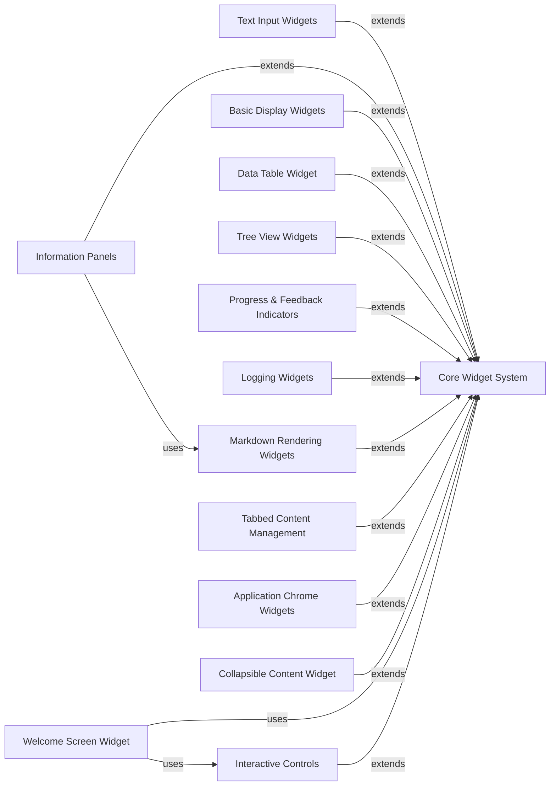

## Component Details

The Widgets subsystem in Textual provides a comprehensive set of UI components for building interactive terminal user interfaces. It encompasses foundational widget classes, various input and display elements, data presentation widgets, and specialized components for application chrome and feedback. The core purpose is to offer a rich toolkit for developers to construct complex and responsive TUI applications.

### Core Widget System
Provides the foundational classes for all UI elements, including the base widget, scrollable containers, and static content display.

**Related Classes/Methods**:

- <a href="https://github.com/Textualize/textual/blob/master/src/textual/widget.py#L275-L4687" target="_blank" rel="noopener noreferrer">`textual.widget.Widget` (275:4687)</a>
- <a href="https://github.com/Textualize/textual/blob/master/src/textual/containers.py#L32-L118" target="_blank" rel="noopener noreferrer">`textual.containers.ScrollableContainer` (32:118)</a>
- <a href="https://github.com/Textualize/textual/blob/master/src/textual/widgets/_static.py#L31-L107" target="_blank" rel="noopener noreferrer">`textual.widgets._static.Static` (31:107)</a>

### Text Input Widgets
Handles various forms of user text input, from single-line fields to multi-line editors and masked inputs.

**Related Classes/Methods**:

- <a href="https://github.com/Textualize/textual/blob/master/src/textual/widgets/_input.py#L70-L1092" target="_blank" rel="noopener noreferrer">`textual.widgets._input.Input` (70:1092)</a>
- <a href="https://github.com/Textualize/textual/blob/master/src/textual/widgets/_text_area.py#L107-L2381" target="_blank" rel="noopener noreferrer">`textual.widgets._text_area.TextArea` (107:2381)</a>
- <a href="https://github.com/Textualize/textual/blob/master/src/textual/widgets/_masked_input.py#L443-L704" target="_blank" rel="noopener noreferrer">`textual.widgets._masked_input.MaskedInput` (443:704)</a>

### Interactive Controls
Provides standard interactive UI elements such as buttons, toggles, switches, and various list-based selection mechanisms.

**Related Classes/Methods**:

- <a href="https://github.com/Textualize/textual/blob/master/src/textual/widgets/_button.py#L39-L405" target="_blank" rel="noopener noreferrer">`textual.widgets._button.Button` (39:405)</a>
- <a href="https://github.com/Textualize/textual/blob/master/src/textual/widgets/_toggle_button.py#L25-L261" target="_blank" rel="noopener noreferrer">`textual.widgets._toggle_button.ToggleButton` (25:261)</a>
- <a href="https://github.com/Textualize/textual/blob/master/src/textual/widgets/_switch.py#L20-L204" target="_blank" rel="noopener noreferrer">`textual.widgets._switch.Switch` (20:204)</a>
- <a href="https://github.com/Textualize/textual/blob/master/src/textual/widgets/_option_list.py#L108-L999" target="_blank" rel="noopener noreferrer">`textual.widgets._option_list.OptionList` (108:999)</a>
- <a href="https://github.com/Textualize/textual/blob/master/src/textual/widgets/_select.py#L270-L707" target="_blank" rel="noopener noreferrer">`textual.widgets._select.Select` (270:707)</a>
- <a href="https://github.com/Textualize/textual/blob/master/src/textual/widgets/_select.py#L44-L173" target="_blank" rel="noopener noreferrer">`textual.widgets._select.SelectOverlay` (44:173)</a>
- <a href="https://github.com/Textualize/textual/blob/master/src/textual/widgets/_select.py#L176-L261" target="_blank" rel="noopener noreferrer">`textual.widgets._select.SelectCurrent` (176:261)</a>
- <a href="https://github.com/Textualize/textual/blob/master/src/textual/widgets/_radio_set.py#L19-L307" target="_blank" rel="noopener noreferrer">`textual.widgets._radio_set.RadioSet` (19:307)</a>
- <a href="https://github.com/Textualize/textual/blob/master/src/textual/widgets/_list_item.py#L11-L39" target="_blank" rel="noopener noreferrer">`textual.widgets._list_item.ListItem` (11:39)</a>
- <a href="https://github.com/Textualize/textual/blob/master/src/textual/widgets/_list_view.py#L19-L394" target="_blank" rel="noopener noreferrer">`textual.widgets._list_view.ListView` (19:394)</a>
- <a href="https://github.com/Textualize/textual/blob/master/src/textual/widgets/_selection_list.py#L76-L715" target="_blank" rel="noopener noreferrer">`textual.widgets._selection_list.SelectionList` (76:715)</a>
- <a href="https://github.com/Textualize/textual/blob/master/src/textual/widgets/_selection_list.py#L37-L73" target="_blank" rel="noopener noreferrer">`textual.widgets._selection_list.Selection` (37:73)</a>

### Basic Display Widgets
Simple widgets for displaying text, stylized digits, and basic graphical elements like sparklines.

**Related Classes/Methods**:

- <a href="https://github.com/Textualize/textual/blob/master/src/textual/widgets/_label.py#L13-L74" target="_blank" rel="noopener noreferrer">`textual.widgets._label.Label` (13:74)</a>
- <a href="https://github.com/Textualize/textual/blob/master/src/textual/widgets/_digits.py#L16-L110" target="_blank" rel="noopener noreferrer">`textual.widgets._digits.Digits` (16:110)</a>
- <a href="https://github.com/Textualize/textual/blob/master/src/textual/widgets/_pretty.py#L12-L63" target="_blank" rel="noopener noreferrer">`textual.widgets._pretty.Pretty` (12:63)</a>
- <a href="https://github.com/Textualize/textual/blob/master/src/textual/widgets/_sparkline.py#L17-L108" target="_blank" rel="noopener noreferrer">`textual.widgets._sparkline.Sparkline` (17:108)</a>
- <a href="https://github.com/Textualize/textual/blob/master/src/textual/widgets/_rule.py#L110-L268" target="_blank" rel="noopener noreferrer">`textual.widgets._rule.Rule` (110:268)</a>
- <a href="https://github.com/Textualize/textual/blob/master/src/textual/widgets/_placeholder.py#L55-L180" target="_blank" rel="noopener noreferrer">`textual.widgets._placeholder.Placeholder` (55:180)</a>
- <a href="https://github.com/Textualize/textual/blob/master/src/textual/widgets/_link.py#L8-L70" target="_blank" rel="noopener noreferrer">`textual.widgets._link.Link` (8:70)</a>

### Data Table Widget
A specialized widget for displaying and managing data in a tabular format with rows and columns.

**Related Classes/Methods**:

- <a href="https://github.com/Textualize/textual/blob/master/src/textual/widgets/_data_table.py#L259-L2785" target="_blank" rel="noopener noreferrer">`textual.widgets._data_table.DataTable` (259:2785)</a>

### Tree View Widgets
Components for displaying and interacting with hierarchical data structures, including a specialized directory tree.

**Related Classes/Methods**:

- <a href="https://github.com/Textualize/textual/blob/master/src/textual/widgets/_tree.py#L516-L1598" target="_blank" rel="noopener noreferrer">`textual.widgets._tree.Tree` (516:1598)</a>
- <a href="https://github.com/Textualize/textual/blob/master/src/textual/widgets/_tree.py#L91-L513" target="_blank" rel="noopener noreferrer">`textual.widgets._tree.TreeNode` (91:513)</a>
- <a href="https://github.com/Textualize/textual/blob/master/src/textual/widgets/_directory_tree.py#L32-L580" target="_blank" rel="noopener noreferrer">`textual.widgets._directory_tree.DirectoryTree` (32:580)</a>

### Progress & Feedback Indicators
Provides visual feedback to the user, such as progress bars, loading animations, and temporary toast notifications.

**Related Classes/Methods**:

- <a href="https://github.com/Textualize/textual/blob/master/src/textual/widgets/_progress_bar.py#L191-L376" target="_blank" rel="noopener noreferrer">`textual.widgets._progress_bar.ProgressBar` (191:376)</a>
- <a href="https://github.com/Textualize/textual/blob/master/src/textual/widgets/_progress_bar.py#L24-L140" target="_blank" rel="noopener noreferrer">`textual.widgets._progress_bar.Bar` (24:140)</a>
- <a href="https://github.com/Textualize/textual/blob/master/src/textual/widgets/_loading_indicator.py#L18-L93" target="_blank" rel="noopener noreferrer">`textual.widgets._loading_indicator.LoadingIndicator` (18:93)</a>
- <a href="https://github.com/Textualize/textual/blob/master/src/textual/widgets/_toast.py#L33-L139" target="_blank" rel="noopener noreferrer">`textual.widgets._toast.Toast` (33:139)</a>
- <a href="https://github.com/Textualize/textual/blob/master/src/textual/widgets/_toast.py#L142-L200" target="_blank" rel="noopener noreferrer">`textual.widgets._toast.ToastRack` (142:200)</a>

### Logging Widgets
Widgets designed for displaying log messages, including basic and rich text logging.

**Related Classes/Methods**:

- <a href="https://github.com/Textualize/textual/blob/master/src/textual/widgets/_log.py#L26-L362" target="_blank" rel="noopener noreferrer">`textual.widgets._log.Log` (26:362)</a>
- <a href="https://github.com/Textualize/textual/blob/master/src/textual/widgets/_rich_log.py#L47-L321" target="_blank" rel="noopener noreferrer">`textual.widgets._rich_log.RichLog` (47:321)</a>

### Markdown Rendering Widgets
Components responsible for parsing and rendering Markdown content within the application.

**Related Classes/Methods**:

- <a href="https://github.com/Textualize/textual/blob/master/src/textual/widgets/_markdown.py#L676-L1049" target="_blank" rel="noopener noreferrer">`textual.widgets._markdown.Markdown` (676:1049)</a>
- <a href="https://github.com/Textualize/textual/blob/master/src/textual/widgets/_markdown.py#L1138-L1261" target="_blank" rel="noopener noreferrer">`textual.widgets._markdown.MarkdownViewer` (1138:1261)</a>
- <a href="https://github.com/Textualize/textual/blob/master/src/textual/widgets/_markdown.py#L107-L232" target="_blank" rel="noopener noreferrer">`textual.widgets._markdown.MarkdownBlock` (107:232)</a>
- <a href="https://github.com/Textualize/textual/blob/master/src/textual/widgets/_markdown.py#L383-L409" target="_blank" rel="noopener noreferrer">`textual.widgets._markdown.MarkdownBulletList` (383:409)</a>
- <a href="https://github.com/Textualize/textual/blob/master/src/textual/widgets/_markdown.py#L412-L451" target="_blank" rel="noopener noreferrer">`textual.widgets._markdown.MarkdownOrderedList` (412:451)</a>
- <a href="https://github.com/Textualize/textual/blob/master/src/textual/widgets/_markdown.py#L454-L498" target="_blank" rel="noopener noreferrer">`textual.widgets._markdown.MarkdownTableContent` (454:498)</a>
- <a href="https://github.com/Textualize/textual/blob/master/src/textual/widgets/_markdown.py#L501-L529" target="_blank" rel="noopener noreferrer">`textual.widgets._markdown.MarkdownTable` (501:529)</a>
- <a href="https://github.com/Textualize/textual/blob/master/src/textual/widgets/_markdown.py#L576-L594" target="_blank" rel="noopener noreferrer">`textual.widgets._markdown.MarkdownListItem` (576:594)</a>
- <a href="https://github.com/Textualize/textual/blob/master/src/textual/widgets/_markdown.py#L605-L661" target="_blank" rel="noopener noreferrer">`textual.widgets._markdown.MarkdownFence` (605:661)</a>
- <a href="https://github.com/Textualize/textual/blob/master/src/textual/widgets/_markdown.py#L1052-L1135" target="_blank" rel="noopener noreferrer">`textual.widgets._markdown.MarkdownTableOfContents` (1052:1135)</a>
- <a href="https://github.com/Textualize/textual/blob/master/src/textual/widgets/_markdown.py#L36-L104" target="_blank" rel="noopener noreferrer">`textual.widgets._markdown.Navigator` (36:104)</a>

### Tabbed Content Management
Manages the display and interaction of content organized into tabs.

**Related Classes/Methods**:

- <a href="https://github.com/Textualize/textual/blob/master/src/textual/widgets/_tabbed_content.py#L238-L716" target="_blank" rel="noopener noreferrer">`textual.widgets._tabbed_content.TabbedContent` (238:716)</a>
- <a href="https://github.com/Textualize/textual/blob/master/src/textual/widgets/_tabbed_content.py#L29-L73" target="_blank" rel="noopener noreferrer">`textual.widgets._tabbed_content.ContentTab` (29:73)</a>
- <a href="https://github.com/Textualize/textual/blob/master/src/textual/widgets/_tabbed_content.py#L76-L162" target="_blank" rel="noopener noreferrer">`textual.widgets._tabbed_content.ContentTabs` (76:162)</a>
- <a href="https://github.com/Textualize/textual/blob/master/src/textual/widgets/_tabbed_content.py#L165-L235" target="_blank" rel="noopener noreferrer">`textual.widgets._tabbed_content.TabPane` (165:235)</a>
- <a href="https://github.com/Textualize/textual/blob/master/src/textual/widgets/_tabs.py#L199-L866" target="_blank" rel="noopener noreferrer">`textual.widgets._tabs.Tabs` (199:866)</a>
- <a href="https://github.com/Textualize/textual/blob/master/src/textual/widgets/_tabs.py#L92-L196" target="_blank" rel="noopener noreferrer">`textual.widgets._tabs.Tab` (92:196)</a>
- <a href="https://github.com/Textualize/textual/blob/master/src/textual/widgets/_tabs.py#L27-L89" target="_blank" rel="noopener noreferrer">`textual.widgets._tabs.Underline` (27:89)</a>

### Application Chrome Widgets
Handles the persistent top (header) and bottom (footer) bars of the application, often displaying titles, clocks, and key bindings.

**Related Classes/Methods**:

- <a href="https://github.com/Textualize/textual/blob/master/src/textual/widgets/_header.py#L130-L237" target="_blank" rel="noopener noreferrer">`textual.widgets._header.Header` (130:237)</a>
- <a href="https://github.com/Textualize/textual/blob/master/src/textual/widgets/_header.py#L16-L52" target="_blank" rel="noopener noreferrer">`textual.widgets._header.HeaderIcon` (16:52)</a>
- <a href="https://github.com/Textualize/textual/blob/master/src/textual/widgets/_header.py#L75-L98" target="_blank" rel="noopener noreferrer">`textual.widgets._header.HeaderClock` (75:98)</a>
- <a href="https://github.com/Textualize/textual/blob/master/src/textual/widgets/_footer.py#L124-L277" target="_blank" rel="noopener noreferrer">`textual.widgets._footer.Footer` (124:277)</a>
- <a href="https://github.com/Textualize/textual/blob/master/src/textual/widgets/_footer.py#L21-L120" target="_blank" rel="noopener noreferrer">`textual.widgets._footer.FooterKey` (21:120)</a>

### Collapsible Content Widget
Allows sections of content to be expanded or collapsed, providing a way to manage screen real estate.

**Related Classes/Methods**:

- <a href="https://github.com/Textualize/textual/blob/master/src/textual/widgets/_collapsible.py#L96-L242" target="_blank" rel="noopener noreferrer">`textual.widgets._collapsible.Collapsible` (96:242)</a>
- <a href="https://github.com/Textualize/textual/blob/master/src/textual/widgets/_collapsible.py#L17-L93" target="_blank" rel="noopener noreferrer">`textual.widgets._collapsible.CollapsibleTitle` (17:93)</a>

### Information Panels
Provides dedicated panels for displaying application-specific information, such as key bindings or general help.

**Related Classes/Methods**:

- <a href="https://github.com/Textualize/textual/blob/master/src/textual/widgets/_key_panel.py#L117-L175" target="_blank" rel="noopener noreferrer">`textual.widgets._key_panel.KeyPanel` (117:175)</a>
- <a href="https://github.com/Textualize/textual/blob/master/src/textual/widgets/_key_panel.py#L21-L114" target="_blank" rel="noopener noreferrer">`textual.widgets._key_panel.BindingsTable` (21:114)</a>
- <a href="https://github.com/Textualize/textual/blob/master/src/textual/widgets/_help_panel.py#L11-L106" target="_blank" rel="noopener noreferrer">`textual.widgets._help_panel.HelpPanel` (11:106)</a>

### Welcome Screen Widget
A specialized widget for displaying an initial welcome screen to the user.

**Related Classes/Methods**:

- <a href="https://github.com/Textualize/textual/blob/master/src/textual/widgets/_welcome.py#L27-L59" target="_blank" rel="noopener noreferrer">`textual.widgets._welcome.Welcome` (27:59)</a>

### [FAQ](https://github.com/CodeBoarding/GeneratedOnBoardings/tree/main?tab=readme-ov-file#faq)