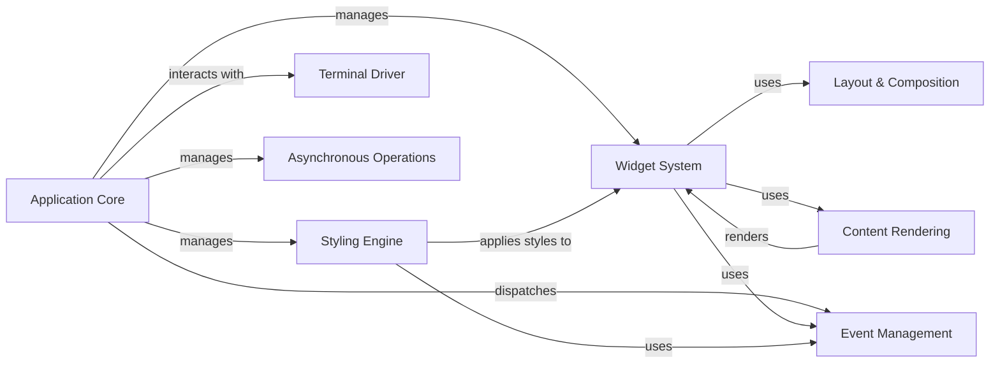

## Component Details

The Textual application framework provides a way to build rich terminal user interfaces. It encompasses core application management, a flexible widget system, layout capabilities, styling via CSS, and an event-driven architecture. The framework abstracts terminal interactions through drivers and supports asynchronous operations for responsiveness.

### Application Core
The central component responsible for managing the application lifecycle, including initialization, screen management, and event handling. It orchestrates the interaction between different components and provides the main entry point for the application.
- **Related Classes/Methods**: `textual.src.textual.app.App`, `textual.src.textual.screen.Screen`, `textual.src.textual.dom.DOMNode`

### Widget System
Provides a base class for creating interactive UI elements. Widgets can handle events, render content, and manage their own layout within a screen. It serves as the building block for creating complex user interfaces.
- **Related Classes/Methods**: `textual.src.textual.widget.Widget`

### Layout & Composition
Manages the arrangement of widgets on the screen using different layout strategies. It provides classes for vertical, horizontal, and grid layouts, allowing developers to create flexible and responsive user interfaces. It dictates how widgets are positioned and sized within the application.
- **Related Classes/Methods**: `textual.src.textual.layout.Layout`, `textual.src.textual.layouts.vertical.VerticalLayout`, `textual.src.textual.layouts.horizontal.HorizontalLayout`, `textual.src.textual.layouts.grid.GridLayout`

### Styling Engine
Handles the parsing and application of CSS styles to widgets. It includes classes for managing stylesheets, selectors, and style properties. It defines the visual appearance of the application and its components.
- **Related Classes/Methods**: `textual.src.textual.css.stylesheet.Stylesheet`, `textual.src.textual.css.styles.Styles`, `textual.src.textual.css.parse`, `textual.src.textual.css._styles_builder`

### Event Management
Defines the event system used for user interactions and internal application events. It includes classes for different event types such as key presses, mouse clicks, and timer events. It enables widgets to respond to user input and application state changes.
- **Related Classes/Methods**: `textual.src.textual.events.Event`, `textual.src.textual.app.App`, `textual.src.textual.widget.Widget`

### Terminal Driver
An abstraction layer for interacting with the terminal or other output devices. It handles input and output, and manages the terminal's state. It provides a consistent interface for rendering the application across different terminal environments.
- **Related Classes/Methods**: `textual.src.textual.driver.Driver`, `textual.src.textual.drivers.linux_driver.LinuxDriver`, `textual.src.textual.drivers.windows_driver.WindowsDriver`, `textual.src.textual.drivers.web_driver.WebDriver`

### Content Rendering
Responsible for rendering text and other visual elements on the screen. It includes classes for managing content, styles, and formatting. It translates the application's data into a visual representation on the terminal.
- **Related Classes/Methods**: `textual.src.textual.content.Content`, `textual.src.textual.strip.Strip`, `textual.src.textual.visual.Visual`

### Asynchronous Operations
Handles background tasks and asynchronous operations. It includes classes for managing workers and executing tasks in separate threads or processes. It allows the application to perform long-running operations without blocking the main thread.
- **Related Classes/Methods**: `textual.src.textual.worker.Worker`, `textual.src.textual.worker_manager.WorkerManager`