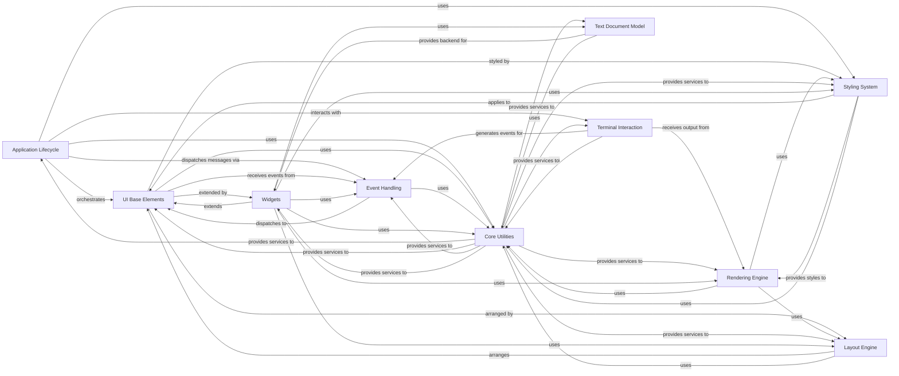

## Component Details

The Textual framework provides a robust architecture for building rich terminal user interfaces. Its core functionality revolves around an Application Lifecycle that orchestrates UI components, handles events from terminal interactions, and renders visual elements using a sophisticated styling and layout system. Reactive data principles ensure UI updates are efficient, while a comprehensive set of widgets and utilities empower developers to create complex and interactive applications.

### Application Lifecycle
Manages the overall application startup, shutdown, and core event processing loop, including background task management and message dispatching.

**Related Classes/Methods**:

- <a href="https://github.com/Textualize/textual/blob/master/src/textual/app.py#L294-L4739" target="_blank" rel="noopener noreferrer">`textual.app.App` (294:4739)</a>

### UI Base Elements
Provides the foundational structure for all interactive and visual elements in the UI, managing their position in the Document Object Model (DOM) tree and basic widget functionality.

**Related Classes/Methods**:

- <a href="https://github.com/Textualize/textual/blob/master/src/textual/widget.py#L275-L4687" target="_blank" rel="noopener noreferrer">`textual.widget.Widget` (275:4687)</a>
- <a href="https://github.com/Textualize/textual/blob/master/src/textual/dom.py#L136-L1844" target="_blank" rel="noopener noreferrer">`textual.dom.DOMNode` (136:1844)</a>

### Terminal Interaction
Manages low-level communication with the terminal, including parsing raw input sequences (keyboard, mouse) and sending control codes for output rendering across different operating systems and web environments.

**Related Classes/Methods**:

- <a href="https://github.com/Textualize/textual/blob/master/src/textual/driver.py#L17-L301" target="_blank" rel="noopener noreferrer">`textual.driver.Driver` (17:301)</a>
- <a href="https://github.com/Textualize/textual/blob/master/src/textual/drivers/windows_driver.py#L16-L137" target="_blank" rel="noopener noreferrer">`textual.drivers.windows_driver.WindowsDriver` (16:137)</a>
- <a href="https://github.com/Textualize/textual/blob/master/src/textual/drivers/linux_driver.py#L31-L469" target="_blank" rel="noopener noreferrer">`textual.drivers.linux_driver.LinuxDriver` (31:469)</a>
- <a href="https://github.com/Textualize/textual/blob/master/src/textual/drivers/web_driver.py#L41-L354" target="_blank" rel="noopener noreferrer">`textual.drivers.web_driver.WebDriver` (41:354)</a>

### Event Handling
Defines and processes various user and system events (e.g., keyboard presses, mouse clicks, window resizing), dispatching them to relevant components for action.

**Related Classes/Methods**:

- <a href="https://github.com/Textualize/textual/blob/master/src/textual/message.py#L23-L158" target="_blank" rel="noopener noreferrer">`textual.message.Message` (23:158)</a>
- <a href="https://github.com/Textualize/textual/blob/master/src/textual/events.py#L261-L309" target="_blank" rel="noopener noreferrer">`textual.events.Key` (261:309)</a>
- <a href="https://github.com/Textualize/textual/blob/master/src/textual/events.py#L324-L561" target="_blank" rel="noopener noreferrer">`textual.events.MouseEvent` (324:561)</a>

### Styling System
Responsible for parsing, applying, and managing CSS rules, computed styles, and color definitions for UI elements, ensuring consistent visual presentation.

**Related Classes/Methods**:

- <a href="https://github.com/Textualize/textual/blob/master/src/textual/css/stylesheet.py#L142-L731" target="_blank" rel="noopener noreferrer">`textual.css.stylesheet.Stylesheet` (142:731)</a>
- <a href="https://github.com/Textualize/textual/blob/master/src/textual/css/styles.py#L858-L1298" target="_blank" rel="noopener noreferrer">`textual.css.styles.Styles` (858:1298)</a>
- <a href="https://github.com/Textualize/textual/blob/master/src/textual/color.py#L137-L661" target="_blank" rel="noopener noreferrer">`textual.color.Color` (137:661)</a>

### Rendering Engine
Orchestrates the visual rendering pipeline, converting UI elements and content into displayable character strips and composing them for final output to the terminal.

**Related Classes/Methods**:

- <a href="https://github.com/Textualize/textual/blob/master/src/textual/_compositor.py#L281-L1240" target="_blank" rel="noopener noreferrer">`textual._compositor.Compositor` (281:1240)</a>
- <a href="https://github.com/Textualize/textual/blob/master/src/textual/visual.py#L106-L233" target="_blank" rel="noopener noreferrer">`textual.visual.Visual` (106:233)</a>
- <a href="https://github.com/Textualize/textual/blob/master/src/textual/strip.py#L67-L735" target="_blank" rel="noopener noreferrer">`textual.strip.Strip` (67:735)</a>

### Layout Engine
Determines the positioning and sizing of UI elements on the screen based on various layout algorithms (e.g., horizontal, vertical, grid) and CSS properties.

**Related Classes/Methods**:

- <a href="https://github.com/Textualize/textual/blob/master/src/textual/layout.py#L203-L309" target="_blank" rel="noopener noreferrer">`textual.layout.Layout` (203:309)</a>
- <a href="https://github.com/Textualize/textual/blob/master/src/textual/layouts/horizontal.py#L15-L120" target="_blank" rel="noopener noreferrer">`textual.layouts.horizontal.HorizontalLayout` (15:120)</a>
- <a href="https://github.com/Textualize/textual/blob/master/src/textual/layouts/vertical.py#L15-L124" target="_blank" rel="noopener noreferrer">`textual.layouts.vertical.VerticalLayout` (15:124)</a>
- <a href="https://github.com/Textualize/textual/blob/master/src/textual/layouts/grid.py#L15-L322" target="_blank" rel="noopener noreferrer">`textual.layouts.grid.GridLayout` (15:322)</a>

### Core Utilities
Provides foundational helper classes and functions for common tasks such as geometric calculations, caching, timing, animation, and various internal mechanisms that support the entire framework.

**Related Classes/Methods**:

- <a href="https://github.com/Textualize/textual/blob/master/src/textual/geometry.py#L317-L1116" target="_blank" rel="noopener noreferrer">`textual.geometry.Region` (317:1116)</a>
- <a href="https://github.com/Textualize/textual/blob/master/src/textual/cache.py#L20-L207" target="_blank" rel="noopener noreferrer">`textual.cache.LRUCache` (20:207)</a>
- <a href="https://github.com/Textualize/textual/blob/master/src/textual/timer.py#L32-L202" target="_blank" rel="noopener noreferrer">`textual.timer.Timer` (32:202)</a>
- <a href="https://github.com/Textualize/textual/blob/master/src/textual/rlock.py#L6-L47" target="_blank" rel="noopener noreferrer">`textual.rlock.RLock` (6:47)</a>

### Text Document Model
The core data structures and logic for managing editable text content, including history (undo/redo), syntax awareness, and navigation within the document.

**Related Classes/Methods**:

- <a href="https://github.com/Textualize/textual/blob/master/src/textual/document/_document.py#L204-L431" target="_blank" rel="noopener noreferrer">`textual.document._document.Document` (204:431)</a>
- <a href="https://github.com/Textualize/textual/blob/master/src/textual/document/_history.py#L18-L183" target="_blank" rel="noopener noreferrer">`textual.document._history.EditHistory` (18:183)</a>

### Widgets
A collection of specialized UI components for displaying and interacting with various types of content, including input fields, text areas, data tables, trees, and general-purpose containers.

**Related Classes/Methods**:

- <a href="https://github.com/Textualize/textual/blob/master/src/textual/widgets/_input.py#L70-L1092" target="_blank" rel="noopener noreferrer">`textual.widgets._input.Input` (70:1092)</a>
- <a href="https://github.com/Textualize/textual/blob/master/src/textual/widgets/_text_area.py#L107-L2381" target="_blank" rel="noopener noreferrer">`textual.widgets._text_area.TextArea` (107:2381)</a>
- <a href="https://github.com/Textualize/textual/blob/master/src/textual/widgets/_data_table.py#L259-L2785" target="_blank" rel="noopener noreferrer">`textual.widgets._data_table.DataTable` (259:2785)</a>
- <a href="https://github.com/Textualize/textual/blob/master/src/textual/widgets/_tree.py#L516-L1598" target="_blank" rel="noopener noreferrer">`textual.widgets._tree.Tree` (516:1598)</a>
- <a href="https://github.com/Textualize/textual/blob/master/src/textual/containers.py#L19-L29" target="_blank" rel="noopener noreferrer">`textual.containers.Container` (19:29)</a>

### [FAQ](https://github.com/CodeBoarding/GeneratedOnBoardings/tree/main?tab=readme-ov-file#faq)