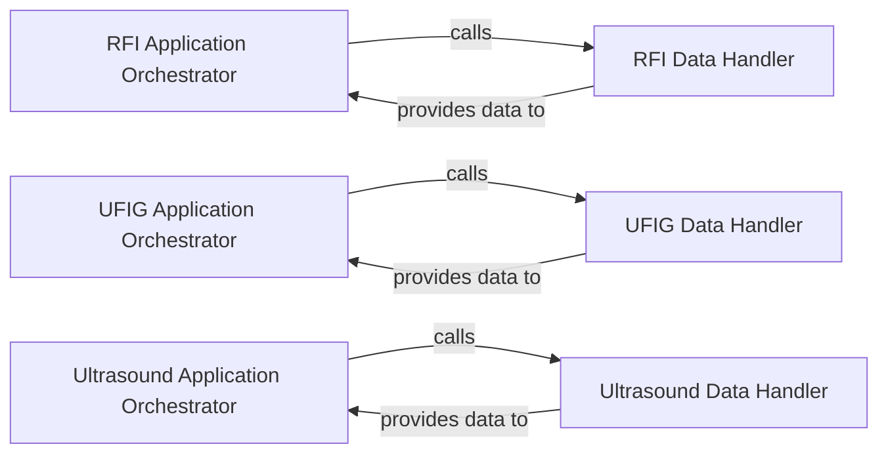

## Details

The Application Orchestration subsystem encompasses the primary entry points and workflow coordinators for different use cases within the tf_unet project. Its boundaries are defined by the rfi_launcher, ufig_launcher, and ultrasound_launcher scripts, which serve as the top-level orchestrators for their respective applications.

### RFI Application Orchestrator
This component is the central coordinator for the Radio Frequency Interference (RFI) detection workflow. It initiates data acquisition, prepares data for the model, triggers model execution (training or inference), and manages the handling of RFI-specific results. It acts as the primary entry point for the RFI use case.

**Related Classes/Methods**:

- <a href="https://github.com/jakeret/tf_unet/blob/master/scripts/rfi_launcher.py#L35-L66" target="_blank" rel="noopener noreferrer">`scripts.rfi_launcher.launch`:35-66</a>

### UFIG Application Orchestrator
This component orchestrates the entire UFIG workflow (likely related to image generation or analysis). Its responsibilities include initiating data acquisition, preparing data for the model, triggering model execution, and handling the results specific to the UFIG application. It serves as the primary entry point for the UFIG use case.

**Related Classes/Methods**:

- <a href="https://github.com/jakeret/tf_unet/blob/master/scripts/ufig_launcher.py#L36-L70" target="_blank" rel="noopener noreferrer">`scripts.ufig_launcher.launch`:36-70</a>

### Ultrasound Application Orchestrator
This component is responsible for orchestrating the complete Ultrasound image processing workflow. It manages the initiation of data acquisition, data preparation for the model, triggering model execution, and handling the results specific to Ultrasound applications. It functions as the primary entry point for the Ultrasound use case.

**Related Classes/Methods**:

- <a href="https://github.com/jakeret/tf_unet/blob/master/scripts/ultrasound_launcher.py#L38-L76" target="_blank" rel="noopener noreferrer">`scripts.ultrasound_launcher.launch`:38-76</a>

### RFI Data Handler
This component specializes in managing data specific to the RFI application. Its core responsibilities include loading RFI datasets and performing necessary preprocessing steps to prepare the data for model consumption.

**Related Classes/Methods**:

- <a href="https://github.com/jakeret/tf_unet/blob/master/scripts/rfi_launcher.py#L69-L108" target="_blank" rel="noopener noreferrer">`scripts.rfi_launcher.DataProvider`:69-108</a>

### UFIG Data Handler
This component is dedicated to handling UFIG-specific data. It is responsible for loading UFIG datasets and executing the required preprocessing routines to make the data suitable for model input.

**Related Classes/Methods**:

- <a href="https://github.com/jakeret/tf_unet/blob/master/scripts/ufig_launcher.py#L73-L125" target="_blank" rel="noopener noreferrer">`scripts.ufig_launcher.DataProvider`:73-125</a>

### Ultrasound Data Handler
This component manages data specifically for the Ultrasound application. Its functions include loading Ultrasound image datasets and performing the necessary preprocessing steps to prepare the data for the deep learning model.

**Related Classes/Methods**:

- <a href="https://github.com/jakeret/tf_unet/blob/master/scripts/ultrasound_launcher.py#L79-L110" target="_blank" rel="noopener noreferrer">`scripts.ultrasound_launcher.DataProvider`:79-110</a>

### [FAQ](https://github.com/CodeBoarding/GeneratedOnBoardings/tree/main?tab=readme-ov-file#faq)