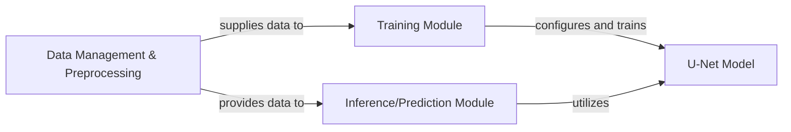

## Details

The `tf_unet` project implements a U-Net architecture for image segmentation, organized into three primary architectural components: Data Management & Preprocessing, Training Module, and Inference/Prediction Module. The Data Management & Preprocessing component handles data acquisition, generation, and preparation. This prepared data is then fed into the Training Module, which encapsulates the core U-Net model and its training logic. Finally, the Inference/Prediction Module leverages the trained U-Net model to perform predictions on new data.

### Data Management & Preprocessing [[Expand]](./Data_Management_Preprocessing.md)
This component is the cornerstone for all data-related operations within the `tf_unet` project. It is responsible for the entire lifecycle of data, from initial loading or generation to final preparation for model consumption. This includes discovering and loading real image data and labels, generating synthetic data when needed, and applying essential preprocessing steps such as resizing, normalization, and post-processing. It also handles the efficient batching of data, ensuring a continuous and optimized data flow to the training and inference modules. This component embodies the "Data Processing Pipeline" pattern, providing a unified interface for diverse data sources.

**Related Classes/Methods**:

- <a href="https://github.com/jakeret/tf_unet/blob/master/tf_unet/image_util.py" target="_blank" rel="noopener noreferrer">`tf_unet/image_util.py`</a>
- <a href="https://github.com/jakeret/tf_unet/blob/master/tf_unet/image_gen.py" target="_blank" rel="noopener noreferrer">`tf_unet/image_gen.py`</a>

### Training Module
This component is responsible for orchestrating the training process of the U-Net model. It initializes the model architecture, defines the cost function (e.g., cross-entropy or dice coefficient), and manages the optimization process. It interacts with the `Data Management & Preprocessing` component to receive training data and uses the defined cost function to compute gradients and update model weights. This module encapsulates the core learning phase of the U-Net.

**Related Classes/Methods**:

- <a href="https://github.com/jakeret/tf_unet/blob/master/tf_unet/unet.py" target="_blank" rel="noopener noreferrer">`tf_unet.unet.Unet:__init__`</a>
- <a href="https://github.com/jakeret/tf_unet/blob/master/tf_unet/unet.py" target="_blank" rel="noopener noreferrer">`tf_unet.unet.Unet:_get_cost`</a>

### Inference/Prediction Module
This component handles the process of making predictions using a trained U-Net model. It is responsible for loading a pre-trained model from a checkpoint and applying it to new, unseen input data to generate segmentation masks or other desired outputs. It receives processed input data from the `Data Management & Preprocessing` component and outputs the model's predictions, effectively performing the forward pass of the U-Net.

**Related Classes/Methods**:

- <a href="https://github.com/jakeret/tf_unet/blob/master/tf_unet/unet.py" target="_blank" rel="noopener noreferrer">`tf_unet.unet.Unet:predict`</a>

### U-Net Model
Represents the core U-Net deep learning model architecture.

**Related Classes/Methods**:

- <a href="https://github.com/jakeret/tf_unet/blob/master/tf_unet/unet.py#L178-L303" target="_blank" rel="noopener noreferrer">`tf_unet.unet.Unet`:178-303</a>

### [FAQ](https://github.com/CodeBoarding/GeneratedOnBoardings/tree/main?tab=readme-ov-file#faq)