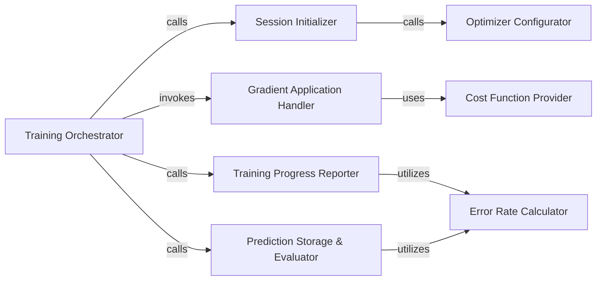

## Details

The Model Training & Optimization subsystem is primarily encapsulated within the tf_unet/unet.py file, specifically around the unet:train method and its associated helper functions. This subsystem is responsible for orchestrating the entire training lifecycle of the U-Net model, from initialization and optimization to gradient application and performance reporting.

### Training Orchestrator
Manages the overall training loop, orchestrating the sequence of operations for model training, including epoch and minibatch iterations, session management, gradient application, and statistics reporting. It is the central coordinator for the training process.

**Related Classes/Methods**:

- <a href="https://github.com/jakeret/tf_unet/blob/master/tf_unet/unet.py#L390-L458" target="_blank" rel="noopener noreferrer">`tf_unet.unet.train`:390-458</a>

### Session Initializer
Responsible for setting up the TensorFlow session and initializing the necessary variables and the optimizer before training begins.

**Related Classes/Methods**:

- <a href="https://github.com/jakeret/tf_unet/blob/master/tf_unet/unet.py#L352-L388" target="_blank" rel="noopener noreferrer">`tf_unet.unet._initialize`:352-388</a>

### Cost Function Provider
Defines and provides the loss function (cost function) that quantifies the discrepancy between model predictions and true labels, guiding the optimization process.

**Related Classes/Methods**:

- <a href="https://github.com/jakeret/tf_unet/blob/master/tf_unet/unet.py#L213-L257" target="_blank" rel="noopener noreferrer">`tf_unet.unet._get_cost`:213-257</a>

### Optimizer Configurator
Configures and returns the optimization algorithm (e.g., Adam, SGD) responsible for updating the model's weights based on computed gradients.

**Related Classes/Methods**:

- <a href="https://github.com/jakeret/tf_unet/blob/master/tf_unet/unet.py#L327-L350" target="_blank" rel="noopener noreferrer">`tf_unet.unet._get_optimizer`:327-350</a>

### Gradient Application Handler
Computes gradients of the cost function with respect to model parameters and applies these gradients to update the model's trainable variables. This is the core of the learning process.

**Related Classes/Methods**:

- <a href="https://github.com/jakeret/tf_unet/blob/master/tf_unet/unet.py#L504-L510" target="_blank" rel="noopener noreferrer">`tf_unet.unet._update_avg_gradients`:504-510</a>

### Training Progress Reporter
Collects, aggregates, and reports training statistics and performance metrics (e.g., loss, error rate) at both minibatch and epoch granularities, providing real-time and summarized feedback on training progress.

**Related Classes/Methods**:

- <a href="https://github.com/jakeret/tf_unet/blob/master/tf_unet/unet.py#L484-L501" target="_blank" rel="noopener noreferrer">`tf_unet.unet.output_minibatch_stats`:484-501</a>
- <a href="https://github.com/jakeret/tf_unet/blob/master/tf_unet/unet.py#L480-L482" target="_blank" rel="noopener noreferrer">`tf_unet.unet.output_epoch_stats`:480-482</a>

### Prediction Storage & Evaluator
Stores model predictions (e.g., segmentation masks) and initiates their evaluation against ground truth, often at specific intervals or at the end of training.

**Related Classes/Methods**:

- <a href="https://github.com/jakeret/tf_unet/blob/master/tf_unet/unet.py#L460-L478" target="_blank" rel="noopener noreferrer">`tf_unet.unet.store_prediction`:460-478</a>

### Error Rate Calculator
Calculates the error rate or other discrepancy metrics between predicted outputs and true labels, quantifying model performance.

**Related Classes/Methods**:

- <a href="https://github.com/jakeret/tf_unet/blob/master/tf_unet/unet.py#L513-L521" target="_blank" rel="noopener noreferrer">`tf_unet.unet.error_rate`:513-521</a>

### [FAQ](https://github.com/CodeBoarding/GeneratedOnBoardings/tree/main?tab=readme-ov-file#faq)