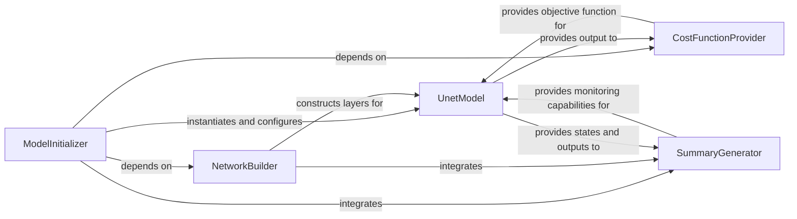

## Details

The `U-Net Model Definition` subsystem is responsible for encapsulating the architecture and initial configuration of the U-Net convolutional neural network. It focuses on the structural aspects of the model, including its encoder-decoder paths, layer construction, and the setup of essential components like the cost function and monitoring summaries within the TensorFlow graph.

### UnetModel
Represents the complete U-Net convolutional neural network architecture. It serves as the central container for the TensorFlow graph, including input/output placeholders, and the overall structure of the encoder-decoder paths.

**Related Classes/Methods**:

- <a href="https://github.com/jakeret/tf_unet/blob/master/tf_unet/unet.py#L178-L303" target="_blank" rel="noopener noreferrer">`tf_unet.unet.unet`:178-303</a>

### ModelInitializer
Orchestrates the initial setup and configuration of the UnetModel instance. This includes constructing the convolutional network, defining the cost function, and setting up other essential parameters for the model's operation.

**Related Classes/Methods**:

- <a href="https://github.com/jakeret/tf_unet/blob/master/tf_unet/unet.py" target="_blank" rel="noopener noreferrer">`tf_unet.unet.unet.__init__`</a>

### NetworkBuilder
Specifically responsible for defining and constructing the intricate convolutional layers of the U-Net, including the encoder (downsampling path), decoder (upsampling path), and the crucial skip connections that link corresponding encoder and decoder layers.

**Related Classes/Methods**:

- <a href="https://github.com/jakeret/tf_unet/blob/master/tf_unet/unet.py" target="_blank" rel="noopener noreferrer">`tf_unet.unet.unet.create_conv_net`</a>

### CostFunctionProvider
Provides the specific loss function (e.g., cross-entropy, Dice coefficient) that the U-Net will optimize during the training phase. It takes the model's predictions and the ground truth labels as input to compute the training objective.

**Related Classes/Methods**:

- <a href="https://github.com/jakeret/tf_unet/blob/master/tf_unet/unet.py" target="_blank" rel="noopener noreferrer">`tf_unet.unet.unet._get_cost`</a>

### SummaryGenerator
Generates TensorFlow summaries, primarily for visualization and monitoring tools like TensorBoard. These summaries can include insights into network architecture, weights, biases, activations, and various training metrics.

**Related Classes/Methods**:

- <a href="https://github.com/jakeret/tf_unet/blob/master/tf_unet/unet.py" target="_blank" rel="noopener noreferrer">`tf_unet.unet.unet.get_image_summary`</a>

### [FAQ](https://github.com/CodeBoarding/GeneratedOnBoardings/tree/main?tab=readme-ov-file#faq)